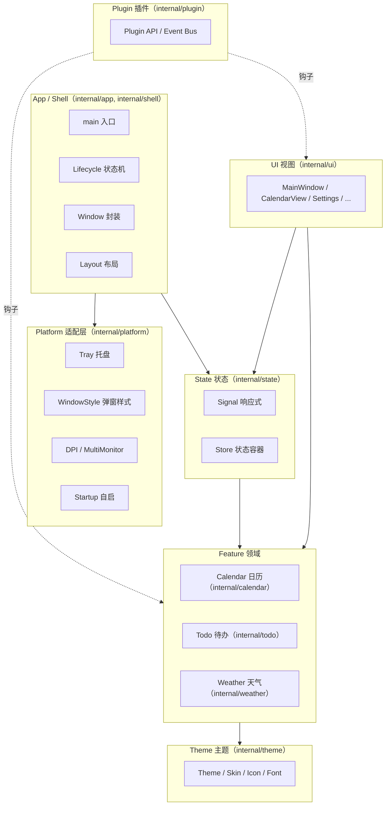
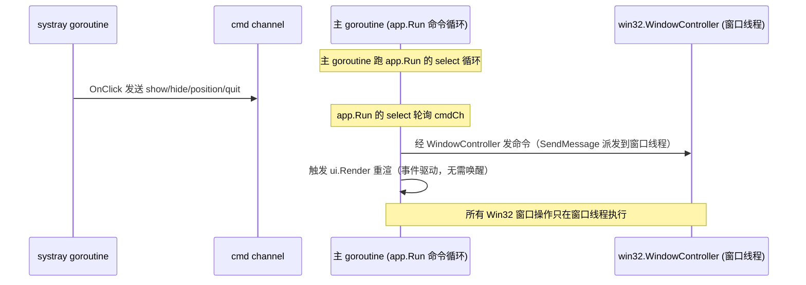

# 01-总体架构

> 版本：v1.0-draft ｜ 最后更新：2026-07-07

## 1. 设计原则（Hard Constraints）

| 原则 | 含义 | 来源 |
|------|------|------|
| 零 CGO | 所有依赖必须纯 Go，`CGO_ENABLED=0` 可编译运行 | ADR-06 / ADR-08 |
| 离线优先 | 农历 / 节假日零网络；天气是唯一在线源且必须优雅降级 | ADR-05 |
| 接口隔离 | Service / Repository / Provider 全接口化，便于 mock / 替换 / 单测 | ADR-05 |
| 可逆 | provider 可换、数据可加远程刷新，决策不锁定 | 通用 |
| 双循环模型 | 主 goroutine 跑 `app.Run` 命令循环，systray 跑独立 goroutine，窗口线程跑自拥 Win32 消息泵；跨线程只发 channel 命令 | ADR-02（spike 验证） / ADR-08（路径 D 自拥窗口） |

## 2. 分层架构（C4 Container 视角）

**依赖方向**：`app → shell → platform/state → feature → theme`；`ui` 依赖 `state` 与 `feature`；`plugin` 以接口钩子反向依赖 `feature/ui`（依赖倒置，不反向编译依赖）。底层（`platform`）不依赖上层。事件总线实现归属 `internal/state`：`feature → state` 经 `state.Publish` emit，`plugin → state` 经 `Host.Subscribe` 委托订阅（详见 **ADR-07**）；严禁 `feature` 编译依赖 `plugin`。

## 3. 并发模型（双消息循环 + Channel 命令）

这是本项目的核心架构约束，已由 `poc/systray-spike` 真机验证通过。

**铁律**：

- `systray.Run()` 在独立 goroutine，拥有自己的 `HWND_MESSAGE` 消息泵。
- 托盘 `OnClick` 回调**只发 channel 命令**，绝不跨线程直接操作窗口。
- 窗口操作（Show/Hide/AnchorAboveTray/Present）**只在窗口线程执行**，由主 goroutine 经 `SendMessage` 派发（ADR-08：窗口线程跑自拥 `GetMessage/Dispatch`，无需 `runtime.LockOSThread`）。
- 重渲由 `app.Run` 在状态变更（显隐/主题/显示开关/跨午夜）时调用 `ui.Render` 触发，事件驱动、无需 `gogpu.App.OnUpdate` 帧循环唤醒（ADR-08 已去除 gogpu 帧循环）。

## 4. 模块职责边界（速查）

| 目录 | 包 | 职责 | 范围 |
|------|----|------|------|
| `10-Shell` | `shell` | 应用进程编排、窗口封装、布局、生命周期 | MVP |
| `20-Platform` | `platform` | Win32 适配：托盘/样式/DPI/多屏/自启 | MVP（部分 Post） |
| `30-State` | `state` | 响应式状态容器与数据流 | MVP |
| `40-Theme` | `theme` | 主题/换肤/图标/字体 | 基础 MVP / 换肤 Post |
| `50-Calendar` | `calendar` | 日历领域模型与数据封装 | MVP |
| `60-Todo` | `todo` | 待办模型与持久化 | v1.1 |
| `70-Weather` | `weather` | 天气 provider 与缓存 | v1.2 |
| `80-Plugin` | `plugin` | 插件接口与事件总线 | v1.4 |
| `90-UI` | `ui` | 具体视图与交互 | MVP + Post |
| `100-Release` | `build`(packaging/CI, 仓库根) + `updater`(运行时, `internal/updater`) | 构建/CI/打包/更新 | MVP + Post |

## 5. 技术风险状态

所有 ADR-01 ~ ADR-07 已拍板或验证通过，**无未决技术阻塞项**。详细验证证据见 `docs/DeskCalendar_技术评估报告_gogpu-ui-Windows.md`（v5）。

## 6. 演进策略

- MVP 以 `shell + platform + state + calendar + theme(基础) + ui(最小)` 闭环。
- 每个后续版本只新增一个 `feature` 包 + 对应 `ui` 视图，不改动核心双循环。
- `WeatherProvider` / `TodoRepository` / `Plugin` 等均以接口预留，避免未来改写核心。
