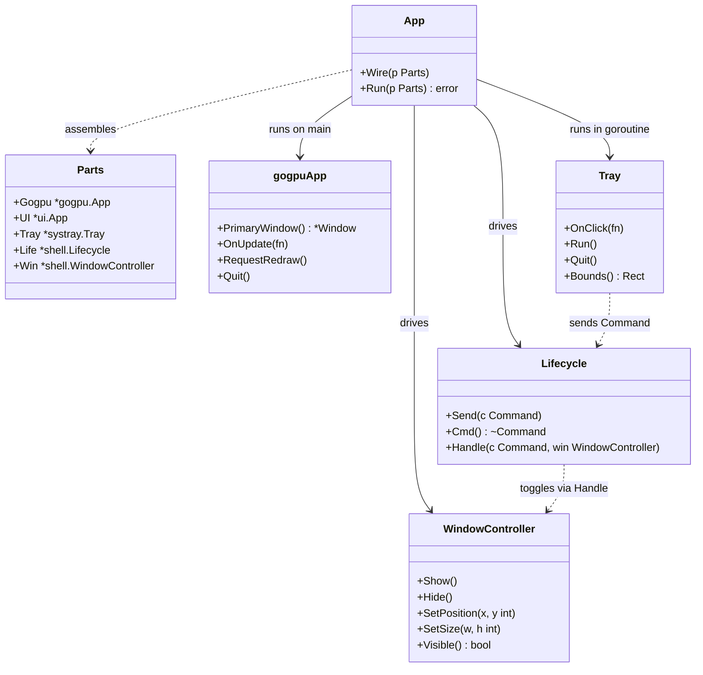
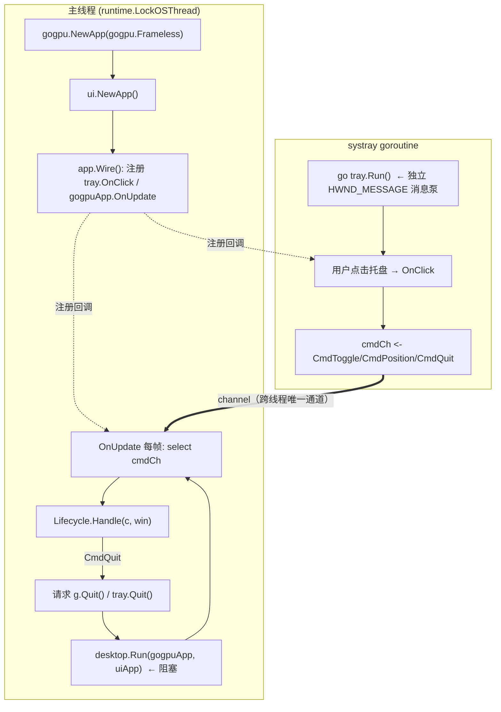
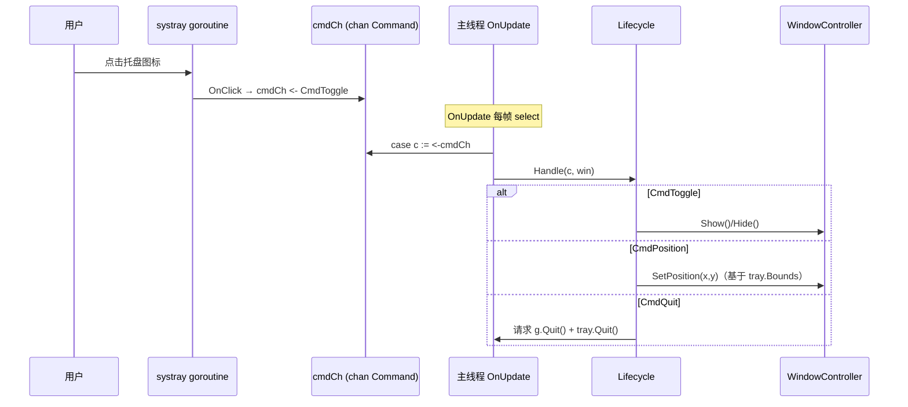
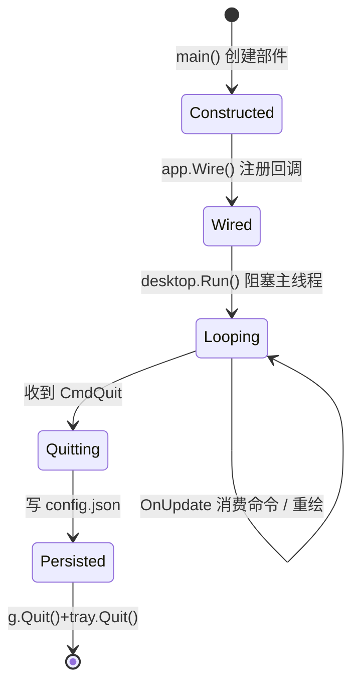

# App.md — 应用装配（Application Wiring）

> 版本：v1.0-draft ｜ 最后更新：2026-07-07 ｜ 模块归属：10-Shell

本篇描述 DeskCalendar 的**进程装配层**：如何把 `gogpu.App`、`ui.App`、托盘 `systray` 与 `shell`（Lifecycle / Window）接成可运行的双消息循环程序，以及优雅退出机制。`main.go` 只做 wire，不写任何业务。

---

## 1. 📦 package 设计

- **包名**：`app`，所在目录 `internal/app`。
- **一句话职责**：负责进程级装配（wire）——创建 `gogpu.App`、创建 `ui.App`、创建托盘、装配 `shell.Lifecycle` 与 `shell.WindowController`，并把它们用 channel 命令接起来后，启动双消息循环。
- **依赖方向**：
  - `app → shell`（调用 `shell.NewLifecycle` / `shell.NewWindow`）
  - `app → platform`（间接：托盘来自 `gogpu/systray`，定位需 `platform` 的 DPI/多屏能力）
  - `app → state`（退出前持久化配置；运行时配置由 `state` 的 Store 承载）
  - 被依赖：仅 `main` 调用 `app.Run`。
- **对外暴露的公开符号**：`Parts`（装配件集合）、`Wire(Parts)`、`Run(Parts) error`。
- **边界**：
  - 归它管：装配顺序、双循环启动、tray 点击→命令、主线程命令消费、优雅退出（`g.Quit()` / `tray.Quit()`）。
  - 不归它管：窗口定位细节（`shell.WindowController`）、状态机语义（`shell.Lifecycle`）、UI 视图（`ui` 包）、配置读写（`infra/config`）。
- **约束说明**：本组（10-Shell）文档整体约定 Go 包名为 `internal/shell`；本篇 `App` 装配逻辑物理上位于 `internal/app`，但它是 10-Shell 模块组的入口装配件，文档归入本组。运行时窗口/状态语义仍由 `shell` 包提供（`app` 仅调用）。

---

## 2. 📐 UML 类图



---

## 3. 🔄 数据流图

描述从进程启动到退出期间，**控制流**如何跨线程流动（注：本模块不搬运业务数据，只搬运命令）。



**启动顺序铁律**（spike 已验证）：
1. `gogpu.NewApp(gogpu.Frameless, ...)` —— 窗口无边框 + 每像素 alpha（`ADR-03`）。
2. `ui.NewApp()` —— 构建响应式 UI 根。
3. `app.Wire()` —— 必须先注册 `tray.OnClick`（发命令）与 `gogpuApp.OnUpdate`（消费命令），**再**启动循环。
4. `go tray.Run()` —— 托盘消息泵放进独立 goroutine。
5. `desktop.Run(gogpuApp, uiApp)` —— 主线程调用，内部 `runtime.LockOSThread()` 锁定，所有 Win32 窗口操作此后只在本线程执行。

---

## 4. 🎨 UI 原型图（ASCII）

N/A —— `app` 装配层不渲染任何可见 UI 表面。窗口外观、圆角透明面板、托盘上方弹层等可见界面由 `10-Shell/Window.md`、`10-Shell/Layout.md` 与 `90-UI` 负责。本层仅做进程/线程编排，无用户可见像素。

---

## 5. 🗂 数据库设计

N/A —— 装配层不持有任何持久化数据。用户配置（开机自启、主题、弹窗位置、天气 key）以 JSON 文件 `%AppData%/DeskCalendar/config.json` 存储，由 `internal/infra/config` 读写，非关系型数据，无 `CREATE TABLE` 需求（详见 `03-项目目录规范.md` §4 与 `100-Release`）。

---

## 6. 📡 Event / Signal 流程

装配层核心是一条**跨线程命令总线**，不依赖 gogpu/ui 的 Signal 原语（避免跨线程触碰 UI 状态）。



- **emit 方**：`tray.OnClick`（systray goroutine）。
- **subscribe 方**：`gogpuApp.OnUpdate`（主线程）。
- **副作用**：仅窗口操作与退出；永不跨线程直接调用窗口 API。
- 唤醒空闲主循环用 `gogpuApp.RequestRedraw()`（非阻塞），避免 busy loop。

---

## 7. 🔌 Plugin API

N/A —— `app` 装配层不对插件暴露任何钩子。插件钩子由 `80-Plugin` 定义，并通过 `state` 的 Store / 事件总线间接影响可见性。`app` 仅负责在退出时广播一次进程级退出信号（供 `infra/config` 持久化），不提供插件可订阅的接口。

---

## 8. 🧩 Feature 生命周期

进程级生命周期（区别于 `Lifecycle.md` 的 UI 显隐状态机）。



- 退出幂等：多次 `CmdQuit` 仅生效一次（`Lifecycle` 进入 `StateQuit` 后忽略后续命令）。
- 退出前持久化：弹窗位置、主题、开机自启等配置写入 `config.json`，下次启动恢复（状态持久化，见 `Lifecycle.md`）。

---

## 9. 📖 Go 接口定义

```go
package app

import (
	"github.com/shaolei/DeskCalendar/internal/shell"
	"github.com/deskcalendar/gogpu"
	"github.com/deskcalendar/gogpu/systray"
	"github.com/deskcalendar/gogpu/ui"
)

// Parts 是应用装配所需的全部部件集合。
// main.go 负责构造，app.Run 负责接线与启动，不含业务。
type Parts struct {
	Gogpu *gogpu.App
	UI    *ui.App
	Tray  *systray.Tray
	Life  *shell.Lifecycle
	Win   *shell.WindowController
}

// Wire 仅做依赖装配：把托盘点击接到命令通道、把主线程 OnUpdate 接到命令消费。
// 不写任何业务逻辑。必须在 desktop.Run 之前调用。
func Wire(p Parts) {
	p.Tray.OnClick(func() { p.Life.Send(shell.CmdToggle) })
	p.Gogpu.OnUpdate(func() {
		select {
		case c := <-p.Life.Cmd():
			p.Life.Handle(c, p.Win)
		default:
		}
	})
}

// Run 启动双消息循环：tray 在独立 goroutine，gogpu 主线程（内部 LockOSThread）。
// 返回即代表进程退出。
func Run(p Parts) error {
	Wire(p)
	go p.Tray.Run()        // systray 消息泵：独立线程，不抢占主线程
	return desktop.Run(p.Gogpu, p.UI) // 阻塞主线程直到 g.Quit()
}
```

> `desktop.Run` 由 gogpu 提供：`desktop.Run(gogpuApp, uiApp)` 内部执行 `runtime.LockOSThread()` 并驱动主循环。退出由 `gogpuApp.Quit()` 触发，同时需 `p.Tray.Quit()` 停止托盘泵，二者均在 `Lifecycle.Handle(CmdQuit, ...)` 中调用。

---

## 10. 🚀 Milestone 任务拆分

| 版本 | 任务 | 验收标准 |
|------|------|----------|
| v1.0（MVP·已实现 spike） | `main.go` 仅做 wire；`app.Wire`/`app.Run` 装配双循环 | 真机点击托盘弹窗 < 50ms；退出无残留进程 |
| v1.0 | 托盘 `OnClick` 仅发 channel 命令，绝不跨线程操作窗口 | 静态检查 + spike 验证无跨线程 Win32 调用 |
| v1.0 | 优雅退出：`CmdQuit` 调用 `g.Quit()` + `tray.Quit()`，退出前写 `config.json` | 退出后无 `deskcalendar.exe` 残留；配置被持久化 |
| v1.0 | 主线程 `runtime.LockOSThread` 由 `desktop.Run` 保证 | 文档与 spike 证据一致 |
| v1.3（Post-MVP） | 支持 `--hide` 等启动参数装配到 `Parts` | 启动即隐藏到托盘，不闪现窗口 |
| v1.4（Post-MVP） | 退出前向 `80-Plugin` 广播进程退出信号 | 插件收到 `OnAppQuit` 并释放资源 |
| v1.5（Post-MVP） | 自更新完成后由 `app` 触发重启装配 | 更新后进程平滑重启，配置保留 |
