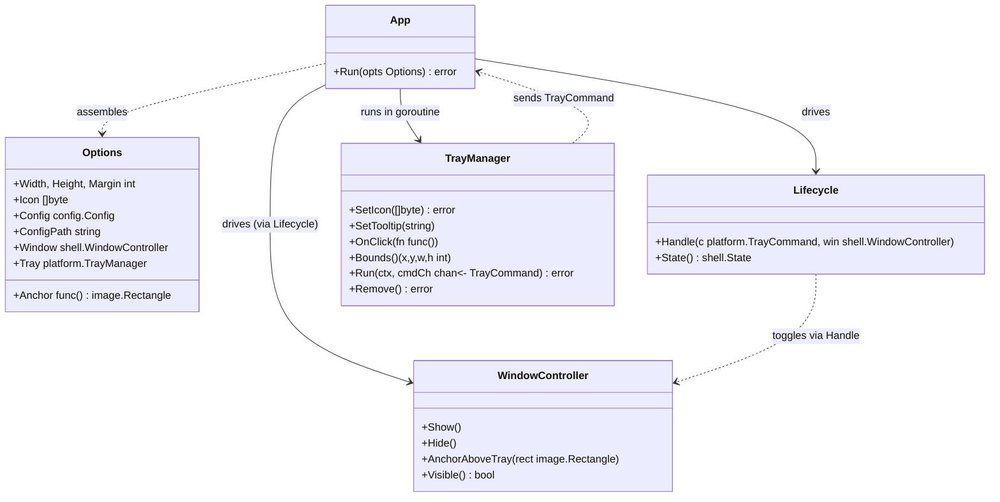
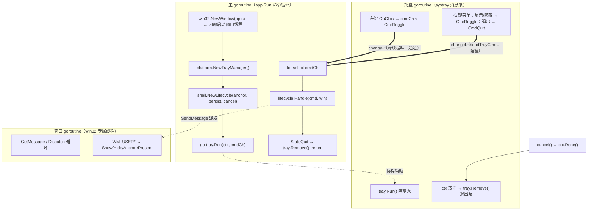
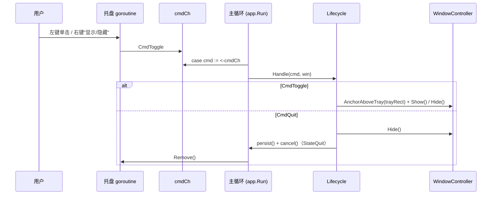
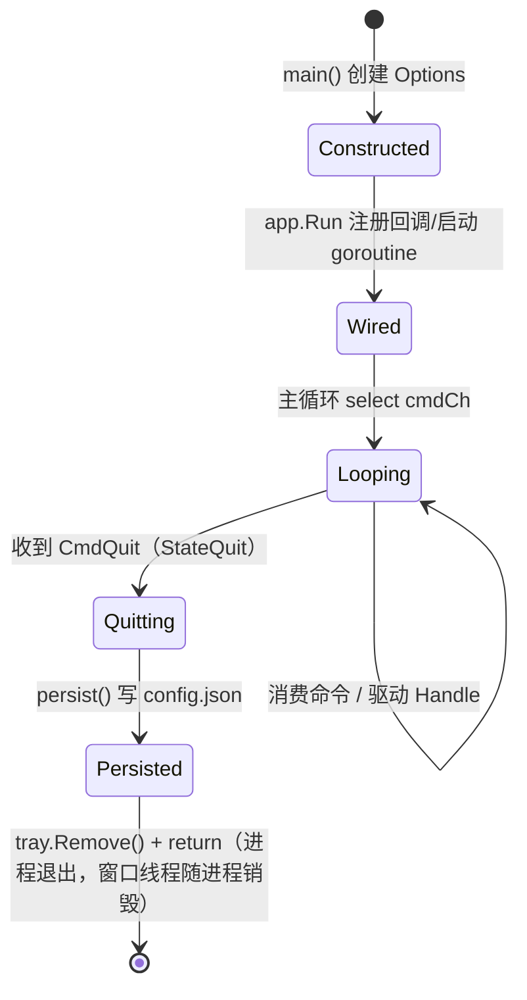

# App.md — 应用装配（Application Wiring）

> 版本：v1.0-draft（Path D / ADR-08）｜ 最后更新：2026-07-09 ｜ 模块归属：10-Shell

本篇描述 DeskCalendar 的**进程装配层**：如何把平台层托盘（`platform.TrayManager`）、
窗口层弹窗（`win32.WindowController`，自拥普通弹窗）、`shell` 生命周期状态机接成可运行的
双循环程序，以及优雅退出机制。`main.go` 只做 wire，不写任何业务。

> **路径 D 改写说明**：原设计依赖 `gogpu.App` / `desktop.Run(gogpuApp, uiApp)` /
> `runtime.LockOSThread` 与 `gogpu/ui` 的 `OnUpdate` 帧循环。本版改为零 gogpu 装配——
> 窗口为自拥 `WS_POPUP` 普通弹窗（其内部专属 goroutine 跑真实 Win32 消息泵），托盘消息泵在
> 独立 goroutine，主 goroutine 跑命令分发循环。详见下方 §3 / §9。

---

## 1. 📦 package 设计

- **包名**：`app`，所在目录 `internal/app`。
- **一句话职责**：负责进程级装配（wire）——创建 `win32` 弹窗、创建 `platform` 托盘、装配
  `shell.Lifecycle`，用 channel 命令接起来后启动双循环；并在退出前持久化配置。
- **依赖方向**：
  - `app → shell`（调用 `shell.NewLifecycle`）
  - `app → platform`（托盘 `TrayManager`、命令 `TrayCommand`、托盘矩形 `Bounds`）
  - `app → win32`（窗口 `NewWindow` / `WindowController`）
  - `app → config`（退出前 `config.Save`）
  - 被依赖：仅 `cmd/deskcalendar/main` 调用 `app.Run`。
- **对外公开符号**：`Options`、`Run(opts Options) error`、`defaultIcon() []byte`。
- **边界**：
  - 归它管：装配顺序、双循环启动、tray 点击→命令、主线程命令消费、优雅退出（取消 ctx /
    移除托盘图标 / 写 config.json）。
  - 不归它管：窗口定位细节（`win32`）、状态机语义（`shell.Lifecycle`）、UI 视图（`90-UI`）、
    配置读写实现（`infra/config`）。
- **约束说明**：运行时窗口/状态语义仍由 `shell` 包提供（`app` 仅调用）。生产窗口为
  `win32.WindowController`，其多出的 `Present` 不影响对 `shell.WindowController` 的结构化满足；
  `app` 持 `shell.WindowController`，与 `win32` 解耦、可单测。

---

## 2. 📐 UML 类图



---

## 3. 🔄 数据流图

描述从进程启动到退出期间，**控制流**如何跨线程流动（本模块不搬运业务数据，只搬运命令）。



**启动顺序（路径 D，已落地）**：
1. `win32.NewWindow(opts)` —— 构造弹窗，内部在专属 goroutine 跑真实 Win32 消息泵
   （`GetMessageW`/`DispatchMessageW`），创建完成经 `ready` channel 做 happens-before 同步。
2. `platform.NewTrayManager()` —— 构造托盘（gogpu/systray 封装，零 CGO）。
3. `shell.NewLifecycle(anchor, persist, cancel)` —— `anchor` 默认取 `tray.Bounds()`
   拼成 `image.Rectangle`；`persist` 写 `config.Save(cfgPath, opts.Config)`；
   `quit` 注入 `cancel`（取消 ctx → 托盘退出 + 主循环退出）。
4. 设置托盘图标（`tray.SetIcon`，空则用 `defaultIcon()` 内置 PNG）与提示
   `tray.SetTooltip("DeskCalendar")`；注册左键 `OnClick` → 非阻塞 `cmdCh <- CmdToggle`。
5. `go tray.Run(ctx, cmdCh)` —— 托盘消息泵放进独立 goroutine。
6. 主循环 `for select cmdCh` —— 消费命令 → `lifecycle.Handle(cmd, win)`；进入
   `StateQuit` 或 `ctx.Done()` 时 `tray.Remove()` 并 `return`。

> 注：原 gogpu 设计由 `desktop.Run` 在主线程跑 `runtime.LockOSThread` 的 Win32 消息泵；
> 路径 D 将该职责一分为二——窗口线程由 `win32.WindowController.run` 承载真实 Win32 泵，
> 主 goroutine 仅跑轻量命令循环（无窗口归其所有，无需 Win32 泵）。二者共同替代
> `desktop.Run`，满足 T4。

---

## 4. 🎨 UI 原型图（ASCII）

N/A —— `app` 装配层不渲染任何可见 UI 表面。窗口外观、面板、托盘上方弹层等可见界面由
`10-Shell/Window.md`、`10-Shell/Layout.md` 与 `90-UI` 负责。本层仅做进程/线程编排。

---

## 5. 🗂 数据库设计

N/A —— 装配层不持有持久化数据。用户配置（主题、窗口、开机自启）以 JSON 文件
`%AppData%/DeskCalendar/config.json` 存储，由 `internal/infra/config` 读写。退出前由
`persist` 回调写盘（见 §3 步骤 3、§8）。

---

## 6. 📡 Event / Signal 流程

装配层核心是一条**跨线程命令总线** `cmdCh chan platform.TrayCommand`，不依赖任何 UI Signal
原语（避免跨线程触碰 UI 状态）。



- **emit 方**：`tray.OnClick`（左键）/ `tray.Run` 右键菜单（均运行于 systray goroutine）。
- **consume 方**：`app.Run` 主循环（主 goroutine）。
- **副作用**：仅窗口操作（经 `SendMessage` 派发到窗口线程）与退出；绝不跨线程直接调用
  Win32 窗口 API（ADR-02 双循环铁律）。
- **唤醒**：命令经 channel 推送即被主循环 `select` 接收，无需 busy loop，也无 `RequestRedraw`
  类机制（窗口固定、不连续重绘）。

---

## 7. 🔌 Plugin API

N/A —— `app` 装配层不对插件暴露任何钩子。插件钩子由 `80-Plugin` 定义，经 `state` 间接影响
可见性。`app` 仅在退出时经 `persist` 写盘；Post-MVP（T6）拟在退出前向 `80-Plugin` 广播进程
退出信号（见 §10）。

---

## 8. 🧩 Feature 生命周期

进程级生命周期（区别于 `Lifecycle.md` 的 UI 显隐状态机）。



- 退出幂等：多次 `CmdQuit` 仅生效一次（`Lifecycle` 进入 `StateQuit` 后忽略后续命令）。
- 退出前持久化：当前配置写入 `config.json`，下次启动经 `main` 的 `config.Load` 恢复。
- 托盘清理：进入退出即 `tray.Remove()`（显式），`ctx` 取消亦触发 `tray.Run` 内部 `Remove`，
  双保险避免残留图标。
- 窗口销毁：窗口线程消息泵随进程退出被 OS 回收（MVP 不显式 `DestroyWindow`；若后续需在退出
  前平滑淡出，可在 `WindowController` 增 `Close()` 并由 `quit` 路径调用）。

---

## 9. 📖 Go 接口定义

```go
package app

import (
	"image"

	"github.com/shaolei/DeskCalendar/internal/infra/config"
	"github.com/shaolei/DeskCalendar/internal/platform"
	"github.com/shaolei/DeskCalendar/internal/shell"
)

// Options 是 Run 的装配选项。生产由 main 填充；测试可注入 fake。
type Options struct {
	Width, Height, Margin int            // 弹窗逻辑尺寸与锚定留白（0 用默认 360×480 / 8）
	Icon                  []byte          // 托盘图标 PNG；空则用 defaultIcon()
	Config                config.Config   // 退出前持久化的配置
	ConfigPath            string          // 配置文件路径；空则 config.DefaultPath()

	// 可注入依赖（nil 时使用生产实现），便于单测替换。
	Window shell.WindowController  // 默认 win32.NewWindow
	Tray   platform.TrayManager    // 默认 platform.NewTrayManager
	Anchor func() image.Rectangle  // 默认取 tray.Bounds() 拼矩形
}

// Run 装配并启动双循环，返回即代表进程退出。
func Run(opts Options) error

// defaultIcon 生成内置 32×32 蓝色圆形 PNG（避免外部二进制资源）。
func defaultIcon() []byte
```

`main` 入口（`cmd/deskcalendar/main.go`）仅做 wire：

```go
func main() {
	cfgPath, _ := config.DefaultPath()
	cfg, err := config.Load(cfgPath)
	if err != nil {
		cfg = config.Default()
	}
	if err := app.Run(app.Options{Config: cfg, ConfigPath: cfgPath}); err != nil {
		fmt.Fprintln(os.Stderr, "DeskCalendar:", err)
		os.Exit(1)
	}
}
```

> 窗口操作最终经 `win32.WindowController` 的 `SendMessage(WM_USER_*)` 派发到窗口线程执行，
> 主循环只发起、不直调 Win32（ADR-02）。`anchor` 默认实现：`x,y,w,h := tray.Bounds();
> image.Rect(x,y,x+w,y+h)`（物理像素，与窗口 DPI 缩放一致）。

---

## 10. 🚀 Milestone 任务拆分

| 版本 | 任务 | 验收标准 | 状态 |
|------|------|----------|------|
| v1.0（MVP） | T1 自拥 main 入口与双循环装配（替代 `desktop.Run`） | `cmd/deskcalendar/main.go` 仅 wire；`app.Run` 装配 win32+platform+shell；真机构建通过 | ✅ |
| v1.0 | T2 双循环接线——托盘 channel 命令 → 主 goroutine 消费 | `go tray.Run(ctx, cmdCh)` + 主 `select cmdCh`；静态检查 + 单测验证无跨线程 Win32 直调 | ✅ |
| v1.0 | T3 退出路径（托盘退出菜单 / WM_CLOSE / WM_QUIT） | 右键"退出"→`CmdQuit`→`Hide`+`persist`+`Remove`+进程退出；窗口 `WM_CLOSE`→`Hide` | ✅ |
| v1.0 | T4 自拥主消息循环（替代 `gogpu App.Run`） | 窗口线程跑真实 Win32 `GetMessage/Dispatch`；主 goroutine 跑命令循环；无 `desktop.Run`/`LockOSThread` | ✅ |
| v1.3（Post-MVP） | T5 启动参数装配（`--hide` 等） | 支持启动即隐藏到托盘，不闪现窗口 | ⏳ |
| v1.4（Post-MVP） | T6 退出前向 `80-Plugin` 广播进程退出信号 | 插件收到 `OnAppQuit` 并释放资源 | ⏳ |
| v1.4（Post-MVP） | T7 自更新完成后由 app 触发重启装配 | 更新后进程平滑重启，配置保留 | ⏳ |
