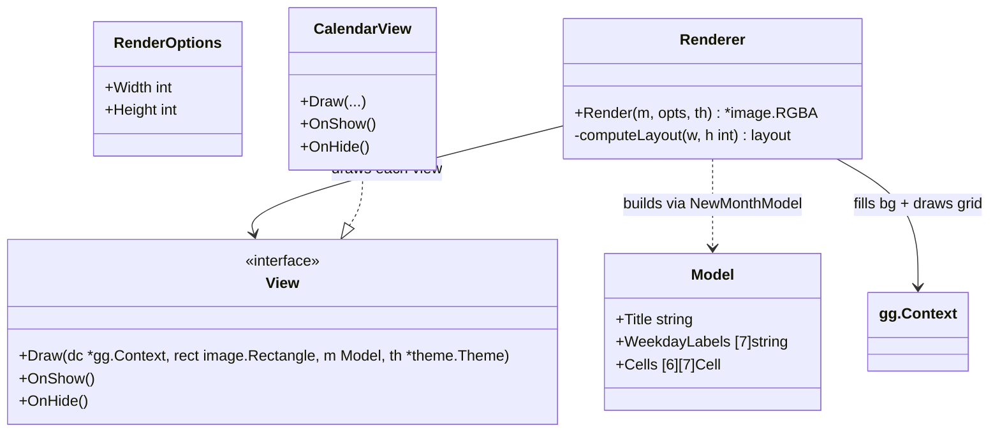
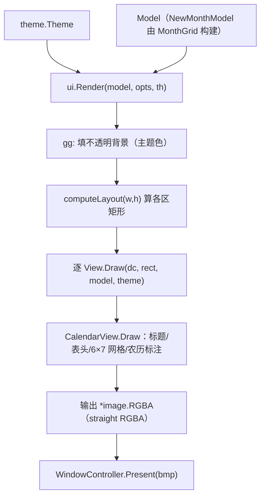
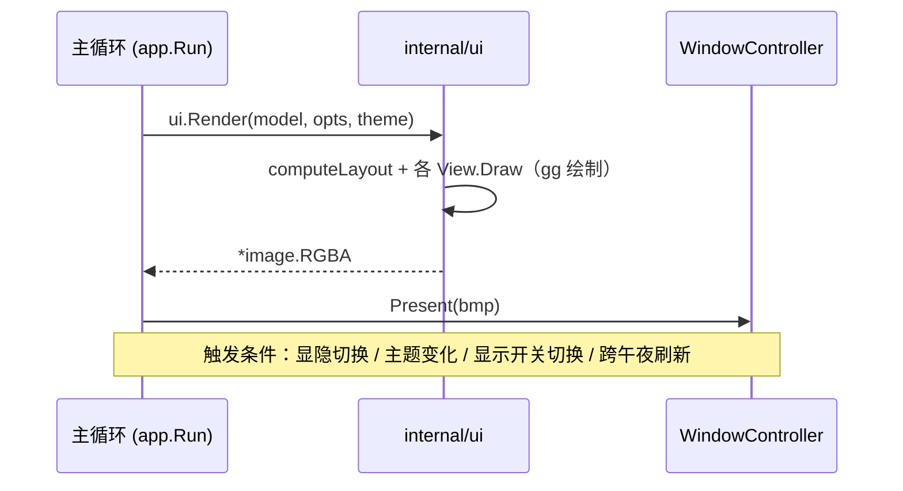
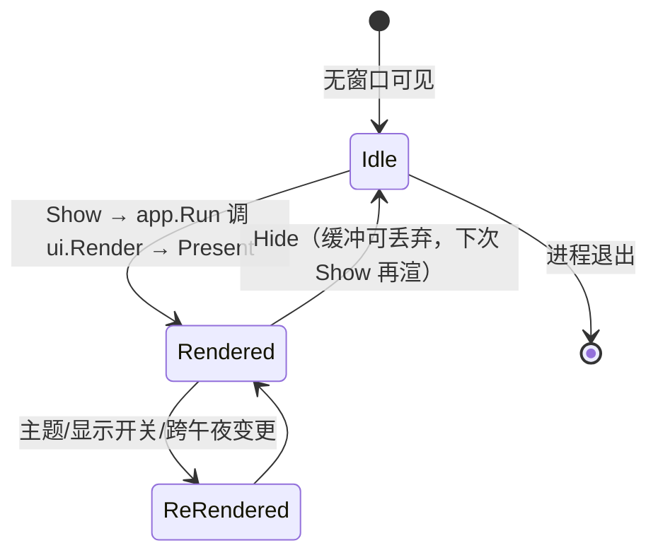

# Layout.md — 面板布局（Panel Layout，由 internal/ui 经 gg 绘制）

> 版本：v1.0-draft（Path D / ADR-08）｜ 最后更新：2026-07-10 ｜ 模块归属：10-Shell ｜ 实际实现包：`internal/ui`

本篇描述 DeskCalendar 面板（360×480 逻辑像素）的**布局几何**如何落地。路径 D（ADR-08）下，
布局不再是 `gogpu/ui` 的 `Column`/`Row`/`Stack` 容器部件树，而是由 `internal/ui` 用
`github.com/gogpu/gg`（纯 Go 零 CGO 2D 库）**立即模式绘制**整块面板：固定网格 + 直接光栅。
MVP 面板为**不透明、方角**（ADR-08 F1：透明圆角/阴影在 MVP 主动舍弃，圆角后续可用
`DwmSetWindowAttribute` 零成本白嫖，见 §10）；圆角裁剪由 gg 路径填充实现，不再依赖
`gogpu/ui` 的 `ClipRRect` / `ThemeBackground` 透明根。

---

## 1. 📦 package 设计

- **包名**：布局逻辑位于 `ui`，所在目录 `internal/ui`（渲染层）。
- **一句话职责**：用 gg 把整块面板光栅化为 `*image.RGBA`——填不透明背景、按固定网格排布
  「月份标题 + 星期表头（一…日）+ 6×7 月历网格 + 农历/节气/节假日/调休标注」，经
  `WindowController.Present` 推送给窗口线程。布局是「几何计算 + 立即绘制」，不是「容器嵌套」。
- **依赖方向**：
  - 依赖 `github.com/gogpu/gg`（Canvas/Context，零 CGO）、`theme`（主题色/圆角半径）、
    `calendar`（经 `MonthGrid` → `Model` 视图模型）。
  - 被依赖：`app`（显示时调用 `ui.Render` 产出像素）、`win32.WindowController`（`Present` 消费）。
- **对外公开符号**：`Render(model Model, opts RenderOptions, th *theme.Theme) *image.RGBA`、
  `View`（可挂载子视图接口）、`CalendarView`（MVP 实现）、`Model` / `NewMonthModel`、
  `RenderOptions`、`computeLayout(w, h int) layout`（纯函数）。
- **边界**：
  - 归它管：背景填充、标题/表头/网格的几何排布、圆角裁剪（MVP 方角）、文本测量与绘制。
  - 不归它管：窗口几何与锚定（`win32`）、交互命令与显隐（`shell`/`app`）、数据来源
    （`calendar`/`theme`/`config`）、农历/节假日计算（`calendar`）。

---

## 2. 📐 UML 类图



> `computeLayout` 为纯函数，由 `Render` 在绘制前计算标题/表头/网格各区的像素矩形，便于单测。

---

## 3. 🔄 数据流图



- **数据源**：`Model`（由 `calendar.MonthGrid` + `config.Display` 的 `ShowLunar`/`ShowHoliday`
  经 `NewMonthModel` 构建）、`theme.Theme`（背景/前景/圆角半径）。
- **汇点**：`*image.RGBA` 经 `Present` 交给 `win32` 窗口，`WM_PAINT` 用 `BitBlt` 拷到屏幕。

---

## 4. 🎨 UI 原型图（ASCII）

面板逻辑布局（360×480，MVP 方角；v1.1+ 可加圆角）。内容由 `CalendarView.Draw` 一笔笔画出，
本图仅表达几何骨架。

```
┌─────────────────────────────┐  ← MVP 方角（v1.1+ 圆角经 DWM 白嫖）
│  ← 2026年7月            ⚙   │  标题行（左：年月 + 翻月；右：设置入口占位）
├─────────────────────────────┤
│  一  二  三  四  五  六  日   │  星期表头（按 WeekStart 旋转）
├─────────────────────────────┤
│ 初一 初二 初三 ... 初七      │  6×7 网格（gg 绘制，含农历/节气/节假日/调休标注）
│ 初八 ...                     │
│ 端午 休 班 ...               │
├─────────────────────────────┤
│  🌗 主题        TODO 0       │  底部栏（主题切换 / 待办占位，MVP 由托盘菜单承载）
└─────────────────────────────┘
```

- MVP 面板为**不透明方角**：gg 填实主题背景色，无透明 alpha、无圆角裁剪开销（ADR-08 F1）。
- 圆角半径由 `theme.Theme` 提供，v1.1+ 经 `DwmSetWindowAttribute(DWMWA_WINDOW_CORNER_PREFERENCE)`
  在窗口层面实现，不改绘制缓冲。

---

## 5. 🗂 数据库设计

N/A —— 布局层为纯内存绘制，不读写任何数据库。布局参数（尺寸/圆角）来自 `theme` 与
`RenderOptions` 常量，无 `CREATE TABLE` 需求。

---

## 6. 📡 Event / Signal 流程

布局随主题/显示开关变化**重渲**，由 `app.Run` 主循环在状态变更时调用 `ui.Render` 触发；
窗口层不引入任何响应式 Signal（跨线程状态问题由命令总线规避，见 `Window.md`）。



- **emit**：`app.Run` 主循环（显隐切换后、`theme.Watch` 变化后、`CmdToggleLunar/Holiday` 后、
  `RefreshToday` 跨午夜后）调用 `ui.Render`。
- **consume**：`win32.WindowController.Present`（窗口线程 `WM_PAINT` → `BitBlt`）。
- **无 Signal 直连**：视图模型 `Model` 由 `NewMonthModel` 在每次 `Render` 前重建，渲染是纯函数式、
  无状态残留。

---

## 7. 🔌 Plugin API

N/A —— 布局/渲染不对插件暴露钩子。未来插件注入自定义视图由 `80-Plugin` 与 `40-Theme` 定义
（如插件注册一个 `View` 到 `Render` 的视图列表），本层只提供稳定的 `View` 接口，不在此开放插件 API。

---

## 8. 🧩 Feature 生命周期

布局随窗口显隐重建（每次 `Show` 由 `app.Run` 调用 `ui.Render` 全量重渲，无增量 diff）。



- 重渲在主 goroutine 同步完成（纯 CPU 光栅，毫秒级），再经 `Present` 派发到窗口线程。

---

## 9. 📖 Go 接口定义

```go
package ui

import (
	"image"

	"github.com/gogpu/gg"
	"github.com/shaolei/DeskCalendar/internal/theme"
)

// RenderOptions 渲染参数（逻辑设计尺寸，96-DPI 基准）。
type RenderOptions struct {
	Width  int // 逻辑宽，默认 360
	Height int // 逻辑高，默认 480
}

// View 是可挂载到面板的子视图（MVP 仅 CalendarView）。
// Draw 在给定矩形内绘制；OnShow/OnHide 在面板显隐时回调（MVP 多为空操作）。
type View interface {
	Draw(dc *gg.Context, rect image.Rectangle, m Model, th *theme.Theme)
	OnShow()
	OnHide()
}

// Render 用 gg 将完整面板光栅化为实心不透明 *image.RGBA（路径 D MVP：方角不透明）。
// model 由 NewMonthModel 构建；opts 提供逻辑尺寸；th 提供主题色与圆角半径。
func Render(m Model, opts RenderOptions, th *theme.Theme) *image.RGBA { /* ... */ }

// computeLayout 由 Render 调用：按 w×h 计算标题/表头/6×7 网格各区的像素矩形。纯函数。
func computeLayout(w, h int) layout { /* ... */ }
```

`CalendarView`（MVP 实现）要点：

```go
// CalendarView 绘制月历面板内容：月份标题 + 星期表头 + 6×7 网格。
type CalendarView struct{}

func (CalendarView) OnShow() {}
func (CalendarView) OnHide() {}

// Draw 在 rect 内绘制整月历。rect 已由 Render 填好不透明背景。
func (CalendarView) Draw(dc *gg.Context, rect image.Rectangle, m Model, th *theme.Theme) {
	// 标题行、星期表头、逐格（公历 + 农历/节气/节假日/调休标注），均经 gg 文本/矩形绘制。
}
```

> 说明：`ui.Render` / `CalendarView.Draw` / `computeLayout` 均为 gg 立即模式绘制，无 `gogpu/ui`
> 容器（`Column`/`Row`/`Stack`）与 `Widget` 部件树。毛玻璃（Mica/Acrylic）按 ADR-04 跳过，
> 背景由 `theme` 自绘渐变/实色提供。

---

## 10. 🚀 Milestone 任务拆分

| 版本 | 任务 | 验收标准 | 状态 |
|------|------|----------|------|
| v1.0（MVP·已实现） | `ui.Render` 用 gg 绘不透明方角 360×480 面板 + 6×7 月历网格 | `go build`（CGO=0）/ `go vet` / `go test` 全绿；真机弹层出图 | ✅ |
| v1.0 | `computeLayout` 固定网格几何（标题/表头/网格区）纯函数 | `TestComputeLayout_*` 各区间不重叠、像素精确 | ✅ |
| v1.0 | 跳过 Mica/Acrylic，自绘背景（ADR-04）；方角不透明（ADR-08 F1） | 观感对齐 360 小清新，无 gogpu/ui/Mica 依赖 | ✅ |
| v1.1（Post-MVP） | 圆角经 `DwmSetWindowAttribute` 在窗口层面实现（零绘制成本） | 面板呈现圆角，不改动 gg 缓冲 | ⬜ |
| v1.3（Post-MVP） | 主题热切换 → `app.Run` 重渲并 `Present` | 浅/深主题切换后面板即时更新 | ⬜ |
| v1.4（Post-MVP） | 预留 `View` 列表供插件注入自定义视图 | 插件可挂接自定义 View 到面板 | ⬜ |
