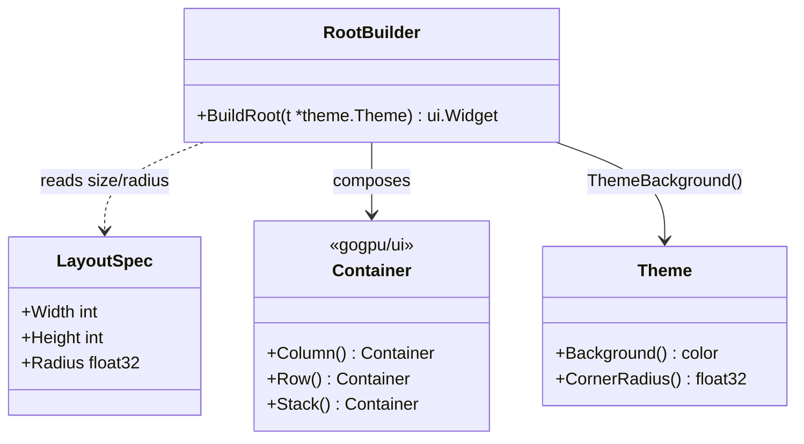
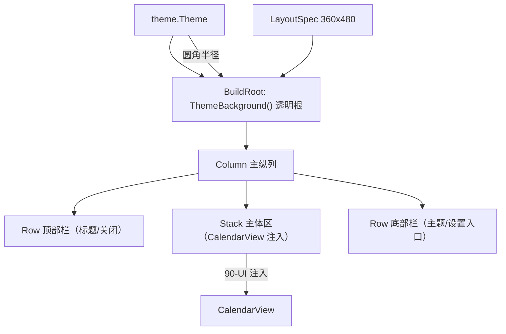
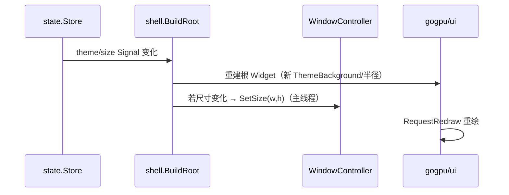
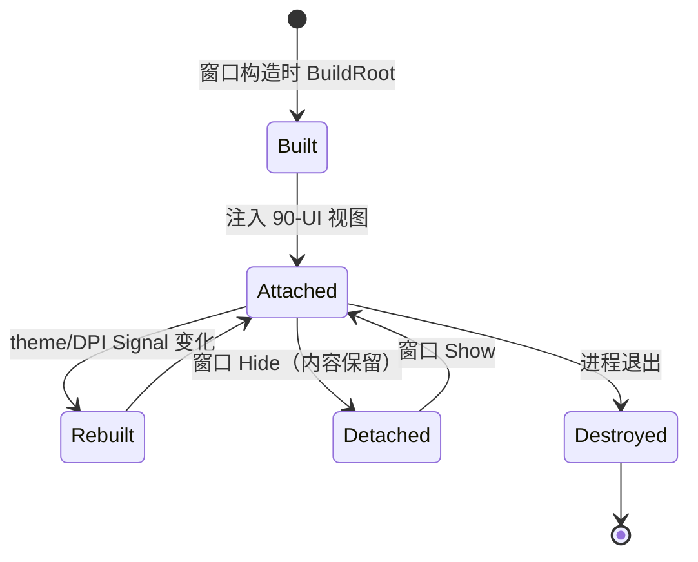

# Layout.md — 布局容器（Layout & Containers）

> 版本：v1.0-draft ｜ 最后更新：2026-07-07 ｜ 模块归属：10-Shell ｜ 包名：`shell`（`internal/shell`）

本篇描述基于 `gogpu/ui` 的布局容器封装：`Column` / `Row` / `Stack`。核心是**根容器使用 `ThemeBackground()` 透明以尊重每像素 alpha**（ADR-03），面板固定尺寸（如 360×480），以及**圆角裁剪如何落地**（自绘圆角 + 避免内容溢出，Mica/Acrylic 跳过，ADR-04）。

---

## 1. 📦 package 设计

- **包名**：`shell`，所在目录 `internal/shell`。
- **一句话职责**：用 `gogpu/ui` 的容器原语搭建面板根布局，确保根级透明（每像素 alpha）、固定面板尺寸与圆角裁剪区域；具体视图内容由 `90-UI` 注入。
- **依赖方向**：
  - 依赖 `gogpu/ui`（Column/Row/Stack/ThemeBackground）、`theme`（主题色与圆角半径）。
  - 被依赖：`ui` 包（MainWindow 调用 `shell.BuildLayout` 拿到根容器并塞入 CalendarView 等）。
- **对外暴露的公开符号**：`LayoutSpec`（尺寸/圆角配置）、`BuildRoot(*theme.Theme) ui.Widget`、`Container` 辅助构造器。
- **边界**：
  - 归它管：根容器透明、面板尺寸、圆角裁剪区域、容器嵌套结构。
  - 不归它管：容器内具体视图的业务与数据（`90-UI` / `50-Calendar`），无需 SQLite。

---

## 2. 📐 UML 类图



> `Container` 为 `gogpu/ui` 既有类型，本层只做组合封装，不重新定义容器语义。

---

## 3. 🔄 数据流图



- **数据源**：`theme.Theme`（背景透明/圆角）、`LayoutSpec`（尺寸）。
- **汇点**：`ui.Widget` 根节点 → 交给 `gogpu.Window` 渲染（每像素 alpha 合成）。

---

## 4. 🎨 UI 原型图（ASCII）

面板逻辑布局（360×480，圆角 12px，`Stack` 主体 + `Column` 纵列 + `Row` 顶/底栏）。内容由 `90-UI` 填充，本图仅表达容器骨架。

```
┌─────────────────────────────┐  ← 圆角裁剪边界 (radius=12)
│  Row 顶部栏                  │
│  [← 2026年7月 ▶]   [设置⚙]  │  Row
├─────────────────────────────┤
│  Stack 主体区                │
│  ┌───────────────────────┐  │  Stack
│  │ 日 一 二 三 四 五 六    │  │
│  │ 初一 初二 ...           │  │  ← 90-UI 注入 CalendarView
│  │ 端午 休 班 ...          │  │
│  └───────────────────────┘  │
│  （农历/节气/节假日/调休）   │
├─────────────────────────────┤
│  Row 底部栏                  │
│  [主题🌗]      [TODO 0]      │  Row
└─────────────────────────────┘  ← ThemeBackground() 透明根，圆角外无绘制
```

- 根容器 `ThemeBackground()`：圆角矩形之外的像素 alpha=0，实现透明圆角（ADR-03）。
- 圆角裁剪：通过 `gogpu/ui` 的 `ClipRRect(radius)` 作用于根容器，使子内容不溢出圆角；毛玻璃（Mica/Acrylic）按 ADR-04 跳过，改用自绘渐变背景。

---

## 5. 🗂 数据库设计

N/A —— 布局层为纯内存 UI 组合，不读写任何数据库。布局配置（尺寸/圆角）来自 `theme` 与 `LayoutSpec` 常量，无 `CREATE TABLE` 需求。

---

## 6. 📡 Event / Signal 流程

布局随主题/尺寸变化重建，由 `state` 的 Signal 驱动（不直接持有 UI Signal，仅响应）。



- **emit**：`state.Store` 的主题 Signal（`theme` 切换、DPI 缩放变化）。
- **subscribe**：`shell.BuildRoot` 消费者（通常在 `90-UI` 的 MainWindow 中响应 Signal 后调用）。
- **副作用**：必要时经 `WindowController.SetSize` 同步面板尺寸（仍受主线程约束，见 `Window.md`）。

---

## 7. 🔌 Plugin API

N/A —— 布局容器不对插件暴露钩子。未来换肤/插件注入视图由 `40-Theme` 与 `80-Plugin` 定义（如插件可注册一个 `Widget` 到主体 `Stack`），本层只提供稳定的根容器接口，不在此开放插件 API。

---

## 8. 🧩 Feature 生命周期

布局随窗口生命周期构建/销毁。



- 布局构建在主线程完成（与窗口同线程），与 `Window` 生命周期对齐。

---

## 9. 📖 Go 接口定义

```go
package shell

import (
	"github.com/shaolei/DeskCalendar/internal/theme"
	"github.com/deskcalendar/gogpu/ui"
)

// LayoutSpec 描述固定面板的几何参数。
type LayoutSpec struct {
	Width  int     // 面板宽，默认 360
	Height int     // 面板高，默认 480
	Radius float32 // 圆角半径，默认 12
}

// DefaultLayout 返回 MVP 默认面板规格。
func DefaultLayout() LayoutSpec {
	return LayoutSpec{Width: 360, Height: 480, Radius: 12}
}

// BuildRoot 构造透明根容器：用 ThemeBackground() 尊重每像素 alpha，
// 并对根做圆角裁剪（ClipRRect），使子内容不溢出圆角。
// 返回的根 Widget 交给 90-UI 注入具体视图。
func BuildRoot(t *theme.Theme, spec LayoutSpec) ui.Widget {
	root := ui.Stack()
	root.SetBackground(ui.ThemeBackground()) // 透明：圆角外 alpha=0
	root.ClipRRect(spec.Radius)              // 圆角裁剪（ADR-03/ADR-04 自绘，非 Mica）

	col := ui.Column()
	col.Add(ui.Row()) // 顶部栏占位
	col.Add(ui.Stack()) // 主体区占位（90-UI 注入 CalendarView）
	col.Add(ui.Row()) // 底部栏占位

	root.Add(col)
	return root
}
```

> 说明：`ui.Stack` / `ui.Column` / `ui.Row` / `ui.ThemeBackground` / `ClipRRect` 均为 `gogpu/ui` 既有 API（ADR-01/ADR-03）。具体视图注入由 `90-UI` 在 `root` 上 `Add` 完成，本层不耦合业务视图。毛玻璃按 ADR-04 跳过 Mica/Acrylic，背景由 `theme` 自绘渐变提供。

---

## 10. 🚀 Milestone 任务拆分

| 版本 | 任务 | 验收标准 |
|------|------|----------|
| v1.0（MVP·已实现 spike） | `BuildRoot` 用 `ThemeBackground()` 透明根 + `ClipRRect` 圆角 | 真机圆角透明面板生效，DWM 阴影可见（ADR-03） |
| v1.0 | 固定面板尺寸 360×480 经 `LayoutSpec` | 窗口尺寸稳定，不随内容抖动 |
| v1.0 | 跳过 Mica/Acrylic，自绘渐变背景（ADR-04） | 观感对齐 360 小清新，无 Mica 依赖 |
| v1.3（Post-MVP） | 主题切换时 `BuildRoot` 重建并响应 `theme` Signal | 浅/深主题热切换无残留旧圆角 |
| v1.3（Post-MVP） | 圆角半径/尺寸随 DPI 缩放调整 `LayoutSpec` | 高分屏下面板不模糊、不溢出 |
| v1.4（Post-MVP） | 预留 `Stack` 主体区供插件注入 Widget | 插件可挂接自定义视图到主体区 |
