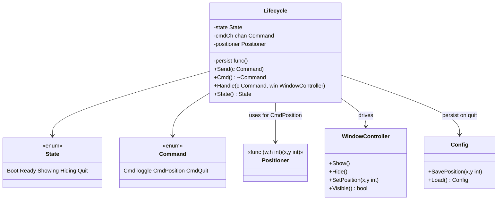
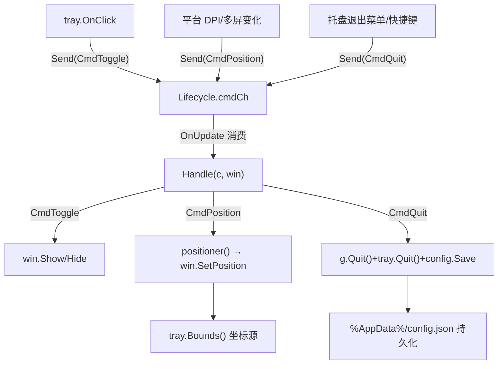
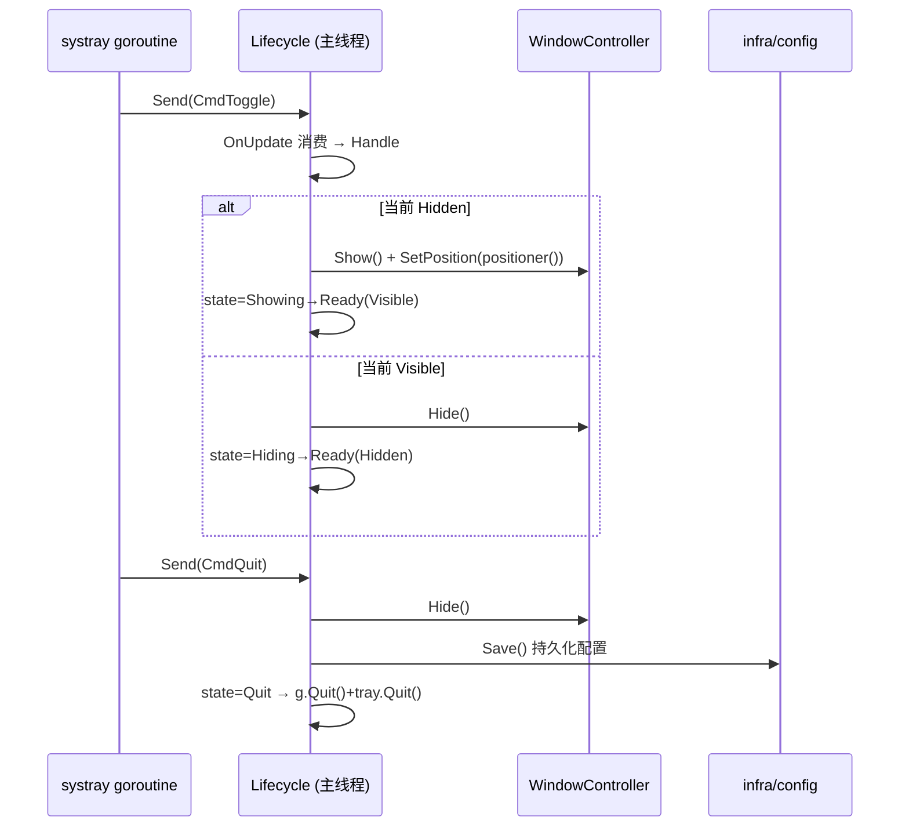
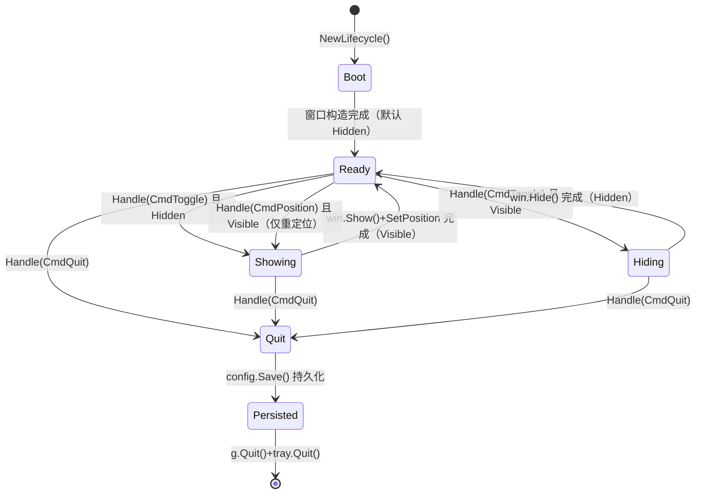

# Lifecycle.md — 应用生命周期状态机（Lifecycle State Machine）

> 版本：v1.0-draft ｜ 最后更新：2026-07-07 ｜ 模块归属：10-Shell ｜ 包名：`shell`（`internal/shell`）

本篇描述应用生命周期状态机 `boot → ready → showing → hiding → quit`，以及它与托盘点击事件、channel 命令（`CmdToggle` / `CmdPosition` / `CmdQuit`）的关系；并说明**状态持久化（退出不丢失配置）**。状态机只在主线程驱动，确保与 `Window` 线程安全边界一致。

---

## 1. 📦 package 设计

- **包名**：`shell`，所在目录 `internal/shell`。
- **一句话职责**：维护应用 UI 显隐生命周期状态机，消费来自托盘的命令（channel），调用 `WindowController` 切换显隐/定位，并在退出前持久化配置。
- **依赖方向**：
  - 依赖 `shell.WindowController`（接口）、`gogpu/systray`（`Bounds()` 定位）、`infra/config`（持久化）、`gogpu`（`Quit()`）。
  - 被依赖：`app`（构造 `Lifecycle` 并接线 `Send`/`Handle`）、`shell.Window`（被 `Handle` 调用）。
- **对外暴露的公开符号**：`Lifecycle`、`State`（枚举）、`Command`（枚举）、`NewLifecycle(...)`、`Send(Command)`、`Cmd() <-chan Command`、`Handle(Command, WindowController)`、`State() State`、`Positioner` 函数类型。
- **边界**：
  - 归它管：状态跃迁语义、命令分发、退出前配置持久化触发。
  - 不归它管：窗口底层 API（`WindowController`）、托盘消息泵（`app` 接线）、具体 UI 内容（`ui`）。

---

## 2. 📐 UML 类图



---

## 3. 🔄 数据流图



- **数据源**：托盘点击、平台 DPI/多屏事件、用户退出意图（均为命令）。
- **汇点**：`WindowController`（显隐/定位）、`config.json`（退出持久化）。

---

## 4. 🎨 UI 原型图（ASCII）

N/A —— `Lifecycle` 是状态机与命令分发逻辑，不渲染任何可见 UI 表面。其对外表现（面板显隐、托盘菜单）由 `Window` / `Layout` / 平台托盘负责。本层无用户可见像素。

---

## 5. 🗂 数据库设计

N/A —— 生命周期状态机不持有关系型数据，无 `CREATE TABLE`。退出前持久化的配置（弹窗位置、主题、开机自启、天气 key）以 JSON 文件 `%AppData%/DeskCalendar/config.json` 存储，由 `internal/infra/config` 读写（键值结构，非 SQLite）。持久化触发点位于 `Handle(CmdQuit, ...)`，但读写实现不属本层。

---

## 6. 📡 Event / Signal 流程



- **emit**：`tray.OnClick`（经 `app.Wire` → `Lifecycle.Send`）、平台事件 → `Send(CmdPosition)`。
- **subscribe**：主线程 `OnUpdate` 中的 `Lifecycle.Handle`。
- **副作用**：窗口显隐、定位、退出前配置保存、进程退出。

---

## 7. 🔌 Plugin API

N/A —— 生命周期状态机不直接对插件暴露钩子。插件若需感知应用退出/显隐，应通过 `80-Plugin` 的事件总线订阅由 `app` 在退出时广播的进程级事件；本层不提供插件可调用/可订阅接口，以保持状态机主线程边界与配置持久化逻辑的内聚。

---

## 8. 🧩 Feature 生命周期

应用 UI 显隐状态机（核心章节，使用 `stateDiagram-v2`）。



- `CmdPosition`：当面板可见时重新计算并 `SetPosition`（DPI/多屏变化后贴附托盘）；隐藏时不动作。
- `CmdQuit`：进入 `Quit`，先 `config.Save()` 持久化，再触发 `g.Quit()` + `tray.Quit()`，保证下次启动恢复位置/主题等。
- 退出幂等：已进入 `Quit` 后忽略后续命令。

---

## 9. 📖 Go 接口定义

```go
package shell

import (
	"sync"

	"github.com/shaolei/DeskCalendar/internal/infra/config"
	"github.com/deskcalendar/gogpu"
	"github.com/deskcalendar/gogpu/systray"
)

// State 是应用 UI 生命周期状态。
type State int

const (
	StateBoot State = iota
	StateReady // 就绪，可显可隐
	StateShowing
	StateHiding
	StateQuit
)

// Command 是跨线程传递的生命周期命令（仅经 channel，绝不跨线程直调窗口）。
type Command int

const (
	CmdToggle Command = iota // 切换显隐
	CmdPosition              // 依据 tray.Bounds 重定位（DPI/多屏变化）
	CmdQuit                  // 优雅退出
)

// Positioner 依据面板尺寸与托盘包围盒计算面板左上角坐标。
// 由 platform 提供 DPI/多屏换算；默认实现调用 tray.Bounds()。
type Positioner func(panelW, panelH int) (x, y int)

// Lifecycle 维护 UI 显隐状态机并分发命令。仅主线程驱动 Handle。
type Lifecycle struct {
	mu        sync.RWMutex
	state     State
	cmdCh     chan Command
	positioner Positioner
	persist   func(c config.Config) error
}

// NewLifecycle 构造状态机。positioner 提供定位计算，persist 提供退出持久化。
func NewLifecycle(positioner Positioner, persist func(config.Config) error) *Lifecycle {
	return &Lifecycle{
		state:     StateBoot,
		cmdCh:     make(chan Command, 8),
		positioner: positioner,
		persist:   persist,
	}
}

// Send 由任意线程（通常 systray goroutine）调用，非阻塞发送命令。
func (l *Lifecycle) Send(c Command) {
	select {
	case l.cmdCh <- c:
	default: // 队列满则丢弃，避免阻塞发送方
	}
}

// Cmd 返回只读命令通道，供主线程 OnUpdate select 消费。
func (l *Lifecycle) Cmd() <-chan Command { return l.cmdCh }

// State 返回当前状态（线程安全读）。
func (l *Lifecycle) State() State {
	l.mu.RLock()
	defer l.mu.RUnlock()
	return l.state
}

// Handle 必须在主线程（OnUpdate）中调用。依据命令驱动状态机与窗口。
func (l *Lifecycle) Handle(c Command, win WindowController, g *gogpu.App, tray *systray.Tray) {
	l.mu.Lock()
	defer l.mu.Unlock()
	switch c {
	case CmdToggle:
		if win.Visible() {
			win.Hide()
		} else {
			x, y := l.positioner(360, 480)
			win.SetPosition(x, y)
			win.Show()
		}
	case CmdPosition:
		if win.Visible() {
			x, y := l.positioner(360, 480)
			win.SetPosition(x, y)
		}
	case CmdQuit:
		if l.state == StateQuit {
			return // 幂等
		}
		win.Hide()
		_ = l.persist(config.Load()) // 退出前持久化配置
		l.state = StateQuit
		g.Quit()
		tray.Quit()
	}
}
```

> 说明：`Handle` 增加 `g *gogpu.App` 与 `tray *systray.Tray` 参数以完成 `CmdQuit` 的优雅退出（对应 `App.md` 的 `g.Quit()` 与 `tray.Quit()`）。`Send` 使用 `select default` 非阻塞，配合 `RequestRedraw()` 唤醒空闲主循环，符合并发规范（`02-开发规范.md` §3）。`positioner` 默认实现内部调用 `tray.Bounds()` 并叠加 DPI/多屏换算。

---

## 10. 🚀 Milestone 任务拆分

| 版本 | 任务 | 验收标准 |
|------|------|----------|
| v1.0（MVP·已实现 spike） | 状态机 `boot→ready→showing/hiding→quit` + 命令分发 | spike 验证点击托盘正确 toggle，不卡顿 |
| v1.0 | `Send` 非阻塞 + 主线程 `OnUpdate` 消费 | 静态检查确认无跨线程窗口调用 |
| v1.0 | `CmdQuit` 优雅退出 + `config.Save` 持久化 | 退出后配置保留；重开恢复位置/主题 |
| v1.0 | `CmdPosition` 基于 `tray.Bounds` 重定位 | 单屏点击托盘弹层贴附上方 |
| v1.2（Post-MVP） | `positioner` 接入多屏/DPI 换算（`platform`） | 副屏托盘点击弹层仍正确贴附 |
| v1.3（Post-MVP） | 退出持久化扩展主题/缩放配置 | 主题切换后退出重开保持一致 |
| v1.4（Post-MVP） | 退出前向 `80-Plugin` 广播（经 `app`） | 插件释放资源后再退出 |
