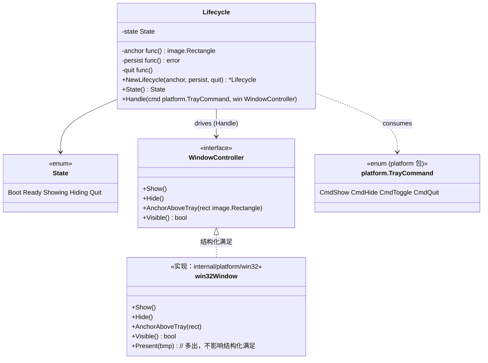
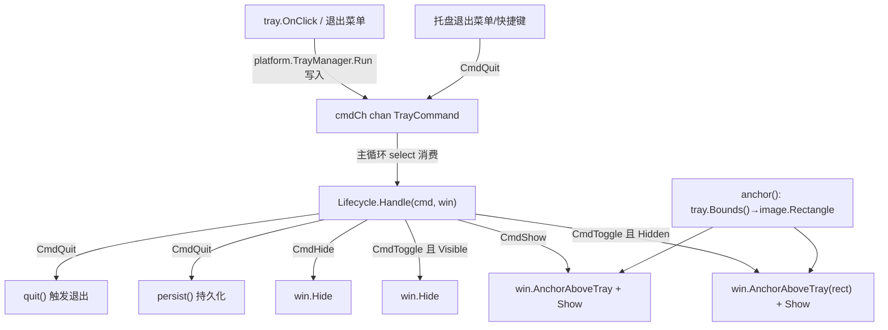
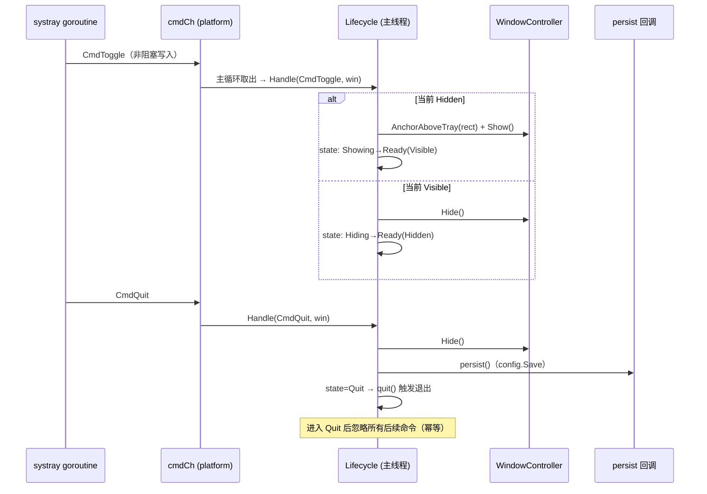
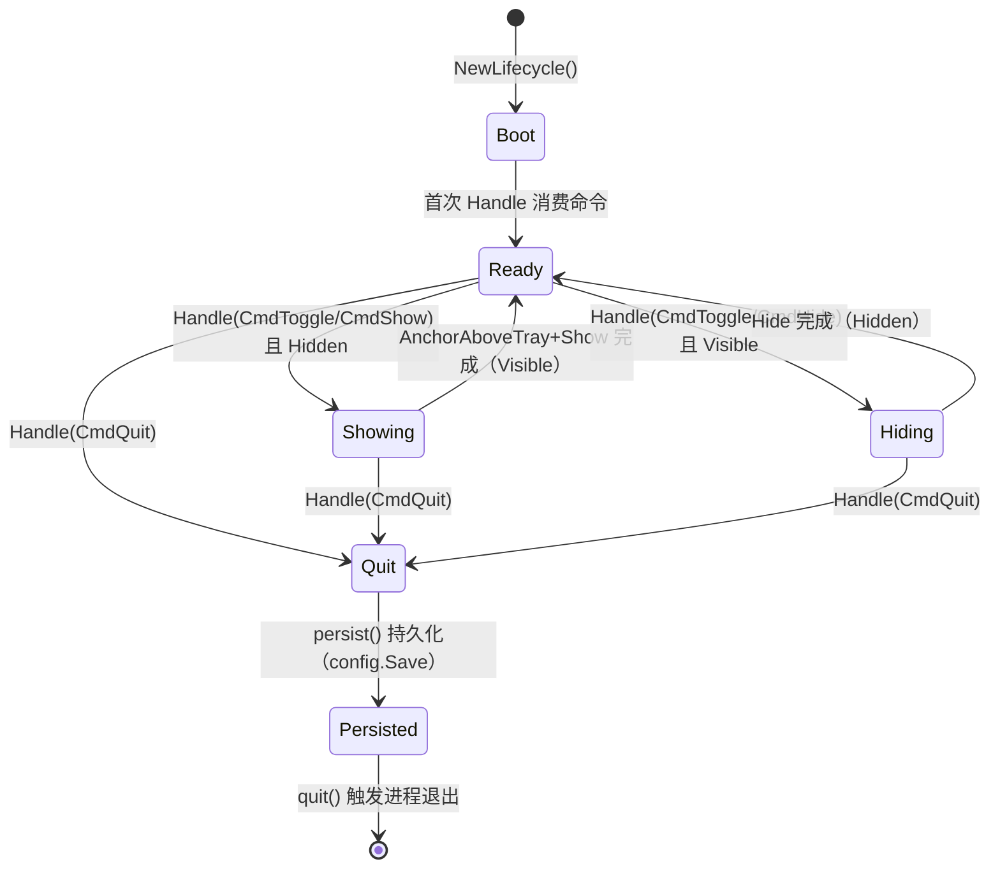

# Lifecycle.md — 应用生命周期状态机（Lifecycle State Machine）

> 版本：v1.0-draft ｜ 最后更新：2026-07-09 ｜ 模块归属：10-Shell ｜ 包名：`shell`（`internal/shell`）
> 路径 D / ADR-08 修订版（替代 gogpu.App / gogpu/systray 直接依赖）

本篇描述应用生命周期状态机 `boot → ready → showing → hiding → quit`，以及它与托盘点击事件、channel 命令（`platform.TrayCommand`：`CmdToggle` / `CmdShow` / `CmdHide` / `CmdQuit`）的关系；并说明**状态持久化（退出不丢失配置）**。状态机只在主线程驱动，确保与 `Window` 线程安全边界一致（ADR-02 双循环铁律）。

---

## 1. 📦 package 设计

- **包名**：`shell`，所在目录 `internal/shell`。
- **一句话职责**：维护应用 UI 显隐生命周期状态机，消费来自托盘的命令（`platform.TrayCommand`），调用 `WindowController` 切换显隐/锚定，并在退出前持久化配置。
- **依赖方向**：
  - 依赖 `platform`（`TrayCommand` 命令类型；`app` 接线时把 `TrayManager.Bounds()` 适配为 `anchor func() image.Rectangle`）、`image`（托盘矩形类型）。
  - **不**直接依赖 `gogpu` / `gogpu/systray` / `config` —— 退出持久化与进程退出经注入的 `persist` / `quit` 回调解耦，本包保持零业务依赖、可独立单测。
  - 被依赖：`app`（构造 `Lifecycle` 并接线 `anchor`/`persist`/`quit` 与托盘命令循环）、`shell.WindowController`（被 `Handle` 调用，由 `win32.WindowController` 结构化满足）。
- **对外暴露的公开符号**：`Lifecycle`、`State`（枚举）、`WindowController`（窄接口）、`NewLifecycle(...)`、`State()`、`Handle(cmd platform.TrayCommand, win WindowController)`。
- **边界**：
  - 归它管：状态跃迁语义、命令分发、退出前配置持久化触发（经 `persist` 回调）。
  - 不归它管：窗口底层 API（`WindowController` 实现）、托盘消息泵（`platform.TrayManager.Run` 拥有命令 channel）、具体 UI 内容（`internal/ui`）、配置读写实现（`infra/config`，由 `app` 经 `persist` 接线）。

> **与旧设计的关键差异**：旧 `Lifecycle` 自带 `shell.Command` 枚举与 `cmdCh`/`Send`/`Cmd()` 自有命令通道，并在 `Handle` 中直接持 `*gogpu.App` / `*systray.Tray`。路径 D 下，跨线程命令通道已由 `platform.TrayManager.Run(ctx, cmdCh chan<- TrayCommand)` 提供（tray goroutine 只写 channel，绝不直调窗口）；`Lifecycle` 仅暴露 `Handle(cmd platform.TrayCommand, win)` 由主循环消费，不再重复一套命令枚举与通道。

---

## 2. 📐 UML 类图



> 注：`WindowController` 是 `shell` 包定义的**窄接口**；`win32.WindowController`（含额外 `Present`）结构化满足它，但 `shell` 不 import `win32`，保持解耦与可单测。

---

## 3. 🔄 数据流图



- **数据源**：托盘点击、用户退出意图（均为 `platform.TrayCommand` 经 channel 到达主线程）。
- **汇点**：`WindowController`（显隐/锚定）、`persist` 回调（退出前配置落盘，由 `app` 接线 `config.Save`）。
- **路径 D 要点**：显示时先 `AnchorAboveTray(rect)` 再 `Show`（替代旧 `SetPosition`+`Show`）；窗口固定后不再移动，DPI/多屏变化下的重锚由窗口自身在 `WM_DPICHANGED` 中处理（见 `#9 Window`）。

---

## 4. 🎨 UI 原型图（ASCII）

N/A —— `Lifecycle` 是状态机与命令分发逻辑，不渲染任何可见 UI 表面。其对外表现（面板显隐、托盘菜单）由 `Window` / `Layout` / 平台托盘负责。本层无用户可见像素。

---

## 5. 🗂 数据库设计

N/A —— 生命周期状态机不持有关系型数据，无 `CREATE TABLE`。退出前持久化的配置（弹窗位置、主题、开机自启、天气 key）以 JSON 文件 `%AppData%/DeskCalendar/config.json` 存储，由 `internal/infra/config` 读写（键值结构，非 SQLite）。持久化触发点位于 `Handle(CmdQuit, ...)` 经 `persist` 回调，但读写实现不属本层。

---

## 6. 📡 Event / Signal 流程



- **emit**：`tray.OnClick`（经 `platform.TrayManager.Run` 写入 channel）、退出菜单 → `CmdQuit`。
- **subscribe**：主循环（app 接线）消费 channel 并调用 `Lifecycle.Handle`。
- **副作用**：窗口显隐、锚定、退出前配置保存、进程退出（`quit` 回调）。
- **跨线程铁律**：tray goroutine 只写 channel，绝不直调窗口；`Handle` 仅在主线程调用（`#9 Window` 内部再经 `SendMessage` 派发到窗口线程）。

> **关于旧 `CmdPosition`**：旧设计在 `Lifecycle` 处理 `CmdPosition`（依 `tray.Bounds` 重定位）以响应 DPI/多屏变化。路径 D 下，窗口（`#9`）已在 `WM_DPICHANGED` 中自行重建 DIB 并用 `lastTray` 重锚，**无需生命周期层再发重定位命令**。故本包不再定义 `CmdPosition`，效果由窗口自锚定覆盖。

---

## 7. 🔌 Plugin API

N/A —— 生命周期状态机不直接对插件暴露钩子。插件若需感知应用退出/显隐，应通过 `80-Plugin` 的事件总线订阅由 `app` 在退出时广播的进程级事件；本层不提供插件可调用/可订阅接口，以保持状态机主线程边界与配置持久化逻辑的内聚。

---

## 8. 🧩 Feature 生命周期

应用 UI 显隐状态机（核心章节，使用 `stateDiagram-v2`）。



- `CmdToggle`：Hidden → `AnchorAboveTray(rect)` + `Show`；Visible → `Hide`（替代旧 `SetPosition`+`Show`）。
- `CmdQuit`：进入 `Quit`，先 `Hide` 再 `persist()` 持久化，最后 `quit()` 触发进程退出，保证下次启动恢复位置/主题等。
- 退出幂等：已进入 `Quit` 后 `Handle` 直接返回，忽略所有后续命令（含重复 `CmdQuit`）。

---

## 9. 📖 Go 接口定义

```go
package shell

import (
	"image"
	"sync"

	"github.com/shaolei/DeskCalendar/internal/platform"
)

// WindowController 是 Lifecycle 驱动窗口所需的窄接口。
// 由 win32.WindowController 结构化满足（其多出的 Present 不影响），本包不 import win32，
// 保持可独立单测。
type WindowController interface {
	Show()
	Hide()
	AnchorAboveTray(rect image.Rectangle)
	Visible() bool
}

// State 是应用 UI 生命周期状态。
type State int

const (
	StateBoot State = iota // 构造后、尚未消费任何命令
	StateReady             // 就绪，可显可隐（稳态）
	StateShowing           // 正在显示（瞬态，Handle 内设置后即回到 Ready）
	StateHiding            // 正在隐藏（瞬态）
	StateQuit              // 已退出（幂等）
)

// Lifecycle 维护 UI 显隐状态机并分发托盘命令。仅主线程驱动 Handle。
type Lifecycle struct {
	mu      sync.RWMutex
	state   State
	anchor  func() image.Rectangle // 取托盘包围盒（物理像素），由 app 接线 tray.Bounds
	persist func() error           // 退出前持久化配置，由 app 接线 config.Save
	quit    func()                 // 触发进程退出，由 app 接线（取消 ctx / os.Exit）
}

// NewLifecycle 构造状态机。anchor 提供托盘矩形；persist/quit 提供退出钩子
// （nil 时对应步骤被安全跳过，便于单测）。
func NewLifecycle(anchor func() image.Rectangle, persist func() error, quit func()) *Lifecycle {
	return &Lifecycle{
		state:   StateBoot,
		anchor:  anchor,
		persist: persist,
		quit:    quit,
	}
}

// State 返回当前状态（线程安全读）。
func (l *Lifecycle) State() State {
	l.mu.RLock()
	defer l.mu.RUnlock()
	return l.state
}

// Handle 必须在主线程（消费 tray 命令的循环）中调用，依据命令驱动状态机与窗口。
// cmd 来自 platform.TrayManager 经 channel 推送的 platform.TrayCommand。
//
// 路径 D 要点：显示时先 AnchorAboveTray(托盘矩形) 再 Show（替代旧 SetPosition+Show）；
// 窗口固定后不再移动，DPI/多屏变化下的重锚由窗口自身在 WM_DPICHANGED 中处理（见 #9）。
func (l *Lifecycle) Handle(cmd platform.TrayCommand, win WindowController) {
	l.mu.Lock()
	defer l.mu.Unlock()
	// 已进入退出则忽略后续所有命令（退出幂等）。
	if l.state == StateQuit {
		return
	}
	switch cmd {
	case platform.CmdToggle:
		if win.Visible() {
			l.state = StateHiding
			win.Hide()
		} else {
			l.state = StateShowing
			win.AnchorAboveTray(l.anchor())
			win.Show()
		}
		l.state = StateReady
	case platform.CmdShow:
		if !win.Visible() {
			l.state = StateShowing
			win.AnchorAboveTray(l.anchor())
			win.Show()
			l.state = StateReady
		}
	case platform.CmdHide:
		if win.Visible() {
			l.state = StateHiding
			win.Hide()
			l.state = StateReady
		}
	case platform.CmdQuit:
		win.Hide()
		if l.persist != nil {
			_ = l.persist()
		}
		l.state = StateQuit
		if l.quit != nil {
			l.quit()
		}
	}
}
```

> 说明：`anchor` 回调由 `app` 接线为 `func() image.Rectangle { x,y,w,h := tray.Bounds(); return image.Rect(x,y,x+w,y+h) }`，把 `platform.TrayManager.Bounds()` 的 `(x,y,w,h)` 转成 `image.Rectangle`；`persist` 接线 `config.Save`，`quit` 接线取消主循环 context / `os.Exit`。`Handle` 增加的 `if l.state == StateQuit { return }` 保证退出后命令全部被忽略（幂等）。

---

## 10. 🚀 Milestone 任务拆分

| 版本 | 任务 | 验收标准 | 状态 |
|------|------|----------|------|
| v1.0（MVP·切片 #24 已落地） | 状态机 `boot→ready→showing/hiding→quit` + 命令分发 | 单测覆盖各命令跃迁（8 case 全绿） | ✅ |
| v1.0 | 命令通道非阻塞 + 主线程消费 | 通道由 `platform.TrayManager.Run` 提供（非阻塞写入），`Lifecycle.Handle(cmd, win)` 在主循环消费；静态检查无跨线程窗控 | ✅ |
| v1.0 | `CmdToggle` 调 `AnchorAboveTray(rect)`+`Show` 替代 `SetPosition`+`Show` | 隐→锚定+显示、显→隐藏，单测断言 `AnchorAboveTray` 收到托盘矩形 | ✅ |
| v1.0 | `CmdQuit` 优雅退出 + `persist` 持久化 | 退出前 `persist()` 调用、`quit()` 触发；幂等（重复命令被忽略） | ✅ |
| v1.0 | DPI/多屏重定位 | 由 `#9 Window` 的 `WM_DPICHANGED` 自锚定吸收，生命周期层不再单独处理（见 §6 注） | ✅（机制迁移） |
| v1.2（Post-MVP） | 多屏下 tray 切换后弹层仍正确贴附 | 窗口自锚定已覆盖；副屏 tray 切换场景 v1.2 真机验 | ⬜ |
| v1.3（Post-MVP） | 退出持久化扩展主题/缩放配置 | 主题切换后退出重开保持一致 | ⬜ |
| v1.4（Post-MVP） | 退出前向 `80-Plugin` 广播（经 `app`） | 插件释放资源后再退出 | ⬜ |
