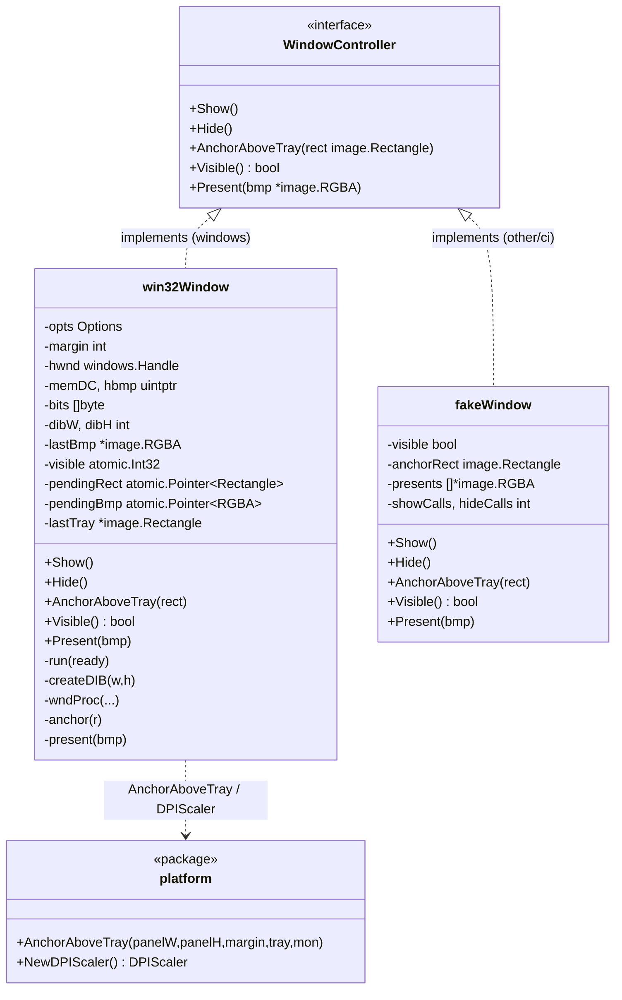
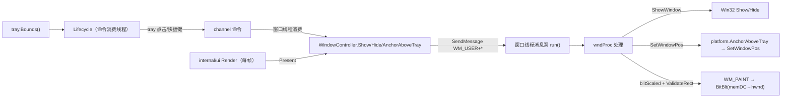
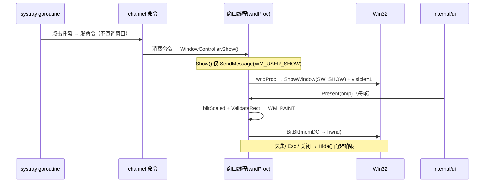
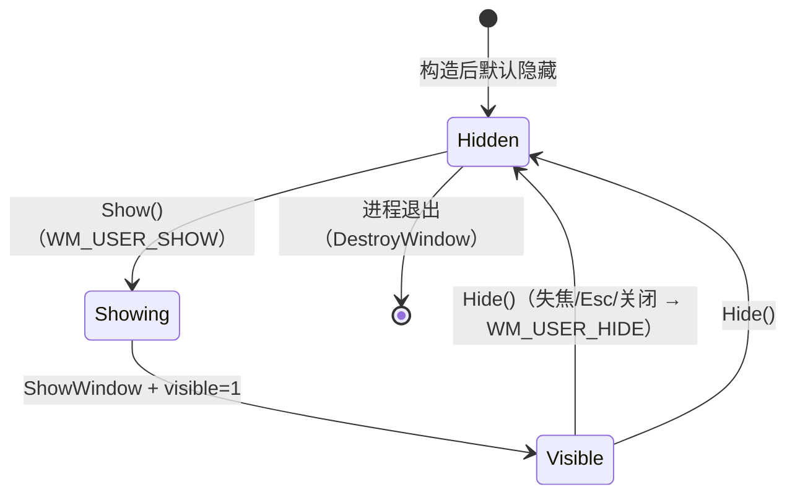

# Window.md — 窗口封装（自拥 win32 普通弹窗）

> 版本：v1.0-draft ｜ 最后更新：2026-07-09 ｜ 模块归属：10-Shell / Phase3 切片 #9 ｜ 包名：`win32`（`internal/platform/win32`）

本篇描述路径 D（ADR-08）下的窗口层：对 **自拥 win32 普通弹窗** 的封装，对外暴露 `WindowController` 接口（`Show` / `Hide` / `AnchorAboveTray` / `Visible` / `Present`）。MVP 目标是一个 **不透明、固定尺寸、方角的 WS_POPUP + WS_EX_TOPMOST 弹窗**，通过 `DIBSection` + `WM_PAINT`/`BitBlt` 推送 `internal/ui`（gg）产出的像素，比 POC 的 layered 窗口更简、无 premultiplied-alpha 坑。

**铁律（ADR-02 双循环）**：窗口方法只在「窗口线程」执行；托盘 goroutine 永不直调窗口，必须经 channel 命令交由窗口线程消费。窗口线程即运行消息泵的专属 goroutine，所有 `Show/Hide/AnchorAboveTray/Present` 经 `SendMessage` 派发自定义 `WM_USER+*` 消息到达该线程——无需 `runtime.LockOSThread`（该 goroutine 的唯一职责就是消息泵）。

---

## 1. 📦 package 设计

- **包名**：`win32`，所在目录 `internal/platform/win32`。
- **一句话职责**：自拥一个普通弹窗，统一为主线程安全的 `WindowController` 接口；通过 `SendMessage` 把窗口操作派发到窗口线程；用 `DIBSection`+`BitBlt` 推送 gg 像素；`AnchorAboveTray` 经 `platform.AnchorAboveTray` 计算并钳制位置。
- **依赖方向**：
  - 依赖 `golang.org/x/sys/windows`（`LazyDLL`，零 CGO）、`internal/platform`（DPI 感知 / 多屏锚定 `AnchorAboveTray` / `Monitor`）。
  - 被依赖：`shell.Lifecycle`（经 `WindowController` 切换显隐）、`app`（装配时持有 `WindowController`）、`internal/ui`（每帧 `Present` 推送像素）。
- **对外公开符号**：`WindowController`（接口）、`Options`、`NewWindow(opts Options) WindowController`、`blitScaled`（纯函数，便于单测）。
- **backend-seam 分层**（沿用仓库 Phase1 约定）：
  - `window.go`（**无 build tag**）：接口、`Options`、`fakeWindow`（内存实现）、`blitScaled` 纯函数。
  - `window_windows.go`（`//go:build windows`）：`win32Window` 真实实现（LazyDLL 调 user32/gdi32/kernel32）。
  - `window_other.go`（`//go:build !windows`）：`newNativeWindow` 回退为 `&fakeWindow{}`，保证跨平台可编译与单测。
- **边界**：
  - 归它管：窗口创建/销毁、显隐、单次锚定、像素推送与重绘、可见性状态、DPI 变化下的 DIB 重建。
  - 不归它管：何时显隐（由 `Lifecycle` 状态机决定）、托盘矩形从哪来（`platform`/`tray.Bounds()` 提供）、UI 内容（`internal/ui` 每帧 `Present`）、坐标公式（`platform.AnchorAboveTray` 决定）。

---

## 2. 📐 UML 类图



> 注：`win32Window` 仅存在于 `//go:build windows` 编译单元；非 Windows 下 `NewWindow` 返回 `fakeWindow`。`var _ WindowController = (*win32Window)(nil)` / `(*fakeWindow)(nil)` 在各自单元做编译期接口满足性校验。

---

## 3. 🔄 数据流图



- **数据源**：`tray.Bounds()`（屏幕坐标矩形，物理像素，来自 systray goroutine，仅经命令交给窗口线程消费）。
- **汇点**：Win32 窗口（`WS_POPUP` + `WS_EX_TOPMOST` + `WS_EX_TOOLWINDOW`）；像素来自 `internal/ui` 经 `Present` 推送的 `*image.RGBA`。
- **跨线程**：`WindowController` 方法体只做 `SendMessage.Call(hwnd, WM_USER_X, ...)`（传参经 `atomic.Pointer` 同步，规避 `unsafe.Pointer` 经 `LazyProc.Call` 的 vet 误用告警），由窗口线程 `wndProc` 真正执行。

---

## 4. 🎨 UI 原型图（ASCII）

窗口本身承载 UI 内容（由 `internal/ui` 经 `Present` 推送），本图说明 `AnchorAboveTray` 把面板定位到**托盘图标正上方**（窗口封装的核心职责，坐标由 `platform.AnchorAboveTray` 计算）。

```
                      屏幕顶部区域（示例：单屏 1920x1080，DPI 96）
   ┌──────────────────────────────────────────────────────────┐
   │  [任务栏托盘区 ............              (托盘图标)▮]      │
   │                                      ┌──┐                  │
   │                                      │  │ tray.Bounds()   │
   │                                      │▮ │  x,w            │
   │                                      └──┘  y(底部)         │
   │                                                            │
   │            ┌───────────────────────────┐  ↑ margin(8px)   │
   │            │  不透明方角日历面板 360x480 │  │                │
   │            │  ┌─────┬─────┬─────┐      │  │                │
   │            │  │ 一  │ 二  │ 三  │ ...  │  │ panelH         │
   │            │  └─────┴─────┴─────┘      │  │                │
   │            │  农历/节气/节假日/调休     │  │                │
   │            │  （90-UI 渲染内容）        │  │                │
   │            └───────────────────────────┘  │                │
   │             x = trayX + trayW/2 - 180     │                │
   │             y = trayY - 480 - 8           │                │
   │             （多屏/DPI 由 platform 换算） │                │
   └──────────────────────────────────────────────────────────┘
```

- `AnchorAboveTray(rect)` 接收托盘矩形（物理像素），由 `platform.AnchorAboveTray(panelW, panelH, margin, tray, mon)` 算出面板左上角并 `SetWindowPos` 钳制到屏内。
- 面板尺寸 `360x480`（逻辑 96-DPI 基准）由 `Options.Width/Height` 提供；MVP 固定，不随主题/缩放 `SetSize`（v1.3 再扩展）。

---

## 5. 🗂 数据库设计

N/A —— 窗口封装层无持久化数据，不读写任何数据库。窗口位置在退出前由 `Lifecycle`/`app` 持久化到 `config.json`，不属于本层职责。

---

## 6. 📡 Event / Signal 流程

窗口可见性由命令驱动，本层**不引入新的 gogpu/ui Signal**（避免跨线程状态问题）。



- **emit/subscribe**：无外部订阅者；可见性仅作为 `WindowController.Visible()` 布尔供 `Lifecycle` 读取以决定下次 toggle 方向。
- **跨线程铁律**：`WindowController` 方法只 `SendMessage` 派发到窗口线程；`wndProc` 内才真正触碰 `hwnd`/`memDC`。`AnchorAboveTray`/`Present` 的入参先存入 `atomic.Pointer` 再发消息，`wndProc` 取出使用——彻底规避「Go 指针经 `LazyProc.Call` 传递」的 `go vet` 告警。

---

## 7. 🔌 Plugin API

N/A —— 窗口操作不向插件直接暴露。插件若需影响面板可见性，应通过 `80-Plugin` 的事件总线发出意图，`Lifecycle` 将其转换为命令，最终经 `WindowController` 在窗口线程执行。本层不提供插件可订阅/可调用的接口，以保持窗口线程安全边界清晰。

---

## 8. 🧩 Feature 生命周期

窗口自身的显隐状态（不是进程生命周期）。



- 状态由 `win32Window.visible`（`atomic.Int32`）缓存，`Lifecycle` 读取以决定 toggle 方向。
- 任何状态跃迁都在窗口线程 `wndProc` 内完成；`Show/Hide` 经 `SendMessage` 同步派发（SendMessage 阻塞至窗口线程处理完，故 `ready` 通道确保构造后即可安全调用）。
- **失焦/Esc 关闭**：`WM_ACTIVATE` 且 `WA_INACTIVE` → `Hide()`；`WM_KEYDOWN` 且 `VK_ESCAPE` → `Hide()`；`WM_CLOSE` → `Hide()`（不销毁，进程退出时才 `DestroyWindow`）。

---

## 9. 📖 Go 接口定义

```go
package win32

import "image"

// WindowController 窗口操作接口（主线程安全，经 SendMessage 派发到窗口线程）。
// 业务/状态机（shell.Lifecycle、app、internal/ui）只依赖此接口，便于单测用 fake 替换。
type WindowController interface {
	// Show 显示窗口（若隐藏则弹出于上次锚定位置）。
	Show()
	// Hide 隐藏窗口（失焦/Esc/关闭均走此路径，而非销毁）。
	Hide()
	// AnchorAboveTray 将窗口锚定到托盘图标正上方居中（初次定位即固定）。
	// rect 为托盘图标的屏幕坐标矩形（物理像素），通常来自 tray.Bounds()。
	AnchorAboveTray(rect image.Rectangle)
	// Visible 返回当前可见状态（由窗口线程维护，供 Lifecycle 决策 toggle 方向）。
	Visible() bool
	// Present 推送最新像素缓冲（straight RGBA）并触发重绘。
	// 由 90-UI 渲染层 internal/ui.Render 每帧调用。
	Present(bmp *image.RGBA)
}

// Options 构造窗口的选项。
type Options struct {
	Width  int // 逻辑设计宽（96-DPI 基准，如 360）
	Height int // 逻辑设计高（如 480）
	Margin int // 锚定到托盘上方时的留白（物理像素）
}

// NewWindow 构造默认实现。Windows 下为自拥普通弹窗；非 Windows/CI 回退内存 fake。
func NewWindow(opts Options) WindowController { return newNativeWindow(opts) }

// ---- 非 Windows / 测试：内存实现，记录调用以便断言 ----
type fakeWindow struct {
	visible    bool
	anchorRect image.Rectangle
	presents   []*image.RGBA
	showCalls  int
	hideCalls  int
}

func (w *fakeWindow) Show()                             { w.showCalls++; w.visible = true }
func (w *fakeWindow) Hide()                             { w.hideCalls++; w.visible = false }
func (w *fakeWindow) Visible() bool                    { return w.visible }
func (w *fakeWindow) AnchorAboveTray(r image.Rectangle) { w.anchorRect = r }
func (w *fakeWindow) Present(b *image.RGBA)             { w.presents = append(w.presents, b) }

var _ WindowController = (*fakeWindow)(nil)

// blitScaled 将 src（straight RGBA）经最近邻缩放写入 DIB 的 BGRA 位（bits）。
// GDI DIB 字节序为 BGRA，故 R/B 互换；alpha 被 BitBlt 忽略，原样拷贝。纯函数，易单测。
func blitScaled(bits []byte, dibW, dibH int, src *image.RGBA) { /* ... */ }
```

`win32Window`（仅 `//go:build windows`）关键实现要点：

```go
//go:build windows

type win32Window struct {
	opts   Options
	margin int
	hwnd   windows.Handle // 仅窗口线程写入
	memDC  uintptr
	hbmp   uintptr
	bits   []byte // DIB 像素（BGRA）
	dibW, dibH int
	lastBmp *image.RGBA
	visible atomic.Int32
	pendingRect atomic.Pointer[image.Rectangle] // 跨线程传参（规避 unsafe.Pointer vet 告警）
	pendingBmp  atomic.Pointer[image.RGBA]
	lastTray *image.Rectangle // 仅窗口线程访问：最近锚定矩形（DPI 变化时重锚）
}

// 构造：声明 DPI 感知(PerMonitorV2) → 按 EffectiveDPI 算 dibW/dibH →
// 起窗口 goroutine 跑消息泵，ready 通道做 happens-before 同步后返回。
func newNativeWindow(opts Options) WindowController { /* ... */ }

// 窗口线程：注册类 → CreateWindowExW(WS_POPUP|WS_EX_TOPMOST|WS_EX_TOOLWINDOW)
// → createDIB → 发 ready → GetMessageW 循环 → DestroyWindow。
func (w *win32Window) run(ready chan<- error) { /* ... */ }

// 创建/重建 DIBSection（负高=自上而下），填充中性底色避免垃圾像素。
func (w *win32Window) createDIB(width, height int) { /* ... */ }

// 窗口过程：WM_USER_SHOW/HIDE/ANCHOR/PRESENT + WM_PAINT(BitBlt) +
// WM_ACTIVATE(失焦→Hide) + WM_KEYDOWN(Esc→Hide) + WM_CLOSE(Hide) + WM_DPICHANGED(重建) + WM_DESTROY(PostQuit)。
func (w *win32Window) wndProc(hwnd, message, wparam, lparam uintptr) uintptr { /* ... */ }

// 锚定：platform.AnchorAboveTray(dibW,dibH,margin, tray, monitorFromPoint) → SetWindowPos。
func (w *win32Window) anchor(r *image.Rectangle) { /* ... */ }

// 推送：存 lastBmp → blitScaled → ValidateRect 触发 WM_PAINT。
func (w *win32Window) present(bmp *image.RGBA) { /* ... */ }

// 接口方法：仅 SendMessage 派发（AnchorAboveTray/Present 先存 atomic.Pointer）。
func (w *win32Window) Show()                     { sendMessage.Call(uintptr(w.hwnd), wmUserShow, 0, 0) }
func (w *win32Window) Hide()                     { sendMessage.Call(uintptr(w.hwnd), wmUserHide, 0, 0) }
func (w *win32Window) Visible() bool             { return w.visible.Load() == 1 }
func (w *win32Window) AnchorAboveTray(r image.Rectangle) { w.pendingRect.Store(&r); sendMessage.Call(uintptr(w.hwnd), wmUserAnchor, 0, 0) }
func (w *win32Window) Present(b *image.RGBA)     { if b == nil { return }; w.pendingBmp.Store(b); sendMessage.Call(uintptr(w.hwnd), wmUserPresent, 0, 0) }
```

**DPI 处理**：构造时 `platform.NewDPIScaler().SetAwareness(ctx, platform.DefaultAwareness())`（`DPIPerMonitorAwareV2`）；`scaleLogical(logical, dpi)` 将逻辑尺寸换算物理像素。`WM_DPICHANGED` 时从 `wParam` 高字取新 DPI，重算 `dibW/dibH` → `createDIB` → 重 blit `lastBmp` → 用 `lastTray` 重新 `anchor()`（不读 `lParam` 的 `RECT` 指针，规避 `(*T)(unsafe.Pointer(uintptr))` 的 vet 告警）。

---

## 10. 🚀 Milestone 任务拆分

| 版本 | 任务 | 验收标准 | 状态 |
|------|------|----------|------|
| v1.0（MVP·切片 #9 已落地） | `WindowController` 接口收敛 `Show/Hide/AnchorAboveTray/Visible/Present` + `NewWindow(opts)` | 接口单测（fake）覆盖 Show/Hide/Anchor/Present 调用 | ✅ |
| v1.0 | 自拥 win32 普通弹窗（`WS_POPUP`+`WS_EX_TOPMOST`+`WS_EX_TOOLWINDOW`）+ `DIBSection`/`BitBlt` 推像素 | `go build`（CGO=0）/ `go vet` / `go test` 全绿；真机弹层出图 | ✅ |
| v1.0 | 双循环铁律：`SendMessage` 派发 + 专属窗口 goroutine 消息泵 | 代码审查 + `go vet` 确认无跨线程直调、无 unsafe.Pointer 经 LazyProc.Call | ✅ |
| v1.0 | 失焦 / Esc / 关闭 → `Hide()`（非销毁） | `WM_ACTIVATE` WA_INACTIVE / `WM_KEYDOWN` VK_ESCAPE / `WM_CLOSE` 均走 Hide | ✅ |
| v1.0 | DPI（PerMonitorV2 感知 + `WM_DPICHANGED` 重建 DIB 并重锚） | 高 DPI 屏下弹层尺寸正确、位置仍贴附托盘 | ✅ |
| v1.0 | `blitScaled` 纯函数（RGBA→BGRA 缩放，R/B 互换）单测 | `TestBlitScaled_Identity`/`ScaleDown`/`NilSafe` 全绿 | ✅ |
| v1.0 | backend-seam：非 Windows 回退 `fakeWindow` | CI（非 Windows）可编译、可单测 | ✅ |
| v1.2（Post-MVP） | 多屏下 `AnchorAboveTray` 副屏托盘点击仍正确贴附 | 副屏弹层不溢出、不越界 | ⬜ |
| v1.3（Post-MVP） | 窗口尺寸随主题/缩放变化（引入 `SetSize` 或重设 `Options`） | 主题切换后面板尺寸正确 | ⬜ |
| v1.4（Post-MVP） | 提供 `WindowController` 只读视图给插件事件总线 | 插件可读取可见性，但不能直调窗口 | ⬜ |
