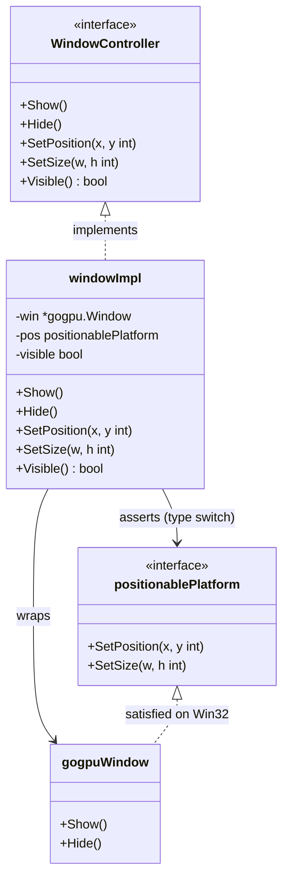
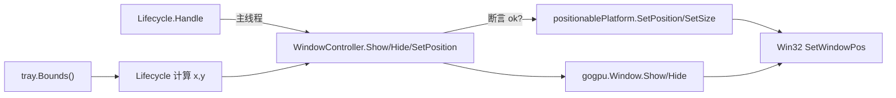
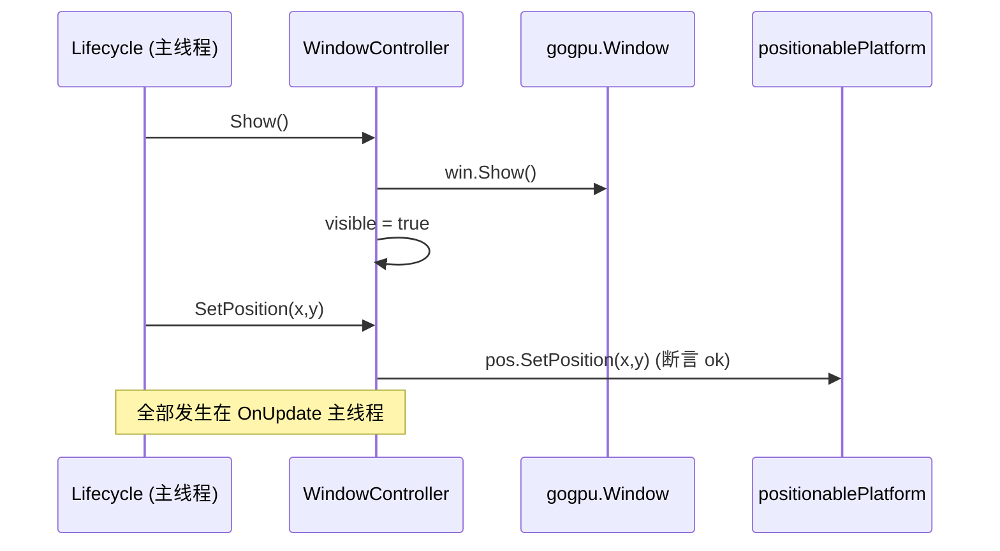
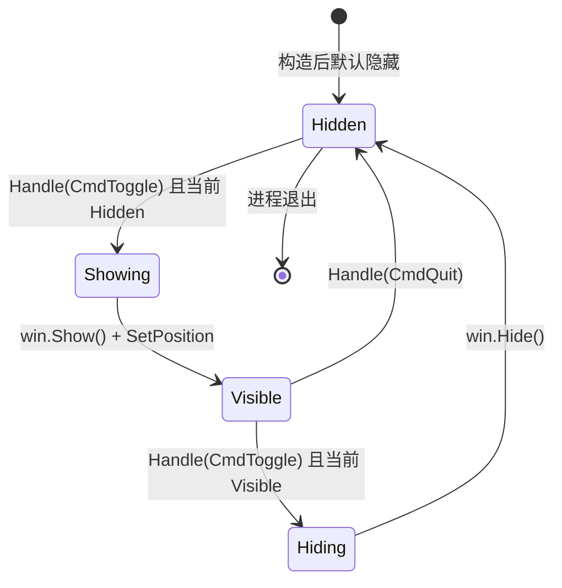

# Window.md — 窗口封装（Window Wrapper）

> 版本：v1.0-draft ｜ 最后更新：2026-07-07 ｜ 模块归属：10-Shell ｜ 包名：`shell`（`internal/shell`）

本篇描述对 `gogpu.Window` 的封装：`Show` / `Hide` / `SetPosition` / `SetSize` / `Visible`。重点是 **SetPosition/SetSize 通过本地 `positionablePlatform` 接口断言暴露**（已在 `poc/systray-spike` 验证），且**所有操作只在主线程 `OnUpdate` 中执行，绝不跨线程**。对外暴露 `WindowController` 接口以便 mock 与单测。

---

## 1. 📦 package 设计

- **包名**：`shell`，所在目录 `internal/shell`。
- **一句话职责**：封装 `gogpu.Window` 的显隐与定位操作，统一为主线程安全接口 `WindowController`；通过平台接口断言暴露 gogpu 未直接开放的 `SetPosition`/`SetSize`。
- **依赖方向**：
  - 依赖 `gogpu`（窗口对象与其平台接口）、`gogpu/systray`（定位用 `tray.Bounds()`）。
  - 被依赖：`app`（装配时持有 `*WindowController`）、`shell.Lifecycle`（通过 `WindowController` 接口切换显隐）。
- **对外暴露的公开符号**：`WindowController`（接口）、`NewWindow(*gogpu.Window) *WindowController`、`positionablePlatform`（平台断言接口）。
- **边界**：
  - 归它管：窗口显隐、主线程内的定位与尺寸设置、可见性状态缓存。
  - 不归它管：何时显隐（由 `Lifecycle` 的状态机决定）、UI 内容（`ui` 包）、定位坐标计算（`Lifecycle` 依据 `tray.Bounds` + DPI 算出后调用 `SetPosition`）。

---

## 2. 📐 UML 类图



> 注：`gogpu.Window` 在 Windows 平台实现 `positionablePlatform`；非 Windows 平台断言 `ok==false`，`SetPosition/SetSize` 变为 no-op（保持跨平台可编译、零 CGO 不受影响）。

---

## 3. 🔄 数据流图



- **数据源**：`tray.Bounds()`（屏幕坐标矩形，来自 systray goroutine，仅在主线程消费命令时读取）。
- **汇点**：Win32 窗口对象（`gogpu.Window` 底层）；可见性 `visible` 仅作为本地布尔缓存，不进 UI Signal。

---

## 4. 🎨 UI 原型图（ASCII）

窗口本身不是 UI 内容，但本图说明 `SetPosition` 把面板定位到**托盘图标正上方**（这是 Window 封装的核心职责，与 `Lifecycle` 的坐标计算配合）。

```
                      屏幕顶部区域（示例：单屏 1920x1080）
   ┌──────────────────────────────────────────────────────────┐
   │  [任务栏托盘区 ............              (托盘图标)▮]      │
   │                                      ┌──┐                  │
   │                                      │  │ tray.Bounds()   │
   │                                      │▮ │  x,w            │
   │                                      └──┘  y(底部)         │
   │                                                            │
   │            ┌───────────────────────────┐  ↑ margin(8px)   │
   │            │  圆角透明日历面板 360x480  │  │                │
   │            │  ┌─────┬─────┬─────┐      │  │                │
   │            │  │ 一  │ 二  │ 三  │ ...  │  │ panelH         │
   │            │  └─────┴─────┴─────┘      │  │                │
   │            │  农历/节气/节假日/调休     │  │                │
   │            │  （90-UI 渲染内容）        │  │                │
   │            └───────────────────────────┘  │                │
   │             x = trayX + trayW/2 - 180     │                │
   │             y = trayY - 480 - 8           │                │
   │             （多屏/DPI 由 platform 换算） │                │
   └──────────────────────────────────────────────────────────┘
```

- `SetPosition(x, y)` 设置面板左上角；`x,y` 由 `Lifecycle` 基于 `tray.Bounds()` 与 DPI 计算。
- 面板尺寸 `360x480` 由 `Layout` 决定，经 `SetSize` 同步（仅在主线程）。

---

## 5. 🗂 数据库设计

N/A —— 窗口封装层无持久化数据，不读写任何数据库。窗口位置在退出前由 `Lifecycle`/`app` 持久化到 `config.json`，不属于本层的 DB 职责。

---

## 6. 📡 Event / Signal 流程

窗口可见性变化通过命令驱动，不引入新的 gogpu/ui Signal（避免跨线程状态问题）。



- **emit/subscribe**：无外部订阅者；可见性仅作为 `WindowController.Visible()` 布尔供 `Lifecycle` 读取以决定下次 `CmdToggle` 行为。
- **跨线程铁律**：`Show/Hide/SetPosition/SetSize` 只允许在 `OnUpdate` 中调用（由 `app.Wire` 保证命令在主线程消费），systray goroutine 永不直调。

---

## 7. 🔌 Plugin API

N/A —— 窗口操作不向插件直接暴露。插件若需影响面板可见性，应通过 `80-Plugin` 的事件总线发出意图，`Lifecycle` 将其转换为 `CmdToggle` 等命令，最终仍由主线程经 `WindowController` 执行。本层不提供插件可订阅/可调用的接口，以保持窗口线程安全边界清晰。

---

## 8. 🧩 Feature 生命周期

窗口自身的显隐状态（不是进程生命周期）。



- 状态由 `WindowController.visible` 布尔缓存，`Lifecycle` 读取以决定 toggle 方向。
- 任何状态跃迁都在主线程 `OnUpdate` 内完成。

---

## 9. 📖 Go 接口定义

```go
package shell

import "github.com/deskcalendar/gogpu"

// WindowController 是窗口操作的线程安全（主线程）接口。
// 业务/状态机只依赖此接口，便于在测试中用 fake 替换。
type WindowController interface {
	Show()
	Hide()
	SetPosition(x, y int)
	SetSize(w, h int)
	Visible() bool
}

// positionablePlatform 是 gogpu.Window 在 Windows 平台（经 poc/systray-spike 验证）
// 额外满足的本地定位接口。gogpu 顶层 Window 未直接暴露，故通过类型断言获取。
type positionablePlatform interface {
	SetPosition(x, y int)
	SetSize(w, h int)
}

// windowImpl 是 WindowController 的默认实现，包装 *gogpu.Window。
type windowImpl struct {
	win     *gogpu.Window
	pos     positionablePlatform
	visible bool
}

// NewWindow 包装一个 gogpu 窗口。对 positionablePlatform 做断言，
// 非 Windows 平台 pos==nil，SetPosition/SetSize 自动降级为 no-op。
func NewWindow(w *gogpu.Window) WindowController {
	pos, _ := w.(positionablePlatform)
	return &windowImpl{win: w, pos: pos}
}

func (c *windowImpl) Show() {
	c.win.Show()
	c.visible = true
}

func (c *windowImpl) Hide() {
	c.win.Hide()
	c.visible = false
}

func (c *windowImpl) Visible() bool { return c.visible }

func (c *windowImpl) SetPosition(x, y int) {
	if c.pos != nil {
		c.pos.SetPosition(x, y) // 仅在 Windows 平台生效
	}
}

func (c *windowImpl) SetSize(w, h int) {
	if c.pos != nil {
		c.pos.SetSize(w, h)
	}
}
```

---

## 10. 🚀 Milestone 任务拆分

| 版本 | 任务 | 验收标准 |
|------|------|----------|
| v1.0（MVP·已实现 spike） | `positionablePlatform` 断言封装 `SetPosition/SetSize` | `poc/systray-spike` 真机弹层定位成功，零 CGO 编译通过 |
| v1.0 | `WindowController` 接口 + `NewWindow` | 单测可用 fake 验证 Show/Hide/SetPosition 调用 |
| v1.0 | 所有窗口操作仅主线程执行 | 代码审查 + 静态分析确认无跨线程调用 |
| v1.0 | `Visible()` 状态缓存供 toggle 决策 | toggle 行为正确，无闪烁 |
| v1.2（Post-MVP） | 多屏/DPI 下 `SetPosition` 坐标换算接入 `platform` | 副屏托盘点击弹层仍正确贴附 |
| v1.3（Post-MVP） | 窗口尺寸随主题/缩放变化经 `SetSize` 同步 | 主题切换后面板尺寸正确 |
| v1.4（Post-MVP） | 提供 `WindowController` 只读视图给插件事件总线 | 插件可读取可见性，但不能直调窗口 |
