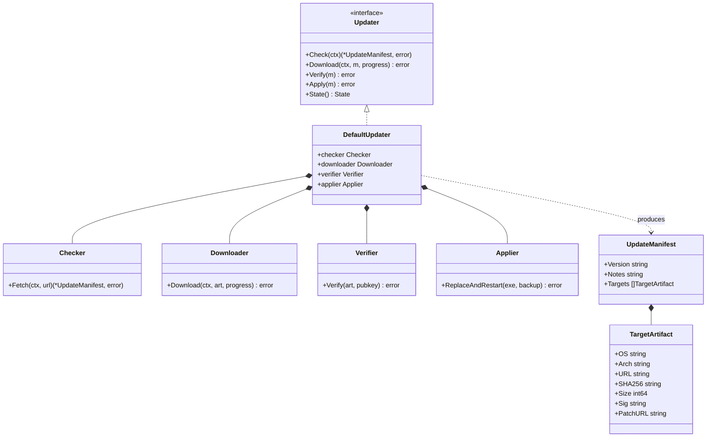
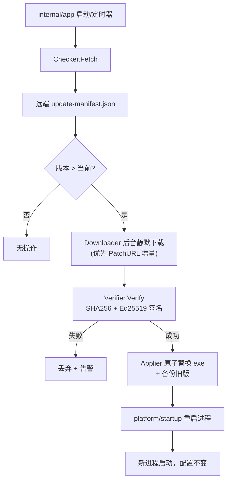
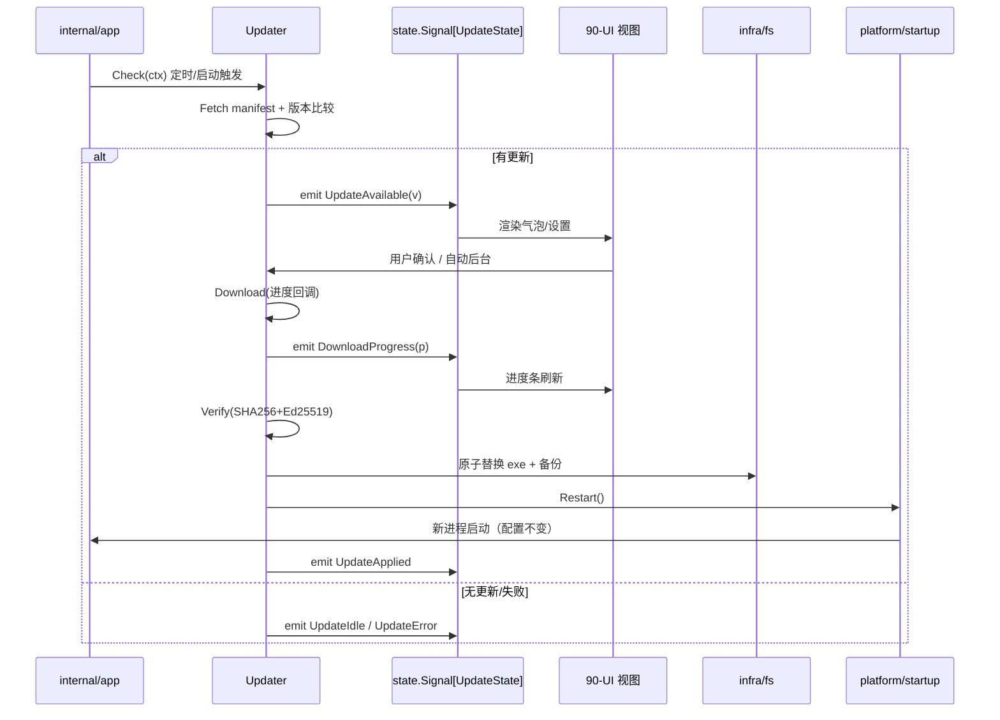
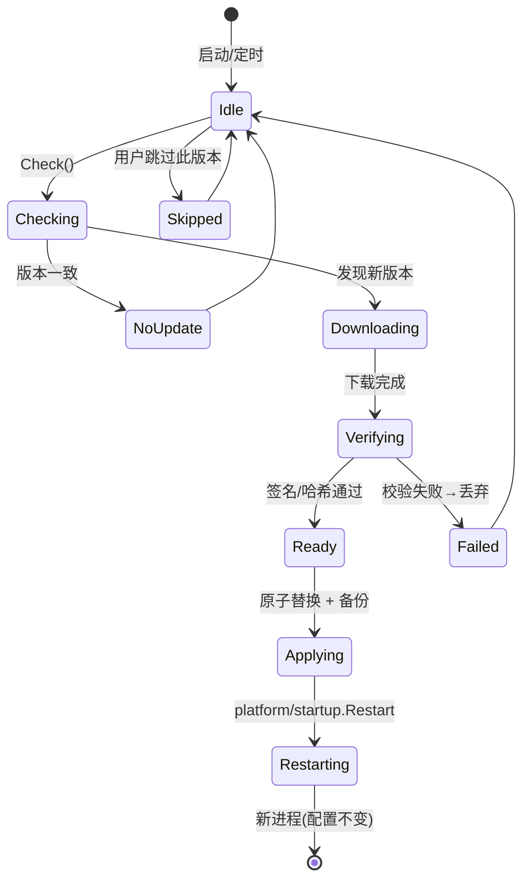

# AutoUpdate（自动更新）

> 模块：`100-Release` → `AutoUpdate` ｜ **Post-MVP（v1.5）**
> 版本：v1.5-draft ｜ 最后更新：2026-07-07
> 关联：`Build.md`（版本注入）、`Package.md`（安装布局）、`20-Platform/Startup.md`（重启）、`02-开发规范.md`（安全）
> ⚠️ **本模块标注为 Post-MVP，计划于 v1.5 交付，不在 v1.0 MVP 范围。**

---

## 1. 📦 package 设计

- **包名 / 目录**：运行期更新器放在 **`internal/updater`**（`github.com/shaolei/DeskCalendar/internal/updater`）。构建相关逻辑（manifest 生成）仍归 `build`，但更新器本身是**运行时 feature 包**（非 `build/`），因为它在应用进程内调度下载、校验、重启。
- **职责一句话**：在启动/定时触发时检查远端更新清单，静默后台下载增量包，用 Ed25519 签名校验，校验通过后替换二进制并重启应用，**不丢失用户配置**。
- **依赖方向**：
  - `internal/updater` 依赖：`build`（读 `Info().Version` 做版本比较）、`internal/infra/config`（读写更新偏好与配置路径）、`internal/infra/fs`（原子替换 exe）、`internal/platform/startup`（重启进程）、`crypto/ed25519`（标准库，纯 Go 零 CGO）、`net/http`（标准库）。
  - 被依赖：`internal/app`（生命周期在启动/定时钩子里调用 updater）。
  - 不依赖 UI 包；通过 `state` 的 `Signal` 向 UI 广播更新状态（见 §6）。
- **对外公开符号**：`Updater` 接口、`UpdateManifest` / `TargetArtifact` 结构、`State`（更新状态机）、`DefaultUpdater` 实现。
- **边界**：
  - 归它管：检查/下载/校验/应用/重启、增量 diff、签名验证、失败回退。
  - 不归它管：编译（Build.md）、安装包生成（Package.md）、配置存储格式本身（`infra/config` 负责）。

---

## 2. 📐 UML 类图



---

## 3. 🔄 数据流图



---

## 4. 🎨 UI 原型图（ASCII）

更新状态通过托盘气泡/设置页呈现（UI 细节见 `90-UI`）。以下为 **更新可用提示气泡**与**设置项**的 ASCII 原型。

```
托盘气泡（无焦点、不抢窗）：
┌─────────────────────────────────────┐
│ 🔔 DeskCalendar 更新可用  v1.5.0     │
│    本次：性能优化 + 农历修正          │
│    [稍后]   [后台下载并安装]          │
└─────────────────────────────────────┘

设置 → 关于 / 更新：
┌─ 更新 ─────────────────────────────┐
│ 自动检查更新      [✔ 开]            │
│ 检查频率          [每周 ▾]          │
│ 使用流量更新      [✘ 关]            │
│ 当前版本 1.4.2  → 最新 1.5.0        │
│ [立即检查]  状态：下载中 62% ▓▓░    │
└─────────────────────────────────────┘
```

---

## 5. 🗂 数据库设计

**N/A** — 更新器状态（已下载版本、跳过版本、上次检查时间）存入用户配置 `config.json`（`%AppData%\DeskCalendar\config.json`，见 `03-项目目录规范.md` §4 与 `infra/config`），非关系型数据库。无需 `CREATE TABLE`。配置项形如 `{"updater":{"autoCheck":true,"lastCheck":"...","skipped":"1.5.0"}}`。

---

## 6. 📡 Event / Signal 流程

本模块**适用** Signal（与 `AutoUpdate` 强相关），其余 Release 子模块不适用。以下用 `state` 响应式 `Signal` 广播更新进度，UI 订阅渲染。



**Signal 定义（state 包侧）**：

```go
// internal/state 中声明（仅为示意，实际在 state 包）
type UpdateState struct {
    Phase   string // idle|available|downloading|verifying|ready|applied|error
    Version string
    Progress int   // 0-100
    Err     string
}
// Signal[UpdateState] 由 updater 写入，UI 订阅。
```

---

## 7. 🔌 Plugin API

**N/A** — 更新器为核心发布能力，不向 `80-Plugin` 暴露钩子（避免插件干扰二进制替换导致不可恢复状态）。插件可在 `UpdateApplied` 之后收到通用生命周期通知，但更新过程本身不提供插件扩展点。

---

## 8. 🧩 Feature 生命周期



---

## 9. 📖 Go 接口定义

```go
// internal/updater/updater.go
package updater

import (
	"context"
	"crypto/ed25519"
)

// UpdateManifest 是远端发布的更新清单（CI tag 后由 build 生成并托管）。
type UpdateManifest struct {
	Version   string          `json:"version"`   // 语义化版本
	Notes     string          `json:"notes"`     // 更新说明（多语言可选）
	Published string          `json:"published"` // RFC3339
	Targets   []TargetArtifact `json:"targets"`  // 各平台产物
}

// TargetArtifact 描述单个平台的更新产物，支持增量补丁。
type TargetArtifact struct {
	OS      string `json:"os"`      // windows
	Arch    string `json:"arch"`    // amd64 / arm64
	URL     string `json:"url"`     // 全量 exe
	PatchURL string `json:"patch_url,omitempty"` // 增量补丁（bsdiff，可选）
	SHA256  string `json:"sha256"`  // 目标文件哈希
	Sig     string `json:"sig"`     // 对 SHA256 的 Ed25519 签名(base64)
	Size    int64  `json:"size"`
}

// Updater 是自动更新的核心抽象，所有副作用均可被 mock。
type Updater interface {
	// Check 拉取并解析 manifest，返回可用更新（无更新返回 nil, nil）。
	Check(ctx context.Context) (*UpdateManifest, error)
	// Download 后台静默下载目标产物，progress 汇报字节进度。
	Download(ctx context.Context, m *UpdateManifest, progress func(done, total int64)) error
	// Verify 校验下载产物的 SHA256 与 Ed25519 签名。
	Verify(m *UpdateManifest, pubKey ed25519.PublicKey) error
	// Apply 原子替换当前 exe（保留备份）并触发重启；配置路径不变，不丢配置。
	Apply(m *UpdateManifest) error
	// State 返回当前更新状态机状态（供 UI Signal 读取）。
	State() State
}

// State 是更新状态机的可观察快照。
type State struct {
	Phase    string // idle|available|downloading|verifying|ready|applied|error
	Version  string
	Progress int // 0-100
	Err      string
}

// DefaultUpdater 是 Updater 的默认实现，组合 Checker/Downloader/Verifier/Applier。
type DefaultUpdater struct {
	ManifestURL string
	PubKey      ed25519.PublicKey
	CurrentVer  string // 来自 build.Info().Version
	// 以下字段在真实实现中注入具体组件
	Checker    Checker
	Downloader Downloader
	Verifier   Verifier
	Applier    Applier
}
```

**校验与重启关键不变量（伪代码级别的真实调用）**：

```go
// 校验：先算 SHA256，再用公钥验签（纯 Go，零 CGO）。
func (v Verifier) Verify(art TargetArtifact, pub ed25519.PublicKey) error {
	sum := sha256.Sum256(art.data)
	sig, _ := base64.StdEncoding.DecodeString(art.Sig)
	if !ed25519.Verify(pub, sum[:], sig) {
		return fmt.Errorf("updater: signature mismatch for %s/%s", art.OS, art.Arch)
	}
	return nil
}

// 重启不丢配置：配置存于 %AppData%\DeskCalendar\config.json（与 exe 分离），
// Applier 仅重命名旧 exe 为 .old、写入新 exe，再经 platform/startup 启动新进程。
func (a Applier) ReplaceAndRestart(exe []byte) error {
	old, _ := os.Executable()
	_ = os.Rename(old, old+".old")       // 备份以便回退
	_ = os.WriteFile(old, exe, 0o755)    // 原位替换
	return platform.ReleaseAndRestart()  // 见 20-Platform/Startup.md
}
```

---

## 10. 🚀 Milestone 任务拆分

| 版本 | 任务 | 验收标准 |
|------|------|---------|
| v1.0 | （MVP 不含）更新器接口预留 | `Updater` 接口与 `UpdateManifest` 结构先定义，避免日后改核心 |
| v1.1 | 配置项 `updater.autoCheck` 落地（`infra/config`） | 设置可存读取向，但不触发下载 |
| v1.3 | CI tag 后生成 `update-manifest.json` 并托管 | Release 附带清单与 `sha256`/`sig` |
| **v1.5（Post-MVP）** | `Checker` + `Downloader`：启动/定时检查、后台静默下载 | 断网/无更新不阻塞主流程；进度经 Signal 上报 |
| **v1.5（Post-MVP）** | `Verifier`：SHA256 + Ed25519 签名校验 | 签名不符直接丢弃并告警，绝不替换 |
| **v1.5（Post-MVP）** | `Applier`：原子替换 + 备份旧版 + 经 `platform/startup` 重启 | 升级后配置完全保留；失败可回退 `.old` |
| **v1.5（Post-MVP）** | 增量更新（PatchURL / bsdiff） | 小版本更新流量显著低于全量（可选增强） |

> 标注：**AutoUpdate 属 Post-MVP（v1.5）**，不在 v1.0 MVP 交付范围；v1.0 仅预留接口与 manifest 结构。
