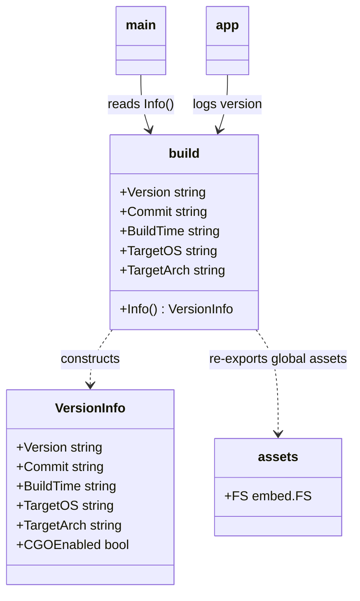
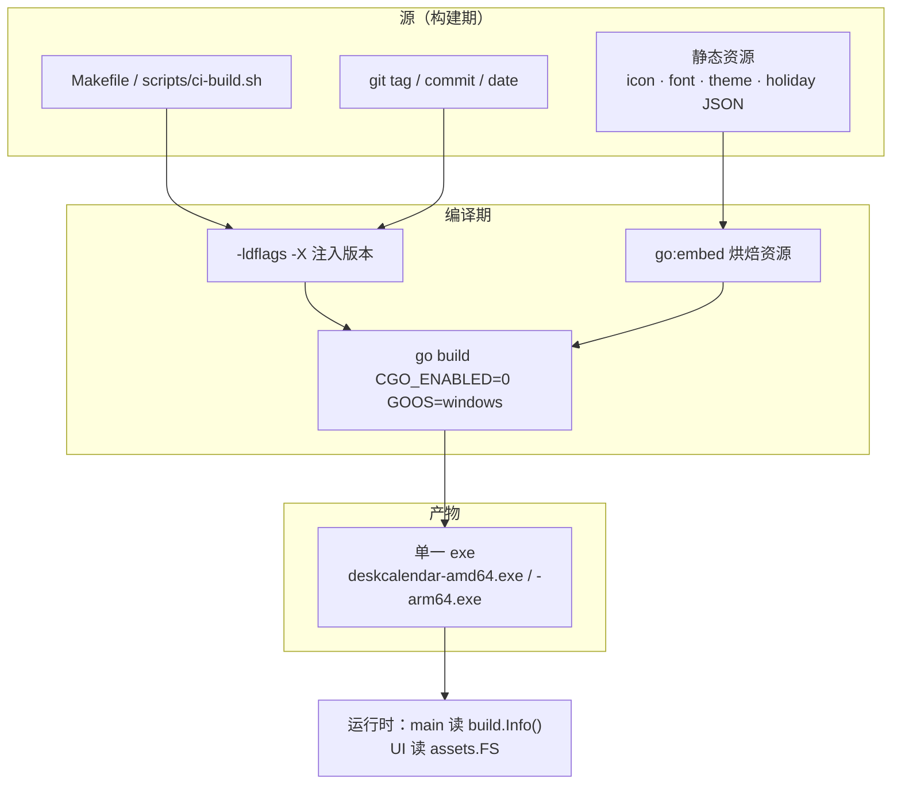
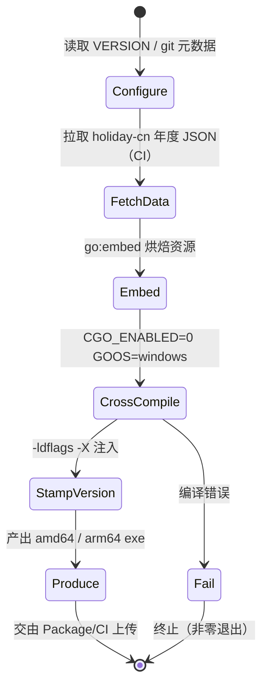

# Build（构建系统）

> 模块：`100-Release` → `Build` ｜ **MVP 发布必需（v1.0）**
> 版本：v1.0-draft ｜ 最后更新：2026-07-07
> 关联：ADR-01 / ADR-03 / ADR-05 / ADR-06、`02-开发规范.md`、`03-项目目录规范.md`

---

## 1. 📦 package 设计

- **包名 / 目录**：构建相关代码统一放在仓库根的 **`build/`** 包（`github.com/shaolei/DeskCalendar/build`），零运行时业务逻辑；纯资源嵌入与版本元数据集中于此。领域数据嵌入按 `03-项目目录规范.md` 落到各自 feature 包（`internal/theme/embedded`、`internal/calendar/data/holidays`），`build` 包只负责**全局构建资产**（应用图标、兜底字体、默认主题 JSON 兜底）与**版本注入目标变量**。
- **职责一句话**：在 `CGO_ENABLED=0` 约束下完成 windows/amd64 + arm64 交叉编译、将静态资源通过 `go:embed` 烘焙进单一二进制、并通过 `-ldflags -X` 注入版本号。
- **依赖方向**：
  - `build` 依赖：`embed`（标准库）、`internal/infra/log`（仅打印构建期诊断，可选）。
  - 被依赖：`main`（读取 `build.Info()` 展示关于框）、`internal/app`（启动期用 `build.Version` 打日志）、CI 脚本（`scripts/ci-build.sh`）通过 `go build -ldflags` 注入。
  - `build` 是**叶子包**，不依赖任何 feature 包，避免构建期引入业务耦合。
- **对外公开符号**：`Version` / `Commit` / `BuildTime` / `TargetOS` / `TargetArch`（ldflags 注入目标）、`Info() VersionInfo`、`build/assets.FS`（embed.FS）。
- **边界**：
  - 归它管：版本变量、全局资源嵌入、交叉编译脚本约定。
  - 不归它管：领域数据嵌入（日历/主题各自包负责）、安装包生成（见 `Package.md`）、CI 编排（见 `CI.md`）、运行时自启注册（见 `20-Platform/Startup.md`）。

---

## 2. 📐 UML 类图



---

## 3. 🔄 数据流图



---

## 4. 🎨 UI 原型图（ASCII）

构建模块无运行时界面，此处给出**嵌入资产布局 + 产物目录**的 ASCII 视图（供阅读定位资源归属）。

```
仓库根
└── build/
    ├── version.go          # Version/Commit/BuildTime/TargetOS/TargetArch (-ldflags 注入)
    └── assets/
        ├── assets.go       # //go:embed icon/ font/ theme/
        ├── icon/app.ico         ┐
        ├── font/default.ttf     ├─ 全局资源（build 包嵌入）
        └── theme/default.json   ┘
internal/
├── theme/embedded/        # 主题/图标/字体（theme 包嵌入，见 40-Theme）
└── calendar/data/holidays/# holiday-cn 年度 JSON（calendar 包嵌入，见 ADR-05c）

产物 dist/
├── deskcalendar-amd64.exe   # CGO_ENABLED=0 + 全部资源已内联
└── deskcalendar-arm64.exe
```

---

## 5. 🗂 数据库设计

**N/A** — 构建系统仅在编译期运行，不持久化任何数据，无表结构。版本元数据与资源均以只读方式嵌入二进制，运行时通过 `build.Info()` 与 `embed.FS` 读取，不落库。

---

## 6. 📡 Event / Signal 流程

**N/A** — 构建发生在编译期，无运行时 `Signal` / 领域事件流转。版本注入与资源嵌入是"编译即定型"的静态行为，不在双消息循环（`01-总体架构.md` §3）中产生事件。

---

## 7. 🔌 Plugin API

**N/A** — 构建工具链属于发布工程（build engineering），不向 `80-Plugin` 暴露任何钩子或接口。插件系统运行时不可观测/干预构建过程。

---

## 8. 🧩 Feature 生命周期



---

## 9. 📖 Go 接口定义

```go
// build/version.go
// Package build 集中管理版本元数据与全局嵌入资产。
// Version/Commit/BuildTime/TargetOS/TargetArch 由 Makefile 或 CI 通过
// -ldflags "-X github.com/shaolei/DeskCalendar/build.Version=..." 注入，
// 请勿在代码中手动赋值（默认值仅用于本地 dev 构建）。
package build

// Version / Commit / BuildTime / TargetOS / TargetArch 为 -ldflags 注入目标。
var (
	Version   = "dev"
	Commit    = "none"
	BuildTime = "unknown"
	TargetOS  = "windows"
	TargetArch = "amd64"
)

// VersionInfo 是运行时可读的构建元数据快照。
type VersionInfo struct {
	Version    string
	Commit     string
	BuildTime  string
	TargetOS   string
	TargetArch string
	CGOEnabled bool
}

// Info 返回当前二进制注入的版本信息。
func Info() VersionInfo {
	return VersionInfo{
		Version:    Version,
		Commit:     Commit,
		BuildTime:  BuildTime,
		TargetOS:   TargetOS,
		TargetArch: TargetArch,
		CGOEnabled: false, // 硬约束：本工程永不启用 CGO
	}
}
```

```go
// build/assets/assets.go
package assets

import "embed"

//go:embed icon/app.ico font/default.ttf theme/default.json
// FS 持有构建期全局静态资源，运行时以只读 embed.FS 访问，零磁盘依赖。
var FS embed.FS

// Icon 返回应用托盘/窗口图标字节（ICO 格式）。
func Icon() ([]byte, error) { return FS.ReadFile("icon/app.ico") }
```

**交叉编译命令（CGO_ENABLED=0，windows/amd64 与 arm64）**：

```bash
# amd64
CGO_ENABLED=0 GOOS=windows GOARCH=amd64 go build -trimpath \
  -ldflags "-s -w \
    -X github.com/shaolei/DeskCalendar/build.Version=$(VER) \
    -X github.com/shaolei/DeskCalendar/build.Commit=$(COMMIT) \
    -X github.com/shaolei/DeskCalendar/build.BuildTime=$(DATE) \
    -X github.com/shaolei/DeskCalendar/build.TargetArch=amd64" \
  -o dist/deskcalendar-amd64.exe .

# arm64（同命令仅改 GOARCH / TargetArch）
CGO_ENABLED=0 GOOS=windows GOARCH=arm64 go build -trimpath \
  -ldflags "-s -w \
    -X github.com/shaolei/DeskCalendar/build.Version=$(VER) \
    -X github.com/shaolei/DeskCalendar/build.Commit=$(COMMIT) \
    -X github.com/shaolei/DeskCalendar/build.BuildTime=$(DATE) \
    -X github.com/shaolei/DeskCalendar/build.TargetArch=arm64" \
  -o dist/deskcalendar-arm64.exe .
```

**Makefile 片段（仓库根）**：

```make
# Makefile —— DeskCalendar 零 CGO 交叉构建
VER    ?= $(shell git describe --tags --always)
COMMIT ?= $(shell git rev-parse --short HEAD)
DATE   ?= $(shell date -u +%Y-%m-%dT%H:%M:%SZ)
PKG     = github.com/shaolei/DeskCalendar/build
LDFLAGS = -s -w \
	-X $(PKG).Version=$(VER) \
	-X $(PKG).Commit=$(COMMIT) \
	-X $(PKG).BuildTime=$(DATE)

.PHONY: build build-amd64 build-arm64
build: build-amd64 build-arm64

build-amd64:
	CGO_ENABLED=0 GOOS=windows GOARCH=amd64 go build -trimpath \
		-ldflags "$(LDFLAGS) -X $(PKG).TargetArch=amd64" \
		-o dist/deskcalendar-amd64.exe .

build-arm64:
	CGO_ENABLED=0 GOOS=windows GOARCH=arm64 go build -trimpath \
		-ldflags "$(LDFLAGS) -X $(PKG).TargetArch=arm64" \
		-o dist/deskcalendar-arm64.exe .
```

---

## 10. 🚀 Milestone 任务拆分

| 版本 | 任务 | 验收标准 |
|------|------|---------|
| **v1.0（MVP）** | 实现 `build` 包版本变量 + `Info()`；`build/assets` 全局资源嵌入 | `go build` 后 `build.Info().CGOEnabled==false`；`assets.FS` 可读出 icon |
| **v1.0（MVP）** | amd64 + arm64 交叉编译脚本（`Makefile` + `scripts/ci-build.sh`） | 两条命令均产出可运行 exe，`CGO_ENABLED=0` 校验通过 |
| **v1.0（MVP）** | `-ldflags -X` 注入 VERSION / COMMIT / DATE / TargetArch | 关于框显示正确版本；`TargetArch` 与产物一致 |
| **v1.0（MVP）** | holiday-cn 年度 JSON 在 CI 构建期拉取并嵌入（`ADR-05c`） | 断网时节假日数据仍完整；年度 CI 任务可刷新 |
| v1.1 | 构建期 vendor 校验脚本（零 CGO 依赖断言） | CI 中扫描 `import "C"` 即失败 |
| v1.3 | 主题/字体资源改为构建期可配置路径嵌入 | 换肤资源随版本切换，无需改代码 |
| v1.5 | 可复现构建（`-trimpath` + 固定 `-buildvcs=false`） | 同源码两次构建哈希一致 |

> 标注：**Build 属 MVP 发布必需**，v1.0 必须交付交叉编译 + 资源嵌入 + 版本注入。
