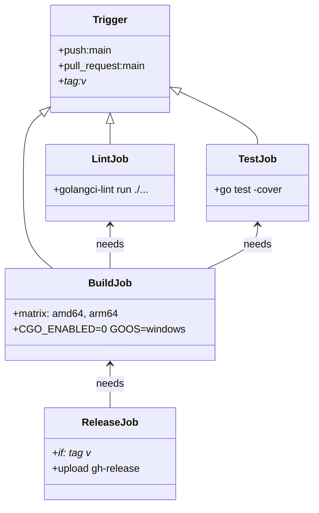
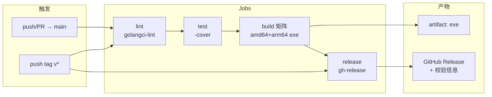
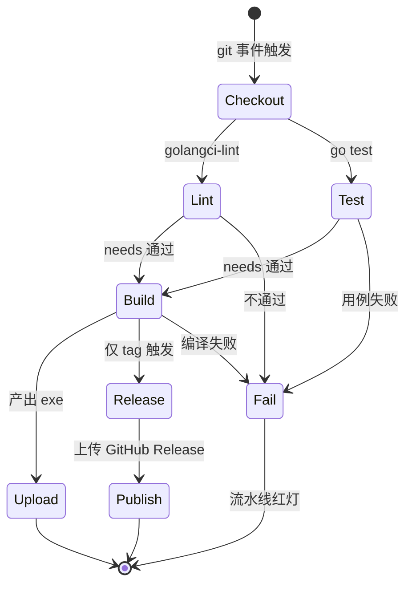

# CI（持续集成）

> 模块：`100-Release` → `CI` ｜ **MVP 发布必需（v1.0）**
> 版本：v1.0-draft ｜ 最后更新：2026-07-07
> 关联：`02-开发规范.md`、`Build.md`、`ADR-06`（Go 1.25+）

---

## 1. 📦 package 设计

- **包名 / 目录**：CI 不是 Go 运行时包，而是仓库根的 **`Makefile` + `.github/workflows/ci.yml` + `scripts/` 脚本集合**（配置即代码，logical module 记为 `ci`）。其中 `scripts/ci-build.sh` 调用 `Build.md` 定义的 `build` 包编译逻辑。
- **职责一句话**：在 Go 1.25 环境下跑 `golangci-lint` + 单测 + windows 双架构构建矩阵，上传产物，并在打 tag 时产出 Release 产物。
- **依赖方向**：
  - `ci` 依赖：`build` 包（消费其交叉编译约定）、`golangci-lint`、`actions/setup-go@v5`、`actions/upload-artifact`、`softprops/action-gh-release`。
  - 被依赖：Release 流程（见 `Package.md` 安装包生成通常在 tag 后由另一条 workflow/手动触发，CI 负责产出裸 exe 产物）。
- **对外公开"符号"**：workflow 暴露的 job（`lint` / `test` / `build` / `release`）与触发条件；`scripts/ci-build.sh` 的命令行参数（`--arch amd64|arm64`）。
- **边界**：
  - 归它管：lint / test / 跨平台编译 / 产物上传 / tag 触发 Release。
  - 不归它管：安装包打包（Package.md）、版本注入实现细节（Build.md）、运行时自动更新（AutoUpdate.md）。

---

## 2. 📐 UML 类图

CI 无 Go 类型，以下用类图建模 workflow 的 job 拓扑（组合/依赖关系）。



---

## 3. 🔄 数据流图



---

## 4. 🎨 UI 原型图（ASCII）

CI 无终端用户界面；以下以 ASCII 展示 **CI Job 流水线**（替代 UI 原型，说明阶段划分与并行关系）。

```
                push/PR(main) · tag(v*)
                         │
          ┌──────────────┼──────────────┐
          ▼              ▼              ▼
       [ lint ]       [ test ]       ( tag? → release 待 build )
          │              │
          └──────┬───────┘
                 ▼
            [ build 矩阵 ]
           ┌─────┴─────┐
           ▼           ▼
      amd64 exe    arm64 exe
           └─────┬─────┘
                 ▼
            upload artifact
                 │
            (tag) ▼ gh-release
```

---

## 5. 🗂 数据库设计

**N/A** — CI 是云端流水线，不持久化业务数据；仅产生临时构建缓存与制品（artifact），无数据库表结构。

---

## 6. 📡 Event / Signal 流程

**N/A** — CI 由 git 事件（push / PR / tag）触发，属 SCM webhook 范畴，非运行时 `gogpu/ui` 的 `Signal` / 领域事件。运行期双消息循环不产生 CI 事件。

---

## 7. 🔌 Plugin API

**N/A** — CI 流水线不向 `80-Plugin` 暴露任何钩子；插件在运行时加载，与构建/集成环境无交互面。

---

## 8. 🧩 Feature 生命周期



---

## 9. 📖 Go 接口定义

CI 自身无 Go 接口。下方 `build/target.go` 的 `Target` / `AllTargets` / `Builder` / `GoBuilder` 是**设计草图（尚未实现）**——当前 v1.0 的交叉编译目标矩阵由 **`Makefile` + `scripts/ci-build.sh`** 直接承担（见 §3 数据流图），是单一事实源；若未来要把编译抽象成可 mock 的 `Builder`，再按此草图落地，届时 CI 脚本复用该契约。

```go
// build/target.go
package build

// Target 描述一个交叉编译目标，供 CI 脚本与本地 Makefile 共用。
type Target struct {
	OS   string // 固定 "windows"
	Arch string // "amd64" 或 "arm64"
}

// AllTargets 返回 MVP 支持的全部构建目标。
func AllTargets() []Target {
	return []Target{
		{OS: "windows", Arch: "amd64"},
		{OS: "windows", Arch: "arm64"},
	}
}

// Builder 抽象单次编译动作，便于在测试中 mock 而非真跑 go build。
type Builder interface {
	Build(ctx context.Context, t Target, out string) error
}

// GoBuilder 是 Builder 的默认实现，内部调用 `go build -trimpath`。
type GoBuilder struct {
	Version   string
	Commit    string
	BuildTime string
}

// Build 在 CGO_ENABLED=0 约束下执行交叉编译并注入版本。
func (b GoBuilder) Build(ctx context.Context, t Target, out string) error {
	// 等价命令见 Build.md §9；此处用 exec.CommandContext 调用 go build。
	// 关键不变量：env 必须含 CGO_ENABLED=0、GOOS=windows。
	_ = ctx
	_ = t
	_ = out
	return nil // 实际实现见 scripts/ci-build.sh 与 Makefile
}
```

> 说明：`GoBuilder.Build` 的真实命令字符串严格遵循 `Build.md §9` 的 `go build` 调用；CI 的 `scripts/ci-build.sh` 直接复用该契约，避免脚本与文档漂移。

---

## 10. 🚀 Milestone 任务拆分

| 版本 | 任务 | 验收标准 |
|------|------|---------|
| **v1.0（MVP）** | `golangci-lint` job（errcheck/staticcheck/ineffassign/revive） | PR 未通过 lint 不能合入 `main` |
| **v1.0（MVP）** | `go test -coverprofile` job | 核心 domain 覆盖率 ≥ 80%；零 CGO（ADR-06）下 `-race` 不可用，并发安全靠单写者+通道设计保证（见 `internal/app`/`internal/platform/win32`），不跑 race detector |
| **v1.0（MVP）** | windows 双架构构建矩阵（`CGO_ENABLED=0`） | amd64 + arm64 均产出 exe 并上传 artifact |
| **v1.0（MVP）** | tag `v*` 触发 Release 上传 GitHub Release | 打 tag 后自动发布两个 exe |
| v1.1 | 测试缓存复用 + 覆盖率门禁（≥ 60%） | CI 报告覆盖率不达标即失败 |
| v1.3 | 构建产物 checksum / SBOM 生成 | Release 附带 `sha256.txt` |
| v1.5 | CI 调用 `AutoUpdate` 元数据发布（manifest.json） | tag 发布同时生成更新清单（见 AutoUpdate.md） |

> 标注：**CI 属 MVP 发布必需**，v1.0 必须落地 lint+test+构建矩阵+tag 发布。
