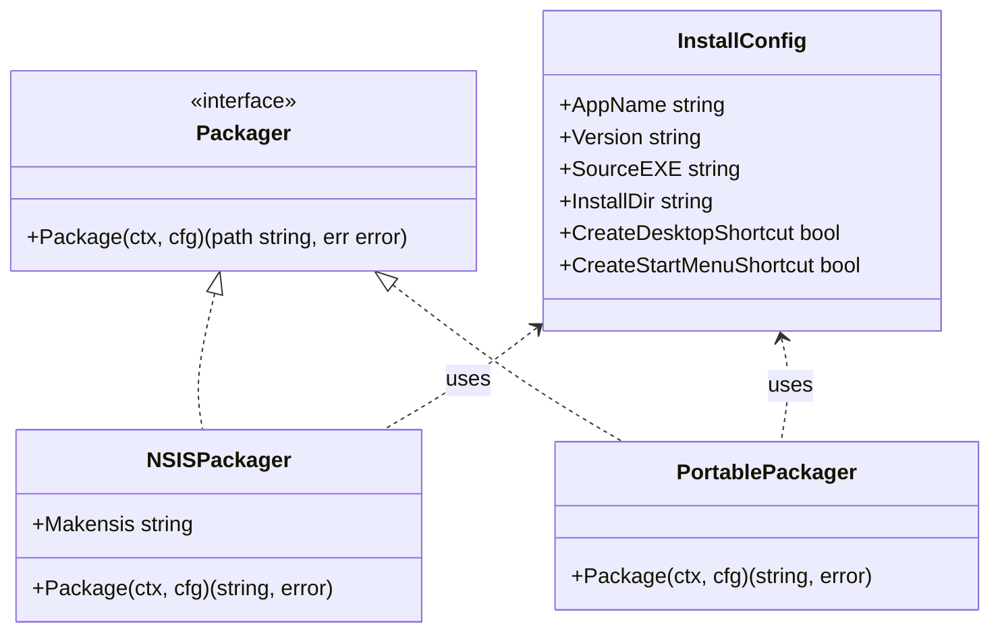
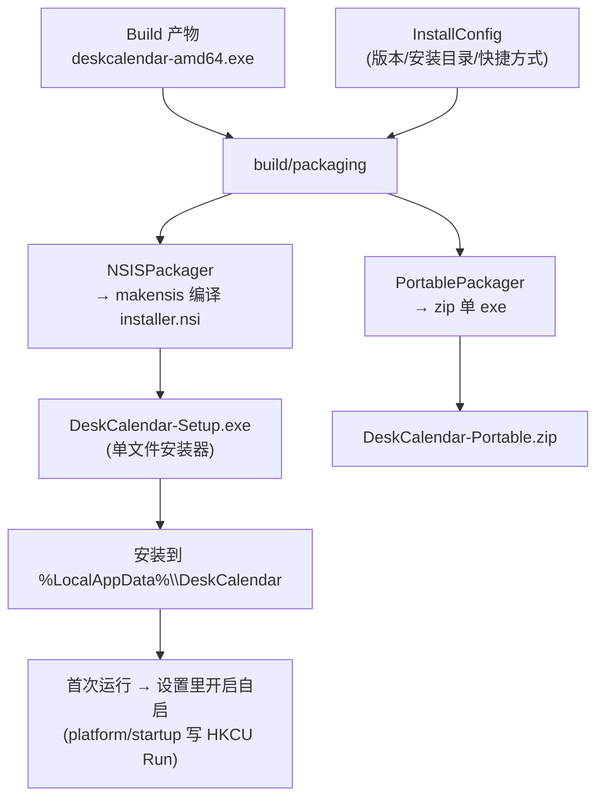
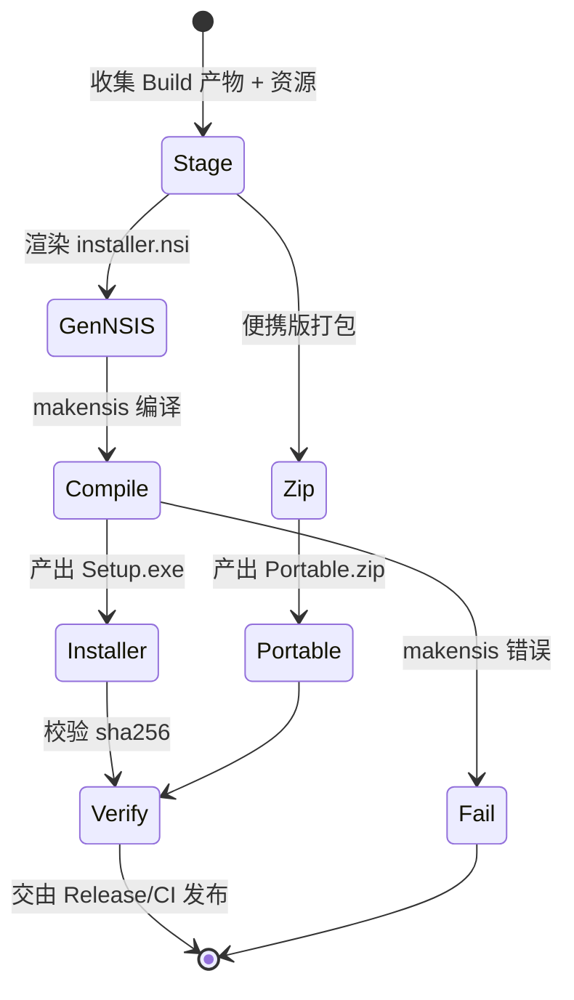

# Package（安装包 / 发布打包）

> 模块：`100-Release` → `Package` ｜ **MVP 发布必需（v1.0）**
> 版本：v1.0-draft ｜ 最后更新：2026-07-07
> 关联：`Build.md`、`20-Platform/Startup.md`、`02-开发规范.md` §8（自启注册表）、`ADR-06`

---

## 1. 📦 package 设计

- **包名 / 目录**：打包逻辑放在仓库根 **`build/packaging`** 子包（`github.com/shaolei/DeskCalendar/build/packaging`）；NSIS 安装脚本位于 `build/nsis/installer.nsi`。`build` 为 `100-Release` 约定的构建根包（见 `_模板与写作规范.md` 已拍板决策与 `03-项目目录规范.md`）。开机自启注册归 `internal/platform/startup`（见 `20-Platform/Startup.md`）；安装器在 `AutoStart` 勾选时于**安装期**即写入 `HKCU\...\Run`（值格式与 `startup.intendedValue()` 对齐），实现「装完即自启」，运行期用户仍可在设置中经 `startup` 改写/关闭该值。
- **职责一句话**：把 `Build.md` 产出的单一 exe 封装为（a）安装到 `%LocalAppData%\DeskCalendar` 的单文件 NSIS 安装包，与（b）免安装便携版（单 exe 的 zip）；并确保开机自启能力可用。
- **依赖方向**：
  - `build/packaging` 依赖：`build`（读取产物路径）、`archive/zip`（标准库，便携版）、外部 `makensis`（NSIS 编译器）。
  - 被依赖：Release 流程（CI tag 后调用生成安装包）。
  - 与 `internal/platform/startup` 协作：安装器安装期写一次 `HKCU\...\Run`（`AutoStart` 勾选时），运行期自启的开启/关闭由 `startup` 管理；二者写同一注册表键，`startup.sameStartupValue` 归一化比对，值格式差异不影响判定。
- **对外公开符号**：`InstallConfig`（安装目标/快捷方式选项）、`Packager` 接口、`NSISPackager`、`PortablePackager`、`Package(ctx, cfg) (string, error)`。
- **边界**：
  - 归它管：安装包脚本生成、便携 zip、产物命名与校验。
  - 不归它管：编译（Build.md）、CI 编排（CI.md）、运行时自启注册实现（20-Platform/Startup.md）、自动更新（AutoUpdate.md）。

---

## 2. 📐 UML 类图



---

## 3. 🔄 数据流图



---

## 4. 🎨 UI 原型图（ASCII）

安装包无应用内 UI，以下以 ASCII 展示 **NSIS 安装向导关键页**与**安装目录约定**。

```
┌─ DeskCalendar 安装向导 ───────────────┐
│ 欢迎：单一二进制 · 零后台服务 · 离线    │
│───────────────────────────────────────│
│ 选择安装位置：                          │
│   [ %LocalAppData%\DeskCalendar  ] 浏览│   ← 默认用户级，无需管理员
│   ☑ 创建桌面快捷方式                   │
│   ☑ 创建开始菜单项                     │
│   ☐ 开机自动启动 (推荐，可在设置关闭)  │   ← 仅勾选，实际注册在首次运行
│───────────────────────────────────────│
│ [安装]  安装进度 ▓▓▓▓▓▓▓▓▓▓ 100%       │
│ 完成 → 运行 DeskCalendar               │
└───────────────────────────────────────┘

便携版：DeskCalendar-Portable.zip
└── deskcalendar-amd64.exe   (解压即用，不写注册表)
```

---

## 5. 🗂 数据库设计

**N/A** — 打包过程仅组织文件与生成安装脚本，不持久化业务数据。开机自启写入的是注册表 `HKCU\Software\Microsoft\Windows\CurrentVersion\Run`（见 `20-Platform/Startup.md`），非数据库，且发生在运行期而非打包期。

---

## 6. 📡 Event / Signal 流程

**N/A** — 安装包生成是发布工程步骤，运行期无 `Signal` 流转。安装向导的"下一步/完成"是 NSIS 页面事件，非 `gogpu/ui` 的响应式 `Signal`，不在本模块建模。

---

## 7. 🔌 Plugin API

**N/A** — 打包工具链不向 `80-Plugin` 暴露钩子。插件在运行期由 `internal/plugin` 加载，与安装包生成无交互面。

---

## 8. 🧩 Feature 生命周期



---

## 9. 📖 Go 接口定义

```go
// build/packaging/packaging.go
package packaging

import (
	"context"
	"archive/zip"
)

// InstallConfig 描述一次打包的配置。
// InstallDir 默认 %LocalAppData%\DeskCalendar（用户级，免管理员）。
type InstallConfig struct {
	AppName                string
	Version                string
	SourceEXE             string // Build 产物绝对路径
	InstallDir            string // 安装目标目录
	CreateDesktopShortcut bool
	CreateStartMenu       bool
	// AutoStart 控制 NSIS 页面是否默认勾选；勾选时安装器在安装期即写 HKCU\...\Run
	// （值格式与 internal/platform/startup.intendedValue() 对齐），实现「装完即自启」。
	AutoStart bool
}

// Packager 抽象一种打包形态，便于扩展（NSIS / MSI / 便携 zip）。
type Packager interface {
	// Package 产出安装包/压缩包文件，返回产物路径。
	Package(ctx context.Context, cfg InstallConfig) (string, error)
}

// NSISPackager 通过调用外部 makensis 编译 installer.nsi 生成单文件安装器。
type NSISPackager struct {
	Makensis string // makensis 可执行路径
}

// Package 生成 DeskCalendar-Setup.exe。
func (n NSISPackager) Package(ctx context.Context, cfg InstallConfig) (string, error) {
	// 1. 渲染 installer.nsi（含 InstallDir / 快捷方式 / 自启勾选）
	// 2. exec.CommandContext(ctx, n.Makensis, "-V2", script)
	_ = ctx
	_ = cfg
	return "", nil // 真实实现调用 makensis，详见 build/nsis/installer.nsi
}

// PortablePackager 生成免安装便携版（单 exe 的 zip）。
type PortablePackager struct{}

// Package 将 SourceEXE 压入 zip，返回 Portable.zip 路径。
func (p PortablePackager) Package(ctx context.Context, cfg InstallConfig) (string, error) {
	_ = ctx
	_ = cfg
	_ = zip.NewWriter
	return "", nil // 真实实现见 build/packaging/portable.go
}
```

**NSIS 安装脚本关键片段（`build/nsis/installer.nsi`）**：

```nsis
!define APPNAME "DeskCalendar"
!define VERSION "1.0.0"
; 用户级安装，无需管理员权限
InstallDir "$LOCALAPPDATA\DeskCalendar"
RequestExecutionLevel user

Section "Main"
  SetOutPath "$INSTDIR"
  File "${SOURCE_EXE}"            ; deskcalendar-amd64.exe
  WriteUninstaller "$INSTDIR\uninstall.exe"
  ; 开始菜单快捷方式
  CreateShortCut "$SMPROGRAMS\DeskCalendar.lnk" "$INSTDIR\deskcalendar-amd64.exe"
  ; 桌面快捷方式（按 InstallConfig.CreateDesktopShortcut）
  ; 自启注册：安装期按 AUTOSTART 勾选写入 HKCU\...\Run（值格式与平台 startup 一致）
SectionEnd

Section "Uninstall"
  Delete "$INSTDIR\deskcalendar-amd64.exe"
  Delete "$INSTDIR\uninstall.exe"
  Delete "$SMPROGRAMS\DeskCalendar.lnk"
  RMDir "$INSTDIR"
SectionEnd
```

---

## 10. 🚀 Milestone 任务拆分

| 版本 | 任务 | 验收标准 |
|------|------|---------|
| **v1.0（MVP）** | NSIS 单文件安装器，安装到 `%LocalAppData%\DeskCalendar` | 双击安装无需管理员；卸载干净无残留 |
| **v1.0（MVP）** | 便携版 zip（单 exe） | 解压即运行，不写注册表/不落配置到程序目录 |
| **v1.0（MVP）** | 开机自启能力可用（经 `platform/startup` 注册表） | 设置开启后重启生效，写在 `HKCU\...\Run` 仅当前用户 |
| **v1.0（MVP）** | 产物附 `sha256.txt` 校验 | Release 含安装包/便携版及其校验和 |
| v1.3 | 安装包内含主题/字体资源自解压校验 | 资源缺失时安装器报错 |
| v1.5 | 安装包与 `AutoUpdate` 联动（保留旧版备份） | 更新失败可回退（见 AutoUpdate.md） |

> 标注：**Package 属 MVP 发布必需**，v1.0 必须交付 NSIS 安装包 + 便携版 + 自启支持。
