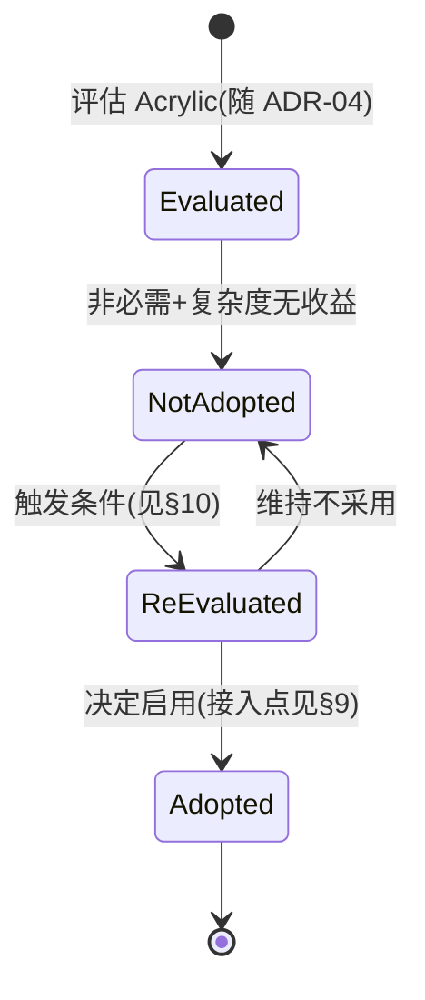

# 20-Platform · Acrylic（亚克力/毛玻璃材质背景）

> 版本：v1.0-draft ｜ 最后更新：2026-07-07
> 关联：ADR-04（Mica 跳过，Acrylic 同理非必需）｜ 评估结论式文档

## 1. 📦 package 设计

**N/A（评估结论：当前不采用，无实现）** —— `internal/platform` 不提供 Acrylic 相关类型或常量。

理由：Acrylic（亚克力材质，`DWMWA_SYSTEMBACKDROP_TYPE = DWMSBT_TRANSIENTWINDOW` 等）与 Mica 同属 Windows 系统桌面材质，需 Win32 接口与系统版本支持。ADR-04 已对 Mica 作出"跳过"决策，并明确"Acrylic 同理非必需"——360 小清新日历观感已由**自绘渐变圆角 + DWM 阴影**完整还原，Acrylic 的毛玻璃模糊既增加复杂度，又在离线/零 CGO/轻量单二进制目标下无收益。

本文件为**评估留档**：记录不采用结论，并明确**若未来需要毛玻璃时的接入点**（见 §9）。

- 依赖方向：**无**（不纳入编译图）。
- 公开符号：**无**（仅预留扩展字段草图）。
- 边界：系统毛玻璃材质归"未来可选探索"，当前由 `WindowStyle` 自绘渐变 + 每像素 alpha 替代（见 `WindowStyle.md` / `Mica.md`）。

## 2. 📐 UML 类图

**N/A** —— 无类型、无类。Acrylic 未实现，无需类图。

## 3. 🔄 数据流图

**N/A** —— 无运行时数据流。Acrylic 本应是"窗口向 DWM 请求毛玻璃模糊背景"的链路，当前由自绘背景替代。

## 4. 🎨 UI 原型图（ASCII）

```
自绘渐变圆角（采用，替代 Acrylic 毛玻璃）：
┌────────────────────────┐
│╱  ███ 渐变背景 ███    ╲│
│  │ 日历内容          │  │   ← 无模糊，纯自绘，离线可控
│  └──────────────────┘  │
│╲  ▓▓▓ 圆角阴影 ▓▓▓    ╱│
└────────────────────────┘

Acrylic 毛玻璃（不采用）：
  窗口对桌面做实时高斯模糊背景 —— 需 DWM 合成、
  Win11 专属、且模糊区域性能/可读性权衡差，
  360 观感无需此效果。
```

## 5. 🗂 数据库设计

**N/A** —— 纯窗口材质机制，无持久化。

## 6. 📡 Event / Signal 流程

**N/A** —— 无 Signal / 事件流转。Acrylic 本应由系统 DWM 推送材质，当前无此链路。

## 7. 🔌 Plugin API

**N/A** —— Platform 底层不向插件暴露系统材质钩子；且本机制不采用。

## 8. 🧩 Feature 生命周期



## 9. 📖 Go 接口定义

**N/A（当前无接口）** —— 但明确**未来接入点**：扩展 `WindowStyle.Backdrop`（与 Mica 共用枚举），由 `WindowStyler.Apply` 下发到 gogpu 内部 DWM 属性。草图（非编译目标）：

```go
// 未来接入点（预留，当前不实现）：
//
// type BackdropType int
// const (
//     BackdropNone    BackdropType = iota // 当前：自绘渐变(默认)
//     BackdropMica                        // 见 Mica.md
//     BackdropAcrylic                     // 本文件：毛玻璃接入点
// )
//
// type WindowStyle struct {
//     // ... 既有字段 ...
//     Backdrop BackdropType // 预留：当前恒为 BackdropNone
// }
//
// // WindowStyler.Apply 内部据 Backdrop 调用 gogpu 的 DWM 材质设置：
// //   gogpu 内部: DwmSetWindowAttribute(hwnd, DWMWA_SYSTEMBACKDROP_TYPE, DWMSBT_TRANSIENTWINDOW)
// // 仅当 Backdrop==BackdropAcrylic 时启用，零 CGO 封装。
```

> 注：草图注释，不随仓库构建；体现"可逆"（ADR-04）。

## 10. 🚀 每个 Milestone 的任务拆分

**N/A（当前不采用）** —— 重新评估触发条件与 Mica 一致（见 `Mica.md` §10），补充一条 Acrylic 专属条件：

| 触发条件（任一） | 说明 |
|---|---|
| 用户强需求毛玻璃模糊背景 | 且自绘渐变无法满足 |
| 需要半透明面板叠加桌面内容的可读性优化 | 如面板常驻且需透视背景 |
| 零 CGO 下出现纯 Go 封装 Acrylic 的可行方案 | 且不增加离线/体积负担 |

若触发，最小拆分（Post-MVP，预估 v2.x）：

- 任务：扩展 `WindowStyle.Backdrop=BackdropAcrylic`，`WindowStyler` 经 gogpu 设置 `DWMSBT_TRANSIENTWINDOW`。
- 验收：毛玻璃生效、与自绘渐变可切换、不破坏零 CGO 与双循环、高 DPI 下模糊正确（`DPI.md`）。
- 任务：与 `Theme.md` 协同，深色模式联动。

> 当前 v1.0 ~ v1.5 路线图**不含** Acrylic。决策可逆。
