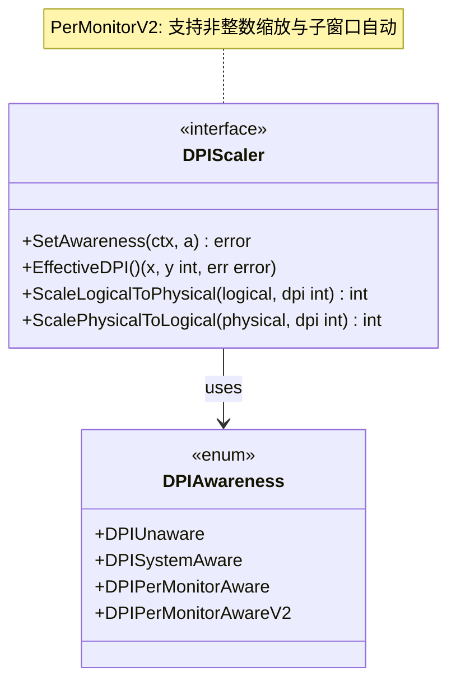
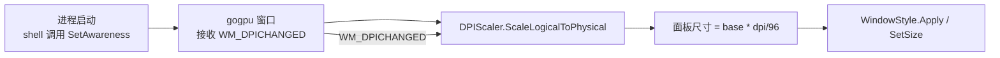
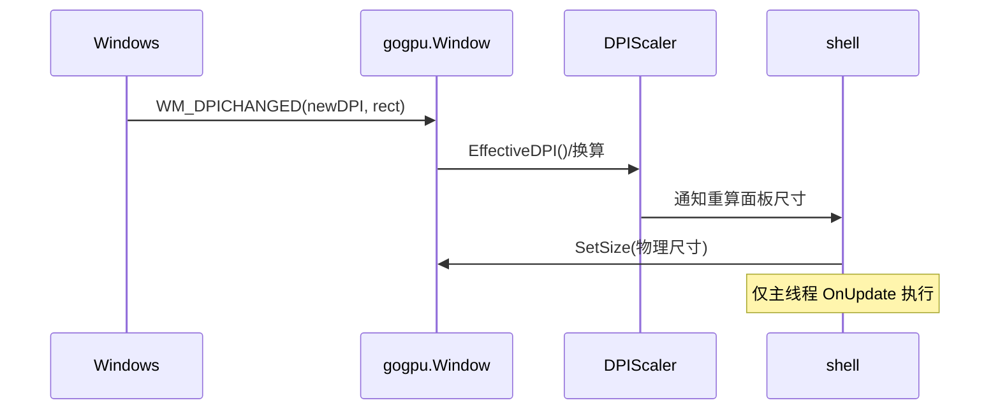
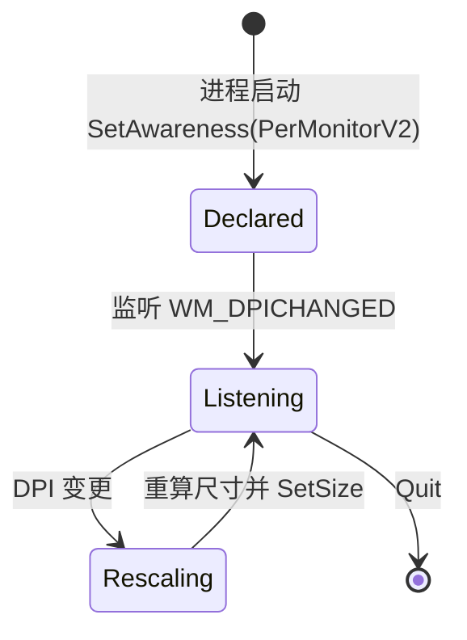

# 20-Platform · DPI（高 DPI 感知与坐标换算）

> 版本：v1.0-draft ｜ 最后更新：2026-07-07
> 关联：`MultiMonitor.md`（多屏 DPI 锚定）｜ `WindowStyle.md`（面板尺寸随缩放）

## 1. 📦 package 设计

- **包名**：`platform`（目录 `internal/platform/dpi`，对外以 `platform` 包暴露）。
- **职责**：进程级 DPI 感知声明（`SetProcessDpiAwareness` / `SetProcessDpiAwarenessContext`）、处理 `WM_DPICHANGED`、逻辑坐标↔物理像素换算、面板尺寸随 DPI 缩放计算。
- **依赖方向**：
  - 依赖：`gogpu`（窗口/消息循环）、`internal/infra`（日志）。
  - 被依赖：`internal/shell`（装配时声明感知）、`MultiMonitor`（按屏 DPI 锚定）、`WindowStyle`（面板尺寸缩放）。
  - 不向上层（feature/state/ui）反向依赖。
- **公开符号**：`DPIAwareness`、`DPIScaler`、`DefaultAwareness()`、`NewDPIScaler()`。
- **边界**：只做"感知声明 + 换算"，具体窗口尺寸由 `shell` 据 `ScaleLogicalToPhysical` 设置；不负责绘制。

## 2. 📐 UML 类图



## 3. 🔄 数据流图



数据源：系统 DPI（每屏不同）→ `WM_DPICHANGED` → `DPIScaler` 换算 → 面板尺寸；汇点：窗口 SetSize。

## 4. 🎨 UI 原型图（ASCII）

不同 DPI 下面板逻辑尺寸恒定、物理尺寸缩放：

```
100% DPI (96)       150% DPI (144)      200% DPI (192)
┌──────────┐        ┌──────────────┐    ┌────────────────┐
│ 日历面板 │ 360x480 │  日历面板    │540x720│   日历面板     │720x960
│ (逻辑)   │        │  (物理放大)  │    │  (物理放大)    │
└──────────┘        └──────────────┘    └────────────────┘
逻辑坐标恒定 360x480；物理像素 = 逻辑 * dpi/96
```

## 5. 🗂 数据库设计

**N/A** —— 纯运行时换算，无持久化表（DPI 感知级别可存 `config.json`，但由 `infra/config` 管理，非本模块）。

## 6. 📡 Event / Signal 流程



- emit：系统 DPI 变更 → subscribe：`shell` 重算并 `SetSize`。
- 副作用：窗口尺寸更新 + `RequestRedraw()`。

## 7. 🔌 Plugin API

**N/A** —— Platform 底层 DPI 不向插件暴露钩子；插件如需 DPI 信息由 `ui` 层透出（Post-MVP）。

## 8. 🧩 Feature 生命周期



约束：所有 `SetSize` 仅在主线程 `OnUpdate` 执行（见 `01-总体架构.md` §3）。

## 9. 📖 Go 接口定义

```go
package platform

import "context"

// DPIAwareness 进程 DPI 感知模式。
type DPIAwareness int

const (
    DPIUnaware            DPIAwareness = iota // 不感知（不采用）
    DPISystemAware                           // 系统级感知
    DPIPerMonitorAware                       // 每显示器感知
    DPIPerMonitorAwareV2                     // 每显示器 V2（推荐，支持非整数缩放）
)

// DefaultAwareness 返回推荐感知模式：PerMonitorV2。
func DefaultAwareness() DPIAwareness { return DPIPerMonitorAwareV2 }

// DPIScaler 提供 DPI 感知声明与坐标换算。
// 实现方封装零 CGO 的 Win32 DPI API（SetProcessDpiAwarenessContext 等）。
type DPIScaler interface {
    // SetAwareness 在进程启动早期（创建窗口前）声明感知模式。
    SetAwareness(ctx context.Context, a DPIAwareness) error
    // EffectiveDPI 返回当前主窗口有效 DPI（x,y，通常相等）。
    EffectiveDPI() (x, y int, err error)
    // ScaleLogicalToPhysical 逻辑坐标(基于 96 DPI)→物理像素。
    ScaleLogicalToPhysical(logical, dpi int) int
    // ScalePhysicalToLogical 物理像素→逻辑坐标。
    ScalePhysicalToLogical(physical, dpi int) int
}

// NewDPIScaler 构造默认实现。
func NewDPIScaler() DPIScaler { return &defaultDPIScaler{} }

// 换算基准：逻辑坐标系以 96 DPI 为单位。
//   physical = round(logical * dpi / 96)
// 例：逻辑宽 360 @ 144 DPI → 物理 540。
```

## 10. 🚀 每个 Milestone 的任务拆分

| Milestone | 任务 | 验收标准 |
|---|---|---|
| v1.0（MVP·待实现） | 进程启动声明 `PerMonitorV2` 感知 | 高 DPI 屏下面板不模糊、不偏小；`SetAwareness` 在窗口创建前调用 |
| v1.0（MVP·待实现） | 处理 `WM_DPICHANGED` 重算面板尺寸 | 拖动窗口跨不同 DPI 屏时自动缩放，无重启 |
| v1.0（MVP·待实现） | 面板尺寸随 DPI 缩放（`ScaleLogicalToPhysical`） | 200% DPI 下物理尺寸翻倍，逻辑布局恒定 |
| v1.2（Post-MVP） | 与天气模块字体缩放协同 | 面板顶部天气文字随 DPI 清晰 |
| v1.4（Post-MVP） | 插件可读取 DPI 信息（若需要） | 不破坏零 CGO |

> 范围：DPI 感知为 MVP 必需；逻辑坐标恒定 360x480（见 `WindowStyle.md` §4），物理尺寸由本模块换算。决策可逆。
