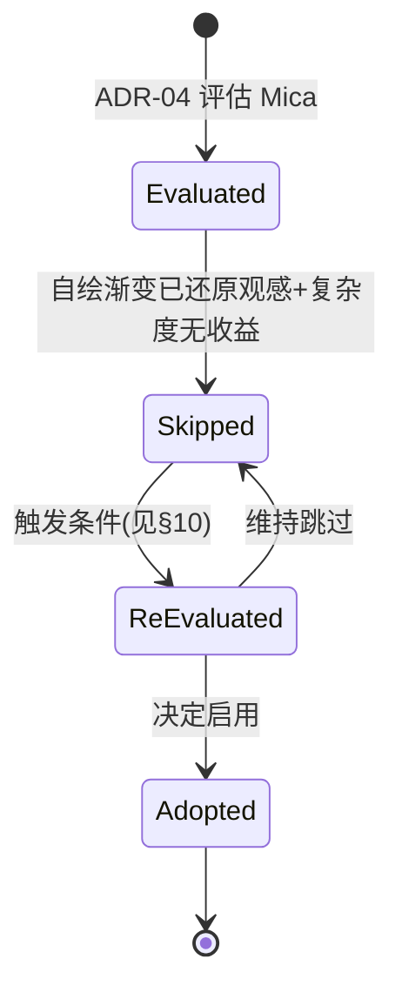

# 20-Platform · Mica（云母材质背景）

> 版本：v1.0-draft ｜ 最后更新：2026-07-07
> 关联：ADR-04（**已跳过** Mica 毛玻璃）｜ 决策记录式文档

## 1. 📦 package 设计

**N/A（已决策跳过，无实现）** —— `internal/platform` 不提供任何 Mica 相关类型或常量。

理由：ADR-04 已拍板**跳过 Mica**。Mica 是 Windows 11 的桌面材质（通过 `DwmSetWindowAttribute(DWMWA_SYSTEMBACKDROP_TYPE, DWMSBT_MAINWINDOW)` 等实现），需 Win32 接口与特定系统版本支持；而 DeskCalendar 目标是"零 CGO + 完全离线 + 单二进制轻量"，且 360 观感已由**自绘渐变圆角面板**还原，引入 Mica 既增加复杂度又无收益。

本文件为**决策留档**：记录跳过原因与替代方案（见 §3 / §9）。

- 依赖方向：**无**（不纳入编译图）。
- 公开符号：**无**。
- 边界：系统材质背景归"未来可选探索"，当前由 `WindowStyle` 的自绘渐变 + 每像素 alpha 替代（见 `WindowStyle.md`）。

## 2. 📐 UML 类图

**N/A** —— 无类型、无类。Mica 未实现，无需类图。

## 3. 🔄 数据流图

**N/A** —— 无运行时数据流。Mica 本应是"窗口向 DWM 请求系统桌面材质作为背景"的链路，当前产品用自绘背景替代，故无该数据流。

## 4. 🎨 UI 原型图（ASCII）

当前采用**自绘渐变圆角**（替代 Mica 的云母观感）：

```
自绘渐变圆角面板（采用，替代 Mica）：
┌────────────────────────┐
│╱  ███ 渐变蓝紫 ███    ╲│   ← 自绘 LinearGradient 背景
│  ┌──────────────────┐  │
│  │ 日历内容          │  │
│  └──────────────────┘  │
│╲  ▓▓▓ 圆角阴影 ▓▓▓    ╱│
└────────────────────────┘
 ░░ 圆角外每像素透明 ░░

Mica 云母材质（跳过，不采用）：
  窗口直接取桌面壁纸做模糊材质背景 —— 需 DWM 系统材质，
  增加 Win32 依赖与 Win11 版本耦合，且观感可由自绘还原。
```

## 5. 🗂 数据库设计

**N/A** —— 纯窗口材质机制，无持久化。

## 6. 📡 Event / Signal 流程

**N/A** —— 无 Signal / 事件流转。Mica 背景本应由系统 DWM 推送材质变更，当前无此链路。

## 7. 🔌 Plugin API

**N/A** —— Platform 底层不向插件暴露系统材质钩子；且本机制已跳过。

## 8. 🧩 Feature 生命周期



## 9. 📖 Go 接口定义

**N/A** —— 当前不沉淀接口。仅记录**替代方案**的衔接点（非编译目标）：

```go
// 替代方案：不使用 Mica，使用 WindowStyle 自绘渐变背景。
// 根容器背景由 theme 提供渐变（alpha 尊重），等价还原 360 观感：
//
//   primitives.Box(...).
//       Background(widget.LinearGradient(c1, c2)).  // 自绘渐变
//       Rounded(16).                                 // 圆角
//       ShadowLevel(3)                               // DWM 阴影(WindowStyle.Shadow)
//
// 若未来需要系统材质，可扩展 WindowStyle：
//   type BackdropType int
//   const ( BackdropNone BackdropType = iota; BackdropMica; BackdropAcrylic )
//   // WindowStyle.Backdrop BackdropType  // 预留字段，当前恒为 BackdropNone
```

> 注：上述为**预留草图注释**，不随仓库构建，体现"可逆"原则（ADR-04）。

## 10. 🚀 每个 Milestone 的任务拆分

**N/A（当前全部跳过）** —— 但给出**重新评估的触发条件**：

| 触发条件（任一） | 说明 |
|---|---|
| 用户强需求系统级毛玻璃/云母质感 | 且自绘渐变无法满足 |
| Win11 普及且需与系统设置/深色模式材质联动 | DWM 材质随系统主题变化 |
| 零 CGO 下出现纯 Go 封装 Mica 的可行方案 | 且不增加离线/体积负担 |

若触发，最小拆分（Post-MVP，预估 v2.x）：

- 任务：在 `WindowStyle` 增加 `Backdrop BackdropType`，由 `WindowStyler.Apply` 调用 gogpu 内部 DWM 属性。
- 验收：Mica 材质生效、与自绘渐变可切换、不破坏零 CGO 与双循环。
- 任务：与 `Theme.md` 协同，深色模式联动系统材质。

> 当前 v1.0 ~ v1.5 路线图**不含** Mica。决策可逆：未来启用不影响核心架构（ADR-04）。
