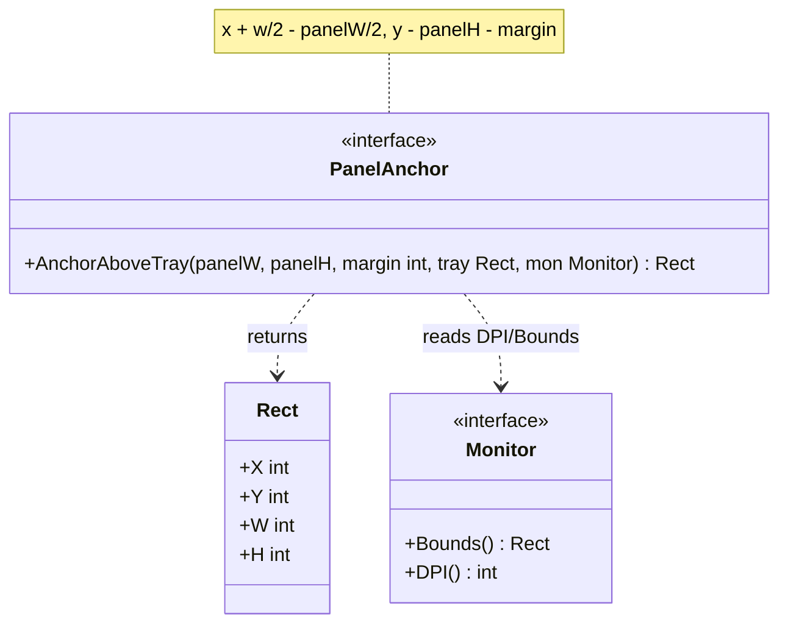
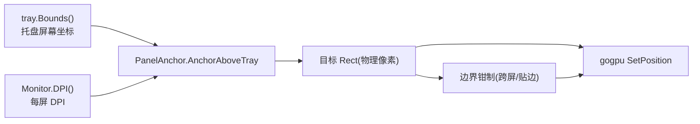
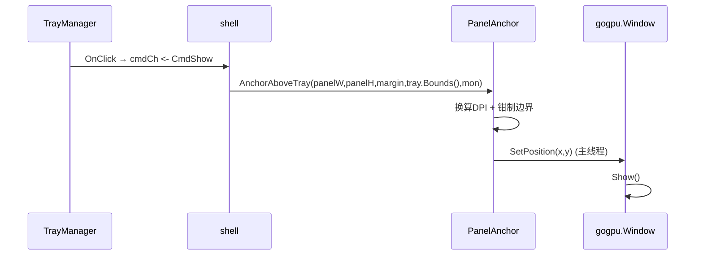
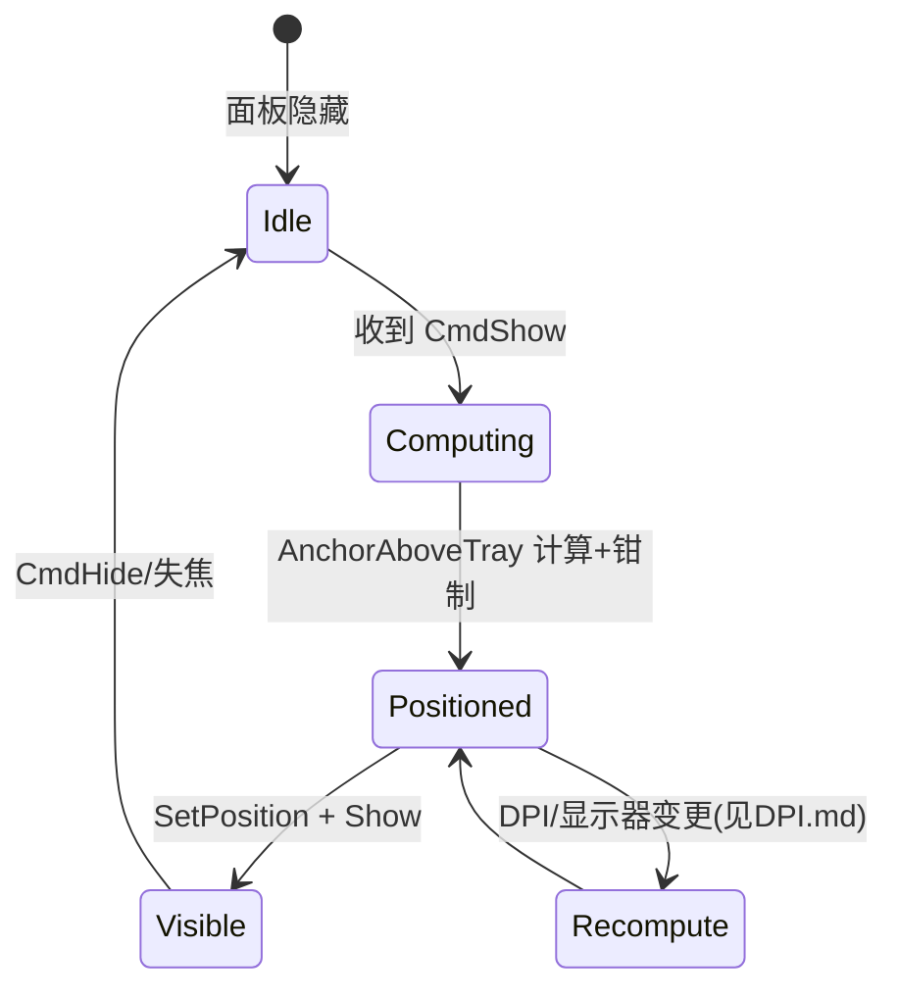

# 20-Platform · MultiMonitor（多显示器定位与 DPI 锚定）

> 版本：v1.0-draft ｜ 最后更新：2026-07-07
> 关联：`Tray.md`（用 `tray.Bounds()` 定位）｜ `DPI.md`（跨屏 DPI 缩放）

## 1. 📦 package 设计

- **包名**：`platform`（目录 `internal/platform/multimonitor`，对外以 `platform` 包暴露）。
- **职责**：在多显示器环境下，将日历面板锚定到托盘图标**正上方**；结合每屏 DPI 做正确坐标换算与边界处理（跨屏、贴边、空间不足回退）。
- **依赖方向**：
  - 依赖：`TrayManager`（`tray.Bounds()` 返回屏幕坐标）、`DPIScaler`（每屏 DPI）、`gogpu`（窗口 `SetPosition`）。
  - 被依赖：`internal/shell`（定位面板）。
  - 不向上层反向依赖。
- **公开符号**：`Monitor`、`PanelAnchor`、`AnchorAboveTray()`。
- **边界**：只负责"计算并应用面板位置"，不负责显隐逻辑（归 `Tray`/`shell`）；不负责绘制。

## 2. 📐 UML 类图



## 3. 🔄 数据流图



数据源：托盘位置（用户点击处）+ 显示器 DPI → `PanelAnchor` → 物理坐标；汇点：窗口 `SetPosition`。

## 4. 🎨 UI 原型图（ASCII）

主屏底部托盘上方居中（常规）：

```
┌──────────────── 主显示器 ────────────────┐
│                                           │
│              ┌──────────┐                 │
│              │ 日历面板 │  ← 托盘正上方居中 │
│              └──────────┘                 │
│ ┌──────┐ ┌──────────┐                     │
│ │开始 │ │ 📅托盘图标│  ← tray.Bounds()     │
│ └──────┘ └──────────┘                     │
└───────────────────────────────────────────┘
    x = tray.x + tray.w/2 - panelW/2
    y = tray.y - panelH - margin
```

边界情况：上方空间不足 → 落到托盘下方；面板超出屏宽 → 钳制到屏内。

## 5. 🗂 数据库设计

**N/A** —— 纯运行时定位，无持久化（用户"弹窗位置"偏好可存 `config.json`，由 `infra/config` 管，非本模块）。

## 6. 📡 Event / Signal 流程



- emit：`tray.OnClick` → subscribe：`shell` 计算锚点并定位。
- 副作用：窗口位置更新（仅主线程）。

## 7. 🔌 Plugin API

**N/A** —— Platform 底层定位不向插件暴露钩子。

## 8. 🧩 Feature 生命周期



约束：`SetPosition` 仅在主线程 `OnUpdate` 执行。

## 9. 📖 Go 接口定义

```go
package platform

// Rect 屏幕坐标矩形（物理像素）。
type Rect struct {
    X, Y, W, H int
}

// Monitor 抽象单台显示器（实现封装零 CGO 的 EnumDisplayMonitors 等）。
type Monitor interface {
    Bounds() Rect // 该显示器工作区（不含任务栏）矩形
    DPI() int     // 该显示器有效 DPI
}

// PanelAnchor 面板锚定策略。
type PanelAnchor interface {
    // AnchorAboveTray 将面板锚定到托盘图标正上方居中。
    // 公式：x = tray.X + tray.W/2 - panelW/2；y = tray.Y - panelH - margin。
    // 边界处理：
    //   - 上方空间不足(y < mon.Bounds().Y) → 落到托盘下方 y = tray.Y + tray.H + margin
    //   - 水平超出屏宽 → 钳制到 [mon.X, mon.X+mon.W-panelW]
    //   - panelW/panelH 为物理像素（已据 mon.DPI() 由 DPIScaler 换算）
    AnchorAboveTray(panelW, panelH, margin int, tray Rect, mon Monitor) Rect
}

// AnchorAboveTray 默认实现（函数式便捷封装）。
func AnchorAboveTray(panelW, panelH, margin int, tray Rect, mon Monitor) Rect {
    b := mon.Bounds()
    x := tray.X + tray.W/2 - panelW/2
    y := tray.Y - panelH - margin
    if y < b.Y { // 上方不足 → 托盘下方
        y = tray.Y + tray.H + margin
    }
    if x < b.X {
        x = b.X
    }
    if x+panelW > b.X+b.W {
        x = b.X + b.W - panelW
    }
    if x < b.X {
        x = b.X
    }
    if y+panelH > b.Y+b.H {
        y = b.Y + b.H - panelH
    }
    return Rect{X: x, Y: y, W: panelW, H: panelH}
}

// 衔接（shell 主线程调用）：
//   pos := platform.AnchorAboveTray(physW, physH, 8, tray.Bounds(), mon)
//   gogpuApp.PrimaryWindow().SetPosition(pos.X, pos.Y)
//   gogpuApp.PrimaryWindow().Show()
```

## 10. 🚀 每个 Milestone 的任务拆分

| Milestone | 任务 | 验收标准 |
|---|---|---|
| v1.0（MVP·待实现） | `tray.Bounds()` 取托盘坐标 + `AnchorAboveTray` 上方居中 | 点击托盘面板出现在图标正上方居中 |
| v1.0（MVP·待实现） | 跨屏边界钳制 | 面板不被切到屏外；贴边不溢出 |
| v1.0（MVP·待实现） | DPI 感知下正确锚定（结合 `DPI.md`） | 高 DPI 屏上 x/w/2 用物理像素，定位不偏移 |
| v1.0（MVP·待实现） | 上方空间不足回退到托盘下方 | 任务栏在顶部时面板落于图标下方 |
| v1.4（Post-MVP） | 多屏记忆最后使用显示器（可选） | 不破坏零 CGO |

> 范围：多屏定位为 MVP 必需。决策可逆；定位逻辑纯函数化，易单测（见 §9）。
