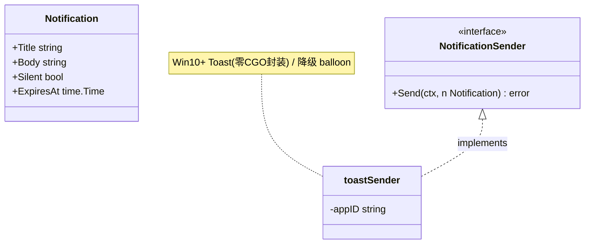
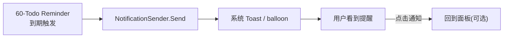
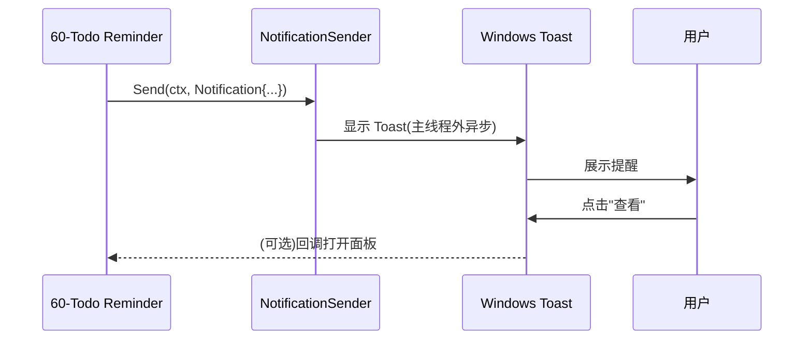
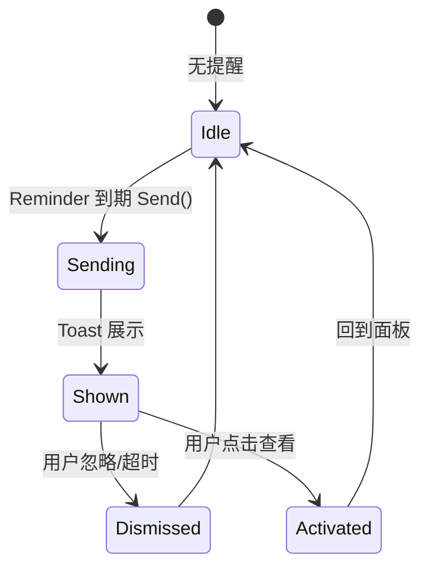

# 20-Platform · Notification（系统通知）

> 版本：v1.0-draft ｜ 最后更新：2026-07-07
> 关联：Post-MVP（v1.1 起与 `60-Todo`/`Reminder` 协作）｜ ADR-02 双循环约束

## 1. 📦 package 设计

- **包名**：`platform`（目录 `internal/platform/notification`，对外以 `platform` 包暴露）。
- **职责**：发送系统通知（Windows Toast / 传统 balloon）；预留 `NotificationSender` 接口；与 `60-Todo` 的 Reminder 协作触发提醒。`NotificationSender` 接口现在就定义，避免日后返工。
- **依赖方向**：
  - 依赖：`internal/infra`（日志）、`gogpu`/`systray`（balloon 可经托盘）、`internal/todo`（Reminder 模型，Post-MVP）。
  - 被依赖：`60-Todo`（Reminder 调用 `Send`）、`internal/shell`。
  - 不向上层（feature/state/ui）反向依赖。
- **公开符号**：`NotificationSender`、`Notification`、`NewNotificationSender()`。
- **边界**：只负责"把一条通知送到系统"，不负责提醒调度（归 `60-Todo`）；不参与业务逻辑。

## 2. 📐 UML 类图



## 3. 🔄 数据流图



数据源：Reminder 到期（来自 `60-Todo`）→ `Send` → 系统通知；汇点：用户。

## 4. 🎨 UI 原型图（ASCII）

系统 Toast（屏幕右下角，独立于面板）：

```
┌─ DeskCalendar ────────────┐
│ 📅 待办提醒                │
│ "15:00 团队周会"           │   ← Notification{Title,Body}
│ [查看]  [忽略]             │
└───────────────────────────┘
        （屏幕右下角，不抢焦点）
```

> 注意：通知是**系统级**，与托盘弹窗（自绘面板）是两套 UI；本模块不画面板内 UI。

## 5. 🗂 数据库设计

**N/A（本模块）** —— 通知本身无持久化；触发源 Reminder 的存储归 `60-Todo`（SQLite）。本模块仅发送，不建表。

## 6. 📡 Event / Signal 流程



- emit：`Reminder` 到期 → subscribe：`NotificationSender.Send`。
- 约束：发送动作可异步（不阻塞主循环）；Toast 交互回调经 channel 回主线程（遵循 ADR-02 双循环铁律）。

## 7. 🔌 Plugin API

**N/A** —— Platform 底层通知不向插件暴露钩子；但 `NotificationSender` 接口本身可供 `60-Todo` 等上层以依赖注入方式使用（接口隔离，便于 mock/替换）。

## 8. 🧩 Feature 生命周期



约束：Toast 展示/回调不在 gogpu 主线程直接操作窗口，经 channel 回主线程。

## 9. 📖 Go 接口定义

```go
package platform

import (
    "context"
    "time"
)

// Notification 一条系统通知内容。
type Notification struct {
    Title     string    // 标题（如 "待办提醒"）
    Body      string    // 正文（如 "15:00 团队周会"）
    Silent    bool      // 是否静音（不发声）
    ExpiresAt time.Time // 过期时间（可选，0 表示系统默认）
}

// NotificationSender 系统通知发送者（接口隔离，便于 mock/替换）。
// 实现方封装零 CGO 的 Windows Toast（Win10+）或降级 balloon。
type NotificationSender interface {
    // Send 异步发送一条通知，不阻塞调用方。
    Send(ctx context.Context, n Notification) error
}

// NewNotificationSender 构造默认实现。
// 策略：
//   - Win10+：Toast（通过零 CGO 的 COM/XML 封装，或经 systray balloon 降级）
//   - 失败/旧系统：降级到托盘 balloon（复用 gogpu/systray 能力）
//   - 始终不阻塞主循环（内部 goroutine + channel）
func NewNotificationSender(appID string) NotificationSender {
    return &toastSender{appID: appID}
}

// 与 60-Todo 协作示意（Post-MVP）：
//   sender := platform.NewNotificationSender("DeskCalendar")
//   reminder.OnDue(func(r todo.Reminder) {
//       _ = sender.Send(ctx, platform.Notification{
//           Title: "待办提醒", Body: r.Title, Silent: false,
//       })
//   })
```

> 约束：所有窗口/Toast 交互回调遵守 ADR-02 双循环——跨线程只发 channel 命令，窗口操作仅主线程。

## 10. 🚀 每个 Milestone 的任务拆分

| Milestone | 任务 | 验收标准 |
|---|---|---|
| v1.1（Post-MVP） | 定义并实现 `NotificationSender`（Toast + balloon 降级） | 待办到期弹出系统通知，不阻塞主循环 |
| v1.1（Post-MVP） | 与 `60-Todo` Reminder 联动 | Reminder 到期自动 `Send`，点击可回面板 |
| v1.1（Post-MVP） | 零 CGO 封装 Toast | `CGO_ENABLED=0` 构建通过；旧系统降级 balloon |
| v1.2（Post-MVP） | 天气预警通知（可选，复用本接口） | 与 `70-Weather` 协作，不新增发送通道 |
| v1.4（Post-MVP） | 插件可发通知（经 `NotificationSender`） | 接口注入，不反向依赖 |

> 范围：系统通知为 Post-MVP（v1.1 起），但**接口现在就定义**（`NotificationSender`），保证 `60-Todo` 可直接依赖、决策可逆。MVP 不含通知功能。
