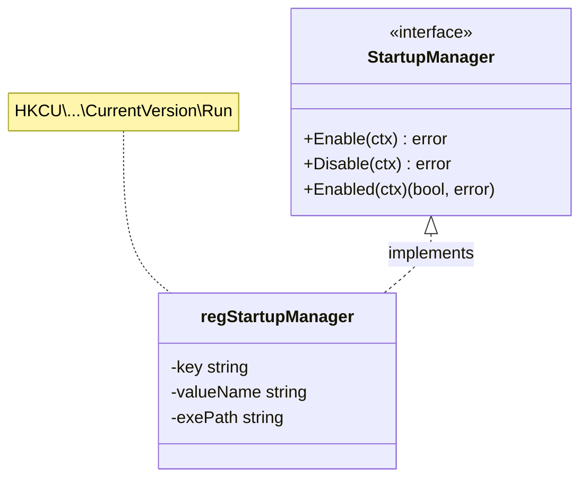
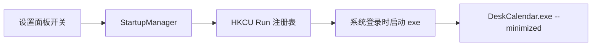
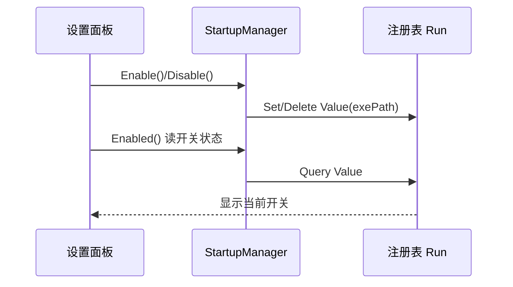
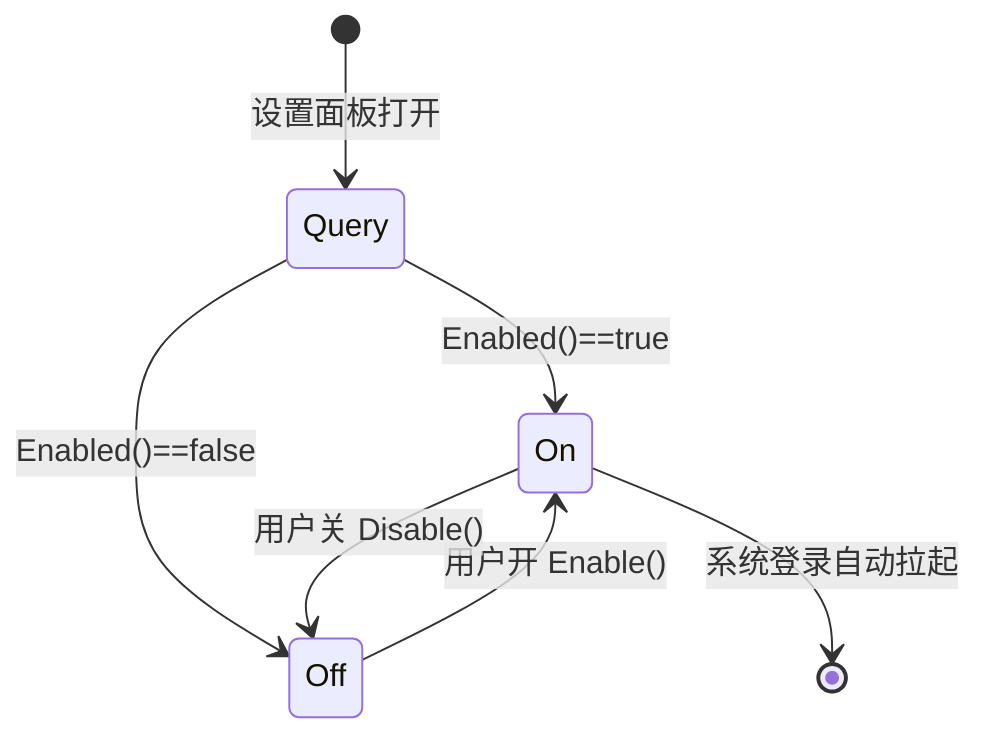

# 20-Platform · Startup（开机自启）

> 版本：v1.0-draft ｜ 最后更新：2026-07-07
> 关联：`02-开发规范.md` §8（注册表仅当前用户）｜ MVP 最小设置面板

## 1. 📦 package 设计

- **包名**：`platform`（目录 `internal/platform/startup`，对外以 `platform` 包暴露）。
- **职责**：开机自启的注册/反注册/查询，通过注册表 `HKCU\Software\Microsoft\Windows\CurrentVersion\Run` 写入当前用户启动项（仅当前用户，不用 `HKLM`）；供设置面板开关调用。
- **依赖方向**：
  - 依赖：`internal/infra`（日志）、可执行文件路径（`os.Executable`）。
  - 被依赖：`internal/shell` / 设置面板（`ui`）。
  - 不向上层（feature/state）反向依赖。
- **公开符号**：`StartupManager`、`RegistryKey`、`ValueName`。
- **边界**：只管"注册表启动项"开关；不自管"是否本次启动来自自启"等逻辑；不写任何敏感信息（见 `02-开发规范.md` §8）。

## 2. 📐 UML 类图



## 3. 🔄 数据流图



数据源：用户开关 → `StartupManager` → 注册表；汇点：系统登录拉起 exe（带 `--minimized` 参数，启动即隐藏托盘弹窗、仅驻托盘）。

## 4. 🎨 UI 原型图（ASCII）

设置面板中的自启开关：

```
┌─ 设置 ──────────────────────────┐
│  ☑ 开机自动启动                  │  ← 开关绑定 StartupManager.Enabled
│  （仅当前用户，写入注册表 Run）  │
│                                  │
│  [主题] [弹窗位置] [关于]        │
└──────────────────────────────────┘
```

## 5. 🗂 数据库设计

**N/A** —— 自启状态存于系统注册表（非应用数据库）；用户偏好"是否自启"可镜像到 `config.json`，但注册表为事实源，非本模块建表。

## 6. 📡 Event / Signal 流程



- emit：用户切换开关 → subscribe：`StartupManager` 改注册表。
- 副作用：注册表写入/删除（仅当前用户 `HKCU`）。

## 7. 🔌 Plugin API

**N/A** —— Platform 底层自启不向插件暴露钩子。

## 8. 🧩 Feature 生命周期



约束：注册表操作不在主线程强制，但属轻量 IO，可走 `context` 超时（见 §9）。

## 9. 📖 Go 接口定义

```go
package platform

import (
    "context"
    "os"
)

// RegistryKey 自启注册表项（仅当前用户，HKCU）。
const RegistryKey = `Software\Microsoft\Windows\CurrentVersion\Run`

// ValueName 注册表值名（应用标识）。
const ValueName = "DeskCalendar"

// StartupManager 开机自启管理器（当前用户）。
type StartupManager interface {
    // Enable 写入注册表 Run，值为 exe 绝对路径 + " --minimized"。
    Enable(ctx context.Context) error
    // Disable 删除注册表 Run 值。
    Disable(ctx context.Context) error
    // Enabled 查询当前是否已注册自启。
    Enabled(ctx context.Context) (bool, error)
}

// NewStartupManager 构造默认实现（零 CGO，纯注册表 API 封装）。
func NewStartupManager() (StartupManager, error) {
    exe, err := os.Executable()
    if err != nil {
        return nil, err // 仅初始化失败可返回错误
    }
    return &regStartupManager{exePath: exe}, nil
}

// 实现要点（伪代码描述，真实走零 CGO 注册表封装）：
//   Enable:  regSetString(HKCU, RegistryKey, ValueName, exePath+" --minimized")
//   Disable: regDeleteValue(HKCU, RegistryKey, ValueName)
//   Enabled: v, ok := regQueryString(HKCU, RegistryKey, ValueName); return ok && v==exePath+" --minimized"
//
// 安全约束（02-开发规范 §8）：仅 HKCU，不写 HKLM；不存任何敏感信息。
```

## 10. 🚀 每个 Milestone 的任务拆分

| Milestone | 任务 | 验收标准 |
|---|---|---|
| v1.0（MVP·待实现） | `StartupManager` 注册/反注册 `HKCU\...\Run` | 勾选后重启系统，托盘图标自动出现且弹窗默认隐藏 |
| v1.0（MVP·待实现） | 设置面板开关绑定 `Enabled()` | 开关状态与注册表一致；取消勾选后不再自启 |
| v1.0（MVP·待实现） | exe 带 `--minimized` 启动即驻托盘 | 自启后不弹面板，点击托盘才显示 |
| v1.3（Post-MVP） | 与换肤/设置持久化协同 | 自启偏好随 `config.json` 同步显示，注册表为事实源 |
| v1.5（Post-MVP） | 安装包（NSIS）可选勾选自启 | 安装流程不强制写入注册表 |

> 范围：开机自启为 MVP 最小设置项。仅当前用户（HKCU），符合隐私与零 CGO 约束。决策可逆。
