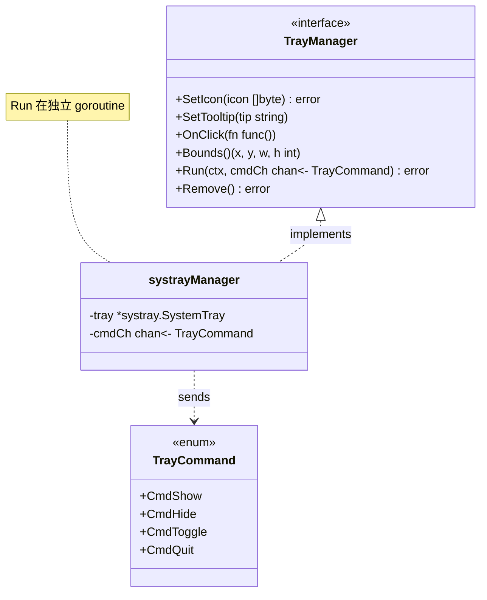
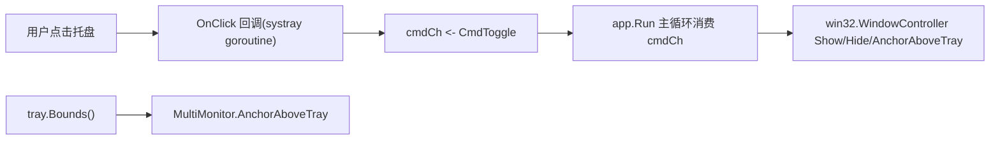
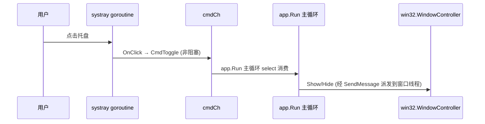
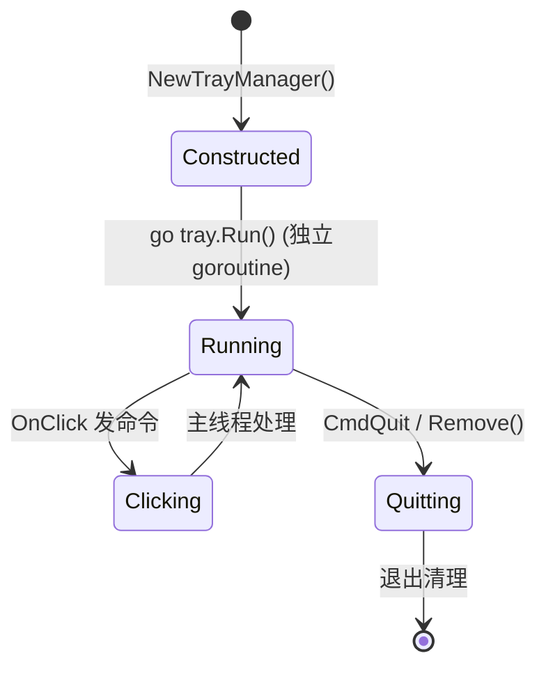

# 20-Platform · Tray（系统托盘集成 · gogpu/systray）

> 版本：v1.0-draft ｜ 最后更新：2026-07-07
> 关联：ADR-02（双消息循环）｜ **已在 `poc/systray-spike` 真机验证**

## 1. 📦 package 设计

- **包名**：`platform`（目录 `internal/platform/tray`，对外以 `platform` 包暴露）。
- **职责**：集成 `gogpu/systray` 托盘图标：`New()` 构造、`Run()` 在**独立 goroutine**、`OnClick` 向 channel 发命令、`Bounds()` 返回屏幕坐标、图标嵌入（`go:embed` / base64）。
- **依赖方向**：
  - 依赖：`github.com/gogpu/systray`（纯 Go·零 CGO）、`internal/infra`（日志）。
  - 被依赖：`internal/shell`（装配 `go tray.Run()` + 消费 channel）、`MultiMonitor`（用 `Bounds()`）。
  - 不向上层（feature/state/ui）反向依赖。
- **公开符号**：`TrayManager`、`TrayCommand`、`NewTrayManager()`。
- **边界**：托盘只发命令、不操作窗口（铁律见 `01-总体架构.md` §3）；窗口显隐/定位归 `shell` 主线程。

## 2. 📐 UML 类图



## 3. 🔄 数据流图



数据源：用户点击 → channel → 主循环；汇点：窗口操作（由 `app.Run` 主循环派发，经窗口线程 `SendMessage` 执行）。

## 4. 🎨 UI 原型图（ASCII）

托盘图标与弹窗关系：

```
任务栏右侧通知区：
  [🔊] [🌐] [📅 DeskCalendar]   ← 托盘图标(tooltip="DeskCalendar")
                │ 单击
                ▼
          ┌──────────┐
          │ 日历面板 │          ← 由 shell 主线程 Show + 定位
          └──────────┘
右键托盘 → 菜单：显示/隐藏 | 退出
```

图标来源：`go:embed` 嵌入 `internal/theme/embedded/icon.png`，或 base64 常量（spike 用 base64）。

## 5. 🗂 数据库设计

**N/A** —— 纯系统托盘集成，无持久化；图标为嵌入资源（见 `03-项目目录规范.md` §3 `embedded/`）。

## 6. 📡 Event / Signal 流程



- emit：`OnClick` 在 systray goroutine → subscribe：`app.Run` 主循环消费 channel。
- 铁律：systray 回调**只发命令**，绝不跨线程操作窗口（已在 spike 验证双循环不冲突）。

## 7. 🔌 Plugin API

**N/A** —— Platform 底层托盘不向插件暴露钩子；托盘菜单项扩展归 `shell`/未来 `ui`（Post-MVP）。

## 8. 🧩 Feature 生命周期



约束：`Run()` 必须在独立 goroutine；窗口操作只经窗口线程 `SendMessage` 派发（见 `01-总体架构.md` §3）。**spike 已验证**：`app.Run` 主 goroutine 命令循环（`for select cmdCh`）与 `go tray.Run()` 两条循环不冲突（窗口操作经窗口线程 `SendMessage` 派发，无 `runtime.LockOSThread`）。

## 9. 📖 Go 接口定义

```go
package platform

import "context"

// TrayCommand 托盘发往主线程的命令。
type TrayCommand int

const (
    CmdShow   TrayCommand = iota // 显示面板
    CmdHide                      // 隐藏面板
    CmdToggle                    // 切换显隐
    CmdQuit                      // 退出应用
)

// TrayManager 系统托盘管理器（封装 gogpu/systray，纯 Go·零 CGO）。
type TrayManager interface {
    // SetIcon 设置托盘图标（二进制 PNG，建议 32x32）。来源：go:embed 或 base64 解码。
    SetIcon(icon []byte) error
    // SetTooltip 设置悬停提示。
    SetTooltip(tip string)
    // OnClick 注册单击回调；回调在 systray goroutine 触发，
    // 实现内只向 cmdCh 发命令，禁止直接操作窗口。
    OnClick(fn func())
    // Bounds 返回托盘图标的屏幕坐标与尺寸（物理像素）。
    Bounds() (x, y, w, h int)
    // Run 在独立 goroutine 启动 systray 消息泵，并把命令写入 cmdCh。
    // ctx 取消时应退出循环并清理。
    Run(ctx context.Context, cmdCh chan<- TrayCommand) error
    // Remove 移除托盘图标并停止消息泵。
    Remove() error
}

// NewTrayManager 构造默认实现（基于 gogpu/systray）。
// 用法（来自 poc/systray-spike 真机验证）：
//   tray := platform.NewTrayManager()
//   tray.SetIcon(iconData)            // go:embed 或 base64
//   tray.SetTooltip("DeskCalendar")
//   tray.OnClick(func() { sendCmd(CmdToggle) })
//   go tray.Run(ctx, cmdCh)           // ★ 独立 goroutine
//   // 主循环（app.Run 内部 for select cmdCh）：
//   for { select { case c := <-cmdCh: handleCmd(c); default: return } }
//   b := tray.Bounds()                // x,y,w,h 屏幕坐标
//   pos := platform.AnchorAboveTray(physW, physH, 8, rectFromBounds(b), mon)
//   win.AnchorAboveTray(rectFromBounds(pos)) // 窗口线程经 SendMessage 派发
```

> 验证证据：`poc/systray-spike/main.go` 已在真机运行通过（`spike.log` + 截图 `s01~s05`），确认双循环不冲突、channel 显隐闭环、Bounds 定位正确。

## 10. 🚀 每个 Milestone 的任务拆分

| Milestone | 任务 | 验收标准 |
|---|---|---|
| v1.0（MVP·已验证） | `gogpu/systray` 集成：`New()`+`Run()` 独立 goroutine | `poc/systray-spike` 真机验证；双循环不冲突 |
| v1.0（MVP·已验证） | `OnClick` 发 channel 命令 + 主循环消费 | 点击切换显隐，焦点不抢；窗口操作经 `SendMessage` 派发到窗口线程 |
| v1.0（MVP·已验证） | `Bounds()` 屏幕坐标 + 锚定上方 | spike `position` 命令定位正确（见 `MultiMonitor.md`） |
| v1.0（MVP·待实现） | 图标 `go:embed` 嵌入（替换 spike base64） | 单二进制含图标，无外部文件依赖 |
| v1.0（MVP·待实现） | 右键菜单：显示/隐藏 + 退出 | 菜单命令经同一 channel 下发 |
| v1.1（Post-MVP） | 与 `Notification.md` 协同（点击通知区） | 不破坏零 CGO |
| v1.4（Post-MVP） | 托盘菜单插件钩子（可选） | 插件可注册菜单项，不反向依赖 |

> 范围：托盘为核心 MVP，且**已真机验证**。决策可逆（ADR-02）。
