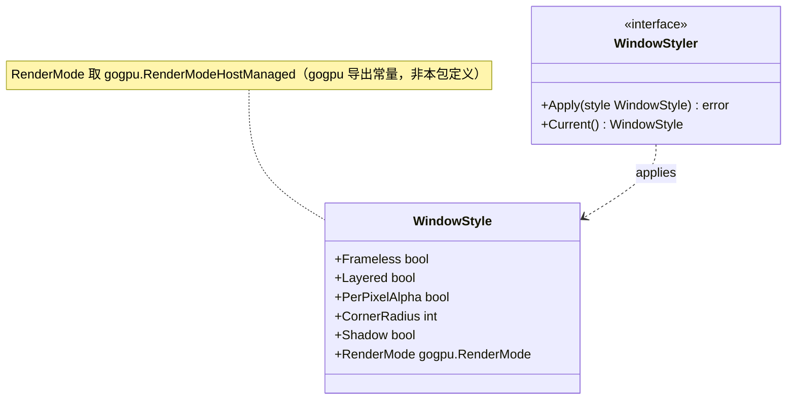
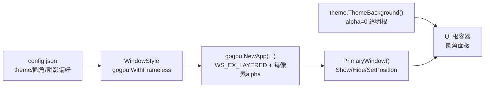
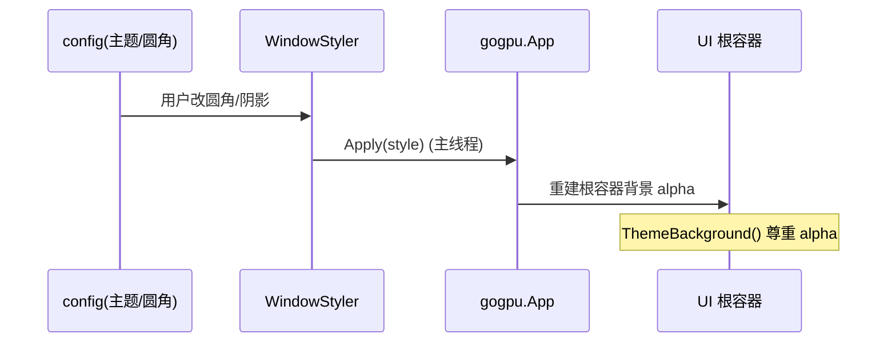
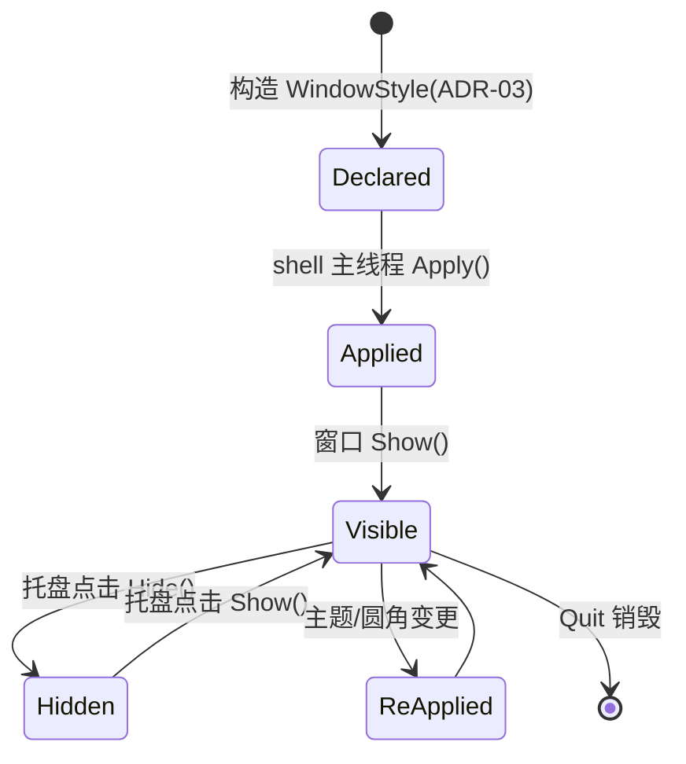

# 20-Platform · WindowStyle（无边框透明圆角窗口样式）

> 版本：v1.0-draft ｜ 最后更新：2026-07-07
> 关联：ADR-03（无边框 + 每像素 alpha + 圆角 + DWM 阴影）｜ 已在 `poc/transparent-window` 验证

## 1. 📦 package 设计

- **包名**：`platform`（目录 `internal/platform/windowstyle`，对外以 `platform` 包暴露）。
- **职责**：封装窗口样式配置——无边框（Frameless）、`WS_EX_LAYERED` 分层、每像素 alpha（per-pixel alpha）透明、圆角（DWM `DWMWA_WINDOW_CORNER_PREFERENCE`）、DWM 阴影；并约定使用 `gogpu.RenderModeHostManaged` 渲染模式（gogpu 导出常量）。
- **依赖方向**：
  - 依赖：`gogpu`（提供 `WithFrameless`、`PrimaryWindow`）；`internal/theme`（根容器 `ThemeBackground()` 需尊重 alpha）。
  - 被依赖：`internal/shell`（窗口装配）、`internal/ui`（根容器背景 alpha）。
  - 不向上层（feature/state）反向依赖。
- **公开符号**：`WindowStyle`、`WindowStyler`、`DefaultWindowStyle()`（`RenderMode` 为 `gogpu.RenderMode`，取 `gogpu.RenderModeHostManaged`）。
- **边界**：样式"声明与常量"归本模块；具体 Win32 位运算由 gogpu 内部完成（零 CGO 封装），`platform` 只做配置与校验，不手写 `syscall` 直接改窗口样式位。

## 2. 📐 UML 类图



## 3. 🔄 数据流图



数据源：用户配置（圆角半径/是否阴影）→ `WindowStyle` → gogpu 装配；汇点：UI 根容器（尊重 alpha 透出桌面）。

## 4. 🎨 UI 原型图（ASCII）

圆角透明面板（每像素 alpha 透出桌面，DWM 阴影）：

```
        ┌────────────────────────┐   ← 圆角 (CornerRadius=16)
        │╱                        ╲│
        │  ┌────────────────────┐  │
        │  │ 公历网格 农历/节气  │  │   ← 根容器 ThemeBackground alpha=0
        │  │ 节假日/调休标记     │  │      面板自身带渐变圆角背景
        │  └────────────────────┘  │
        │╲                        ╱│
        └────────────────────────┘
         ░░░░░ 透出桌面 (alpha) ░░░░░   ← 面板外区域每像素透明
         ┄┄┄┄ DWM 外阴影 ┄┄┄┄
```

- 面板外区域 alpha=0 → 桌面透出（每像素 alpha）。
- `Shadow=true` → DWM 绘制柔和外阴影，无需自绘。

## 5. 🗂 数据库设计

**N/A** —— 纯窗口样式配置，无持久化表。圆角/阴影仅存于运行时 `WindowStyle` 与 `config.json`（由 `internal/infra/config` 管理，非本模块职责）。

## 6. 📡 Event / Signal 流程



- emit：配置变更 Signal（`state` 包）→ subscribe：`shell` 调用 `WindowStyler.Apply`。
- 副作用：窗口样式位更新、根容器背景重绘（非阻塞，`RequestRedraw()` 唤醒）。

## 7. 🔌 Plugin API

**N/A** —— Platform 底层窗口样式不向插件暴露钩子；主题换肤相关钩子归 `40-Theme`（Post-MVP 换肤）。

## 8. 🧩 Feature 生命周期



约束：所有 `Apply`/`Show`/`Hide` 仅在主线程 `OnUpdate` 中执行（见 `01-总体架构.md` §3）。

## 9. 📖 Go 接口定义

```go
package platform

import (
    "context"

    "github.com/gogpu/gogpu" // RenderMode / RenderModeHostManaged 由 gogpu 导出
)

// WindowStyle 描述窗口样式配置（ADR-03）。
// 所有字段映射到 gogpu 的 Frameless/Layered/alpha/圆角/阴影设置。
// RenderMode 取 gogpu.RenderModeHostManaged（gogpu 内部 compositor 宿主管理合成与 alpha）。
type WindowStyle struct {
    Frameless     bool             // 无边框
    Layered       bool             // WS_EX_LAYERED 分层窗口
    PerPixelAlpha bool             // 每像素 alpha 透明
    CornerRadius  int              // DWM 圆角半径（像素），0=系统默认
    Shadow        bool             // DWM 外阴影
    RenderMode    gogpu.RenderMode // 渲染模式（gogpu 导出）
}

// DefaultWindowStyle 返回 MVP 默认样式：无边框+分层+每像素alpha+圆角16+阴影。
func DefaultWindowStyle() WindowStyle {
    return WindowStyle{
        Frameless:     true,
        Layered:       true,
        PerPixelAlpha: true,
        CornerRadius:  16,
        Shadow:        true,
        RenderMode:    gogpu.RenderModeHostManaged,
    }
}

// WindowStyler 窗口样式应用者。实现方封装 gogpu 装配细节。
type WindowStyler interface {
    // Apply 在主线程将样式应用到主窗口（仅 OnUpdate 调用）。
    Apply(style WindowStyle) error
    // Current 返回当前生效样式。
    Current() WindowStyle
}

// 注：gogpu 装配侧示意（非本包代码，仅说明衔接点）：
//   gogpuApp := gogpu.NewApp(gogpu.Frameless, gogpu.RenderModeHostManaged)
//   // WS_EX_LAYERED + 每像素 alpha + DWM 圆角/阴影由 WindowStyler.Apply 在主线程
//   // 经 Win32 位运算设置（见 ADR-03），gogpu.NewApp 仅负责 Frameless + 渲染模式。
// 根容器背景需尊重 alpha：theme.ThemeBackground() 返回 RGBA8(0,0,0,0)
// 之外，面板内容自带渐变圆角背景，圆角之外透出桌面。
```

## 10. 🚀 每个 Milestone 的任务拆分

| Milestone | 任务 | 验收标准 |
|---|---|---|
| v1.0（MVP·已实现） | 无边框 + WS_EX_LAYERED + 每像素 alpha + 圆角 + DWM 阴影 | `poc/transparent-window` 已验证；`WithFrameless` 装配生效；圆角外透出桌面、阴影可见 |
| v1.0（MVP·已实现） | 根容器 `ThemeBackground()` 尊重 alpha | 面板外区域完全透明，不出现黑边/灰底 |
| v1.3（Post-MVP） | 换肤联动圆角/阴影（40-Theme） | 切换主题时 `Apply` 重设圆角与阴影，无闪烁 |
| v1.4（Post-MVP） | 插件可调样式钩子（若需要） | 插件可读取当前 `WindowStyle`，不破坏零 CGO |
| v1.5（Post-MVP） | 高 DPI 下圆角/阴影随缩放正确 | 见 `DPI.md` §9 协同验收 |

> 范围：核心样式为 MVP 已验证；后续仅随主题/换肤演进。决策可逆（ADR-03）。
