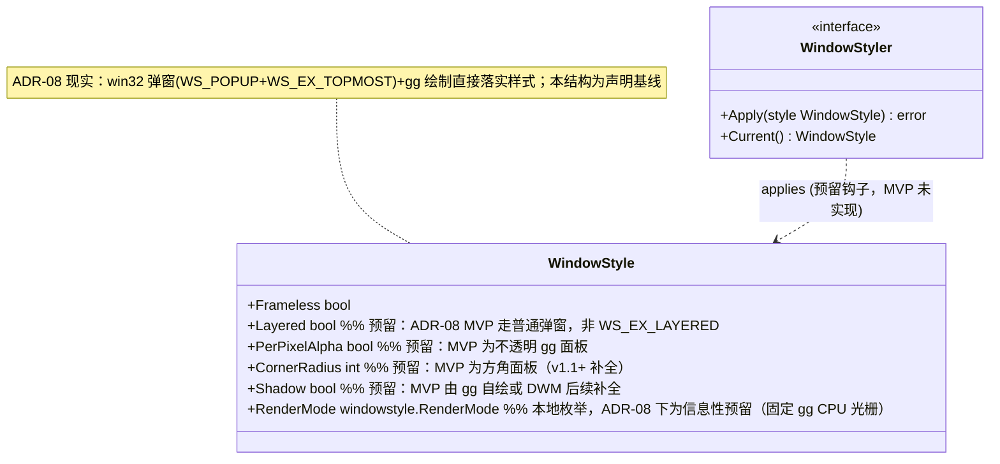
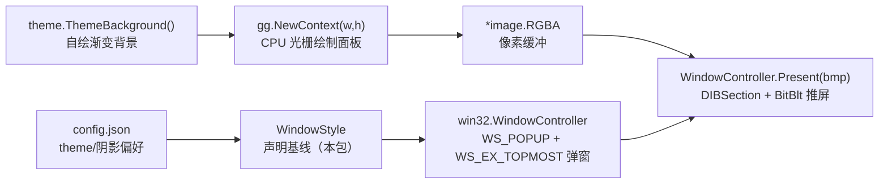
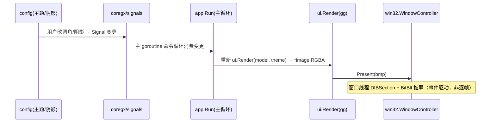
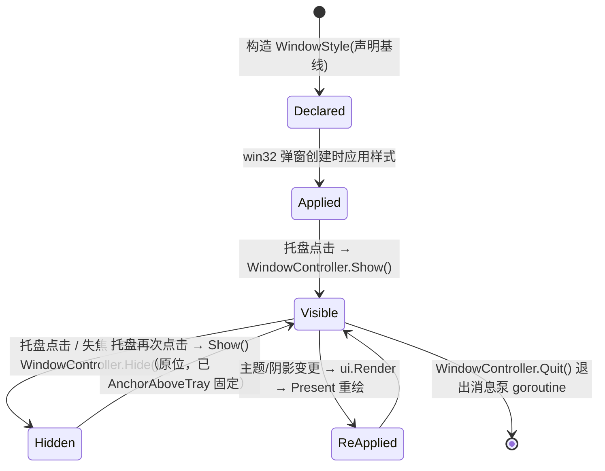

# 20-Platform · WindowStyle（窗口样式声明）

> 版本：v1.0-revised（ADR-08 对齐）｜ 最后更新：2026-07-10
> 关联：ADR-03（无边框 + 圆角 + 每像素 alpha + DWM 阴影的意图）、ADR-08（降级脱离 gogpu，自拥 Win32 弹窗 + gg）
> ⚠️ **ADR-08 对齐说明**：2026-07-09 起 ADR-08 转正为唯一主线——彻底脱离 gogpu 上游（含 gogpu/ui、wgpu），窗口改由自拥 `internal/platform/win32` 弹窗（`WS_POPUP` + `WS_EX_TOPMOST`，DIBSection + `WM_PAINT`/`BitBlt`）承载，面板由 `github.com/gogpu/gg`（纯 Go CPU 光栅、零 CGO）即时绘制，再经 `WindowController.Present` 推送。本 `windowstyle` 包因此是一个**独立的样式声明 / 常量模块**，不再映射任何 gogpu 类型，当前也未被 shell/ui 实际 import（见 §1 依赖方向）。

## 1. 📦 package 设计

- **包名**：`windowstyle`（目录 `internal/platform/windowstyle`）。
- **职责**：定义窗口样式配置结构 `WindowStyle` 与 `RenderMode` 本地枚举，给出 MVP 默认样式 `DefaultWindowStyle()`。本包**只做配置与常量声明**，不操作窗口、不引入任何图形栈依赖。真实的窗口外观由 `internal/platform/win32` + gg 落实（见 §3）。
- **依赖方向**：
  - 依赖：无外部依赖（零 CGO，不 import gogpu / wgpu / gg / theme）。
  - 被依赖：**当前无实际依赖方**。ADR-08 下窗口样式由 `win32` 包直接以 `WS_POPUP + WS_EX_TOPMOST` + gg 绘制落实，`windowstyle` 仅作为「期望样式的声明基线」存在；未来若引入运行时换肤 / 窗口修饰，可经预留的 `WindowStyler` 钩子读取本结构。
  - 不向上层（feature/state/shell/ui）反向依赖。
- **公开符号**：`WindowStyle`、`WindowStyler`、`DefaultWindowStyle()`、`RenderMode`（本地枚举：`RenderModeAuto` / `RenderModeCPU` / `RenderModeGPU`）。
- **边界**：样式"声明与常量"归本模块；具体窗口位运算（`WS_POPUP`/`WS_EX_TOPMOST`、DIBSection、BitBlt）由 `win32` 包完成；面板像素由 `gg` 在 `ui.Render` 中绘制。本包不手写 `syscall`，也不持有窗口句柄。

## 2. 📐 UML 类图



## 3. 🔄 数据流图



数据源：用户配置（是否阴影）→ `WindowStyle`（声明）；汇点：gg 绘制的 `*image.RGBA` → `WindowController.Present` 推送到屏幕。圆角 / 每像素 alpha / 定位为 ADR-08 后续补全项（见 §10）。**不存在** gogpu.NewApp / gogpu.RenderMode 适配器环节。

## 4. 🎨 UI 原型图（ASCII）

> ADR-08 形态：方角、不透明面板（每像素 alpha 与圆角待 v1.1+ 补全）。MVP 无 DWM 透视；阴影由 gg 自绘或 DWM 后续补全。

```
   ┌────────────────────────┐   ← 方角（CornerRadius 暂未落实，MVP 为方角面板）
   │  ┌────────────────────┐  │
   │  │ 公历网格 农历/节气  │  │   ← gg 即时绘制（不透明渐变背景）
   │  │ 节假日/调休标记     │  │
   │  └────────────────────┘  │
   └────────────────────────┘
    ┄┄┄┄ 外阴影（v1.1+：gg 自绘或 DWM） ┄┄┄┄
```

- 面板为**方角、不透明**（gg 绘制到 `*image.RGBA`，经 BitBlt 推屏，不透视桌面）。
- `Shadow=true` → v1.1+ 由 gg 自绘柔边或 DWM `DwmSetWindowAttribute` 阴影补全；MVP 不强制。
- 圆角 / 每像素 alpha 透出桌面：当前不支持，见 §10 后续补全项。

## 5. 🗂 数据库设计

**N/A** —— 纯窗口样式配置，无持久化表。圆角/阴影仅存于运行时 `WindowStyle` 与 `config.json`（由 `internal/infra/config` 管理，非本模块职责）。

## 6. 📡 Event / Signal 流程



- emit：配置 / 主题变更 Signal（`coregx/signals`，`internal/state` 原语）→ subscribe：`app.Run` 主循环重渲并 `Present`。
- 副作用：窗口像素重绘（事件驱动，由 `coregx/signals` 变更触发，**非** `RequestRedraw()` 逐帧唤醒、**非** `OnUpdate` 帧循环）。窗口操作经窗口线程 `SendMessage` 派发，不在主 goroutine 直接执行。

## 7. 🔌 Plugin API

**N/A** —— Platform 底层窗口样式不向插件暴露钩子；主题换肤相关钩子归 `40-Theme`（Post-MVP 换肤）。

## 8. 🧩 Feature 生命周期



约束：所有 `Show`/`Hide`/`Present` 仅经**窗口线程**（win32 消息泵 goroutine）执行，由 `app.Run` 主循环经 `SendMessage(WM_USER_*)` 派发（见 `01-总体架构.md` §3 双循环铁律）；MVP 窗口固定尺寸、初次 `AnchorAboveTray(rect)` 定位后不再移动。

## 9. 📖 Go 接口定义

```go
package windowstyle

// RenderMode 渲染模式（本地枚举）。
// ADR-08 下窗口绘制固定走 gg 的纯 Go CPU 光栅路径（零 CGO），不存在 GPU 分支；
// 本枚举仅为信息性预留，当前不被 win32/gg 路径消费。
type RenderMode int

const (
    RenderModeAuto RenderMode = iota // 自动：ADR-08 下等价于 CPU（gg 纯 Go 光栅）
    RenderModeCPU                    // 强制 CPU 光栅化（gg 当前唯一路径）
    RenderModeGPU                    // 预留：未来可选 GPU 加速后端（未实现）
)

// WindowStyle 描述窗口样式配置（ADR-03 意图）。
// 字段为期望的视觉属性声明；ADR-08 下真实外观由 win32 弹窗 + gg 即时绘制落实，
// Layered/CornerRadius/Shadow/RenderMode 等为预留/声明字段，部分在 MVP 尚未落实。
type WindowStyle struct {
    Frameless     bool      // 无边框（win32 弹窗即无边框）
    Layered       bool      // WS_EX_LAYERED 分层窗口（预留：MVP 走普通弹窗）
    PerPixelAlpha bool      // 每像素 alpha 透明（预留：MVP 为不透明 gg 面板）
    CornerRadius  int       // DWM 圆角半径（像素），0=系统默认（预留：MVP 为方角）
    Shadow        bool      // 外阴影（预留：v1.1+ gg 自绘或 DWM 补全）
    RenderMode    RenderMode // 渲染模式（预留：ADR-08 固定 gg CPU 光栅）
}

// DefaultWindowStyle 返回 MVP 默认样式声明（配置基线）。
func DefaultWindowStyle() WindowStyle {
    return WindowStyle{
        Frameless:     true,
        Layered:       true,
        PerPixelAlpha: true,
        CornerRadius:  16,
        Shadow:        true,
        RenderMode:    RenderModeAuto,
    }
}

// WindowStyler 窗口样式应用者（预留钩子，MVP 未实现）。
// 未来由 shell/主题在窗口线程调用 Apply，将样式变更应用到自拥 Win32 弹窗。
type WindowStyler interface {
    // Apply 将样式应用到窗口（应在窗口线程调用，非主 goroutine 命令循环）。
    Apply(style WindowStyle) error
    // Current 返回当前生效样式。
    Current() WindowStyle
}
```

> 衔接点说明（非本包代码）：真实窗口由 `win32` 包以 `WS_POPUP | WS_EX_TOPMOST` 创建，gg 在 `ui.Render` 中绘制 `*image.RGBA`，`WindowController.Present` 经 DIBSection + `BitBlt` 推屏。本包 `WindowStyle` 作为「期望样式」声明，可供未来 `WindowStyler` 或换肤逻辑读取；ADR-08 下不依赖 gogpu，也不存在 gogpu.NewApp / gogpu.RenderMode 适配器。

## 10. 🚀 每个 Milestone 的任务拆分

| Milestone | 任务 | 验收标准 |
|---|---|---|
| v1.0（MVP·ADR-08 已实现） | 自拥 Win32 弹窗（WS_POPUP + WS_EX_TOPMOST）+ gg 绘制 | 不透明方角面板可见；零 CGO 离线构建通过；无 gogpu 依赖 |
| v1.0（MVP·ADR-08 已实现） | gg 自绘渐变背景 | 面板为不透明渐变 UI；不透视桌面 |
| v1.1（后续补全） | 圆角（M1） | gg 自绘圆角面板，或反射取 hwnd 后 `DwmSetWindowAttribute` 设圆角 |
| v1.1（后续补全） | 程序化 Show/Hide + 贴时钟定位 | 托盘点击原位显隐；`AnchorAboveTray(rect)` 定位于时钟正上方居中 |
| v1.1+（后续补全） | 外阴影（M 阴影项） | gg 自绘柔边或 DWM 阴影补全 |
| v1.3（Post-MVP） | 换肤联动阴影（40-Theme） | 切换主题时经 `WindowStyler`/`ui.Render` 重设阴影，无闪烁 |
| v1.4（Post-MVP） | 插件可调样式钩子（若需要） | 插件可读取当前 `WindowStyle`，不破坏零 CGO |
| v1.5（Post-MVP） | 高 DPI 下阴影随缩放正确 | 见 `DPI.md` §9 协同验收 |

> 范围：ADR-08 下核心窗口（无边框弹窗 + gg 不透明面板）为 MVP 已实现；圆角 / 阴影 / 每像素 alpha 为 `WindowStyle` 声明字段，待 §10 后续补全项落实。本 `windowstyle` 包为独立声明模块，不持有窗口、不引入图形栈；历史上设想的 gogpu 适配器与 `OnUpdate` 帧循环已随 ADR-08 废弃，不可恢复为 gogpu 路径。
