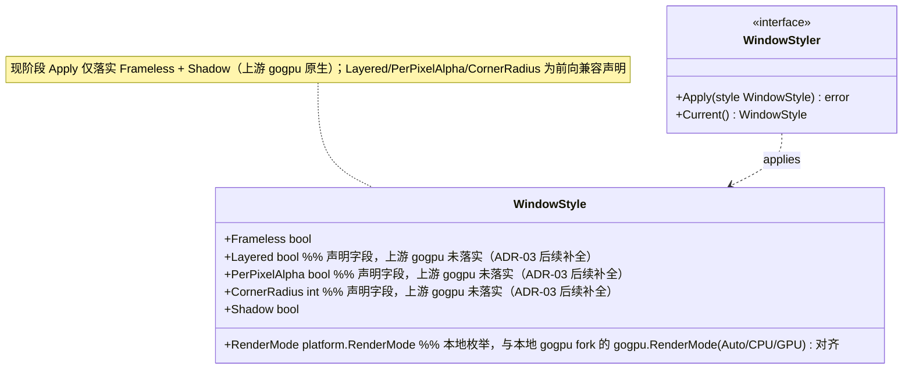
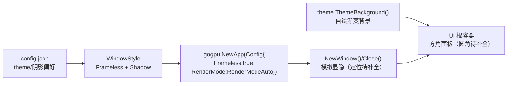
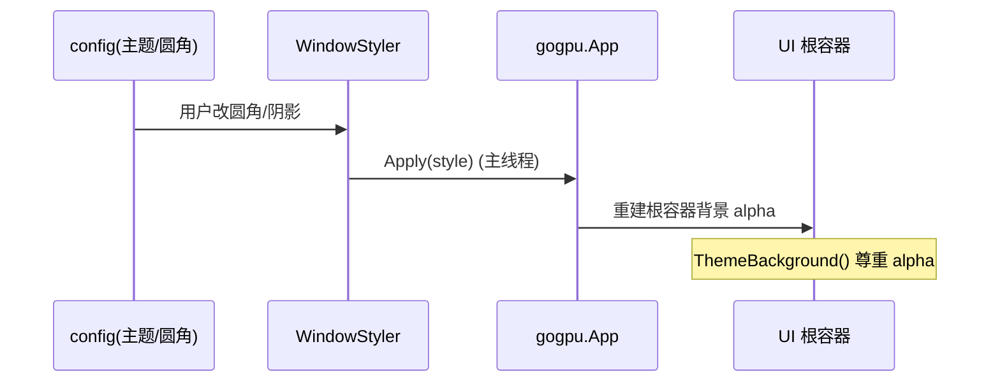
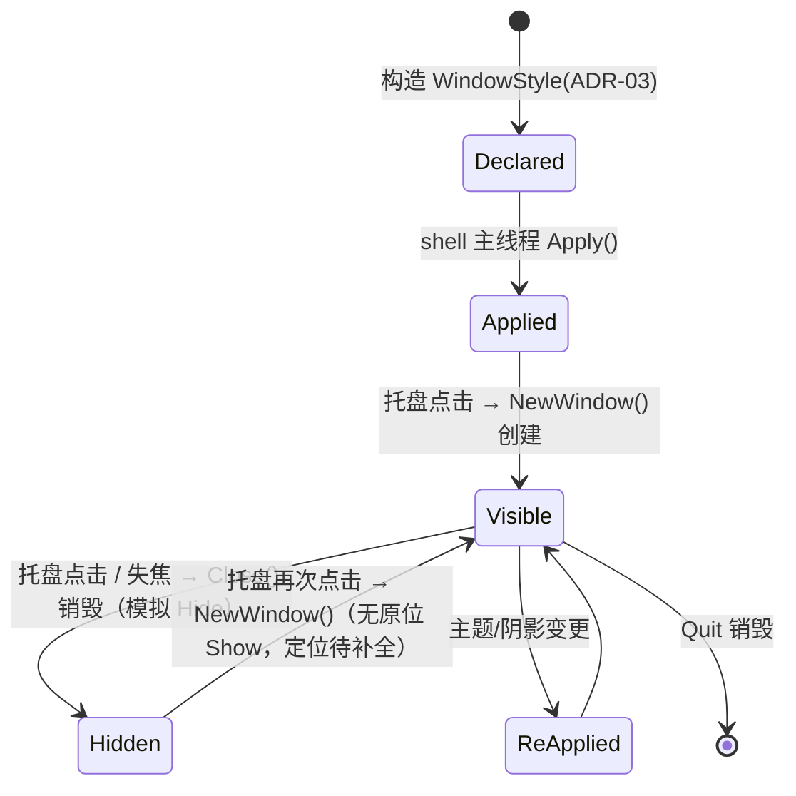

# 20-Platform · WindowStyle（无边框窗口样式）

> 版本：v1.0-revised（降级）｜ 最后更新：2026-07-08
> 关联：ADR-03（无边框 + DWM 阴影；圆角 / 每像素 alpha / 定位为声明字段，待后续补全）
> ⚠️ **降级说明**：2026-07-08 起恢复上游 gogpu（不 patch 依赖库），上游仅原生支持「无边框 + DWM 阴影」。圆角、每像素 alpha 透明、程序化 Show/Hide/SetPosition **现阶段未落实**，列为后续补全项（见 ADR-03「缺失功能清单」）。`poc/transparent-window` 的验证基于已 stash 的本地 patch，现已过期。

## 1. 📦 package 设计

- **包名**：`platform`（目录 `internal/platform/windowstyle`，对外以 `platform` 包暴露）。
- **职责**：封装窗口样式配置——无边框（Frameless）、DWM 阴影（frameless 时自动启用）；并声明 `Layered` / `PerPixelAlpha` / `CornerRadius` 三个**前向兼容字段**（上游 gogpu 当前未落实，待后续补全，见 ADR-03）。渲染模式使用**本地 `platform.RenderMode` 枚举**（Auto/CPU/GPU），避免把 wgpu 栈引入基础层。
- **依赖方向**：
  - 依赖：无外部依赖（Phase 0 不 import gogpu；`RenderMode` 为本地枚举）。`internal/theme` 仅在使用其 `ThemeBackground()` 时相关。
  - 被依赖：`internal/shell`（窗口装配，Phase 3 经适配器把 `platform.RenderMode` 映射到 `gogpu.RenderMode`）、`internal/ui`。
  - 不向上层（feature/state）反向依赖。
- **公开符号**：`WindowStyle`、`WindowStyler`、`DefaultWindowStyle()`、`RenderMode`（本地枚举：`RenderModeAuto` / `RenderModeCPU` / `RenderModeGPU`）。
- **边界**：样式"声明与常量"归本模块；具体窗口位运算由 gogpu 内部完成（零 CGO 封装）。`platform` 只做配置与校验，不手写 `syscall` 直接改窗口样式位。现阶段 `WindowStyler.Apply` 仅落实 `Frameless` + `Shadow`（上游原生能力）。

## 2. 📐 UML 类图



## 3. 🔄 数据流图



数据源：用户配置（是否阴影）→ `WindowStyle` → gogpu 装配；汇点：UI 根容器（自绘渐变，不透视桌面）。圆角 / 每像素 alpha / 定位为 ADR-03 后续补全项。

## 4. 🎨 UI 原型图（ASCII）

> ⚠️ 降级形态：方角、不透明面板（每像素 alpha 与圆角待 ADR-03 后续补全）。DWM 阴影仍由上游 gogpu 在 frameless 时自动绘制。

```
   ┌────────────────────────┐   ← 方角（CornerRadius 暂未落实）
   │  ┌────────────────────┐  │
   │  │ 公历网格 农历/节气  │  │   ← 根容器自绘渐变背景（不透明）
   │  │ 节假日/调休标记     │  │
   │  └────────────────────┘  │
   └────────────────────────┘
    ┄┄┄┄ DWM 外阴影 ┄┄┄┄          ← 上游 gogpu frameless 自动带
```

- 面板为**方角、不透明**（上游 gogpu 交换链为 `Opaque`，无法透出桌面）。
- `Shadow=true` → DWM 绘制柔和外阴影（上游原生，无需自绘）。
- 圆角 / 每像素 alpha 透出桌面：当前不支持，见 ADR-03「缺失功能清单」。

## 5. 🗂 数据库设计

**N/A** —— 纯窗口样式配置，无持久化表。圆角/阴影仅存于运行时 `WindowStyle` 与 `config.json`（由 `internal/infra/config` 管理，非本模块职责）。

## 6. 📡 Event / Signal 流程



- emit：配置变更 Signal（`state` 包）→ subscribe：`shell` 调用 `WindowStyler.Apply`。
- 副作用：窗口样式位更新、根容器背景重绘（非阻塞，`RequestRedraw()` 唤醒）。

## 7. 🔌 Plugin API

**N/A** —— Platform 底层窗口样式不向插件暴露钩子；主题换肤相关钩子归 `40-Theme`（Post-MVP 换肤）。

## 8. 🧩 Feature 生命周期



约束：所有 `Apply`/`Show`/`Hide` 仅在主线程 `OnUpdate` 中执行（见 `01-总体架构.md` §3）。

## 9. 📖 Go 接口定义

```go
package platform

// RenderMode 渲染模式（本地枚举，与本地 gogpu fork 的 gogpu.RenderMode 对齐：Auto/CPU/GPU）。
// 注意：设计稿曾设想 gogpu 提供"宿主托管式"渲染模式常量，但本地/上游 gogpu 均不存在该常量；
// 为避免把 wgpu 全栈引入基础层，本包用本地枚举表达，Phase 3 由 shell 适配器映射到 gogpu.RenderMode。
type RenderMode int

const (
    RenderModeAuto RenderMode = iota // 自动：软适配走 CPU，真 GPU 走 GPU
    RenderModeCPU                    // 强制 CPU 光栅化
    RenderModeGPU                    // 强制 GPU 路径
)

// WindowStyle 描述窗口样式配置（ADR-03）。
// Frameless / Shadow 由上游 gogpu 原生落实；Layered / PerPixelAlpha / CornerRadius
// 为前向兼容声明字段，上游 gogpu 当前未落实（圆角/每像素透明待 ADR-03 后续补全）。
type WindowStyle struct {
    Frameless     bool      // 无边框（上游 gogpu 原生）
    Layered       bool      // WS_EX_LAYERED 分层窗口（声明字段，待后续补全）
    PerPixelAlpha bool      // 每像素 alpha 透明（声明字段，待后续补全）
    CornerRadius  int       // DWM 圆角半径（像素），0=系统默认（声明字段，待后续补全）
    Shadow        bool      // DWM 外阴影（上游 gogpu frameless 时自动）
    RenderMode    RenderMode // 渲染模式（本地枚举）
}

// DefaultWindowStyle 返回 MVP 默认样式。
// 注：Layered/PerPixelAlpha/CornerRadius 保留为声明默认值，便于后续补全时直接复用；
// 现阶段 WindowStyler.Apply 仅落实 Frameless + Shadow。
func DefaultWindowStyle() WindowStyle {
    return WindowStyle{
        Frameless:     true,
        Layered:       true,
        PerPixelAlpha: true,
        CornerRadius:  16,
        Shadow:        true,
        RenderMode:    RenderModeAuto,
    }
}

// WindowStyler 窗口样式应用者。实现方封装 gogpu 装配细节（Phase 3）。
type WindowStyler interface {
    // Apply 在主线程将样式应用到主窗口（仅 OnUpdate 调用）。
    Apply(style WindowStyle) error
    // Current 返回当前生效样式。
    Current() WindowStyle
}

// 注：gogpu 装配侧示意（非本包代码，仅说明衔接点）：
//   gogpuApp := gogpu.NewApp(gogpu.Config{
//       Frameless:  true,
//       RenderMode: gogpu.RenderModeAuto,
//   })
//   // 上游 gogpu 仅原生支持 Frameless + DWM 阴影。
//   // WS_EX_LAYERED / 每像素 alpha / DWM 圆角 现阶段未落实（见 ADR-03 缺失功能清单）；
//   // 未来若恢复窗口化补丁（路径 A）或反射取 hwnd 修饰（路径 C），再经 WindowStyler.Apply 落实。
// 根容器背景为自绘渐变（不透明），不透视桌面。
```

## 10. 🚀 每个 Milestone 的任务拆分

| Milestone | 任务 | 验收标准 |
|---|---|---|
| v1.0（MVP·降级已实现） | 无边框 + DWM 阴影（上游 gogpu 原生） | `WithFrameless` 装配生效；方角不透明面板 + DWM 阴影可见 |
| v1.0（MVP·降级已实现） | 根容器自绘渐变背景 | 面板为不透明渐变 UI；不透视桌面（与 ADR-03 降级一致） |
| v1.1（待定·后续补全） | 圆角（M1） | 反射取 hwnd 后 `DwmSetWindowAttribute` 设圆角，或恢复窗口化补丁 |
| v1.1（待定·后续补全） | 程序化 Show/Hide + SetPosition 贴时钟（M3/M4） | 托盘点击原位显隐；弹窗定位于时钟正下方 |
| v1.1+（待定·后续补全） | 每像素 alpha 透明（M2） | 恢复 premultiplied 交换链 + WS_EX_LAYERED，面板外透出桌面 |
| v1.3（Post-MVP） | 换肤联动阴影（40-Theme） | 切换主题时 `Apply` 重设阴影，无闪烁 |
| v1.4（Post-MVP） | 插件可调样式钩子（若需要） | 插件可读取当前 `WindowStyle`，不破坏零 CGO |
| v1.5（Post-MVP） | 高 DPI 下阴影随缩放正确 | 见 `DPI.md` §9 协同验收 |

> 范围：降级后核心样式（无边框 + DWM 阴影）为 MVP 已实现；圆角 / 每像素 alpha / 显隐定位为声明字段，待 ADR-03「缺失功能清单」补全。决策可逆（恢复 `git -C D:/workspace/github/gogpu stash pop` 即升级回完整 ADR-03）。
