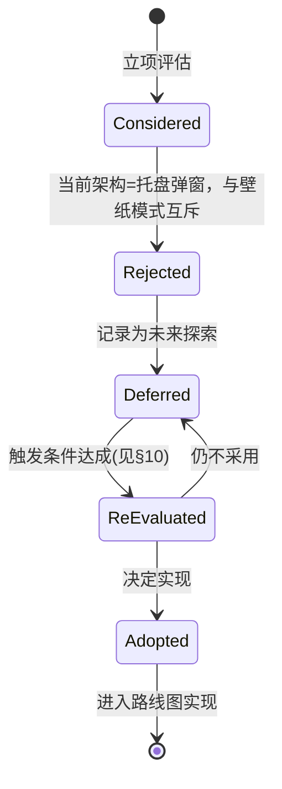

# 20-Platform · WorkerW（桌面嵌入 / 壁纸模式）

> 版本：v1.0-draft ｜ 最后更新：2026-07-07
> 状态：**已判定为当前非目标（Non-Goal / Deferred）** —— 决策记录式文档

## 1. 📦 package 设计

**N/A —— 本模块在当前架构中不实现，不在 `internal/platform` 中落地任何代码。**

理由：`00-项目介绍.md` 已明确将"壁纸模式（WorkerW 桌面嵌入）"列为 **Non-Goals**。DeskCalendar 的产品形态是"点击系统托盘时钟弹出的日历面板"，与桌面壁纸渲染是两条互斥的 UI 范式。因此 `internal/platform` 不提供 WorkerW 相关类型、函数或子包。

本文件仅作为**决策留档**：记录为何当前不需要、以及在何种条件下才重新评估（见 §8 / §10）。

- 依赖方向：**无**（不纳入编译图）。
- 公开符号：**无**。
- 边界：桌面壁纸附着（Progman → WorkerW → SendMessage 切换壁纸 Z 序）不属于托盘弹窗职责，当前归为"未来探索"。

## 2. 📐 UML 类图

**N/A** —— 无类型、无类。当前不存在 `WorkerW` 相关 struct / interface，无需类图。

## 3. 🔄 数据流图

**N/A** —— 无运行时数据流。WorkerW 模式本应是"窗口附着到 `WorkerW` 窗口句柄之下、随壁纸刷新"的渲染链路，但本产品不走该链路，故无数据流可画。

## 4. 🎨 UI 原型图（ASCII）

当前产品为**托盘弹窗**（上方居中浮层），与 WorkerW 壁纸模式对比如下，仅用于说明为何后者当前不需要：

```
当前形态（MVP，已采用）：                    未来探索形态（WorkerW 壁纸模式）：
┌──────────────────────────┐               ┌────────────────────────────┐
│ [任务栏] [📅托盘图标]      │               │  桌面壁纸 (WorkerW 之下)     │
└──────────┬───────────────┘               │  ┌──────────────────────┐  │
            │ 点击                          │  │ 常驻桌面组件 嵌入壁纸 │  │
            ▼                               │  │ 日历/组件浮于壁纸之上 │  │
      ┌─────────────┐                       │  └──────────────────────┘  │
      │ 圆角透明面板 │  ← 不抢焦点          │  覆盖整屏，随壁纸刷新        │
      │ 公历/农历... │                       └────────────────────────────┘
      └─────────────┘
```

结论：托盘弹窗已是完整的 360 观感复刻路径，无需附着桌面壁纸。

## 5. 🗂 数据库设计

**N/A** —— 纯窗口附着机制，无任何持久化数据。

## 6. 📡 Event / Signal 流程

**N/A** —— 无 Signal / 事件流转。WorkerW 附着本应通过 Win32 消息（如 `SendMessage(Progman, 0x052C, ...)` 切换 WorkerW 可见性），但当前产品无此链路。

## 7. 🔌 Plugin API

**N/A** —— Platform 底层不向插件暴露钩子；且本机制未实现，无插件面可见接口。

## 8. 🧩 Feature 生命周期

本"功能"当前处于**决策拒绝 / 延期**状态，用状态机记录决策轨迹：



## 9. 📖 Go 接口定义

**N/A** —— 当前不沉淀任何 Go 接口。仅预留一个**未来可能的**最小接口草图（非编译目标，仅决策备忘）：

```go
// 以下为未来探索期的接口预留草图，当前不进入 internal/platform 编译图。
//
// type DesktopWallpaperHost interface {
//     // Attach 将指定窗口句柄嵌入到 WorkerW 之下，作为桌面组件常驻。
//     Attach(hwnd uintptr) error
//     // Detach 解除嵌入，恢复普通窗口。
//     Detach(hwnd uintptr) error
// }
```

> 注：上述代码块为**草案注释**，不保证可编译、不随仓库构建。

## 10. 🚀 每个 Milestone 的任务拆分

**N/A（当前全部延期）** —— 但给出**重新评估的触发条件**，条件达成才会进入路线图：

| 触发条件（任一） | 说明 |
|---|---|
| 用户强需求：桌面常驻组件 | 出现"希望日历浮于壁纸之上、不依赖托盘点击"的明确需求 |
| 产品定位变更 | 从"托盘弹窗"扩展为"桌面小组件平台" |
| 技术验证：gogpu 支持 WorkerW 附着且不破坏双循环 | 需先验证 `systray.Run()` + 主循环的并发模型在壁纸模式下仍成立 |

若触发，建议最小拆分（Post-MVP，预估 v2.x）：

- 任务：实现 `DesktopWallpaperHost.Attach/Detach`（零 CGO，纯 Win32 消息）。
- 验收：日历面板嵌入壁纸之下、随壁纸刷新、托盘点击仍可用、关机无残留。
- 任务：与 `MultiMonitor`（§6）协同，按主显示器 DPI 缩放。
- 验收：多屏 + 高 DPI 下壁纸组件不糊、定位正确。

> 当前 v1.0 ~ v1.5 路线图**不含**本模块。保持决策可逆：未来若采用，不影响核心双循环（ADR-02）。
