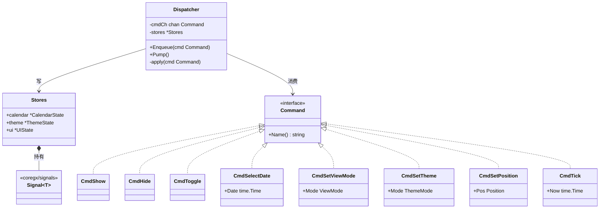
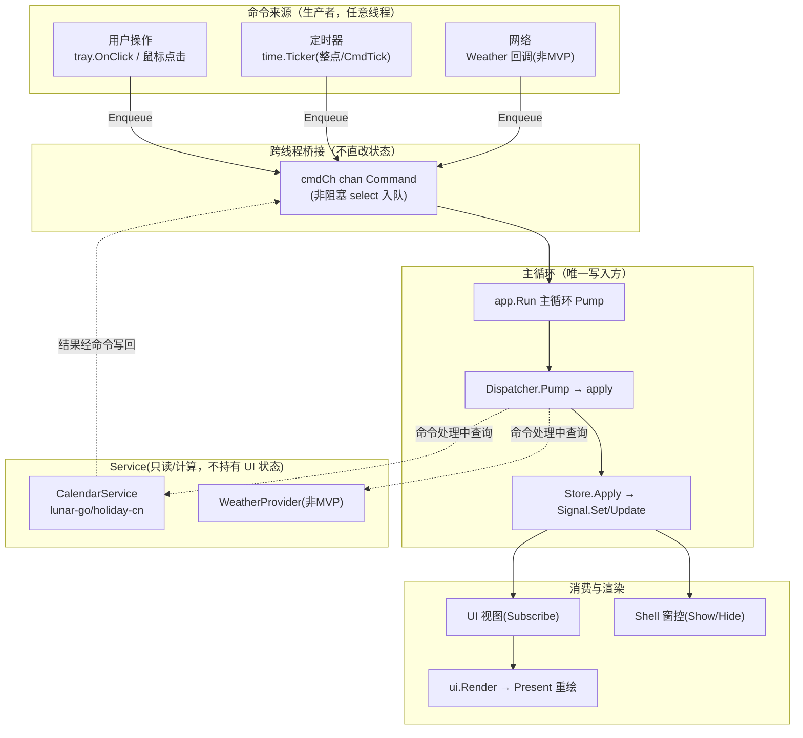
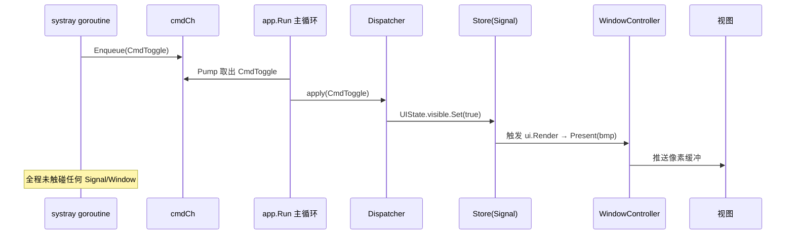
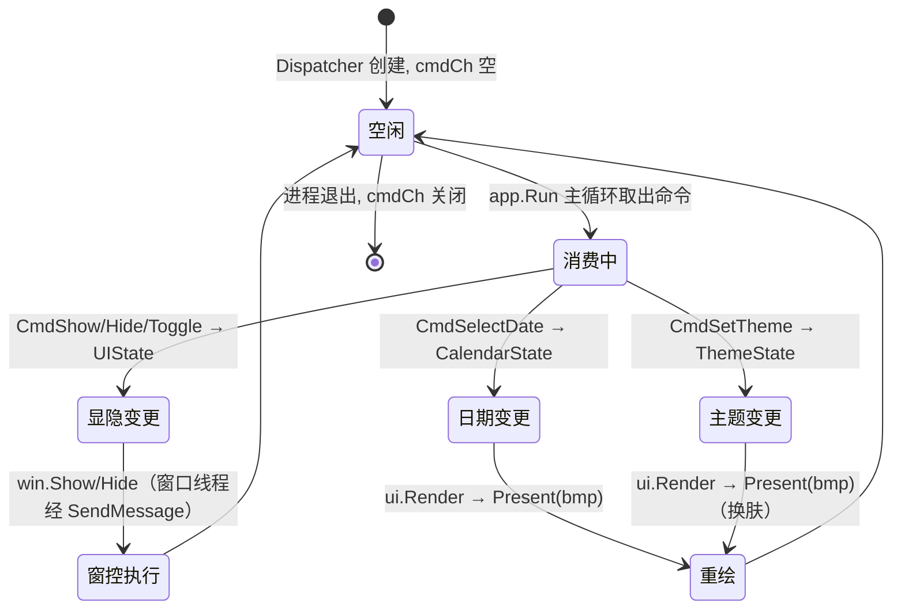

# DataFlow — 单向数据流与命令分发

> 版本：v1.0-draft ｜ 最后更新：2026-07-07 ｜ 模块：30-State ｜ 子主题：DataFlow

## 1. 📦 package 设计

- **包名**：`state`（命令分发逻辑与 Signal/Store 同包，目录 `internal/state`，文件 `command.go` / `dispatcher.go`）。
- **职责一句话**：定义归一化的 `Command` 载体与 `Dispatcher`，把所有状态变更收敛为"跨线程投递命令 → 主线程消费 → 写 Store(Signal) → UI 重绘"的单向通道，杜绝双向绑定与跨线程直改状态。
- **依赖方向**：
  - 依赖：`coregx/signals`（Signal）、`internal/state` 的 Store、`internal/calendar`/`internal/theme`/`internal/platform`（命令语义所涉及的领域与窗控）。
  - 被依赖：`internal/shell`（装配 Dispatcher 到 `app.Run` 主循环）、`internal/app`（wire 时创建 Dispatcher）、各 feature（发出命令）。
- **对外暴露的公开符号**：`Command` 接口、`CmdShow`/`CmdHide`/`CmdToggle`/`CmdSelectDate`/`CmdSetViewMode`/`CmdSetTheme`/`CmdSetPosition`/`CmdTick` 等命令类型、`Dispatcher` 接口与 `NewDispatcher`、`Enqueue`（跨线程安全入队）、`Pump`（主线程消费）。
- **边界**：
  - 归它管：命令定义、跨线程桥接（channel）、主线程消费与分发、错误兜底（非法命令日志）。
  - 不归它管：Signal 原语实现（见 `Signal.md`）、Store 内状态语义（见 `Store.md`）、具体业务逻辑（如农历换算由 `internal/calendar` 在命令处理中调用，不在本模块）。

## 2. 📐 UML 类图



## 3. 🔄 数据流图



**铁律**（与 `01-总体架构.md` §3 一致）：
- 不双向绑定：视图只读/订阅 Store，绝不在视图里反向写状态；状态变更的唯一出口是 `Signal.Set`，且仅主线程。
- 不跨线程直接改状态：非主线程只允许 `Enqueue(cmd)`；`Dispatcher.apply` 必定在 `app.Run` 主循环内执行。
- Service（calendar/weather）是无状态/只读计算层，产出数据后经通道以命令形式回流，不持有或直改 UI 状态。

## 4. 🎨 UI 原型图（ASCII）

以下为面板从"隐藏"到"显示并重绘"的数据流映射（面板像素结构见 `90-UI`）：

```text
   [托盘时钟]──click──▶ tray.OnClick
        │                     │
        │            Enqueue(CmdToggle)  ──▶ cmdCh ──▶ app.Run 主循环
        ▼                                          │
   [app.Run 主循环] ◀── Pump() ◀──────────────────┘
        │
        ├─ UIState.visible.Set(true)      ─▶ Shell 经 SendMessage 执行 win.Show()
        ├─ UIState.position.Set(托盘上方) ─▶ win.AnchorAboveTray(rect)
        └─ ui.Render → WindowController.Present(bmp)
                    │
                    ▼
   ┌──────── 日历面板(重绘) ────────┐
   │ 选中日期 = CalendarState        │
   │ 主题   = ThemeState             │
   └─────────────────────────────────┘
```

## 5. 🗂 数据库设计

**N/A**。DataFlow 是纯运行时机制（命令在内存 channel 中流转、在主线程即时消费），本身不持久化任何数据，不定义表结构。需要落盘的领域状态由 `Store.Snapshot()` 产出、由 `internal/infra/config`（JSON）与 `60-Todo`（SQLite，Post-MVP）负责，命令分发层不接触存储。

## 6. 📡 Event / Signal 流程



- **谁 emit**：生产者线程（tray/定时器/网络）只 `Enqueue`。
- **谁 subscribe**：`app.Run` 主循环订阅 channel（轮询）；视图 `Subscribe`/`SubscribeForever` 订阅 Store 内 Signal。
- **副作用**：命令经 `apply` 落到 Signal 后，触发窗控（`WindowController.Show/Hide`，经窗口线程 `SendMessage` 派发）与 UI 重绘（`ui.Render → Present`，事件驱动，非逐帧 `RequestRedraw`）。

## 7. 🔌 Plugin API

**N/A**。命令通道（cmdCh / Dispatcher）是核心内部数据流构件，不对插件开放——若插件可 `Enqueue` 任意命令或读取 Dispatcher，会破坏"主线程唯一写入"的线程安全模型，且让插件具备绕过 feature 边界直接操控 UI 的能力。插件统一经 feature 层（`80-Plugin`）定义的领域事件/钩子表达意图，由 feature 翻译为合法命令并投递，DataFlow 层不提供插件侧接口。

## 8. 🧩 Feature 生命周期

面板的一次"显示→交互→隐藏"在命令驱动下的生命周期：



## 9. 📖 Go 接口定义

以下为可编译风格的 Go 定义（节选自 `internal/state/command.go` 与 `dispatcher.go`）：

```go
package state

import (
    "time"

    "github.com/shaolei/DeskCalendar/internal/infra/log"
)

// Command 是所有状态变更的归一化指令（单向数据流载体）。
// 任何线程都可构造 Command，但只有 Dispatcher.apply（主线程）可消费它。
type Command interface {
    // Name 返回命令名，用于日志/追踪。
    Name() string
}

// ---- 具体命令 ----

type CmdShow struct{}

func (CmdShow) Name() string { return "show" }

type CmdHide struct{}

func (CmdHide) Name() string { return "hide" }

type CmdToggle struct{}

func (CmdToggle) Name() string { return "toggle" }

type CmdSelectDate struct{ Date time.Time }

func (CmdSelectDate) Name() string { return "select_date" }

type CmdSetViewMode struct{ Mode ViewMode }

func (CmdSetViewMode) Name() string { return "set_view_mode" }

type CmdSetTheme struct{ Mode ThemeMode }

func (CmdSetTheme) Name() string { return "set_theme" }

type CmdSetPosition struct{ Pos Position }

func (CmdSetPosition) Name() string { return "set_position" }

// CmdTick 由定时器驱动，用于刷新"今天/当前月"等随时间变化的状态。
type CmdTick struct{ Now time.Time }

func (CmdTick) Name() string { return "tick" }

// Stores 聚合所有领域状态容器（由 app 装配时注入）。
type Stores struct {
    Calendar *CalendarState
    Theme    *ThemeState
    UI       *UIState
}

// Dispatcher 在主线程消费命令并应用到 Store。
type Dispatcher struct {
    cmdCh  chan Command
    stores *Stores
}

// NewDispatcher 创建分发器；channel 带缓冲以避免生产者阻塞。
func NewDispatcher(stores *Stores) *Dispatcher {
    return &Dispatcher{
        cmdCh:  make(chan Command, 64),
        stores: stores,
    }
}

// Enqueue 跨线程安全入队（非阻塞），避免生产者（如 systray goroutine）因 channel 满而阻塞。
func (d *Dispatcher) Enqueue(cmd Command) {
    select {
    case d.cmdCh <- cmd:
    default:
        log.Warn("dispatcher: cmd channel full, dropped", "cmd", cmd.Name())
    }
}

// Pump 必须在 app.Run 主循环中调用：排空当前所有待处理命令。
// 非阻塞：无命令时立即返回，不 spinning。
func (d *Dispatcher) Pump() {
    for {
        select {
        case cmd := <-d.cmdCh:
            d.apply(cmd)
        default:
            return
        }
    }
}

// apply 仅主线程调用：把命令落到对应 Store 的 Signal（唯一合法写入点）。
func (d *Dispatcher) apply(cmd Command) {
    switch c := cmd.(type) {
    case CmdShow:
        d.stores.UI.visible.Set(true)
    case CmdHide:
        d.stores.UI.visible.Set(false)
    case CmdToggle:
        d.stores.UI.visible.Update(func(v bool) bool { return !v })
    case CmdSelectDate:
        d.stores.Calendar.applySelectDate(c.Date) // 见 Store.md：主线程写 Signal
    case CmdSetViewMode:
        d.stores.Calendar.viewMode.Set(c.Mode)
    case CmdSetTheme:
        d.stores.Theme.mode.Set(c.Mode)
    case CmdSetPosition:
        d.stores.UI.position.Set(c.Pos)
    case CmdTick:
        d.stores.Calendar.applyTick(c.Now)
    default:
        log.Warn("dispatcher: unknown command", "cmd", cmd.Name())
    }
}
```

装配示例（在 `internal/app` / `internal/shell`）：

```go
// 跨线程：tray 回调只 Enqueue
tray.OnClick(func() { dispatcher.Enqueue(state.CmdToggle) })

// 主循环（app.Run 内部 for select cmdCh）消费：
dispatcher.Pump() // 事件驱动重渲经 ui.Render → WindowController.Present，无需 RequestRedraw 唤醒
```

## 10. 🚀 Milestone 任务拆分

| 版本 | 任务 | 验收标准 |
|------|------|----------|
| v1.0 (MVP) | 定义 `Command` 接口与核心命令类型，实现 `Dispatcher`（Enqueue 非阻塞 / Pump 主线程消费） | 单测：Enqueue→Pump→Store.Signal 被正确 Set；channel 满不阻塞生产者 |
| v1.0 (MVP) | 装配到命令循环：tray.OnClick→Enqueue；app.Run 主循环→Pump 事件驱动重渲 | spike 真机验证：点击托盘显隐面板 < 50ms，焦点不丢 |
| v1.0 (MVP) | CmdShow/Hide/Toggle/Anchor 接 WindowController 窗控（仅窗口线程经 SendMessage） | 面板坐标定位在托盘上方正确；无跨线程窗控调用 |
| v1.0 (MVP) | CmdSelectDate / CmdSetViewMode / CmdSetTheme 接 Store | 日历高亮、月/周切换、主题切换经命令生效，无双向绑定 |
| v1.1 | CmdTick + Todo 联动命令（选中日期触发待办查询） | 每日/选中变更时待办视图经命令刷新 |
| v1.2 | 网络回调以命令回流（Weather 结果经 Cmd 写 Store，降级时不发脏命令） | 断网/超时时不产生状态污染，面板稳定 |
| v1.3 | CmdSetAccent 等换肤命令扩展 | 强调色热切换即时生效 |
| v1.4 | 插件经 feature 事件翻译为命令（Dispatcher 不直对插件，见 §7） | 插件无法越权 Enqueue；仅经 feature 边界 |
| v1.5 | 自动更新重启后命令流不丢状态（Snapshot 恢复后再 Pump 残留命令） | 重启后无悬挂命令、状态连续 |
