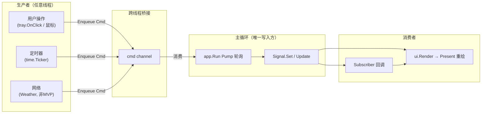
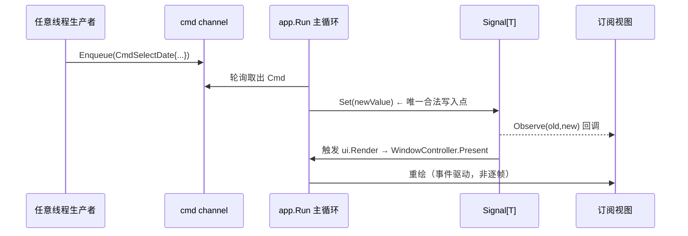
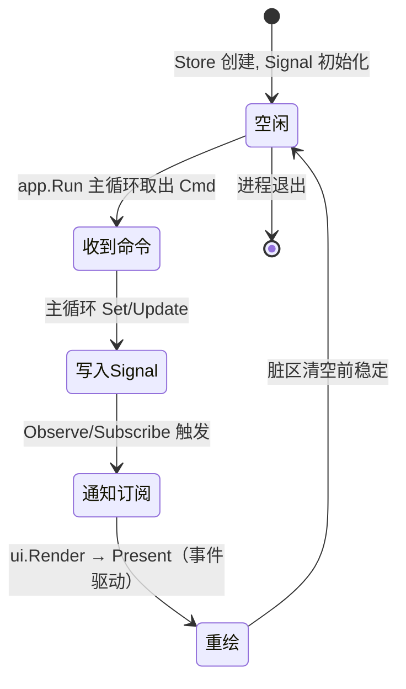

# Signal — coregx/signals 响应式原语

> 版本：v1.0-draft ｜ 最后更新：2026-07-07 ｜ 模块：30-State ｜ 子主题：Signal

## 1. 📦 package 设计

- **包名**：`state`（状态容器统一归属 `internal/state`）。Signal 原语由 `coregx/signals` 提供（即 `internal/state.Signal[T]` = `coregx/signals.Signal[T]`，已是 go.mod 直接依赖），本项目**直接复用、不二次封装**，保持零抽象损耗。
- **所在目录**：`internal/state`（Signal 的使用约定与组合样板在此收敛，见 `signal.go` / `doc.go`）。
- **职责一句话**：Signal 是 `coregx/signals` 的泛型响应式原语，承载"值变化 → 通知订阅者 → 触发 UI 重绘"的最小闭环；它是本项目单向数据流的最终落点。
- **依赖方向**：
  - 依赖：`coregx/signals`（Signal 本体）。
  - 被依赖：`internal/ui`（视图订阅 Signal 渲染）、`internal/shell`（`app.Run` 主循环消费）、`internal/state` 的 Store（内部持有 Signal）、各 feature（读写领域状态）。
- **对外暴露的公开符号**：`signals.New[T]`、`signals.Signal[T]` 接口（Get/Set/Update/Subscribe/Observe）；本项目约定的"主循环唯一写入"规则（见 §6）。
- **边界**：
  - 归它管：值的读写、变化通知、订阅生命周期、与状态变更重渲（`ui.Render` → `WindowController.Present`）的衔接。
  - 不归它管：命令的来源与分发（见 `DataFlow.md`）、状态如何持久化（见 `Store.md` 与 config 模块）、领域语义（"选中日期"之类语义在 Store 层）。

## 2. 📐 UML 类图

```mermaid
classDiagram
    class Signal~T~ {
        <<interface>>
        +Get() T
        +Set(value T)
        +Update(fn func(old T) T)
        +Subscribe(fn func(T)) unsubscribe
        +Observe(fn func(old, new T)) unsubscribe
    }
    class Subscriber {
        <<view / feature>>
        +render(s Signal~T~)
    }
    class MainLoop {
        <<app.Run 命令循环 for select cmdCh>>
        +SendMessage 派发窗控
    }

    Signal~T~ <.. Subscriber : Observe/Subscribe
    Signal~T~ ..> MainLoop : Set/Update 仅在主循环触发重渲
    Note for Signal~T~ "signals.New[T](initial) 创建实例"
```

## 3. 🔄 数据流图



要点：生产者**永不直接调用 `Signal.Set`**，只通过命令通道把意图交给主循环；`app.Run` 主循环是唯一能改变 Signal 值的地方（见 §6 线程安全铁律）。

## 4. 🎨 UI 原型图（ASCII）

下图为托盘日历面板，标注各部分由哪个 Signal 驱动重绘（仅作模块相关 UI 示意，真实像素见 `90-UI`）：

```text
┌─────────────────────────────┐  ← UIState.visible / position Signal 控制显隐与坐标
│  🗓 2026年7月       [☀/🌙]  │  ← ThemeState.mode Signal 控制图标(浅/深)
│ ┌──┬──┬──┬──┬──┬──┬──┐      │
│ │日│一│二│三│四│五│六│      │  ← CalendarState.displayedMonth Signal 控制表头年月
│ ├──┼──┼──┼──┼──┼──┼──┤      │
│ │28│29│30│ 1│ 2│ 3│ 4│      │  ← CalendarState.selectedDate Signal 控制高亮格
│ │ 5│ 6│★7│ 8│ 9│10│11│      │     ★=节假日 Signal(由 HolidayService 经命令写入)
│ └──┴──┴──┴──┴──┴──┴──┘      │
│ 农历 五月廿三 · 小暑(节气)   │  ← 同上，依赖 CalendarState 选中态
└─────────────────────────────┘
    ▲ 任意格被点击 → Enqueue CmdSelectDate → 主线程 Set(selectedDate) → Observe 重绘
```

## 5. 🗂 数据库设计

**N/A**。Signal 是纯内存响应式原语，无任何持久化需求：它不持有磁盘状态、不落库、不序列化。需要持久化的状态（如用户上次选中的主题、弹窗位置）由 `Store` 层在变更后显式写入 `config.json`（`internal/infra/config`）或 SQLite（Todo，Post-MVP），Signal 本身不参与存储。

## 6. 📡 Event / Signal 流程



**线程安全铁律**：
- `Signal.Set` / `Signal.Update` **只能在 `app.Run` 主循环调用**。渲染（窗口线程 `GetMessage/Dispatch`）与 Signal 通知经事件驱动衔接，内部无需 `sync.Mutex`，避免锁竞争与跨线程撕裂读。
- 任何非主线程（systray goroutine、定时器 goroutine、网络回调 goroutine）**禁止直接调用 `Set`**，只能把意图打包成 `Command` 经 channel 投递（见 `DataFlow.md`）。
- `Signal.Get` 为只读读取，可在任意线程调用（值在主线程写入后对其他线程可见，因无并发写，Go 内存模型保证发布安全）。
- 与 UI 重绘关系：`Set` 后经 `coregx/signals` 变更触发 `ui.Render` 重渲，并推送 `WindowController.Present(bmp)`（事件驱动，非逐帧 `RequestRedraw` 唤醒）。
- 订阅回调（`Subscribe`/`Observe` 的 `fn`）一律在主线程派发，回调内可安全读取/修改其他 Signal（仍仅主线程），**不可在回调中做阻塞 IO**。

## 7. 🔌 Plugin API

**N/A**。Signal 是 `coregx/signals` 的响应式原语，属于"状态引擎内部件"，不应向插件暴露。插件不直接订阅或写入 Signal——它们通过 feature 层定义的领域事件 / 钩子（见各 feature 模块与 `80-Plugin`）与系统交互，由 feature 内部translate 为命令并最终落到 Signal。直接暴露 Signal 会让插件获得跨主线程写入能力，违背 §6 线程安全铁律，故不开放。

## 8. 🧩 Feature 生命周期

Signal 本身无独立生命周期（随 Store 创建而创建、随进程退出而销毁），但参与每一次状态变更。以下为其在一轮"显隐/选中"中的状态机角色：



## 9. 📖 Go 接口定义

以下为 `coregx/signals` 的 Signal 契约示意（泛型 `Signal[T]`），本项目直接复用（`internal/state.Signal[T]` = `coregx/signals.Signal[T]`），可编译风格：

```go
package signals // 来自 coregx/signals；internal/state 直接等于 signals.Signal[T]，不重新定义

// Signal 是 coregx/signals 的泛型响应式原语。
// 线程约束：Set/Update 仅可在 app.Run 主循环调用；Get 可任意线程只读；
// Subscribe/Observe 注册在主循环，回调也在主循环派发。
type Signal[T any] interface {
    // Get 返回当前值。
    Get() T

    // Set 替换当前值，并触发订阅通知与 UI 重绘请求。
    // 仅允许在主线程调用。
    Set(value T)

    // Update 以函数式更新当前值（读旧值 → 写新值），原子于主线程一次帧。
    // 仅允许在主线程调用。
    Update(fn func(old T) T)

    // Subscribe 注册值变化回调，返回取消订阅函数。
    // fn 在主线程派发；请勿在其中执行阻塞 IO。
    Subscribe(fn func(value T)) (unsubscribe func())

    // Observe 注册带新旧值的细粒度回调，便于 diff 渲染（如只重绘变化格子）。
    // fn 在主线程派发。
    Observe(fn func(old, new T)) (unsubscribe func())
}

// NewSignal 创建一个带初始值的 Signal。
func NewSignal[T any](initial T) Signal[T]
```

本项目在 Store 中的约定用法（主线程唯一写入示例）：

```go
package state

import "github.com/shaolei/DeskCalendar/internal/infra/log"

// 任何对 Signal 的写入都必须经由主线程的 applyCmd，绝不暴露 Set 给外部。
func (s *CalendarState) applySelectDate(d time.Time) {
    // 调用方保证当前处于 app.Run 主循环。
    s.selectedDate.Set(d)
    s.displayedMonth.Update(func(old time.Time) time.Time {
        return time.Date(d.Year(), d.Month(), 1, 0, 0, 0, 0, d.Location())
    })
}
```

## 10. 🚀 Milestone 任务拆分

| 版本 | 任务 | 验收标准 |
|------|------|----------|
| v1.0 (MVP) | 接入 `coregx/signals` Signal 原语；确立"主循环唯一写入"规则与 channel 桥接约定 | 视图订阅 Signal 后，主循环 Set 能触发重绘；systray 线程直接 Set 在 code review 中被禁止（静态约定） |
| v1.0 (MVP) | 封装 Store 对 Signal 的持有（见 `Store.md`），Calendar/Theme/UI 三态接入 | 日历高亮、主题切换、弹窗显隐均由对应 Signal 驱动，无手写 mutex 管理 UI 状态 |
| v1.1 | Signal 与 Todo 状态联动（选中日期 → 显示当日待办） | 切换选中日期时 TodoView 经 Signal 自动刷新 |
| v1.2 | Weather Signal 接入（非 MVP，异步+降级），断网不阻塞日历 | 天气 Signal 为空/错误时面板隐藏天气区，日历照常渲染 |
| v1.3 | Theme Signal 支持运行时换肤 / 图标字体热切换 | Set(mode) 后整个面板即时换肤无残影 |
| v1.4 | 插件经 feature 事件间接影响 Signal（不直接暴露，见 §7） | 插件写领域事件 → feature translate 为 Cmd → Signal 变更，插件无 Signal 直接引用 |
| v1.5 | Signal 在自动更新重启后保持状态连续性（必要时从 config 恢复） | 重启后选中日期/主题/位置与退出前一致 |
