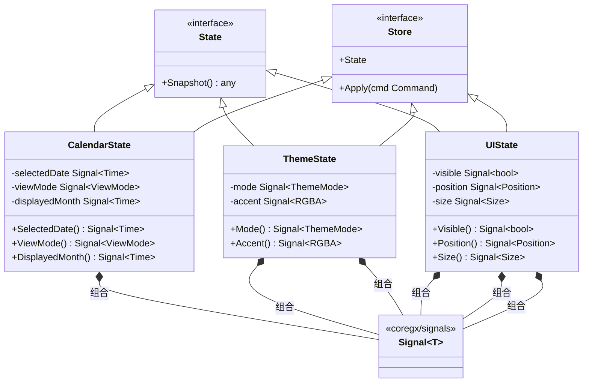
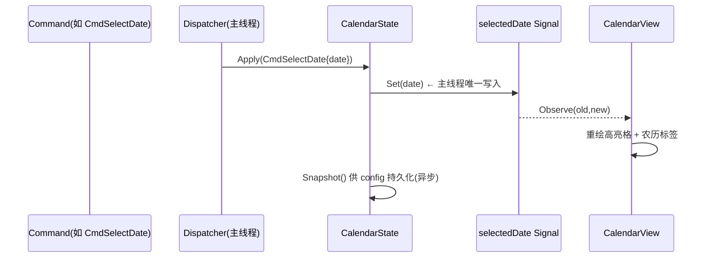
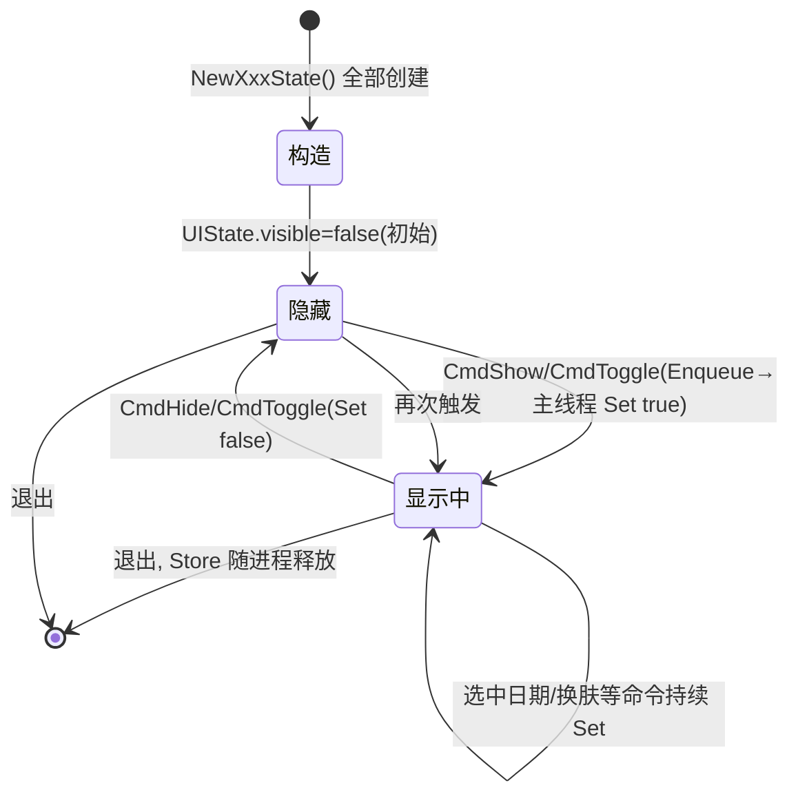

# Store — 领域状态容器

> 版本：v1.0-draft ｜ 最后更新：2026-07-07 ｜ 模块：30-State ｜ 子主题：Store

## 1. 📦 package 设计

- **包名**：`state`（与 Signal 同包，目录 `internal/state`）。
- **职责一句话**：Store 是各业务领域状态的**有类型容器**，内部持有 `coregx/signals` 的 Signal（即 `internal/state.Signal[T]` = `coregx/signals.Signal[T]`），对外以接口隔离暴露读取/订阅能力，是单向数据流里"状态"这一侧的归口。
- **依赖方向**：
  - 依赖：`coregx/signals`（Signal 本体）、`time`、`image/color`（主题色值）。
  - 被依赖：`internal/ui`（视图读取并订阅 Store 内 Signal 渲染）、`internal/shell`（`app.Run` 主循环把命令结果应用到 Store）、各 feature（Calendar/Theme 经 Store 暴露状态）、`DataFlow` 的 Dispatcher（`apply(cmd)` 落到 Store）。
- **对外暴露的公开符号**：`State` 接口、`Store` 接口、`CalendarState` / `ThemeState` / `UIState` 三个具体容器、`ViewMode` / `ThemeMode` / `Position` / `Size` 等 value object，`NewCalendarState` / `NewThemeState` / `NewUIState` 构造器。
- **边界**：
  - 归它管：领域状态的定义、初始值、类型、与 Signal 的绑定、Snapshot（供持久化/调试）。
  - 不归它管：命令的来源与跨线程投递（见 `DataFlow.md`）；Signal 原语实现（见 `Signal.md`）；持久化落盘动作（Store 仅产出 Snapshot，由 config/SQLite 模块写入）。

## 2. 📐 UML 类图



## 3. 🔄 数据流图

```mermaid
flowchart LR
    subgraph SRC["命令来源"]
        U["用户(tray/鼠标)"]
        T["定时器"]
        N["网络(Weather)"]
    end
    CH["cmd channel"]
    subgraph MAIN["主循环（唯一写入方）"]
        OU["app.Run 主循环"]
    end
    subgraph STORE["Store(内部 Signal)"]
        C["CalendarState"]
        TH["ThemeState"]
        UI["UIState"]
    end
    V["UI 视图"]
    RD["ui.Render → Present"]

    U -->|Enqueue| CH
    T -->|Enqueue| CH
    N -->|Enqueue| CH
    CH --> OU
    OU -->|Apply(cmd)| STORE
    STORE -->|Signal.Set| V
    V -->|Observe 重绘| RD
```

Store 是被命令"写"的对象；UI 视图只"读/订阅"Store 内 Signal，形成单向：来源 → 命令 → 主线程写 Store → Signal 通知 → 视图重绘。

## 4. 🎨 UI 原型图（ASCII）

下图为最小设置面板，直观展示 ThemeState / UIState 在 UI 上的落点（日历面板本身见 `Signal.md` §4）：

```text
┌──────────── 设置(Settings) ────────────┐  ← UIState.position Signal 决定弹出坐标
│ 主题:  (●)跟随系统 ( )浅色 ( )深色     │  ← ThemeState.mode Signal 驱动单选态
│ 强调色: [██ #4C8DFF]                   │  ← ThemeState.accent Signal 驱动色块
│ 开机自启: [✔]                          │
│ 弹窗位置: (●)托盘上方 ( )鼠标处        │  ← UIState 相关偏好(持久化到 config)
│                                        │
│ [关闭]                                 │  ← 点击 → Enqueue CmdHide → UIState.visible.Set(false)
└────────────────────────────────────────┘
```

## 5. 🗂 数据库设计

**N/A**。Store 是纯内存响应式状态容器，不持有数据库表。领域状态的持久化由其它模块负责：UI 偏好（主题、弹窗位置）写入 `%AppData%/DeskCalendar/config.json`（见 `03-项目目录规范.md` §4 与 `internal/infra/config`）；Todo 类数据走 SQLite（`60-Todo`，Post-MVP）。Store 仅通过 `Snapshot()` 产出可序列化快照，由上述模块决定落盘，自身不引入任何 SQL / 表结构。

## 6. 📡 Event / Signal 流程



三类 Store 的 Signal 与触发命令对照：

| Store | 内部 Signal | 典型写入命令 | 订阅方 |
|-------|-------------|--------------|--------|
| CalendarState | `selectedDate` / `viewMode` / `displayedMonth` | `CmdSelectDate` / `CmdSetViewMode` / `CmdTick` | CalendarView |
| ThemeState | `mode` / `accent` | `CmdSetTheme` / `CmdSetAccent` | 所有视图（换肤） |
| UIState | `visible` / `position` / `size` | `CmdShow` / `CmdHide` / `CmdToggle` / `CmdSetPosition` | Shell（窗口控制） |

## 7. 🔌 Plugin API

**N/A**。Store 属于内部状态引擎，不对插件开放读写接口。插件通过 feature 层（Calendar/Weather/Todo）暴露的领域事件与钩子间接影响状态——即插件产生领域事件 → feature 翻译为 `Command` → 主线程 `Apply` 落到 Store（见 `80-Plugin` 与 `DataFlow.md`）。直接暴露 Store 会让插件绕过命令通道、可能在非主线程写 Signal，违背 `Signal.md` §6 铁律，故不开放。

## 8. 🧩 Feature 生命周期

Store 随应用启动构造、随应用退出销毁；其中 UIState 的 `visible` 在显示/隐藏间切换，是面板生命周期的核心：



## 9. 📖 Go 接口定义

以下为可编译风格的 Go 定义（节选自 `internal/state/store.go`）：

```go
package state

import (
    "image/color"
    "time"

    "github.com/coregx/signals" // internal/state.Signal[T] = signals.Signal[T]
)

// ViewMode 日历视图模式。
type ViewMode int

const (
    ViewMonth ViewMode = iota
    ViewWeek
)

// ThemeMode 主题模式。
type ThemeMode int

const (
    ThemeSystem ThemeMode = iota
    ThemeLight
    ThemeDark
)

// Position 屏幕坐标（托盘上方定位结果）。
type Position struct {
    X, Y int
}

// Size 弹窗尺寸。
type Size struct {
    W, H int
}

// State 是所有领域状态容器的公共接口（接口隔离，便于 mock/测试）。
type State interface {
    // Snapshot 返回当前状态只读快照，供持久化/调试。
    Snapshot() any
}

// Store 是状态容器的统一接口，可被 Dispatcher 应用命令。
type Store interface {
    State
// Apply 在 app.Run 主循环执行，把命令结果落到内部 Signal。
// 非主线程调用会导致数据竞争，由 DataFlow 保证只在主循环内调用。
    Apply(cmd Command)
}

// CalendarState 当前选中日期与视图模式。
type CalendarState struct {
    selectedDate   signals.Signal[time.Time]
    viewMode       signals.Signal[ViewMode]
    displayedMonth signals.Signal[time.Time]
}

func NewCalendarState(now time.Time) *CalendarState {
    return &CalendarState{
        selectedDate:   signals.New(now),
        viewMode:       signals.New(ViewMonth),
        displayedMonth: signals.New(time.Date(now.Year(), now.Month(), 1, 0, 0, 0, 0, now.Location())),
    }
}

func (s *CalendarState) SelectedDate() signals.Signal[time.Time]   { return s.selectedDate }
func (s *CalendarState) ViewMode() signals.Signal[ViewMode]         { return s.viewMode }
func (s *CalendarState) DisplayedMonth() signals.Signal[time.Time]  { return s.displayedMonth }

func (s *CalendarState) Snapshot() any {
    return struct {
        SelectedDate   time.Time
        ViewMode       ViewMode
        DisplayedMonth time.Time
    }{s.selectedDate.Get(), s.viewMode.Get(), s.displayedMonth.Get()}
}

// ThemeState 主题与强调色。
type ThemeState struct {
    mode   signals.Signal[ThemeMode]
    accent signals.Signal[color.RGBA]
}

func NewThemeState() *ThemeState {
    return &ThemeState{
        mode:   signals.New(ThemeSystem),
        accent: signals.New(color.RGBA{R: 0x4C, G: 0x8D, B: 0xFF, A: 0xFF}),
    }
}

func (s *ThemeState) Mode() signals.Signal[ThemeMode]     { return s.mode }
func (s *ThemeState) Accent() signals.Signal[color.RGBA]  { return s.accent }

func (s *ThemeState) Snapshot() any {
    return struct {
        Mode   ThemeMode
        Accent color.RGBA
    }{s.mode.Get(), s.accent.Get()}
}

// UIState 弹窗可见性与几何。
type UIState struct {
    visible  signals.Signal[bool]
    position signals.Signal[Position]
    size     signals.Signal[Size]
}

func NewUIState() *UIState {
    return &UIState{
        visible:  signals.New(false),
        position: signals.New(Position{}),
        size:     signals.New(Size{W: 320, H: 420}),
    }
}

func (s *UIState) Visible() signals.Signal[bool]    { return s.visible }
func (s *UIState) Position() signals.Signal[Position] { return s.position }
func (s *UIState) Size() signals.Signal[Size]       { return s.size }

func (s *UIState) Snapshot() any {
    return struct {
        Visible  bool
        Position Position
        Size     Size
    }{s.visible.Get(), s.position.Get(), s.size.Get()}
}
```

> 注：`Apply(cmd Command)` 的具体实现依赖 `DataFlow.md` 中定义的 `Command` 类型，二者在同一 `state` 包内协作。

## 10. 🚀 Milestone 任务拆分

| 版本 | 任务 | 验收标准 |
|------|------|----------|
| v1.0 (MVP) | 定义 `State`/`Store` 接口与 `CalendarState`/`ThemeState`/`UIState` 三容器，内部持有 Signal | `go build` 通过；三容器成功构造并暴露 Signal；接口可被 mock 用于单测 |
| v1.0 (MVP) | UIState 接入 Shell：CmdShow/Hide/Toggle 经主循环 Set `visible`，窗控仅经窗口线程 `SendMessage` 派发 | 点击托盘可显隐面板；systray goroutine 不直调窗控 |
| v1.0 (MVP) | CalendarState 接入 CalendarView：选中日期/切换月视图由 Signal 驱动 | 点击日期高亮即时刷新；切换月份网格重绘 |
| v1.0 (MVP) | ThemeState 基础（跟随系统浅/深）接入，Snapshot 写入 config | 重启后主题偏好保留 |
| v1.1 | CalendarState 与 Todo 联动（选中日期驱动当日待办查询） | 切换日期 TodoView 自动刷新 |
| v1.2 | Weather 状态以新 Signal 加入 Store（异步+降级），断网不写脏状态 | 天气失败时不改变其它 Signal，面板稳定 |
| v1.3 | ThemeState 支持运行时换肤/强调色热切换（accent Signal） | 改色即时生效无残影 |
| v1.4 | 插件经 feature 事件间接驱动 Store（不直开接口，见 §7） | 插件无法 import Store 写接口，仅经命令通道 |
| v1.5 | Store Snapshot 在自动更新重启后无缝恢复 | 重启后状态与退出前一致，无需重新操作 |
