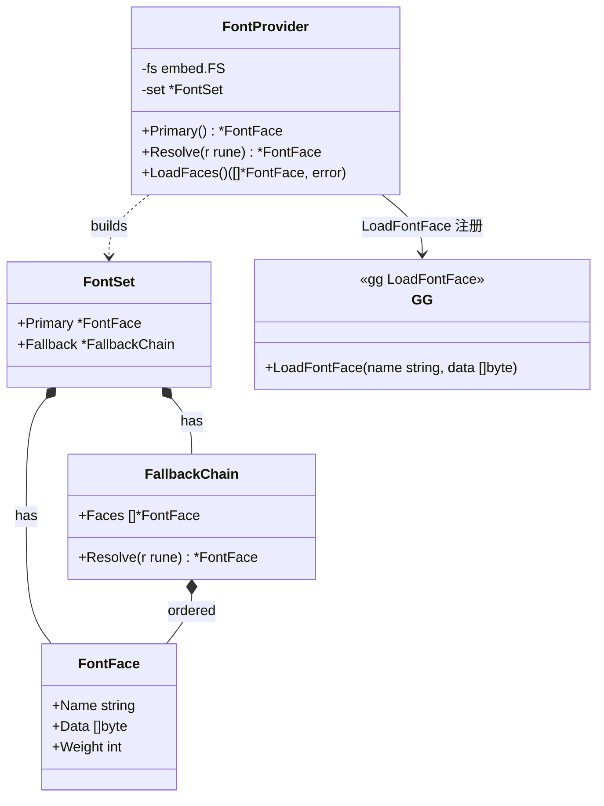
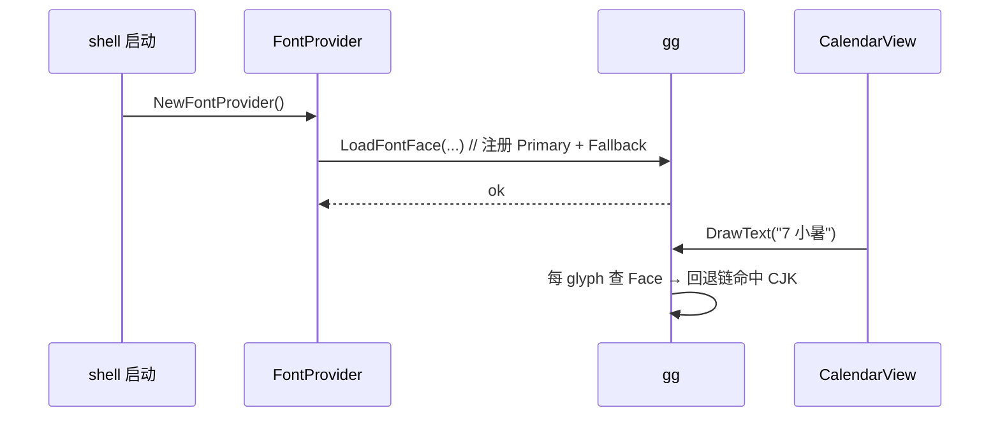
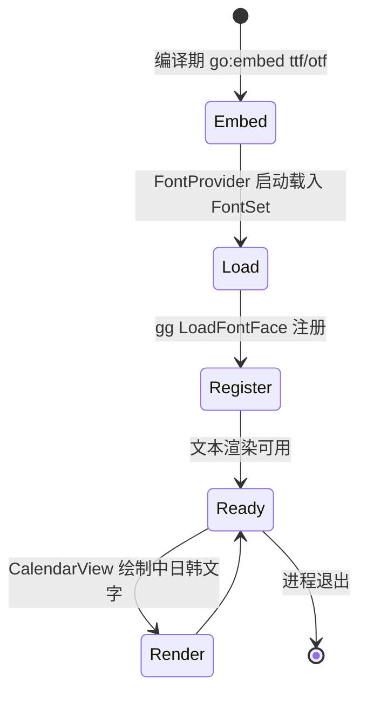

# Font — 字体嵌入与渲染对接

> 模块：`40-Theme` ｜ 文件：`Font.md` ｜ 范围：**Post-MVP（v1.3，图标字体路线图）**
> 最后更新：2026-07-07

本文定义 DeskCalendar 的**字体资源策略**：以 `go:embed` 嵌入 `ttf/otf` 字体，覆盖中日韩（CJK）字形，定义字体回退（fallback）链，并与 `github.com/gogpu/gg` 的文本渲染对接（经 `gg.LoadFontFace` 注册）。字体嵌入属 **Post-MVP（v1.3）**——MVP 阶段复用系统字体即可满足日历基础显示；v1.3「图标字体」路线图要求自带字体以保证跨机器观感一致。

---

## 1. 📦 package 设计

- **包名**：`theme`（同包文件 `font.go`）
- **所在目录**：`internal/theme/`
- **职责一句话**：以 `go:embed` 固化字体二进制，构建「带 CJK 覆盖 + 回退链」的字体族描述，经 `gg.LoadFontFace` 提供给 gg 文本渲染使用。
- **依赖方向**：
  - 依赖：`go:embed`、`golang.org/x/image/font`（纯 Go 字体解析，零 CGO）、`github.com/gogpu/gg`（`LoadFontFace` 注册）、`internal/theme`、`internal/infra/log`。
  - 被依赖：`internal/ui`（文本渲染绑定字体族）、gg（字体加载）。
- **对外公开符号**：
  - 类型：`FontSet`、`FontFace`、`FontProvider`、`FallbackChain`
  - 函数：`NewFontProvider() *FontProvider`、`(p) Primary() *FontFace`、`(p) Resolve(rune) *FontFace`、`(p) LoadFaces() ([]*FontFace, error)`
  - 变量：`//go:embed embedded/fonts/*.ttf` 的 `fontFS embed.FS`
- **边界**：
  - 归它管：字体嵌入、CJK 覆盖判定、回退链、向 gg 注册字体面（经 `gg.LoadFontFace`）。
  - 不归它管：具体文字绘制坐标/排版（→ `internal/ui`）、主题颜色（→ `Theme.md`）。

---

## 2. 📐 UML 类图



---

## 3. 🔄 数据流图

```mermaid
flowchart TB
    subgraph EMB["编译期固化"]
        FS["fontFS embed.FS\nembedded/fonts/deskcalendar.ttf\nnoto-cjk.otf"]
    end
    subgraph FP["FontProvider"]
        LD["启动时载入 FontSet"]
        RB["Resolve(rune) 按字形选回退"]
    end
    subgraph UI["gg"]
        RG["LoadFontFace 注册"]
        TX["文本渲染（日历数字/农历汉字）"]
    end

    FS -->|[]byte| LD
    LD --> RB
    FP -->|name,data| RG
    RG --> TX
    TX -->|缺字形| RB
    RB -->|候选 Face| TX
```

- **数据源**：编译期 `go:embed`（离线、零 CGO）。
- **汇点**：gg 的 `LoadFontFace`；渲染时按 `rune` 走回退链。
- 无网络、无持久化。

---

## 4. 🎨 UI 原型图（ASCII）

日历单元格内文字渲染示意（数字 + 农历汉字需 CJK 覆盖）：

```
┌─────────┐
│ 7 周二  │  ← 数字用 Primary（西文等宽）
│ 小暑    │  ← 农历汉字走 CJK 回退（noto-cjk.otf）
└─────────┘
   字体回退链:
   渲染 '小' → Primary 无此 glyph
            → FallbackChain.Resolve('小')
            → noto-cjk.otf 命中 → 用该 Face 绘制
```

---

## 5. 🗂 数据库设计

**N/A。** 字体为编译期嵌入二进制资源，无数据库表。

---

## 6. 📡 Event / Signal 流程

字体在启动时一次性经 gg `LoadFontFace` 注册，运行期一般不随主题变化（除非 v1.3 引入「等宽/圆体」等字体档切换，届时复用 `Theme.md` 的 Scheme/Override 通道）。



- **emit / subscribe**：本模块无独立 Signal；属一次性初始化副作用。

---

## 7. 🔌 Plugin API

**N/A。** 字体为渲染内部资源，MVP/v1.3 均不对插件开放字体注册。若未来插件需自定义字形，在 `80-Plugin` 通过字体包注册扩展，复用 `FontProvider` 的 gg 字体加载；本文件不预留钩子。

---

## 8. 🧩 Feature 生命周期



- 注册一次，常驻；无运行期显隐/销毁副作用。

---

## 9. 📖 Go 接口定义

以下为可编译风格签名（节选自 `internal/theme/font.go`）：

```go
package theme

import (
	"embed"
)

// FontFace 单款字体的描述（名称 + 原始字节 + 字重）。
type FontFace struct {
	Name   string
	Data   []byte
	Weight int
}

// FallbackChain 回退链：主字体缺字形时按序尝试。
type FallbackChain struct {
	Faces []*FontFace
}

// Resolve 返回能覆盖该 rune 的第一个 Face；都缺则返回最后一个（静默降级）。
func (c *FallbackChain) Resolve(r rune) *FontFace {
	for _, f := range c.Faces {
		if glyphAvailable(f.Data, r) {
			return f
		}
	}
	if len(c.Faces) == 0 {
		return nil
	}
	return c.Faces[len(c.Faces)-1]
}

// FontSet 字体族：主字体 + 回退链（含 CJK）。
type FontSet struct {
	Primary  *FontFace
	Fallback *FallbackChain
}

// gg 经 LoadFontFace 注册字体（gg 纯 Go CPU 光栅化，零 CGO）。
// 本项目用 golang.org/x/image/font 解析字形覆盖后交给 gg 渲染。

// FontProvider 管理嵌入字体并经 gg 注册。
type FontProvider struct {
	fs  embed.FS
	set *FontSet
}

//go:embed embedded/fonts/*.ttf embedded/fonts/*.otf
var fontFS embed.FS

// NewFontProvider 载入嵌入字体构建 FontSet。
func NewFontProvider() (*FontProvider, error) {
	set, err := loadFontSet(fontFS)
	if err != nil {
		return nil, err
	}
	return &FontProvider{fs: fontFS, set: set}, nil
}

// Primary 返回主字体（西文/数字）。
func (p *FontProvider) Primary() *FontFace { return p.set.Primary }

// Resolve 按字形返回应使用的 Face（走回退链）。
func (p *FontProvider) Resolve(r rune) *FontFace { return p.set.Fallback.Resolve(r) }

// LoadFaces 将主字体与回退链经 gg.LoadFontFace 注册，供文本渲染调用。
func (p *FontProvider) LoadFaces() ([]*FontFace, error) {
	if err := gg.LoadFontFace(p.set.Primary.Name, p.set.Primary.Data); err != nil {
		return nil, err
	}
	for _, f := range p.set.Fallback.Faces {
		if err := gg.LoadFontFace(f.Name, f.Data); err != nil {
			return nil, err
		}
	}
	return append([]*FontFace{p.set.Primary}, p.set.Fallback.Faces...), nil
}
```

> 说明：`glyphAvailable` 为纯 Go 字形覆盖查询（基于 `golang.org/x/image/font` 解析 cmap），零 CGO；CJK 覆盖由 `noto-cjk.otf` 等字体保证。

---

## 10. 🚀 Milestone 任务拆分

| 版本 | 任务 | 验收标准 |
|------|------|----------|
| **v1.0（MVP · 不实现）** | 复用系统字体显示日历（不嵌入） | 数字/汉字正常显示即可，不要求跨机一致 |
| **v1.3（Post-MVP）** | 选并嵌入一款等宽西文字体 + 一款 CJK 字体（ttf/otf） | 资源经 `go:embed` 固化，零 CGO |
| **v1.3（Post-MVP）** | 实现 `FallbackChain.Resolve` 字形覆盖判定 | 农历汉字/数字均命中，无豆腐块 |
| **v1.3（Post-MVP）** | `gg.LoadFontFace` 注册 | `CalendarView` 文本渲染走嵌入字体，观感一致 |
| **v1.3（Post-MVP 可选）** | 字体档切换（随 Scheme 换圆体/等宽） | 复用 Theme Override 通道热切换 |

> 标注：字体嵌入为 **Post-MVP（v1.3）**；MVP 复用系统字体，不实现本模块。
