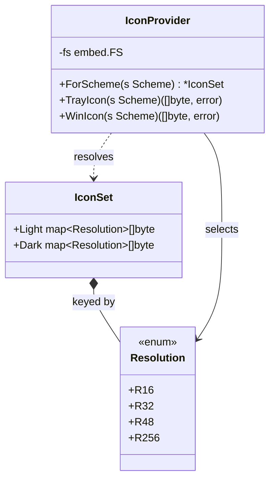
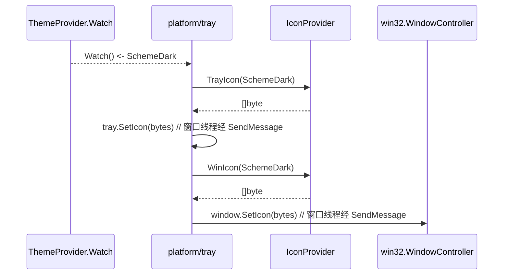
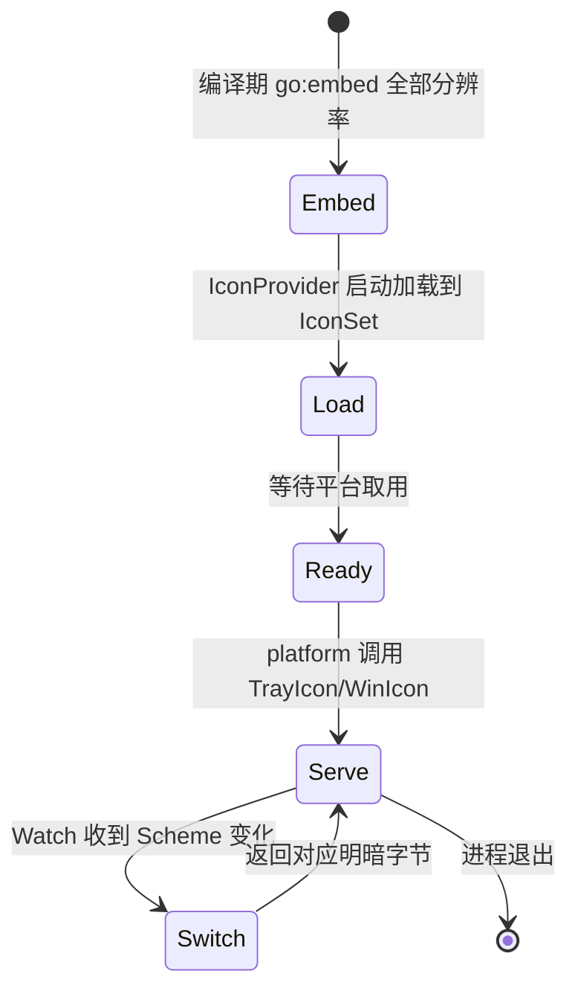

# Icon — 托盘/窗口图标嵌入与明暗切换

> 模块：`40-Theme` ｜ 文件：`Icon.md` ｜ 范围：**MVP（v1.0）**
> 最后更新：2026-07-07

本文定义 DeskCalendar 的**图标资源策略**：以 `go:embed` 嵌入多分辨率图标（16/32/48/256），支持 `base64` 常量或 `embed.FS` 两种固化方式，并按系统浅/深主题切换托盘/窗口图标。托盘图标是 MVP 必需（无图标则托盘无入口），故本文件属 **MVP（v1.0）**。

---

## 1. 📦 package 设计

- **包名**：`theme`（同包文件 `icon.go`）
- **所在目录**：`internal/theme/`
- **职责一句话**：提供多分辨率图标资源与按 Scheme 解析「应使用的图标集」的能力，供 `platform`（托盘/窗口）取用，屏蔽资源来源（embed / base64 / 文件）。
- **依赖方向**：
  - 依赖：`go:embed`、`image`、`internal/theme`（`Scheme`）、`internal/infra/log`。
  - 被依赖：`internal/platform`（tray 设置托盘图标、window 设置任务栏图标）。
- **对外公开符号**：
  - 类型：`IconSet`、`IconProvider`、`Resolution`
  - 函数：`NewIconProvider() *IconProvider`、`(p) ForScheme(s Scheme) *IconSet`、`(p) TrayIcon(s Scheme) ([]byte, error)`、`(p) WinIcon(s Scheme) ([]byte, error)`
  - 常量/变量：`//go:embed embedded/icons/*` 的 `iconFS embed.FS`；可选 `base64` 常量 `Icon16LightB64` 等
- **边界**：
  - 归它管：图标资源嵌入、分辨率选择、明暗图标切换。
  - 不归它管：把图标真正设置到 Win32 窗口（→ `platform`）、主题颜色（→ `Theme.md`）、字体（→ `Font.md`）。

---

## 2. 📐 UML 类图



> 说明：`IconSet` 同时持有 Light/Dark 两套字节，避免运行时反复查 FS；`IconProvider` 按 `Scheme` 选边。

---

## 3. 🔄 数据流图

```mermaid
flowchart TB
    subgraph EMB["编译期固化"]
        FS["iconFS embed.FS\nembedded/icons/light_16.png ...\ndark_256.png"]
        B64["可选 base64 常量\nIcon16LightB64 ..."]
    end
    subgraph IP["IconProvider"]
        LD["启动时加载到 IconSet"]
        SEL["ForScheme(scheme)"]
    end
    subgraph PL["platform"]
        TR["tray.SetIcon(bytes)"]
        WN["window.SetIcon(bytes)"]
    end

    FS -->|[]byte| LD
    B64 -.->|解码| LD
    LD --> SEL
    SEL -->|Light/Dark bytes| TR
    SEL -->|Light/Dark bytes| WN
```

- **数据源**：编译期 `go:embed`（离线、零 CGO），`base64` 常量作为可选冗余（便于极小图标内联）。
- **汇点**：`platform` 的 `tray` / `window`，仅在主线程设置图标（符合 `01-总体架构.md` §3）。
- 无网络、无持久化。

---

## 4. 🎨 UI 原型图（ASCII）

托盘区图标在不同系统主题下的呈现：

```
系统浅色:                    系统深色:
  [🕘 tray area]               [🕘 tray area]
     │                            │
   DeskCalendar 图标            DeskCalendar 图标
   (浅底深图形·16px)           (深底浅图形·16px)
        │                            │
   任务栏/弹窗左上角            任务栏/弹窗左上角
   同款 32/48px              同款 32/48px（自动按 DPI）

   多分辨率供给:
   16px  → 托盘通知区
   32px  → 小任务栏
   48px  → 中任务栏
   256px → 弹窗标题/About/高分屏
```

---

## 5. 🗂 数据库设计

**N/A。** 图标为编译期嵌入的二进制资源，无任何数据库表。

---

## 6. 📡 Event / Signal 流程

图标随系统浅/深切换而更换，复用 `Theme.md` 的 `ThemeProvider.Watch` 通道（同一 Scheme 事件驱动图标与配色同步切换）。



- **emit**：`ThemeProvider.Watch`（系统方案变化）。
- **subscribe**：`platform` 在 `app.Run` 主循环消费，切换图标。
- **副作用**：仅图标字节替换，无重绘整窗（图标由系统托盘/窗口管理）。

---

## 7. 🔌 Plugin API

**N/A。** 图标资源为平台内部实现，MVP 不向插件开放（插件体系本身 v1.4 才引入）。未来若支持插件自定义图标，在 `80-Plugin` 定义，复用 `IconProvider` 接口；本文件不预留。

---

## 8. 🧩 Feature 生命周期



- 资源常驻内存 `IconSet`，无显隐/销毁副作用（图标由平台设置，退出随进程释放）。

---

## 9. 📖 Go 接口定义

以下为可编译风格签名（节选自 `internal/theme/icon.go`）：

```go
package theme

import (
	"embed"
	"encoding/base64"
)

// Resolution 图标分辨率档位。
type Resolution int

const (
	R16 Resolution = iota
	R32
	R48
	R256
)

// IconSet 持有某主题下各分辨率的 PNG 字节。
type IconSet struct {
	Light map[Resolution][]byte
	Dark  map[Resolution][]byte
}

// IconProvider 按 Scheme 提供图标字节，屏蔽资源来源。
type IconProvider struct {
	fs  embed.FS
	set *IconSet
}

//go:embed embedded/icons/*.png
var iconFS embed.FS

// 可选：极小图标内联为 base64 常量（冗余容灾，非必需）。
const Icon16LightB64 = "iVBORw0KGgoAAAANSUhEUgAAAAEAAAABCAQAAAC1HAwCAAAAC0lEQVR42mNk+M8AAAMBAQDJ/pLvAAAAAElFTkSuQmCC"

// NewIconProvider 加载 embed 资源到内存 IconSet。
func NewIconProvider() (*IconProvider, error) {
	set, err := loadIconSet(iconFS)
	if err != nil {
		return nil, err
	}
	return &IconProvider{fs: iconFS, set: set}, nil
}

// ForScheme 返回对应明暗的图标集（供扩展使用）。
func (p *IconProvider) ForScheme(s Scheme) *IconSet {
	if s == SchemeDark {
		return p.set
	}
	return p.set
}

// TrayIcon 返回托盘通知区图标字节（默认 16px，按 Scheme 选明暗）。
func (p *IconProvider) TrayIcon(s Scheme) ([]byte, error) {
	res := R16
	if s == SchemeDark {
		return p.set.Dark[res], nil
	}
	return p.set.Light[res], nil
}

// WinIcon 返回窗口/任务栏图标字节（默认 48px，高分屏由 platform 选 256）。
func (p *IconProvider) WinIcon(s Scheme, res Resolution) ([]byte, error) {
	if s == SchemeDark {
		return p.set.Dark[res], nil
	}
	return p.set.Light[res], nil
}

// 容灾示例：base64 常量解码（当 embed 缺失时）。
func fallbackIcon16Light() ([]byte, error) {
	return base64.StdEncoding.DecodeString(Icon16LightB64)
}
```

> 图标 PNG 经 `image/png` 解码或直接以原始字节交给 `gogpu/systray` 与窗口 API（零 CGO）。

---

## 10. 🚀 Milestone 任务拆分

| 版本 | 任务 | 验收标准 |
|------|------|----------|
| **v1.0（MVP · 待实现）** | 准备 16/32/48/256 四档 PNG（Light/Dark 各一套） | 资源存在于 `embedded/icons/`，透明通道正确 |
| **v1.0（MVP · 待实现）** | `go:embed` 固化 + `loadIconSet` 加载 | `CGO_ENABLED=0` 编译通过；启动加载无错误 |
| **v1.0（MVP · 待实现）** | `IconProvider.TrayIcon/WinIcon` 按 Scheme 返回 | 系统切换浅/深，托盘图标同步更换 |
| **v1.0（MVP · 待实现）** | `platform` 在 `app.Run` 主循环设置图标（窗口线程经 `SendMessage` 执行） | 托盘可见且点击弹出面板；不跨线程设图标 |
| **v1.3（Post-MVP 可选）** | 可选 base64 内联容灾 | embed 缺失时回退常量图标，不崩溃 |

> 标注：图标嵌入与明暗切换为 **MVP（v1.0）**（托盘入口必需）。
