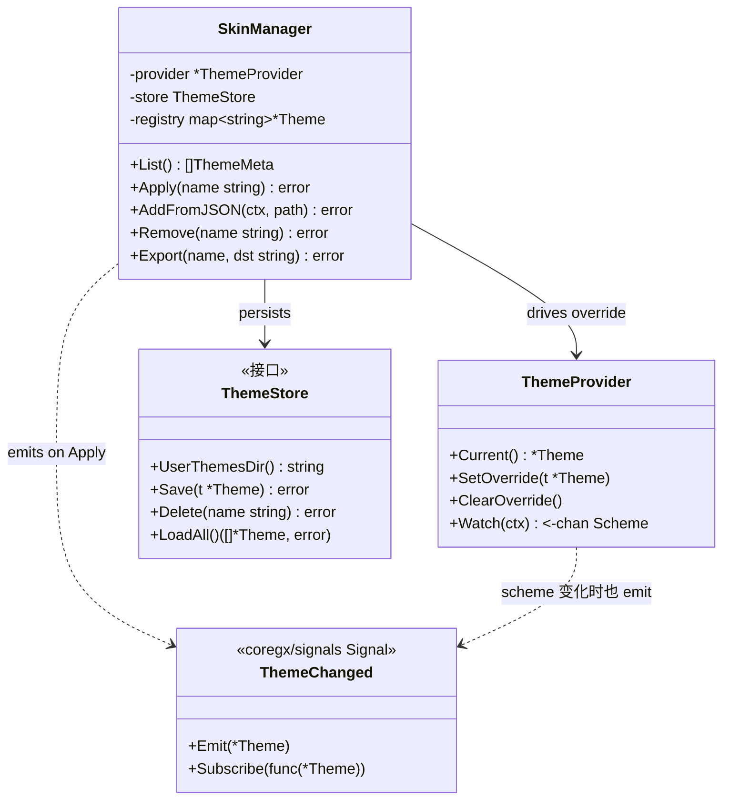
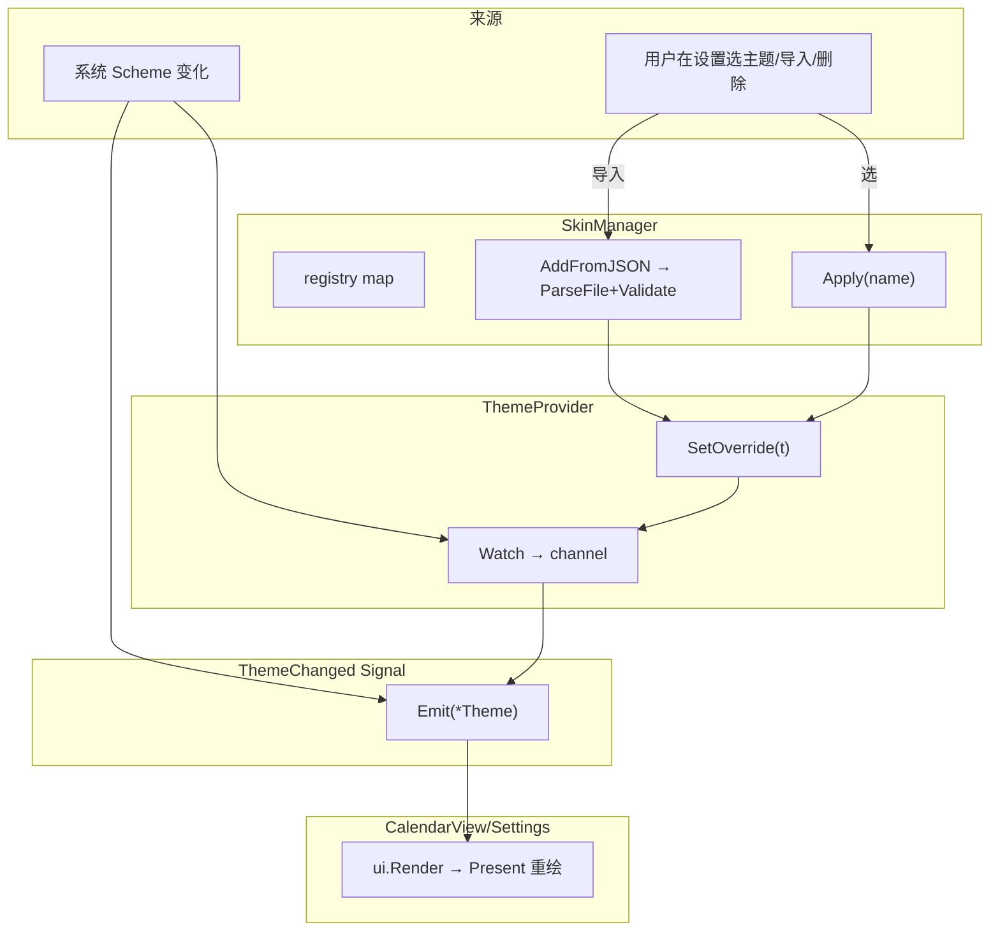
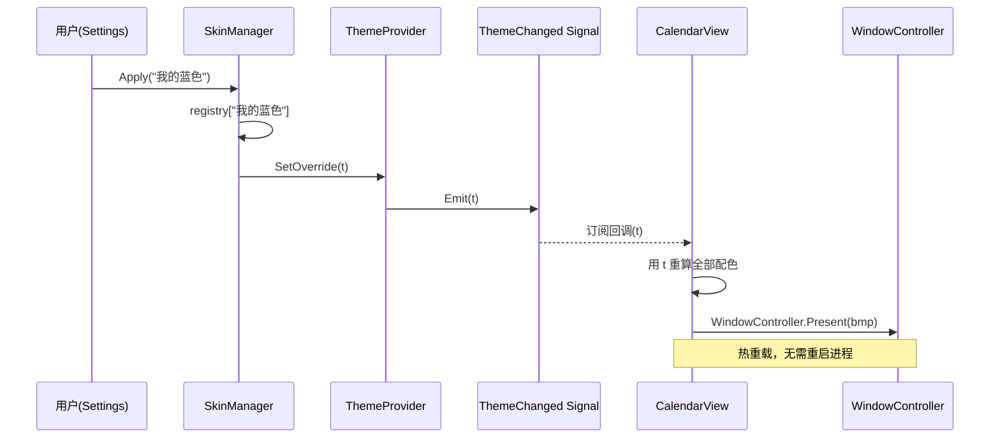
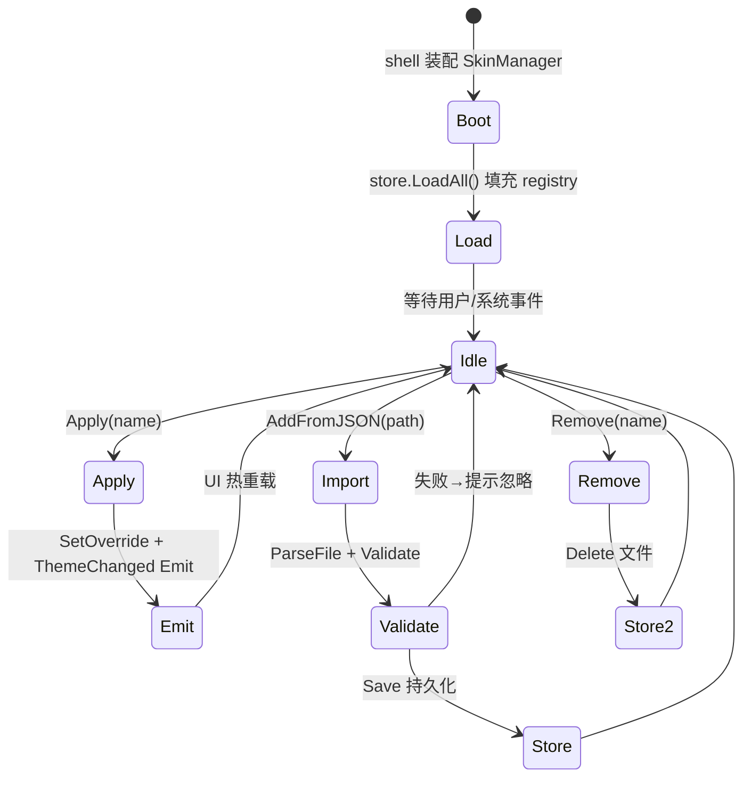

# Skin — 运行时换肤（用户主题管理）

> 模块：`40-Theme` ｜ 文件：`Skin.md` ｜ 范围：**Post-MVP（v1.3）** ⚠️
> 最后更新：2026-07-07

本文定义 DeskCalendar 的**换肤能力（Skin）**：运行时切换 `Theme`（热重载 Signal 通知 UI 重绘）、用户主题管理（增删 / 导入导出），并与 `Theme.md` / `ThemeJson.md` 协作。换肤**不属于 MVP**，属 **Post-MVP（v1.3）**，路线图见 `00-项目介绍.md`。

---

## 1. 📦 package 设计

- **包名**：`theme`（同包文件 `skin.go`）
- **所在目录**：`internal/theme/`
- **职责一句话**：在 `ThemeProvider` 之上提供「用户主题注册表 + 运行时热切换 + 导入导出」的换肤管理层，是 `Theme` 与 `ThemeJson` 能力的编排者（orchestrator）。
- **依赖方向**：
  - 依赖：`internal/theme`（`ThemeProvider` / `Theme` / `ParseFile` / `Validate`）、`internal/infra/fs`（用户主题目录）、`internal/infra/config`、`internal/infra/log`。
  - 被依赖：`internal/shell`（启动时装配 `SkinManager`）、`internal/ui/settings`（换肤 UI 调用）。
- **对外公开符号**：
  - 类型：`SkinManager`、`ThemeRegistry`、`SkinEvent`
  - 函数：`NewSkinManager(provider *ThemeProvider, fs ThemeStore) *SkinManager`、`List() []ThemeMeta`、`Apply(name string) error`、`AddFromJSON(ctx, path) error`、`Remove(name) error`、`Export(name, dst) error`
  - Signal：`ThemeChanged`（`coregx/signals` Signal，承载 `*Theme`）
- **边界**：
  - 归它管：用户主题增删、运行时切换、导入导出、热重载通知。
  - 不归它管：主题数据结构与系统探测（→ `Theme.md`）、JSON schema 与校验（→ `ThemeJson.md`）、图标/字体（→ `Icon.md` / `Font.md`）、UI 面板绘制（→ `internal/ui`）。

---

## 2. 📐 UML 类图



---

## 3. 🔄 数据流图



- **数据源**：系统 Scheme（离线）、用户文件（磁盘 JSON）。
- **汇点**：`ThemeChanged` Signal → UI 重绘。
- 用户主题持久化到 `AppData` 目录（经 `ThemeStore`），非数据库。

---

## 4. 🎨 UI 原型图（ASCII）

设置面板「外观 / 换肤」交互：

```
┌─ 设置 / 外观 / 皮肤 ──────────────────────┐
│ 模式： [跟随系统] [浅色] [深色] [自定义●]  │
│ 已安装皮肤：                               │
│   ◉ 我的蓝色      [应用] [导出] [删除]     │
│   ○ 复古绿        [应用] [导出] [删除]     │
│   ○ 暗夜紫        [应用] [导出] [删除]     │
│ [+ 导入 JSON…]                             │
│                                            │
│ 预览（实时）：                              │
│ ┌──────────────┐  ← 圆角/阴影/透明即时变  │
│ │ 2026年7月 蓝 │                          │
│ │ [今] 小暑 红 │  ← 热重载，无需重启      │
│ └──────────────┘                          │
└────────────────────────────────────────────┘
```

---

## 5. 🗂 数据库设计

**N/A。** 用户主题以 **JSON 文件**存于 `%AppData%/DeskCalendar/themes/`，元数据索引（已安装列表、当前选中）存于 `config.json`，均非 SQLite。仅 `60-Todo` 使用数据库。

---

## 6. 📡 Event / Signal 流程

`SkinManager.Apply` 与系统 Scheme 变化共用 `ThemeChanged` Signal（coregx/signals 响应式原语），UI 订阅后热重载重绘。



- **emit**：`SkinManager.Apply`（用户切换）、`ThemeProvider.Watch`（系统变化）。
- **subscribe**：`internal/ui` 各视图。
- **副作用**：重算配色 + `WindowController.Present`（事件驱动重渲，非逐帧 `RequestRedraw`）。

---

## 7. 🔌 Plugin API

**N/A（v1.3 仍不向插件开放写权限）。** 换肤管理为应用内能力；插件体系（v1.4）若需统一配色，可只读订阅 `ThemeChanged` Signal，但不在本文件定义写钩子，避免提前锁定。具体在 `80-Plugin` 协同。

---

## 8. 🧩 Feature 生命周期



- 用户主题进程退出不丢失（已落 `AppData`）。
- 导入失败不致命，仅不加入 registry。

---

## 9. 📖 Go 接口定义

以下为可编译风格签名（节选自 `internal/theme/skin.go`），复用 `Theme.md` 的 `ThemeProvider` 与 `ThemeJson.md` 的 `ParseFile`：

```go
package theme

import (
	"context"

	"github.com/shaolei/DeskCalendar/internal/infra/fs" // 提供用户主题目录访问
)

// ThemeMeta 列表项元数据（不含完整配色，减轻列表负载）。
type ThemeMeta struct {
	Name    string
	Builtin bool
	Scheme  Scheme
}

// ThemeStore 用户主题持久化接口（便于测试替换为内存实现）。
type ThemeStore interface {
	UserThemesDir() string
	Save(t *Theme) error
	Delete(name string) error
	LoadAll() ([]*Theme, error)
}

// SkinManager 换肤编排层，建立在 ThemeProvider 之上。
type SkinManager struct {
	provider *ThemeProvider
	store    ThemeStore
	registry map[string]*Theme
}

// NewSkinManager 用 Provider 与持久化创建管理器并预载用户主题。
func NewSkinManager(provider *ThemeProvider, store ThemeStore) (*SkinManager, error) {
	all, err := store.LoadAll()
	if err != nil {
		return nil, err
	}
	reg := make(map[string]*Theme, len(all))
	for _, t := range all {
		reg[t.Name] = t
	}
	return &SkinManager{provider: provider, store: store, registry: reg}, nil
}

// List 返回已安装主题元数据（含内置与用户）。
func (m *SkinManager) List() []ThemeMeta

// Apply 运行时切换主题：写入 Provider override 并触发 ThemeChanged 热重载。
func (m *SkinManager) Apply(name string) error {
	t, ok := m.registry[name]
	if !ok {
		return fmt.Errorf("skin: theme %q not found", name)
	}
	m.provider.SetOverride(t) // 见 Theme.md
	ThemeChanged.Emit(t)       // coregx/signals Signal
	return nil
}

// AddFromJSON 从用户 JSON 导入：解析 + 校验 + 持久化。
func (m *SkinManager) AddFromJSON(ctx context.Context, path string) error {
	t, err := ParseFile(ctx, path) // 见 ThemeJson.md
	if err != nil {
		return err
	}
	if err := m.store.Save(t); err != nil {
		return err
	}
	m.registry[t.Name] = t
	return nil
}

// Remove 删除用户主题（内置主题不可删）。
func (m *SkinManager) Remove(name string) error {
	t, ok := m.registry[name]
	if !ok {
		return fmt.Errorf("skin: theme %q not found", name)
	}
	if t.Builtin {
		return fmt.Errorf("skin: builtin theme %q cannot be removed", name)
	}
	if err := m.store.Delete(name); err != nil {
		return err
	}
	delete(m.registry, name)
	// 若当前正应用该主题，回退系统跟随
	if cur := m.provider.Current(); cur != nil && cur.Name == name {
		m.provider.ClearOverride()
		ThemeChanged.Emit(m.provider.Current())
	}
	return nil
}

// Export 将某主题导出为 JSON 文件（供分享）。
func (m *SkinManager) Export(name, dst string) error {
	t, ok := m.registry[name]
	if !ok {
		return fmt.Errorf("skin: theme %q not found", name)
	}
	data, err := json.MarshalIndent(themeToFile(t), "", "  ")
	if err != nil {
		return err
	}
	return os.WriteFile(dst, data, 0o644)
}

// ThemeChanged 是 coregx/signals 响应式 Signal，承载新生效的 *Theme。
// UI 视图 Subscribe 后在回调里重算配色并经 WindowController.Present 重渲。
var ThemeChanged = signals.New[*Theme]()
```

---

## 10. 🚀 Milestone 任务拆分

| 版本 | 任务 | 验收标准 |
|------|------|----------|
| **v1.0（MVP · 不实现）** | 换肤能力不排期 | 仅 2 套内置主题 + 跟随系统，无用户管理 |
| **v1.3（Post-MVP）** | 定义 `SkinManager` / `ThemeStore` 接口 | 接口可编译；与 `ThemeProvider` 解耦 |
| **v1.3（Post-MVP）** | 实现 `Apply` 热重载（SetOverride + ThemeChanged Emit） | 切换主题后面板实时重绘，无需重启 |
| **v1.3（Post-MVP）** | 实现 `AddFromJSON`（导入 + 校验 + 持久化） | 坏 JSON 被拒；成功主题出现在列表 |
| **v1.3（Post-MVP）** | 实现 `Remove` / `Export` | 可删用户主题（内置不可删）；可导出合法 JSON |
| **v1.3（Post-MVP）** | Settings 换肤 UI 接入 | 列表/应用/导入/导出在设置面板可用 |

> 标注：本文件全部内容属 **Post-MVP（v1.3）**。⚠️ MVP 不实现任何换肤逻辑。
