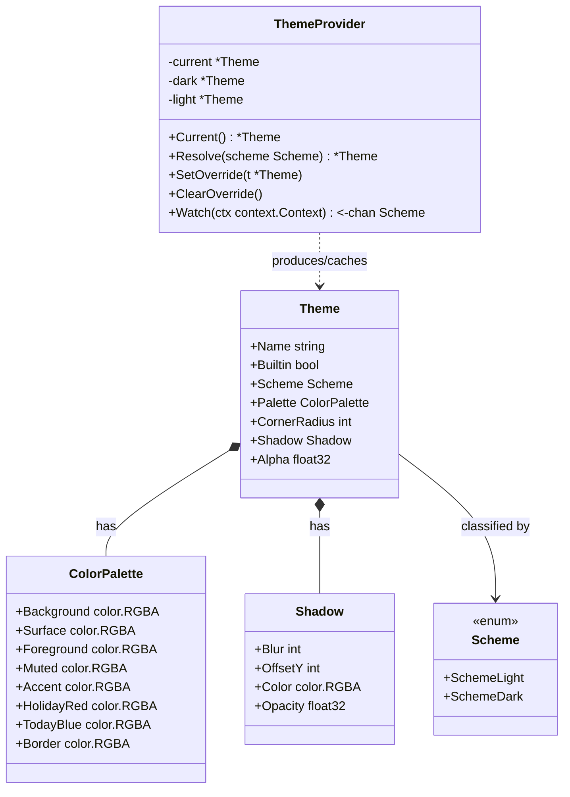
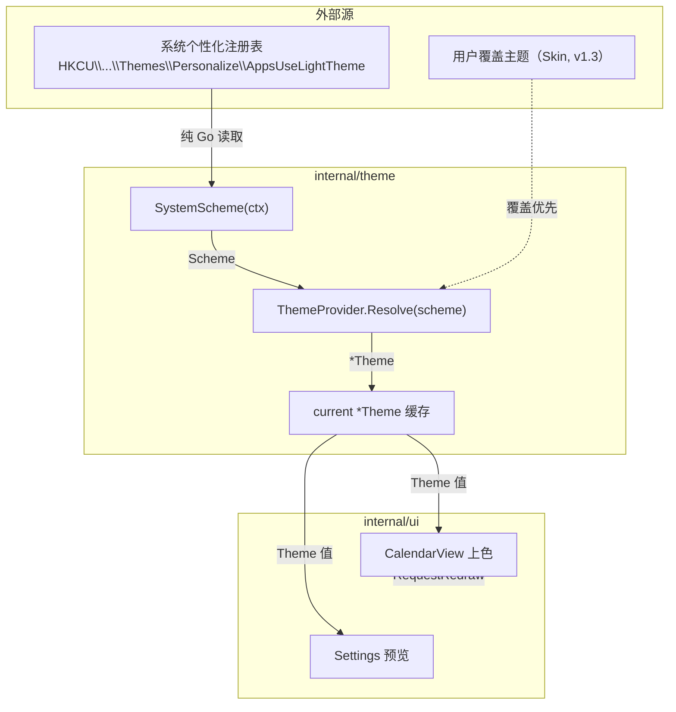
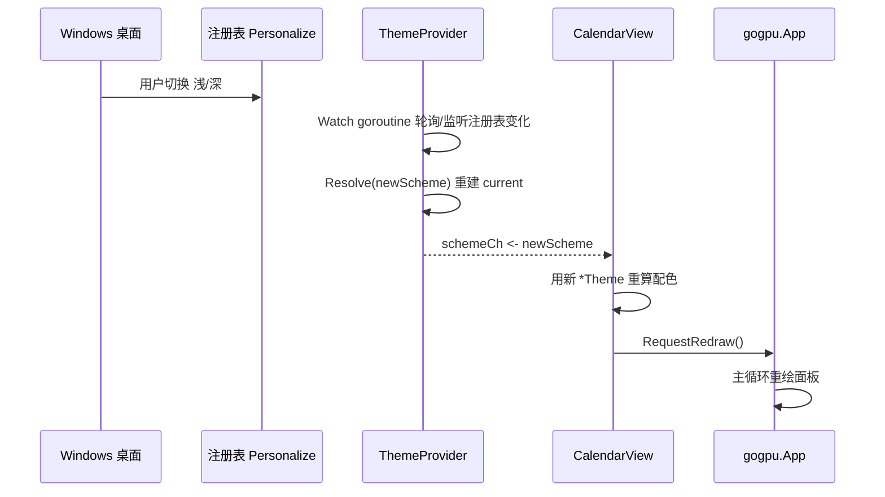
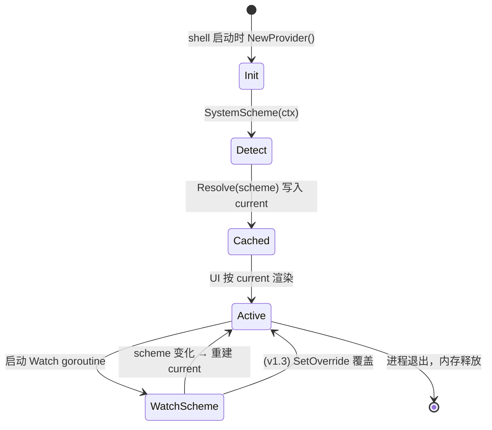

# Theme — 主题模型与 ThemeProvider

> 模块：`40-Theme` ｜ 文件：`Theme.md` ｜ 范围：**MVP（v1.0）基础主题**
> 最后更新：2026-07-07

本文定义 DeskCalendar 的**主题模型（Theme Model）**：颜色（背景 / 前景 / 强调 / 节假日红 / 今日蓝）、圆角半径、阴影、透明度，以及基础主题（跟随系统浅 / 深，2 套内置）。基础主题属于 **MVP（v1.0）**；运行时换肤（Skin）属 Post-MVP（v1.3），见 `Skin.md`。

---

## 1. 📦 package 设计

- **包名**：`theme`
- **所在目录**：`internal/theme/`（同包内文件：`theme.go` / `themejson.go` / `icon.go` / `font.go` / `skin.go`）
- **职责一句话**：定义主题数据结构与「当前主题」解析/供给，使 UI 渲染只依赖 `Theme` 值对象，不直接耦合系统取色或配置文件。
- **依赖方向**：
  - 依赖：`image/color`、`golang.org/x/sys/windows`（纯 Go，读取系统个性化注册表，零 CGO）、`internal/infra/log`。
  - 被依赖：`internal/ui`（CalendarView / Settings 等读取 `Theme` 上色）、`internal/shell`（启动时装配 Provider）、`internal/theme` 内 `themejson` / `skin`（加载自定义主题后注入 Provider）。
- **对外公开符号**：
  - 类型：`Theme`、`ColorPalette`、`Shadow`、`Scheme`、`ThemeProvider`、`ProviderOption`
  - 函数：`NewProvider(opts ...ProviderOption) *ThemeProvider`、`SystemScheme(ctx) (Scheme, error)`
  - 常量：`SchemeLight` / `SchemeDark`、`BuiltinLight` / `BuiltinDark` 主题名
- **边界**：
  - 归它管：主题数据结构、系统浅/深探测、当前主题解析与缓存、默认 2 套内置主题。
  - 不归它管：JSON 文件读写与校验（→ `ThemeJson.md`）、图标/字体资源（→ `Icon.md` / `Font.md`）、用户主题增删导入导出（→ `Skin.md`）、UI 具体绘制（→ `internal/ui`）。

---

## 2. 📐 UML 类图



> 说明：`ColorPalette` 除规格要求的「背景 / 前景 / 强调 / 节假日红 / 今日蓝」外，补充 `Surface`（卡片底色）、`Muted`（次要文字）、`Border`（网格线）三项，均为日历网格渲染所必需，且均为可扩展字段。

---

## 3. 🔄 数据流图



- **数据源**：系统注册表（离线、零 CGO）、用户覆盖（Post-MVP）。
- **汇点**：UI 视图按 `Theme` 上色后调用 `gogpuApp.RequestRedraw()` 触发重绘。
- 无网络、无持久化写；当前主题仅内存缓存。

---

## 4. 🎨 UI 原型图（ASCII）

基础主题下日历面板观感（明/暗各一套内置），展示关键色角色落点：

```
┌──────────────────────────────┐  ← CornerRadius 圆角 + Shadow 阴影
│  [Accent 强调] 2026年7月     │  ← 标题栏：Accent 文字 / Background
├──────────────────────────────┤
│ 日 一 二 三 四 五 六          │  ← Muted 次要文字（表头）
│             1  2  3           │
│  4  5 [TodayBlue 7] 11       │  ← 今日：TodayBlue 高亮底
│ 12 [HolidayRed 13] 18 19     │  ← 节假日：HolidayRed 红字
│ 20 25 26 27 30 31            │
└──────────────────────────────┘  ← Border 网格线 / Alpha 透明度合成
   Light 主题                 Dark 主题
   Background=#F7F7F7         Background=#202124
   Foreground=#1A1A1A         Foreground=#E8EAED
   Accent=#2D7FF9             Accent=#4C8DFF
```

---

## 5. 🗂 数据库设计

**N/A。** 主题模型为纯内存值对象，当前主题不落 SQLite。基础主题的内置配色以 Go 常量 + `go:embed` 默认 JSON 固化（见 `ThemeJson.md`）；用户所选「跟随系统 / 指定主题」开关存于 `%AppData%/DeskCalendar/config.json`（由 `internal/infra/config` 管理），不在此模块的数据库职责内。本项目仅 `60-Todo` 使用 SQLite。

---

## 6. 📡 Event / Signal 流程

基础主题阶段，**主题变化由系统浅/深切换驱动**（用户手动在 Windows 设置里改主题）。`ThemeProvider` 通过 `Watch` 暴露一个只读 channel，供 UI 订阅并重绘；未来 `Skin` 的热重载 Signal 也复用于同一通道（详见 `Skin.md`）。



- **emit 方**：`ThemeProvider.Watch` 内部 goroutine（基于注册表变化）。
- **subscribe 方**：`internal/ui` 各视图。
- **副作用**：重算配色 + `RequestRedraw()`（非阻塞，避免 busy loop，符合 `01-总体架构.md` §3 铁律）。

---

## 7. 🔌 Plugin API

**N/A（MVP 不向插件暴露主题）。** MVP 阶段 `internal/plugin` 尚未引入（v1.4），且主题属于视觉内部细节，不对插件开放写权限。Post-MVP 可考虑以**只读**方式向插件暴露当前 `Theme`（供插件视图配色统一），届时在 `80-Plugin` 与 `Skin.md` 协同定义；本文件不预留可变钩子，避免锁定决策。

---

## 8. 🧩 Feature 生命周期



- 无显隐态（主题为常驻内存值）；销毁即进程退出，无资源需手动释放。
- `Watch` 的 goroutine 随 `ctx` 取消而退出。

---

## 9. 📖 Go 接口定义

以下签名可直接粘入 `internal/theme/theme.go`，在 `CGO_ENABLED=0`、`Go 1.25+` 下可编译（`image/color`、`golang.org/x/sys/windows` 均为纯 Go）。

```go
package theme

import (
	"context"
	"image/color"

	"golang.org/x/sys/windows" // 纯 Go，零 CGO
)

// Scheme 表示明暗色彩方案（跟随系统或用户指定）。
type Scheme int

const (
	SchemeLight Scheme = iota
	SchemeDark
)

func (s Scheme) String() string {
	if s == SchemeDark {
		return "dark"
	}
	return "light"
}

// ColorPalette 主题调色板。规格要求 5 色 + 3 个渲染必需扩展色。
type ColorPalette struct {
	Background  color.RGBA // 面板背景
	Surface     color.RGBA // 卡片/单元格底色
	Foreground  color.RGBA // 主文字
	Muted       color.RGBA // 次要文字（表头/非本月）
	Accent      color.RGBA // 强调（标题/交互）
	HolidayRed  color.RGBA // 节假日红
	TodayBlue   color.RGBA // 今日蓝
	Border      color.RGBA // 网格线
}

// Shadow 面板阴影参数（对接 ADR-03 DWM 阴影 + 自绘）。
type Shadow struct {
	Blur    int
	OffsetY int
	Color   color.RGBA
	Opacity float32
}

// Theme 是主题聚合根（值对象，不可变语义：切换即整体替换）。
type Theme struct {
	Name        string
	Builtin     bool
	Scheme      Scheme
	Palette     ColorPalette
	CornerRadius int
	Shadow      Shadow
	Alpha       float32 // 面板整体透明度 0..1（每像素 alpha 合成）
}

// ThemeProvider 解析并缓存「当前主题」，是 UI 取色的唯一入口。
type ThemeProvider struct {
	current *Theme
	light   *Theme
	dark    *Theme
	override *Theme
	schemeCh chan Scheme
}

// NewProvider 创建 Provider，内置 Light/Dark 两套主题。
func NewProvider(opts ...ProviderOption) *ThemeProvider

// Current 返回当前生效主题（线程安全读，供 UI 主线程调用）。
func (p *ThemeProvider) Current() *Theme

// Resolve 根据 Scheme 返回对应内置主题；override 非空时优先返回 override。
func (p *ThemeProvider) Resolve(scheme Scheme) *Theme

// SetOverride 设置用户覆盖主题（v1.3 Skin 调用）；传 nil 等同 ClearOverride。
func (p *ThemeProvider) SetOverride(t *Theme)

// ClearOverride 清除覆盖，恢复系统跟随。
func (p *ThemeProvider) ClearOverride()

// Watch 返回一个只读 channel，系统浅/深或 override 变化时推送新 Scheme。
// 调用方需在 ctx 取消时停止接收以释放 goroutine。
func (p *ThemeProvider) Watch(ctx context.Context) <-chan Scheme

// SystemScheme 通过纯 Go 读取 Windows 个性化注册表判断当前系统方案。
// 路径：HKCU\Software\Microsoft\Windows\CurrentVersion\Themes\Personalize\AppsUseLightTheme
// 0 = 深色, 1 = 浅色。失败时回退 SchemeLight（不致命，离线安全）。
func SystemScheme(ctx context.Context) (Scheme, error) {
	k, err := windows.OpenKey(
		windows.CURRENT_USER,
		`Software\Microsoft\Windows\CurrentVersion\Themes\Personalize`,
		windows.QUERY_VALUE,
	)
	if err != nil {
		return SchemeLight, err
	}
	defer k.Close()
	v, _, err := k.GetIntegerValue("AppsUseLightTheme")
	if err != nil {
		return SchemeLight, err
	}
	if v == 0 {
		return SchemeDark, nil
	}
	return SchemeLight, nil
}
```

---

## 10. 🚀 Milestone 任务拆分

| 版本 | 任务 | 验收标准 |
|------|------|----------|
| **v1.0（MVP · 待实现）** | 定义 `Theme` / `ColorPalette` / `Shadow` 结构与 2 套内置 Light/Dark 配色 | 结构可编译；配色经设计评审对齐 360 观感 |
| **v1.0（MVP · 待实现）** | 实现 `SystemScheme`（纯 Go 读注册表，零 CGO） | `CGO_ENABLED=0` 编译通过；浅/深切换识别正确；失败回退 Light 不 panic |
| **v1.0（MVP · 待实现）** | 实现 `ThemeProvider` 解析/缓存/ `Watch` channel | UI 订阅后系统切主题能收到变化并重绘（< 50ms 感知） |
| **v1.0（MVP · 待实现）** | UI 视图按 `Theme` 上色（背景/前景/强调/节假日红/今日蓝/圆角/阴影/透明度） | 面板观感符合 ADR-03 圆角透明 + DWM 阴影 |
| **v1.3（Post-MVP）** | `SetOverride/ClearOverride` 接入 `Skin` 用户主题 | 用户选主题后 `Watch` 推送并热重载（见 `Skin.md`） |
| **v1.3（Post-MVP）** | 主题与 `ThemeJson` 默认文件对齐（go:embed 默认主题） | 内置主题可由 `themejson` 加载校验，结构一致 |

> 标注：**基础主题为 MVP（v1.0）**；`SetOverride` 等换肤相关为 Post-MVP（v1.3）。
