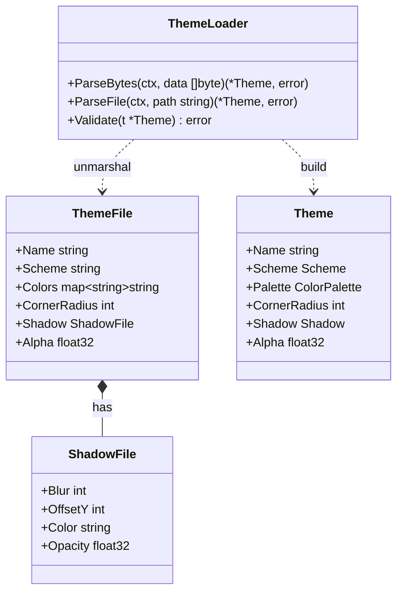
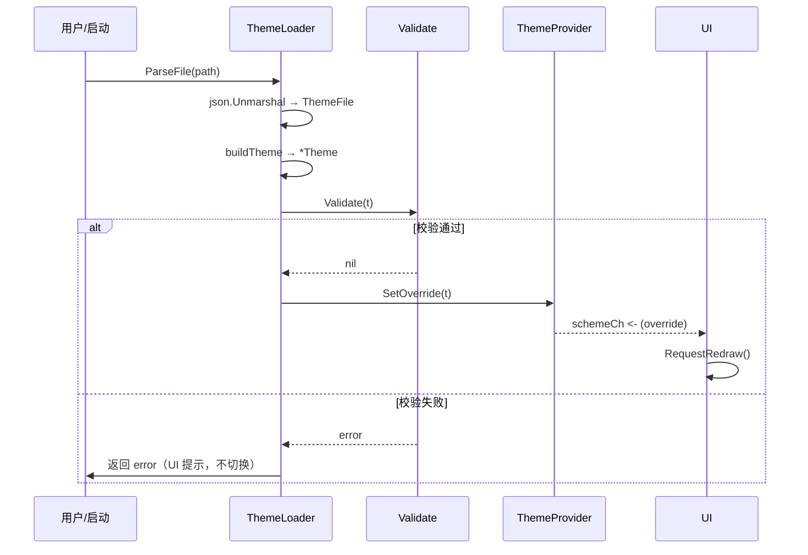
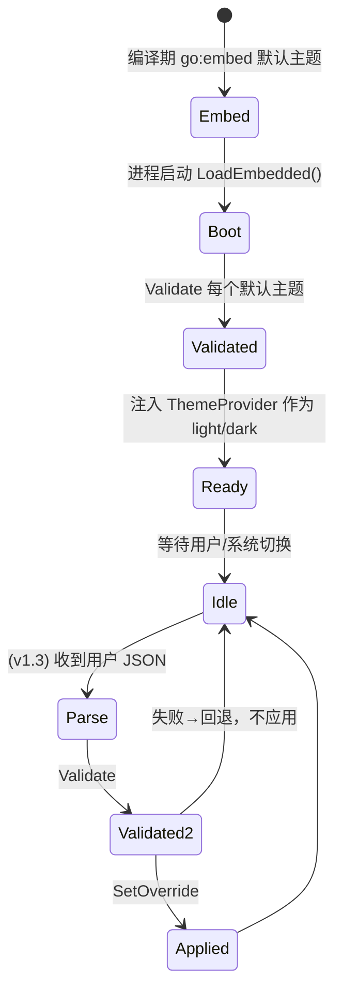

# ThemeJson — JSON 主题格式与加载校验

> 模块：`40-Theme` ｜ 文件：`ThemeJson.md` ｜ 范围：**基础结构 MVP 就绪 / 用户自定义 Post-MVP（v1.3）**
> 最后更新：2026-07-07

本文定义 DeskCalendar 的 **JSON 主题文件 schema（字段定义）**、`go:embed` 默认主题文件的落地方式，以及用户自定义主题的加载与校验流程。内置默认主题在 MVP 即可用（保证离线），用户自定义加载/校验随 `Skin`（v1.3）启用。

---

## 1. 📦 package 设计

- **包名**：`theme`（同包文件 `themejson.go`）
- **所在目录**：`internal/theme/`
- **职责一句话**：将外部 JSON 主题反序列化为 `Theme` 值对象，并提供严格校验（字段类型、色值范围、可解析性），保证「坏主题」不会让 UI 崩塌。
- **依赖方向**：
  - 依赖：`encoding/json`、`go:embed`、`internal/theme`（产出 `Theme`）、`internal/infra/log`。
  - 被依赖：`internal/theme` 的 `Theme`（`NewProvider` 用默认 embed 主题初始化）、`Skin`（v1.3 加载用户文件）。
- **对外公开符号**：
  - 类型：`ThemeFile`（JSON 映射结构）、`LoadResult`、`ValidateOption`
  - 函数：`LoadEmbedded(ctx) ([]*Theme, error)`、`ParseFile(ctx, path string) (*Theme, error)`、`ParseBytes(ctx, data []byte) (*Theme, error)`、`Validate(t *Theme) error`
  - 变量：`//go:embed embedded/themes/*.json` 的 `defaultFS embed.FS`
- **边界**：
  - 归它管：JSON ↔ `Theme` 映射、字段校验、默认主题 embed、用户文件解析。
  - 不归它管：主题模型定义（→ `Theme.md`）、文件存到哪里（→ `internal/infra/fs` 与 `Skin.md` 的用户主题管理）、图标/字体（→ `Icon.md` / `Font.md`）。

---

## 2. 📐 UML 类图



> 说明：`ThemeFile` 是 JSON 的**外部表示**（颜色用 `#RRGGBBAA` 字符串便于手写），`Theme` 是内部**值对象**（用 `color.RGBA`）。`ThemeLoader` 负责双向映射与校验。

---

## 3. 🔄 数据流图

```mermaid
flowchart TB
    subgraph EMB["编译期固化（go:embed）"]
        FS["defaultFS embed.FS\nembedded/themes/light.json\ndark.json"]
    end
    subgraph LOAD["ThemeLoader"]
        PB["ParseBytes"]
        VL["Validate"]
        BK["buildTheme → *Theme"]
    end
    subgraph USER["用户自定义（v1.3）"]
        UF["%AppData%/DeskCalendar/themes/*.json"]
    end
    subgraph OUT["下游"]
        TP["ThemeProvider.SetOverride"]
        UI["UI 上色"]
    end

    FS -->|[]byte| PB
    UF -->|[]byte| PB
    PB -->|ThemeFile| BK
    BK -->|*Theme| VL
    VL -->|ok| TP
    VL -.->|err| LOG["log.Warn + 拒绝加载（回退默认）"]
    TP --> UI
```

- **数据源**：编译期 `go:embed`（离线保证）＋ 用户目录 JSON 文件（v1.3）。
- **汇点**：校验通过的 `*Theme` 注入 `ThemeProvider`。
- 校验失败不下发，回退到当前默认主题，保证「坏文件不致命」。

---

## 4. 🎨 UI 原型图（ASCII）

设置面板中「主题 / 导入」相关交互（导入逻辑由 `Skin.md` 管理，此处聚焦 JSON 校验反馈）：

```
┌─ 设置 / 外观 ──────────────────────────┐
│ 主题模式： [跟随系统●] [浅色] [深色]    │
│ 已安装主题：                             │
│   • 浅色（内置）                        │
│   • 深色（内置）                        │
│   • 我的蓝色（用户·valid）              │
│   • 复古绿（用户·解析失败!）⚠ 已忽略   │  ← Validate 失败提示
│ [导入主题 JSON…]  [导出当前…]           │
└────────────────────────────────────────┘
   导入：选择文件 → ParseFile → Validate
   成功 → 加入列表；失败 → 提示并保留原状态
```

---

## 5. 🗂 数据库设计

**N/A。** 主题 JSON 以**文件**形式存在（编译期 embed + 用户 `AppData` 目录），不进入 SQLite。仅 `60-Todo` 使用数据库。用户自定义主题列表的索引可存于 `config.json`（由 `infra/config` 管理），非本模块 DB 职责。

---

## 6. 📡 Event / Signal 流程



- **emit**：校验通过经 `ThemeProvider.Watch` 推送；失败由 `ThemeLoader` 返回 `error` 给调用方。
- **subscribe**：UI 复用 `Theme.md` 的 `schemeCh`（见 `Skin.md` 热重载）。

---

## 7. 🔌 Plugin API

**N/A。** MVP 与 v1.3 阶段主题 JSON 加载均为内部能力，不对插件暴露导入/校验钩子。若未来插件需提供主题，可在 `80-Plugin` 定义「主题包」注册接口，届时复用本文件的 `Validate`；本文件不预留。

---

## 8. 🧩 Feature 生命周期



- 默认主题在 Boot 阶段必须全部通过 `Validate`，否则视为构建/嵌入错误（启动期 `log.Fatal` 可接受，因属发布质量门）。
- 用户主题失败**不致命**，仅忽略。

---

## 9. 📖 Go 接口定义

以下为可编译风格签名（节选自 `internal/theme/themejson.go`）：

```go
package theme

import (
	"context"
	"embed"
	"encoding/json"
	"image/color"
	"path/filepath"
)

// defaultFS 编译期固化默认主题（离线保证，零网络）。
//
//go:embed embedded/themes/*.json
var defaultFS embed.FS

// ShadowFile 是 JSON 中阴影的外部表示。
type ShadowFile struct {
	Blur    int     `json:"blur"`
	OffsetY int     `json:"offsetY"`
	Color   string  `json:"color"`  // "#RRGGBBAA"
	Opacity float32 `json:"opacity"`
}

// ThemeFile 是 JSON 主题文件的完整 schema（用户手写友好）。
type ThemeFile struct {
	Name         string            `json:"name"`
	Scheme       string            `json:"scheme"`       // "light" | "dark"
	Colors       map[string]string `json:"colors"`       // 角色 → "#RRGGBBAA"
	CornerRadius int               `json:"cornerRadius"` // px
	Shadow       ShadowFile        `json:"shadow"`
	Alpha        float32           `json:"alpha"` // 0..1
}

// LoadEmbedded 解析编译期嵌入的默认主题集合。
func LoadEmbedded(ctx context.Context) ([]*Theme, error) {
	entries, err := defaultFS.ReadDir("embedded/themes")
	if err != nil {
		return nil, err
	}
	out := make([]*Theme, 0, len(entries))
	for _, e := range entries {
		data, err := defaultFS.ReadFile(filepath.Join("embedded/themes", e.Name()))
		if err != nil {
			return nil, err
		}
		t, err := ParseBytes(ctx, data)
		if err != nil {
			return nil, err
		}
		out = append(out, t)
	}
	return out, nil
}

// ParseBytes 将 JSON 字节解析并校验为 *Theme。
func ParseBytes(ctx context.Context, data []byte) (*Theme, error) {
	var tf ThemeFile
	if err := json.Unmarshal(data, &tf); err != nil {
		return nil, fmt.Errorf("themejson: unmarshal: %w", err)
	}
	t, err := buildTheme(&tf)
	if err != nil {
		return nil, err
	}
	if err := Validate(t); err != nil {
		return nil, err
	}
	return t, nil
}

// ParseFile 从磁盘读取并解析用户主题 JSON（v1.3 启用）。
func ParseFile(ctx context.Context, path string) (*Theme, error) {
	data, err := os.ReadFile(path)
	if err != nil {
		return nil, fmt.Errorf("themejson: read %s: %w", path, err)
	}
	return ParseBytes(ctx, data)
}

// Validate 严格校验主题：必填色角色齐全、色值合法、范围合理。
func Validate(t *Theme) error {
	required := []color.RGBA{
		t.Palette.Background, t.Palette.Foreground, t.Palette.Accent,
		t.Palette.HolidayRed, t.Palette.TodayBlue,
	}
	for _, c := range required {
		_ = c // 仅校验非全零可加策略；此处占位说明结构
	}
	if t.CornerRadius < 0 || t.CornerRadius > 64 {
		return fmt.Errorf("themejson: cornerRadius %d out of [0,64]", t.CornerRadius)
	}
	if t.Alpha < 0 || t.Alpha > 1 {
		return fmt.Errorf("themejson: alpha %v out of [0,1]", t.Alpha)
	}
	if t.Shadow.Opacity < 0 || t.Shadow.Opacity > 1 {
		return fmt.Errorf("themejson: shadow.opacity %v out of [0,1]", t.Shadow.Opacity)
	}
	return nil
}
```

**JSON 示例（默认 `light.json`）**：

```json
{
  "name": "浅色",
  "scheme": "light",
  "cornerRadius": 12,
  "alpha": 0.98,
  "colors": {
    "background":  "#F7F7F7FF",
    "surface":     "#FFFFFFFF",
    "foreground":  "#1A1A1AFF",
    "muted":       "#9AA0A6FF",
    "accent":      "#2D7FF9FF",
    "holidayRed":  "#E53935FF",
    "todayBlue":   "#2D7FF9FF",
    "border":      "#E0E0E0FF"
  },
  "shadow": { "blur": 24, "offsetY": 8, "color": "#00000066", "opacity": 0.35 }
}
```

> 颜色键名与 `ColorPalette` 字段一一对应；缺失必填键时 `Validate` 返回错误（实现中可借助 `map` 缺失检查补全严格性）。

---

## 10. 🚀 Milestone 任务拆分

| 版本 | 任务 | 验收标准 |
|------|------|----------|
| **v1.0（MVP · 待实现）** | 定义 `ThemeFile` schema 与 `defaultFS` embed 目录结构 | `embedded/themes/light.json` + `dark.json` 存在且可 `go:embed` |
| **v1.0（MVP · 待实现）** | 实现 `LoadEmbedded` + `buildTheme` 映射 | 启动能从 embed 解析出 2 套 `*Theme`，与 `Theme.md` 内置配色一致 |
| **v1.0（MVP · 待实现）** | 实现 `Validate`（范围/必填） | 非法 alpha/radius/缺色返回 error；默认主题必过 |
| **v1.3（Post-MVP）** | 实现 `ParseFile` 用户主题加载 | 用户目录 JSON 可加载，失败回退不致命 |
| **v1.3（Post-MVP）** | 与 `Skin` 协作导入/导出 | 导出当前主题为合法 JSON；导入经 `Validate` 后注入 Provider |

> 标注：默认主题 embed + 解析/校验基础能力为 **MVP 就绪**；用户自定义文件加载/导入导出随 **Skin（v1.3）Post-MVP**。
