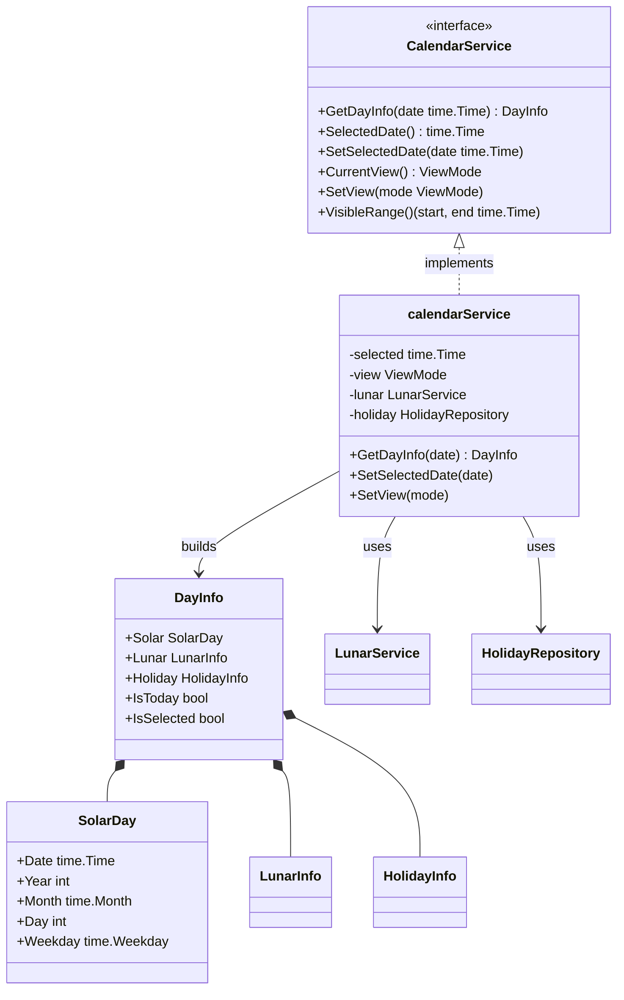
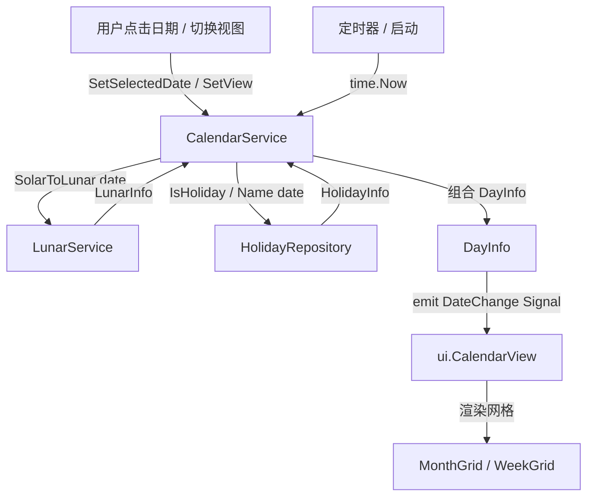
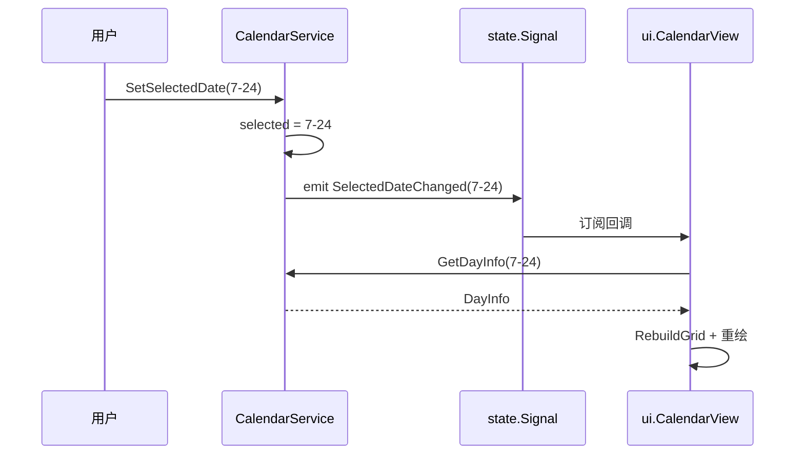
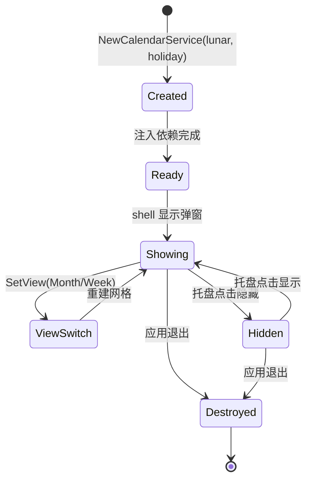

# Calendar（聚合根）

> 版本：v1.0-draft ｜ 最后更新：2026-07-07 ｜ 模块组：50-Calendar
> 包：`internal/calendar` ｜ 范围：MVP

---

## 1. 📦 package 设计

- **包名**：`calendar`（对应 `internal/calendar`）。
- **职责一句话**：日历领域聚合根，持有"当前选中日期 / 视图模式（月·周）/ 可见范围"，并编排 `LunarService` 与 `HolidayRepository` 产出某日的完整信息（公历 + 农历 + 节气 + 节假日）。
- **依赖方向**：
  - 依赖：`lunar.LunarService`（同包 `lunar.go`）、`holiday.HolidayRepository`（同包 `holiday.go`）。
  - 被依赖：`internal/ui`（CalendarView 调用 `CalendarService` 取数并渲染）、`internal/state`（Signal 订阅日期变更）、`internal/shell`（生命周期装配）。
  - 不依赖：`platform` / `theme` / `ui` 实现（依赖倒置，仅暴露接口）。
- **对外公开符号**：`CalendarService`（接口）、`DayInfo`、`SolarDay`、`ViewMode`（`ViewMonth` / `ViewWeek`）、`NewCalendarService(...)`。
- **边界**：
  - 归它管：选中态、视图态、可见范围、聚合单日完整信息、日期变更事件。
  - 不归它管：农历换算算法（交给 `LunarService`）、节假日数据（交给 `HolidayRepository`）、网格布局像素计算（交给 `Month`/`Week` 视图模型）、UI 绘制（交给 `ui`）。

---

## 2. 📐 UML 类图



> `LunarInfo` 与 `HolidayInfo` 分别在 `Lunar.md` / `Holiday.md` 中定义，本图以组合关系表示聚合。

---

## 3. 🔄 数据流图



- **数据源**：用户操作（点击）、系统时钟（`time.Now`）、嵌入的农历/节假日数据。
- **汇点**：`DayInfo` → UI 渲染；日期变更 Signal → State 订阅者。

---

## 4. 🎨 UI 原型图（ASCII）

日历弹窗（聚合根视角：顶栏状态 + 视图区 + 底栏）

```
┌─────────────────────────────────────────┐
│ 2026年7月           ◀ 月 ▶     ☰ 设置    │  ← 顶栏：年月 + 视图切换(月/周)
├─────────────────────────────────────────┤
│ 日 一 二 三 四 五 六                      │
│         1  2  3  4  5  6                 │
│  7  8  9 10 11 12 13   ← 网格(月/周切换)  │
│ 14 15 16 17 18 19 20                     │
│ 21 22 23[24]25 26 27   ← [24]=选中高亮   │
│ 28 29 30 31  1  2  3   ← 下月补位(灰)     │
├─────────────────────────────────────────┤
│ 今日: 农历六月初十 · 大暑 · 周五          │  ← 底栏：选中日完整信息摘要
└─────────────────────────────────────────┘
```

- 月/周按钮切换 `ViewMode`；`[24]` 表示 `SelectedDate` 高亮；补位日期（非当月）置灰。

---

## 5. 🗂 数据库设计

**N/A。** `Calendar` 聚合根为纯内存领域模型，选中态/视图态存于 `state` 的 Signal 中，不持久化到 SQLite（持久化为 `60-Todo` 范围）。无 `CREATE TABLE`。

---

## 6. 📡 Event / Signal 流程

领域事件：**日期变更（SelectedDateChanged）** 与 **视图变更（ViewModeChanged）**。



- **emit 方**：`CalendarService.SetSelectedDate` / `SetView`。
- **subscribe 方**：`ui.CalendarView`（重建网格）、`state` 持久化选中态。
- 副作用：UI 重绘、底栏摘要更新；不触发网络。

---

## 7. 🔌 Plugin API

**N/A。** 插件系统为 Post-MVP（v1.4，`80-Plugin`）。MVP 阶段 `Calendar` 不向插件暴露钩子；后续可经 `Plugin` 事件总线订阅 `SelectedDateChanged`，但当前不在契约内，故不定义接口。

---

## 8. 🧩 Feature 生命周期



- 无 GPU 资源持有，销毁仅停止 Signal 订阅与定时器，无需释放 wgpu 对象。

---

## 9. 📖 Go 接口定义

```go
package calendar

import "time"

// ViewMode 视图模式
type ViewMode int

const (
	ViewMonth ViewMode = iota // 月视图
	ViewWeek                  // 周视图（可选，见 Week.md）
)

// SolarDay 公历日值对象
type SolarDay struct {
	Date    time.Time
	Year    int
	Month   time.Month
	Day     int
	Weekday time.Weekday
}

// DayInfo 聚合根产出的某日完整信息
type DayInfo struct {
	Solar     SolarDay
	Lunar     LunarInfo   // 定义在 lunar.go
	Holiday   HolidayInfo // 定义在 holiday.go
	IsToday   bool
	IsSelected bool
}

// CalendarService 聚合根服务接口（依赖倒置，可 mock）
type CalendarService interface {
	// GetDayInfo 获取某日完整信息（公历+农历+节气+节假日）
	GetDayInfo(date time.Time) DayInfo
	// SelectedDate 当前选中日期
	SelectedDate() time.Time
	// SetSelectedDate 设置选中日期，触发 SelectedDateChanged
	SetSelectedDate(date time.Time)
	// CurrentView 当前视图模式
	CurrentView() ViewMode
	// SetView 切换视图模式，触发 ViewModeChanged
	SetView(mode ViewMode)
	// VisibleRange 当前视图可见日期范围 [start, end]
	VisibleRange() (start, end time.Time)
}

// calendarService 默认实现
type calendarService struct {
	selected time.Time
	view     ViewMode
	lunar    LunarService
	holiday  HolidayRepository
}

// NewCalendarService 构造聚合根；today 默认 time.Now，view 默认 ViewMonth
func NewCalendarService(lunar LunarService, holiday HolidayRepository, opts ...Option) CalendarService {
	s := &calendarService{
		selected: time.Now(),
		view:     ViewMonth,
		lunar:    lunar,
		holiday:  holiday,
	}
	for _, o := range opts {
		o(s)
	}
	return s
}

func (s *calendarService) GetDayInfo(date time.Time) DayInfo {
	return DayInfo{
		Solar:     toSolarDay(date),
		Lunar:     s.lunar.SolarToLunar(date),
		Holiday:   s.holiday.dayInfo(date),
		IsToday:   isSameDay(date, time.Now()),
		IsSelected: isSameDay(date, s.selected),
	}
}

func (s *calendarService) SetSelectedDate(date time.Time) {
	s.selected = date
	emitSelectedDateChanged(date) // 经 state.Signal 广播
}
```

> `LunarService` / `HolidayRepository` 接口与 `LunarInfo` / `HolidayInfo` 值对象分别见 `Lunar.md` §9、`Holiday.md` §9，同属 `package calendar`。

---

## 10. 🚀 Milestone 任务拆分

- **v1.0（MVP，待实现）**
  - 实现 `CalendarService` 聚合根 + `GetDayInfo` 编排。**验收**：给定日期返回含农历/节假日的 `DayInfo`；单测覆盖跨年/跨月边界。
  - 选中态/视图态接入 `state.Signal`，实现 `SelectedDateChanged` / `ViewModeChanged` 广播。**验收**：UI 订阅后正确重绘。
  - 装配到 `shell` 生命周期（显示/隐藏/退出）。**验收**：托盘点击弹窗，选中日期底栏摘要正确。
- **v1.1**：`GetDayInfo` 增加 Todo 计数注解位（预留字段，不阻塞）。
- **v1.2**：`VisibleRange` 供天气模块定位。
- **v1.3**：视图切换动画接入 `theme`。
- **v1.4**：经 `Plugin` 事件总线暴露 `SelectedDateChanged`（本 §7 的 N/A 届时解除）。
- **v1.5**：无变更。
