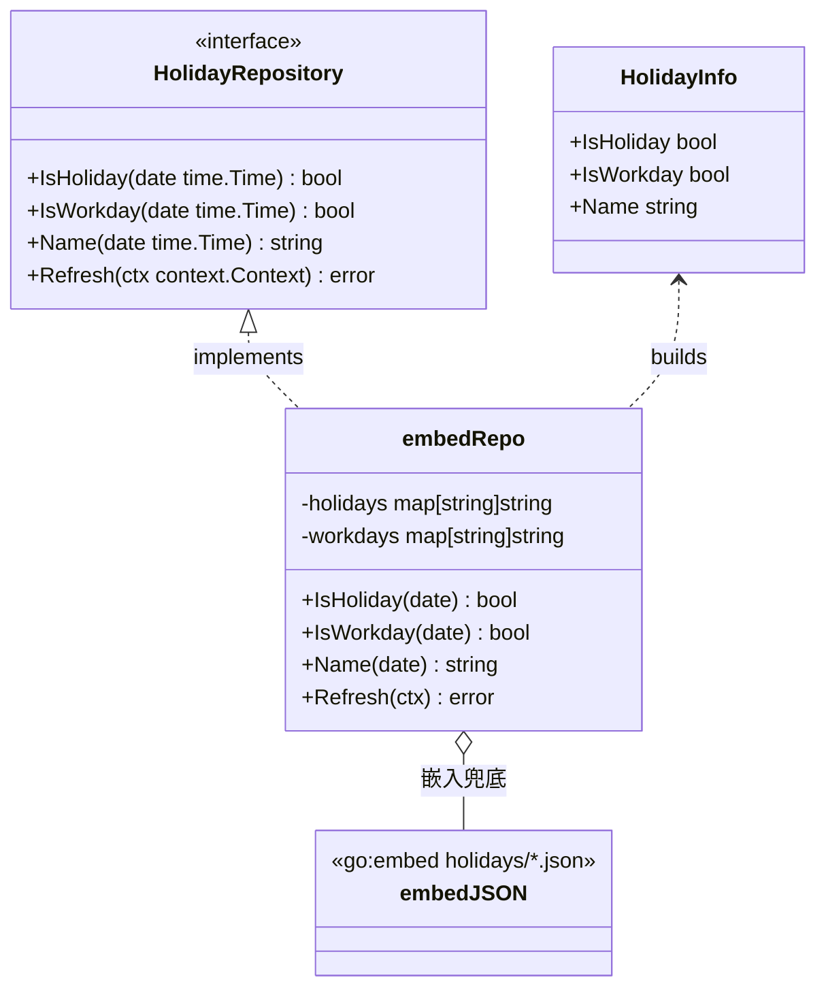
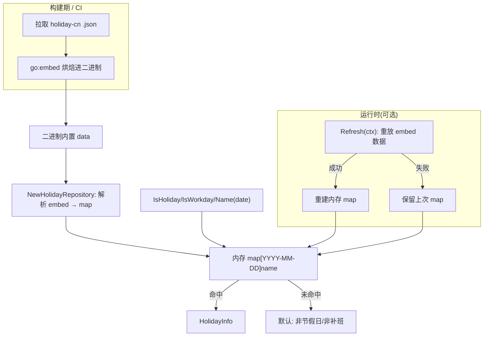
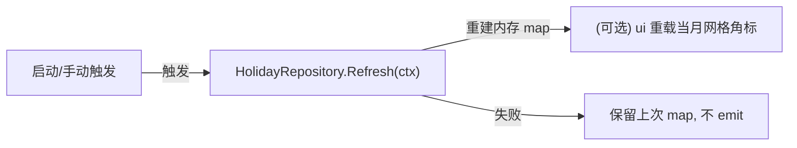
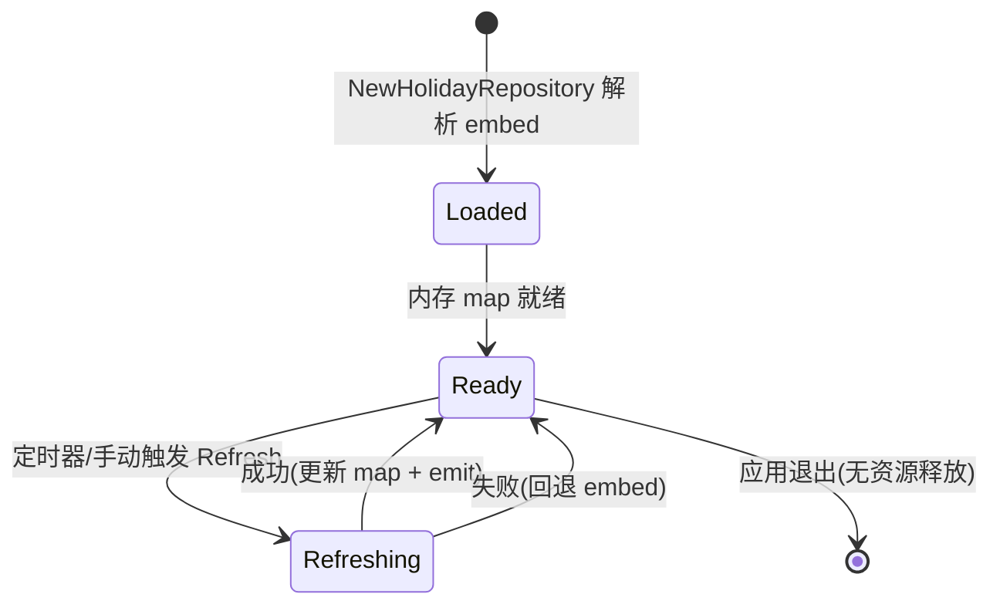

# Holiday（holiday-cn 封装）

> 版本：v1.0-draft ｜ 最后更新：2026-07-09 ｜ 模块组：50-Calendar
> 包：`internal/calendar` ｜ 范围：MVP（ADR-05c 已 Accepted）

---

## 1. 📦 package 设计

- **包名**：`calendar`（同包，`internal/calendar`，文件 `holiday.go`）。
- **职责一句话**：封装 `NateScarlet/holiday-cn` 数据，以 `go:embed` 在构建期烘焙年度 JSON（含调休）嵌入二进制，对外暴露 `HolidayRepository`（`IsHoliday` / `IsWorkday` / `Name`），并预留可选运行时年度刷新 + 嵌入兜底。
- **依赖方向**：
  - 依赖：`embed`（标准库）、`encoding/json`、`sync`（只读并发安全）、`HolidayRepository` 数据文件（`internal/calendar/embed/holidays/<year>.json`，键 `holidays` / `workdays` 两张表）。
  - 被依赖：`CalendarService`（聚合根）、`Month`/`Week` 视图模型。
  - 不依赖：UI / 窗口 / GPU / **网络**（`Refresh` 仅重放 embed，零网络，契合 ADR-05 离线优先）。
- **对外公开符号**：`HolidayRepository`（接口）、`HolidayInfo`（值对象）、`NewHolidayRepository() (*embedHolidayRepo, error)`、`(*repo) Refresh(ctx)`。
- **边界**：
  - 归它管：节假日/调休判定、数据加载、年度刷新与兜底、名称提取。
  - 不归它管：农历换算（委托 `LunarService`）、显示样式（委托 `ui`）、网络策略细节（仅做年度一次拉取）。

---

## 2. 📐 UML 类图



---

## 3. 🔄 数据流图



- **零网络**：默认与运行时均不触网。`Refresh` 仅重新解析 embed 数据（MVP 阶段无 HTTP 拉取，契合 ADR-05「离线优先」），失败保留上次内存 map，不致命。

---

## 4. 🎨 UI 原型图（ASCII）

Holiday 模块自身无独立界面，其产出以"日格角标"呈现（单格示例）：

```
节假日（休）                  调休补班（班）
┌────────┐                   ┌────────┐
│ 1      │                   │ 4*     │
│ 元旦    │  ← Name 角标      │ 班     │  ← 补班角标(红)
│ 休     │  ← 休标记(绿)      │        │
└────────┘                   └────────┘
普通工作日无角标；周末无节假日时仅显示农历
```

---

## 5. 🗂 数据库设计

**N/A。** 节假日数据为 `go:embed` 的 JSON 文件（构建期烘焙），非 SQLite 数据库；运行时仅存于内存 `map`，不落库（无 `CREATE TABLE`）。

---

## 6. 📡 Event / Signal 流程



- 默认不 emit 事件（embed 数据在构造期已就绪）。MVP 阶段 `Refresh` 仅重放 embed（零网络），不广播任何事件；UI 如需刷新角标可自行重新查询。失败路径静默保留上次 map，不影响主流程。

---

## 7. 🔌 Plugin API

**N/A。** 同 `Calendar.md` §7：插件系统 Post-MVP；节假日数据在 MVP 不向插件暴露钩子。

---

## 8. 🧩 Feature 生命周期



- 无文件句柄 / GPU 资源；进程退出即释放内存 map。

---

## 9. 📖 Go 接口定义

> ✏️ 2026-07-09 代码审查 S1 回写：本节已与已落地实现（`holiday.go` / `holiday_embed.go`）对齐——**删除**运行时 HTTP 拉取 `holiday-cn` 与 `isMakeupWorkday` 名称 heuristic；改用 `holidays` / `workdays` 两张独立 map（补班天然不误判为节假日）；`NewHolidayRepository() (*embedHolidayRepo, error)`；`Refresh` 仅重放 embed（零网络）。

```go
package calendar

import (
	"context"
	"embed"
	"encoding/json"
	"fmt"
	"strconv"
	"strings"
	"sync"
	"time"
)

// HolidayInfo 节假日/调休信息值对象
type HolidayInfo struct {
	IsHoliday bool
	IsWorkday bool   // 调休补班日
	Name      string // 节日/放假名，如 "元旦"；补班可为 "元旦补班"
}

// HolidayRepository 节假日仓储接口（依赖倒置，可 mock）
type HolidayRepository interface {
	IsHoliday(date time.Time) bool
	IsWorkday(date time.Time) bool
	Name(date time.Time) string
	// Refresh 可选运行时刷新；MVP 仅重放 embed（零网络），失败返回 error。
	Refresh(ctx context.Context) error
}

// yearFile 是单个年度节假日 JSON 的解析结构：
// holidays 为法定节假日名（"MM-DD" -> 名），workdays 为调休补班标注。
type yearFile struct {
	Holidays map[string]string `json:"holidays"`
	Workdays map[string]string `json:"workdays"`
}

//go:embed embed/holidays/*.json
var holidayFS embed.FS

// embedHolidayRepo 基于内嵌 JSON 的真实实现。
// 用 holidays / workdays 两张独立 map，补班天然不会误判为节假日（无需脆弱 heuristic）。
type embedHolidayRepo struct {
	mu       sync.RWMutex
	holidays map[string]string // "YYYY-MM-DD" -> 名称
	workdays map[string]string // "YYYY-MM-DD" -> 名称（补班）
}

// NewHolidayRepository 从嵌入 JSON 加载（离线保证）。失败返回 error（调用方须处理）。
func NewHolidayRepository() (*embedHolidayRepo, error) {
	r := &embedHolidayRepo{}
	if err := r.load(); err != nil {
		return nil, err
	}
	return r, nil
}

// load 解析 embed 中所有 YYYY.json，按文件名年份补全日期键到两张 map。
func (r *embedHolidayRepo) load() error {
	holidays := make(map[string]string)
	workdays := make(map[string]string)
	entries, err := holidayFS.ReadDir("embed/holidays")
	if err != nil {
		return fmt.Errorf("read embed holidays dir: %w", err)
	}
	for _, e := range entries {
		if e.IsDir() || !strings.HasSuffix(e.Name(), ".json") {
			continue
		}
		year, err := strconv.Atoi(strings.TrimSuffix(e.Name(), ".json"))
		if err != nil {
			return fmt.Errorf("holiday file %q: bad year: %w", e.Name(), err)
		}
		data, err := holidayFS.ReadFile("embed/holidays/" + e.Name())
		if err != nil {
			return fmt.Errorf("read embed %q: %w", e.Name(), err)
		}
		var yf yearFile
		if err := json.Unmarshal(data, &yf); err != nil {
			return fmt.Errorf("parse embed %q: %w", e.Name(), err)
		}
		for mmdd, name := range yf.Holidays {
			key, err := joinDate(year, mmdd)
			if err != nil {
				return fmt.Errorf("holiday file %q: %w", e.Name(), err)
			}
			holidays[key] = name
		}
		for mmdd, name := range yf.Workdays {
			key, err := joinDate(year, mmdd)
			if err != nil {
				return fmt.Errorf("holiday file %q: %w", e.Name(), err)
			}
			workdays[key] = name
		}
	}
	if len(holidays) == 0 {
		return fmt.Errorf("no holiday data loaded from embed")
	}
	r.mu.Lock()
	r.holidays = holidays
	r.workdays = workdays
	r.mu.Unlock()
	return nil
}

// joinDate 把文件名年份与 "MM-DD" 拼成 "YYYY-MM-DD"，并校验合法性（拦截 02-30 等死键）。
func joinDate(year int, mmdd string) (string, error) {
	parts := strings.SplitN(mmdd, "-", 2)
	if len(parts) != 2 {
		return "", fmt.Errorf("invalid MM-DD key %q", mmdd)
	}
	m, err1 := strconv.Atoi(parts[0])
	d, err2 := strconv.Atoi(parts[1])
	if err1 != nil || err2 != nil {
		return "", fmt.Errorf("invalid MM-DD key %q", mmdd)
	}
	if m < 1 || m > 12 || d < 1 || d > 31 {
		return "", fmt.Errorf("out-of-range MM-DD key %q", mmdd)
	}
	return fmt.Sprintf("%04d-%02d-%02d", year, m, d), nil
}

func (r *embedHolidayRepo) IsHoliday(d time.Time) bool {
	r.mu.RLock()
	defer r.mu.RUnlock()
	_, ok := r.holidays[d.Format("2006-01-02")]
	return ok
}

func (r *embedHolidayRepo) IsWorkday(d time.Time) bool {
	r.mu.RLock()
	defer r.mu.RUnlock()
	_, ok := r.workdays[d.Format("2006-01-02")]
	return ok
}

func (r *embedHolidayRepo) Name(d time.Time) string {
	r.mu.RLock()
	defer r.mu.RUnlock()
	key := d.Format("2006-01-02")
	if n, ok := r.holidays[key]; ok {
		return n
	}
	if n, ok := r.workdays[key]; ok {
		return n
	}
	return ""
}

// Refresh 重放内嵌数据。MVP 阶段不触网；真实 holiday-cn 烘焙接入后，
// 此处可改为读取构建期生成的外部文件/远端，失败回退上次 map。
func (r *embedHolidayRepo) Refresh(ctx context.Context) error {
	return r.load()
}

// dayInfo 由仓储接口组合出 HolidayInfo（包内辅助，非接口成员）。
func dayInfo(r HolidayRepository, d time.Time) HolidayInfo {
	if r == nil {
		return HolidayInfo{}
	}
	return HolidayInfo{
		IsHoliday: r.IsHoliday(d),
		IsWorkday: r.IsWorkday(d),
		Name:      r.Name(d),
	}
}
```

> 注：节假日与补班分属 `holidays` / `workdays` 两张独立 map，补班日天然不会误判为节假日，无需"名称含班"之类脆弱 heuristic。 `dayInfo` 为包内辅助函数（非接口成员），供 `CalendarService.GetDayInfo` 与 `Month`/`Week` 网格直接调用。当前内嵌 `2026.json` 为 SEED 占位数据，发布前须以真实 holiday-cn / 国务院年度安排替换（见代码审查 S5）。

---

## 10. 🚀 Milestone 任务拆分

- **v1.0（MVP，已实现）**
  - 节假日/补班以 `holidays` / `workdays` 两张独立 map 内嵌于 `embed/holidays/YYYY.json`（当前 2026 为 SEED 占位，发布前替换真实数据），零网络、零 CGO。**验收**：离线启动可判定当年节假日/调休；单测抽样（元旦休、春节补班）正确。
  - 实现 `IsHoliday` / `IsWorkday` / `Name` 及 `dayInfo`。**验收**：`IsWorkday` 在补班日返回 true，`IsHoliday` 在补班日返回 false（两表分离，补班不误判为节假日）。
  - 接入 `CalendarService` 与 `Month` 角标。**验收**：月格显示"休/班"角标。
  - ⚠️ **发布门**：内嵌 `2026.json` 为 SEED 占位近似数据，v1.0 发布前须以真实 holiday-cn / 国务院年度安排替换并加 CI 校验（见代码审查 S5）。
- **v1.2（可选）**：`Refresh` 升级为读取构建期烘焙的真实数据（替换 SEED），或预留外部数据文件重载；**不做运行时 HTTP 拉取**（契合 ADR-05 离线优先）。
- **v1.1 / v1.3 / v1.4 / v1.5**：无强制变更。

---

### 附：为何调休必须靠数据而非算法

国务院每年的放假安排是**行政决定**（含哪些周末挪作补班、假期如何拼接），**不存在可推导的数学/天文规律**：

1. **非周期**：调休模式逐年不同（如 2024 与 2025 春节调休日完全不同），无法用公式预测。
2. **非天文**：与节气/月相无关，纯政策产物。
3. **发布时点**：国务院通常在前一年末发布次年安排，无法在软件发布时硬编码未来多年。
4. **易变**：偶发因特殊事件调整（如疫情期变动）。

因此只能以**数据驱动**：构建期/CI 拉取 `holiday-cn`（自动抓国务院公告）烘焙进二进制保证离线准确，并预留运行时年度刷新 + 嵌入兜底。这同时契合 ADR-05c 的"可逆"原则——若未来更换数据源（如自爬公告），仅替换 `HolidayRepository` 实现即可，调用方零改动。
