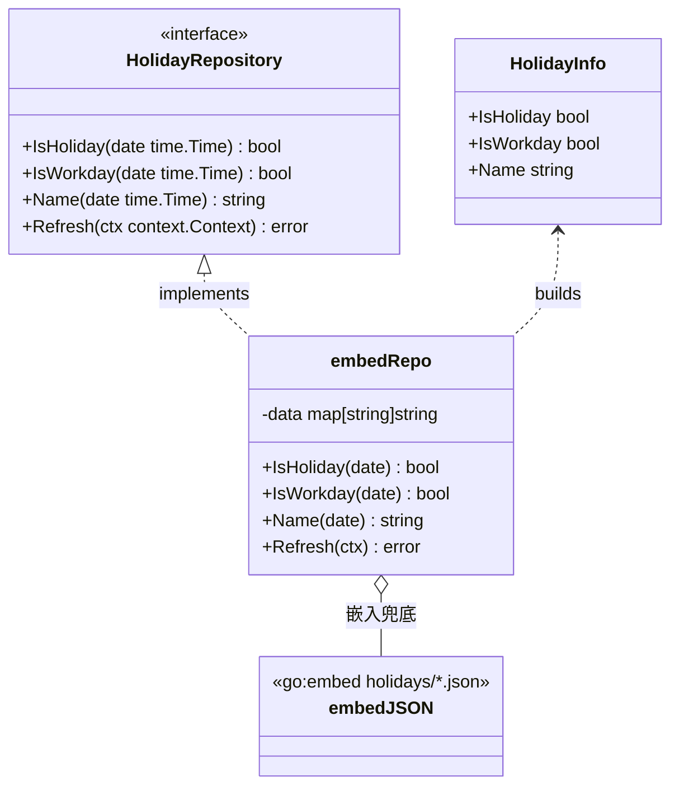
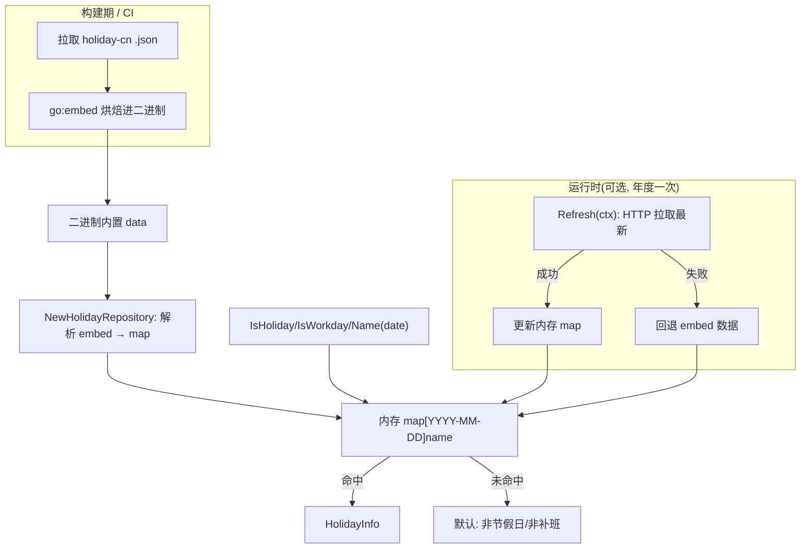
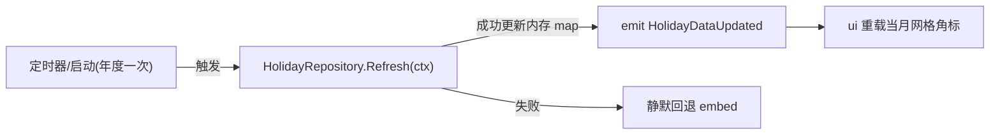
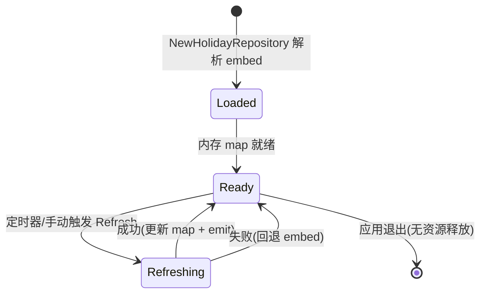

# Holiday（holiday-cn 封装）

> 版本：v1.0-draft ｜ 最后更新：2026-07-07 ｜ 模块组：50-Calendar
> 包：`internal/calendar` ｜ 范围：MVP（ADR-05c 已 Accepted）

---

## 1. 📦 package 设计

- **包名**：`calendar`（同包，`internal/calendar`，文件 `holiday.go`）。
- **职责一句话**：封装 `NateScarlet/holiday-cn` 数据，以 `go:embed` 在构建期烘焙年度 JSON（含调休）嵌入二进制，对外暴露 `HolidayRepository`（`IsHoliday` / `IsWorkday` / `Name`），并预留可选运行时年度刷新 + 嵌入兜底。
- **依赖方向**：
  - 依赖：`embed`（标准库）、`encoding/json`、`net/http`（可选刷新）、`HolidayRepository` 数据文件（`internal/calendar/embed/holidays/<year>.json`）。
  - 被依赖：`CalendarService`（聚合根）、`Month`/`Week` 视图模型。
  - 不依赖：UI / 窗口 / GPU。
- **对外公开符号**：`HolidayRepository`（接口）、`HolidayInfo`（值对象）、`NewHolidayRepository(...)`、`(*repo) Refresh(ctx)`。
- **边界**：
  - 归它管：节假日/调休判定、数据加载、年度刷新与兜底、名称提取。
  - 不归它管：农历换算（委托 `LunarService`）、显示样式（委托 `ui`）、网络策略细节（仅做年度一次拉取）。

---

## 2. 📐 UML 类图



---

## 3. 🔄 数据流图



- 默认零网络（embed 兜底）；`Refresh` 仅在用户/定时器触发年度更新时联网，失败安全回退。

---

## 4. 🎨 UI 原型图（ASCII）

Holiday 模块自身无独立界面，其产出以"日格角标"呈现（单格示例）：

```
节假日（休）                  调休补班（班）
┌────────┐                   ┌────────┐
│ 1      │                   │ 4*     │
│ 元旦    │  ← Name 角标      │ 班     │  ← 补班角标(红)
│ 休     │  ← 休标记(绿)      │        │
└────────┘                   └────────┘
普通工作日无角标；周末无节假日时仅显示农历
```

---

## 5. 🗂 数据库设计

**N/A。** 节假日数据为 `go:embed` 的 JSON 文件（构建期烘焙），非 SQLite 数据库；运行时仅存于内存 `map`，不落库（无 `CREATE TABLE`）。

---

## 6. 📡 Event / Signal 流程



- 默认不 emit（embed 已就绪）；仅当可选 `Refresh` 成功更新数据后广播 `HolidayDataUpdated`，UI 据此刷新角标。失败路径静默回退，不影响主流程。

---

## 7. 🔌 Plugin API

**N/A。** 同 `Calendar.md` §7：插件系统 Post-MVP；节假日数据在 MVP 不向插件暴露钩子。

---

## 8. 🧩 Feature 生命周期



- 无文件句柄 / GPU 资源；进程退出即释放内存 map。

---

## 9. 📖 Go 接口定义

```go
package calendar

import (
	"context"
	"encoding/json"
	"embed"
	"fmt"
	"io/fs"
	"net/http"
	"time"
)

// HolidayInfo 节假日/调休信息值对象
type HolidayInfo struct {
	IsHoliday bool
	IsWorkday bool   // 调休补班日
	Name      string // 节日/放假名，如 "元旦"；补班可为 "元旦补班"
}

// HolidayRepository 节假日仓储接口（依赖倒置，可 mock）
type HolidayRepository interface {
	IsHoliday(date time.Time) bool
	IsWorkday(date time.Time) bool
	Name(date time.Time) string
	// Refresh 可选运行时年度刷新；失败返回 error（调用方应回退 embed）
	Refresh(ctx context.Context) error
}

//go:embed embed/holidays/*.json
var holidayFS embed.FS

// embedRepo 基于嵌入 JSON 的实现
type embedRepo struct {
	data map[string]string // "YYYY-MM-DD" -> 名称
}

// NewHolidayRepository 从嵌入 JSON 加载（离线保证）
func NewHolidayRepository() (HolidayRepository, error) {
	repo := &embedRepo{data: make(map[string]string)}
	if err := repo.loadEmbed(); err != nil {
		return nil, err
	}
	return repo, nil
}

func (r *embedRepo) loadEmbed() error {
	entries, err := fs.ReadDir(holidayFS, "embed/holidays")
	if err != nil {
		return fmt.Errorf("read embed holidays: %w", err)
	}
	for _, e := range entries {
		if e.IsDir() {
			continue
		}
		b, err := holidayFS.ReadFile("embed/holidays/" + e.Name())
		if err != nil {
			return fmt.Errorf("read %s: %w", e.Name(), err)
		}
		var yearMap map[string]string
		if err := json.Unmarshal(b, &yearMap); err != nil {
			return fmt.Errorf("parse %s: %w", e.Name(), err)
		}
		for k, v := range yearMap {
			r.data[k] = v // key 形如 "2026-01-01"
		}
	}
	return nil
}

func keyOf(date time.Time) string {
	return date.Format("2006-01-02")
}

// IsHoliday 法定节假日（非补班）
func (r *embedRepo) IsHoliday(date time.Time) bool {
	v, ok := r.data[keyOf(date)]
	return ok && !isMakeupWorkday(v)
}

// IsWorkday 调休补班日（周末/休息日上班）
func (r *embedRepo) IsWorkday(date time.Time) bool {
	v, ok := r.data[keyOf(date)]
	return ok && isMakeupWorkday(v)
}

// Name 节假日名称（含补班标注）
func (r *embedRepo) Name(date time.Time) string {
	return r.data[keyOf(date)]
}

// Refresh 可选运行时年度刷新：拉取 holiday-cn 最新 JSON 覆盖内存
func (r *embedRepo) Refresh(ctx context.Context) error {
	url := fmt.Sprintf("https://raw.githubusercontent.com/NateScarlet/holiday-cn/master/%d.json", time.Now().Year())
	req, err := http.NewRequestWithContext(ctx, http.MethodGet, url, nil)
	if err != nil {
		return err
	}
	resp, err := http.DefaultClient.Do(req)
	if err != nil {
		return err
	}
	defer resp.Body.Close()
	var yearMap map[string]string
	if err := json.NewDecoder(resp.Body).Decode(&yearMap); err != nil {
		return err
	}
	for k, v := range yearMap {
		r.data[k] = v
	}
	return nil
}

// isMakeupWorkday 按数据约定识别调休补班（名称含"补班"或"班"后缀）
func isMakeupWorkday(name string) bool {
	return len(name) > 0 && (contains(name, "补班") || endsWith(name, "班"))
}

// dayInfo 供同包 CalendarService / Grid 直接取 HolidayInfo
func (r *embedRepo) dayInfo(date time.Time) HolidayInfo {
	return HolidayInfo{
		IsHoliday: r.IsHoliday(date),
		IsWorkday: r.IsWorkday(date),
		Name:      r.Name(date),
	}
}
```

> 注：`dayInfo` 为包内辅助方法（非接口成员），供 `CalendarService.GetDayInfo` 与 `GridOptions` 直接调用；`contains`/`endsWith` 为标准库 `strings` 辅助，省略实现细节。

---

## 10. 🚀 Milestone 任务拆分

- **v1.0（MVP，待实现）**
  - 引入 `holiday-cn` 数据，编写构建期脚本拉取当年 JSON 烘焙进 `embed/holidays/`，确认 MIT 许可与零 CGO。**验收**：离线启动可判定 2026 全年节假日/调休；单测抽样（元旦休、春节调休补班）正确。
  - 实现 `IsHoliday` / `IsWorkday` / `Name` 及 `dayInfo`。**验收**：`IsWorkday` 在补班日返回 true，`IsHoliday` 在补班日返回 false。
  - 接入 `CalendarService` 与 `Month` 角标。**验收**：月格显示"休/班"角标。
- **v1.2**：实现可选 `Refresh` + `HolidayDataUpdated` 事件与年度定时器（默认关闭，可在设置开启）。
- **v1.1 / v1.3 / v1.4 / v1.5**：无强制变更。

---

### 附：为何调休必须靠数据而非算法

国务院每年的放假安排是**行政决定**（含哪些周末挪作补班、假期如何拼接），**不存在可推导的数学/天文规律**：

1. **非周期**：调休模式逐年不同（如 2024 与 2025 春节调休日完全不同），无法用公式预测。
2. **非天文**：与节气/月相无关，纯政策产物。
3. **发布时点**：国务院通常在前一年末发布次年安排，无法在软件发布时硬编码未来多年。
4. **易变**：偶发因特殊事件调整（如疫情期变动）。

因此只能以**数据驱动**：构建期/CI 拉取 `holiday-cn`（自动抓国务院公告）烘焙进二进制保证离线准确，并预留运行时年度刷新 + 嵌入兜底。这同时契合 ADR-05c 的"可逆"原则——若未来更换数据源（如自爬公告），仅替换 `HolidayRepository` 实现即可，调用方零改动。
