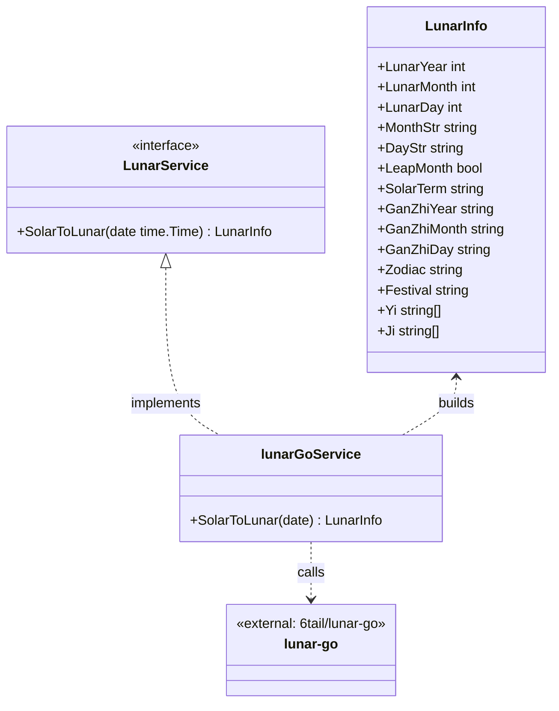
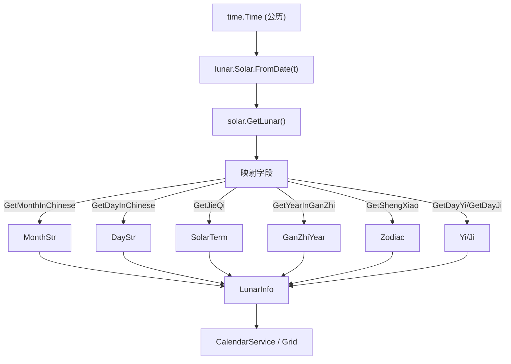

# Lunar（lunar-go 封装）

> 版本：v1.0-draft ｜ 最后更新：2026-07-07 ｜ 模块组：50-Calendar
> 包：`internal/calendar` ｜ 范围：MVP（ADR-05a 已 Accepted）

---

## 1. 📦 package 设计

- **包名**：`calendar`（同包，`internal/calendar`，文件 `lunar.go`）。
- **职责一句话**：封装 `6tail/lunar-go`（纯 Go · MIT · 零依赖零 CGO），对外暴露 `LunarService`，将公历 `time.Time` 转换为项目自有的 `LunarInfo` 值对象（农历/节气/干支/生肖/宜忌）。
- **依赖方向**：
  - 依赖：`github.com/6tail/lunar-go`（外部，纯 Go，ADR-05a 选定）。
  - 被依赖：`CalendarService`（聚合根）、`Month`/`Week` 视图模型（经 `GridOptions.Lunar` 注入）。
  - 不依赖：UI / 窗口 / 网络。
- **对外公开符号**：`LunarService`（接口）、`LunarInfo`（值对象）、`NewLunarService()`。
- **边界**：
  - 归它管：农历换算、节气判定、干支/生肖/宜忌提取、与 lunar-go 类型的映射。
  - 不归它管：节假日/调休（委托 `HolidayRepository`）、显示文本优先级（委托 `Month`）、持久化。

---

## 2. 📐 UML 类图



---

## 3. 🔄 数据流图



- 纯算法、无 IO、无网络；结果可缓存（`time.Time` 为键）。

---

## 4. 🎨 UI 原型图（ASCII）

Lunar 模块自身无独立界面，其产出以"日格副文本"形式呈现（单格示例）：

```
┌────────┐
│ 24     │  ← 公历日（主文本）
│ 大暑   │  ← 节气优先（SolarTerm）
│ 甲辰年 │  ← 干支年（可选 tooltip）
└────────┘
农历初一示例：显示月名而非日名
┌────────┐
│ 1      │
│ 正月   │  ← MonthStr（初一显月）
└────────┘
```

---

## 5. 🗂 数据库设计

**N/A。** lunar-go 为纯算法库，无数据文件、无 SQLite；换算在运行时由算法完成（或按 `time.Time` 内存缓存），不落库。

---

## 6. 📡 Event / Signal 流程

**N/A。** `LunarService` 是同步查询（请求-响应），不主动 emit 事件；它由 `CalendarService` 在日期变更时被动调用（事件流见 `Calendar.md` §6 / `Month.md` §6）。故本节不适用。

---

## 7. 🔌 Plugin API

**N/A。** 农历换算为底层数据能力，MVP 不向插件暴露；Post-MVP 若开放插件自定义"宜忌"等，可在 `80-Plugin` 定义钩子，当前不定义。

---

## 8. 🧩 Feature 生命周期

**N/A。** `lunar-go` 为无状态纯函数封装，无加载/初始化/销毁状态机（构造即就绪，无资源持有），故无 Feature 生命周期。

---

## 9. 📖 Go 接口定义

```go
package calendar

import (
	"time"

	lunar "github.com/6tail/lunar-go/calendar"
)

// LunarInfo 农历信息值对象（项目自有，隔离 lunar-go 类型）
type LunarInfo struct {
	LunarYear  int
	LunarMonth int
	LunarDay   int
	MonthStr   string   // "正月"
	DayStr     string   // "初一"
	LeapMonth  bool     // 是否闰月
	SolarTerm  string   // 节气，如 "清明"，无则空
	GanZhiYear  string  // "甲辰"
	GanZhiMonth string  // "庚午"
	GanZhiDay   string  // "癸酉"
	Zodiac     string   // 生肖 "龙"
	Festival   string   // 农历节日 "中秋节"，无则空
	Yi         []string // 宜
	Ji         []string // 忌
}

// LunarService 农历服务接口（依赖倒置，可 mock）
type LunarService interface {
	SolarToLunar(date time.Time) LunarInfo
}

// lunarGoService 基于 6tail/lunar-go 的实现（无状态）
type lunarGoService struct{}

// NewLunarService 构造 lunar-go 封装（零 CGO、纯 Go）
func NewLunarService() LunarService { return &lunarGoService{} }

func (s *lunarGoService) SolarToLunar(date time.Time) LunarInfo {
	solar := lunar.Solar.FromDate(date)
	l := solar.GetLunar()
	return LunarInfo{
		LunarYear:   l.GetYear(),
		LunarMonth:  l.GetMonth(),
		LunarDay:    l.GetDay(),
		MonthStr:    l.GetMonthInChinese(),
		DayStr:      l.GetDayInChinese(),
		LeapMonth:   l.GetMonth() != l.GetMonthInChinese() && l.IsLeap(),
		SolarTerm:   l.GetJieQi(),                 // 空字符串表示当日非节气
		GanZhiYear:  l.GetYearInGanZhi(),
		GanZhiMonth: l.GetMonthInGanZhi(),
		GanZhiDay:   l.GetDayInGanZhi(),
		Zodiac:      l.GetShengXiao(),
		Festival:    firstOrEmpty(l.GetFestivals()),
		Yi:          l.GetDayYi(),
		Ji:          l.GetDayJi(),
	}
}

func firstOrEmpty(s []string) string {
	if len(s) == 0 {
		return ""
	}
	return s[0]
}
```

> 注：`GetJieQi()` 在 lunar-go 中返回当前节气名（若当日为节气），否则返回空串，故可直接作 `SolarTerm`。具体方法名以 lunar-go v1.4.6 实际 API 为准，映射逻辑不变。

---

## 10. 🚀 Milestone 任务拆分

- **v1.0（MVP，待实现）**
  - 引入 `6tail/lunar-go`（确认零 CGO、`CGO_ENABLED=0` 编译通过）。**验收**：`go build` 无 CGO；`go.mod` 仅纯 Go 依赖。
  - 实现 `SolarToLunar` 字段映射与 `LunarInfo`。**验收**：对 2026-07-24 返回"大暑"；对农历正月初一返回 `MonthStr="正月"`；生肖/干支单测抽样通过。
  - 接入 `CalendarService` 与 `Month` 网格。**验收**：月格副文本显示节气/农历正确。
- **v1.1**：增加 `time.Time → LunarInfo` 内存缓存（LRU），降低高频重绘开销。
- **v1.2 / v1.3 / v1.4 / v1.5**：无强制变更；宜忌 tooltip 可在 v1.3 主题化展示。
