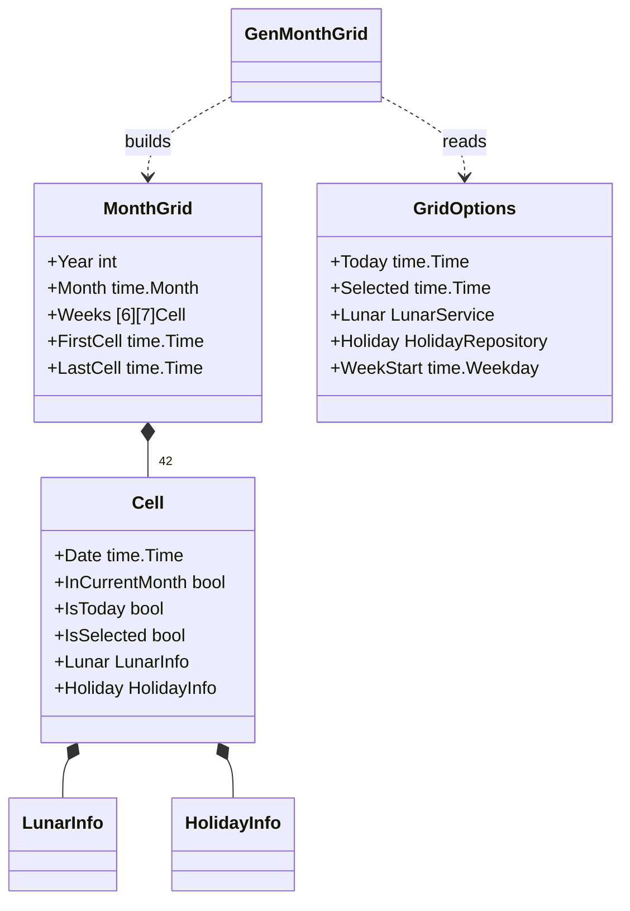
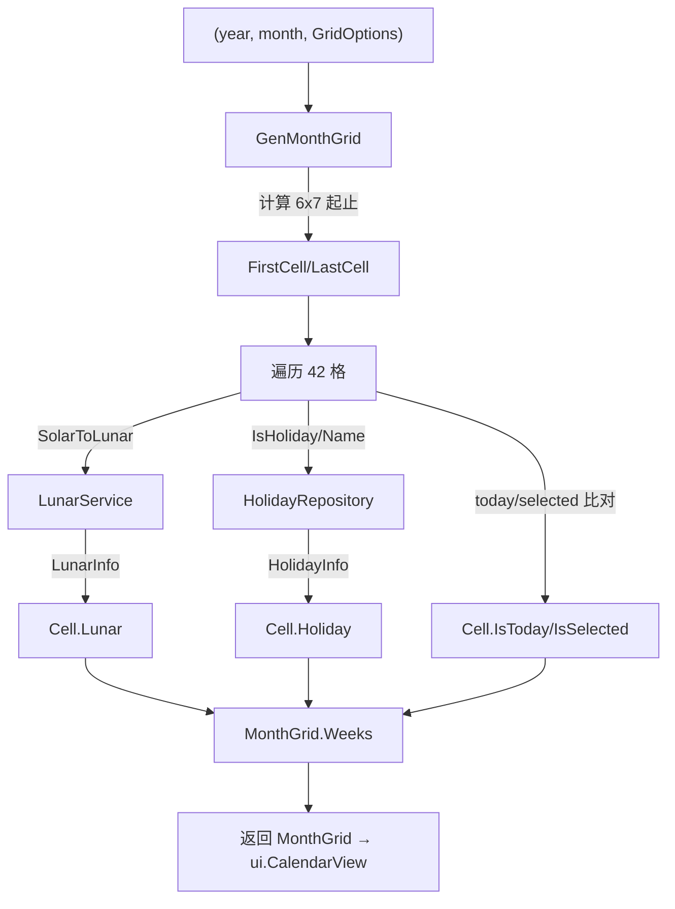
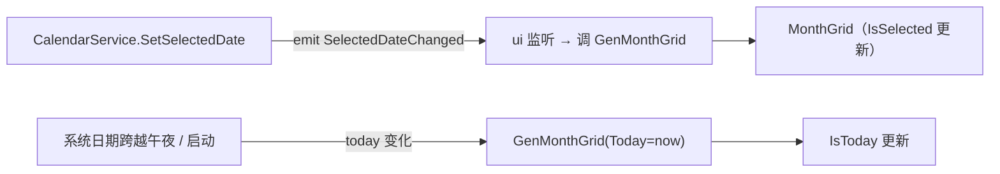

# Month（月视图模型）

> 版本：v1.0-draft ｜ 最后更新：2026-07-07 ｜ 模块组：50-Calendar
> 包：`internal/calendar` ｜ 范围：MVP

---

## 1. 📦 package 设计

- **包名**：`calendar`（与聚合根同包，`internal/calendar`，文件 `month.go`）。
- **职责一句话**：生成 6×7 月历网格（含上月/下月补位），应用今日高亮、选中高亮与农历/节气/节假日标注规则；纯函数逻辑，可单测、零 GPU 依赖。
- **依赖方向**：
  - 依赖：`LunarService`、`HolidayRepository`（同包，用于填充每格 `Lunar`/`Holiday`）。
  - 被依赖：`CalendarService`（聚合根调用 `GenMonthGrid` 填充视图）、`ui.CalendarView`（直接取 `MonthGrid` 渲染）。
  - 不依赖：UI / 窗口 / GPU。
- **对外公开符号**：`MonthGrid`、`Cell`、`GridOptions`、`GenMonthGrid(...)`。
- **边界**：
  - 归它管：网格结构、补位算法、高亮判定、标注优先级规则。
  - 不归它管：农历换算（委托 `LunarService`）、节假日判定（委托 `HolidayRepository`）、像素布局与绘制（委托 `ui`）。

---

## 2. 📐 UML 类图



---

## 3. 🔄 数据流图



- 纯内存计算，无网络、无定时器。

---

## 4. 🎨 UI 原型图（ASCII）

```
月视图网格（6 行 × 7 列）标注示例
┌────┬────┬────┬────┬────┬────┬────┐
│日  │一  │二  │三  │四  │五  │六  │
├────┼────┼────┼────┼────┼────┼────┤
│30* │ 1  │ 2  │ 3  │ 4  │ 5  │ 6  │  * 上月补位(灰)
│ 初一│初二│初三│初四│初五│初六│初七│  ← 农历(初一显月名)
├────┼────┼────┼────┼────┼────┼────┤
│ 7  │ 8  │ 9  │10  │11  │12  │13  │
│初八│初九│初十│十一│十二│十三│十四│
├────┼────┼────┼────┼────┼────┼────┤
│14  │15  │16[24]17  │18  │19  │20  │  [24]=选中高亮
│十五│十六│十七│大暑│十九│二十│廿一│  ← 节气优先于农历日
├────┼────┼────┼────┼────┼────┼────┤
│21  │22  │23  │ 1* │ 2* │ 3* │ 4* │  * 下月补位(灰)
│廿二│廿三│廿四│建军│廿六│廿七│廿八│
└────┴────┴────┴────┴────┴────┴────┘
休/班标记：节假日格角标"休"，调休补班格角标"班"
```

---

## 5. 🗂 数据库设计

**N/A。** 月网格为纯内存计算结果，不落库（无 `CREATE TABLE`）。

---

## 6. 📡 Event / Signal 流程



- 月视图自身不 emit 事件；它响应聚合根的 `SelectedDateChanged` 与 `today` 变化，重新生成网格。纯逻辑生成函数亦可在单测中直接调用，无需 Signal。

---

## 7. 🔌 Plugin API

**N/A。** 同 `Calendar.md` §7：插件系统 Post-MVP（v1.4），月视图标注规则在 MVP 不向插件暴露。

---

## 8. 🧩 Feature 生命周期

**N/A。** `Month` 为纯逻辑值对象与生成函数，无注册/初始化/显隐/销毁状态机；其产物 `MonthGrid` 由 `ui.CalendarView` 在每次视图刷新时按需重建（生命周期归属 UI 层，见 `90-UI`）。故本节不适用。

---

## 9. 📖 Go 接口定义

```go
package calendar

import "time"

// Cell 月网格单格
type Cell struct {
	Date           time.Time
	InCurrentMonth bool      // 是否属于当前月（补位格=false）
	IsToday        bool
	IsSelected     bool
	Lunar          LunarInfo   // 来自 LunarService
	Holiday        HolidayInfo // 来自 HolidayRepository
}

// MonthGrid 月视图网格（固定 6 行 7 列 = 42 格）
type MonthGrid struct {
	Year      int
	Month     time.Month
	Weeks     [6][7]Cell
	FirstCell time.Time // 左上角格日期（可能属上月）
	LastCell  time.Time // 右下角格日期（可能属下月）
}

// GridOptions 网格生成选项
type GridOptions struct {
	Today     time.Time      // 用于判定 IsToday，默认 time.Now()
	Selected  time.Time      // 用于判定 IsSelected
	Lunar     LunarService   // 注入农历服务
	Holiday   HolidayRepository // 注入节假日仓储
	WeekStart time.Weekday   // 周起始（time.Sunday / time.Monday）
}

// GenMonthGrid 生成指定年月的月网格（纯函数，可单测）
// 规则：以 WeekStart 为列首，向上取满首格、向下补满 6 行；
// 非当月日期 InCurrentMonth=false；每格填充 Lunar/Holiday 与高亮标志。
func GenMonthGrid(year int, month time.Month, opts GridOptions) MonthGrid {
	if opts.Today.IsZero() {
		opts.Today = time.Now()
	}
	first := time.Date(year, month, 1, 0, 0, 0, 0, time.Local)
	offset := (int(first.Weekday()) - int(opts.WeekStart) + 7) % 7
	start := first.AddDate(0, 0, -offset)

	grid := MonthGrid{Year: year, Month: month}
	for r := 0; r < 6; r++ {
		for c := 0; c < 7; c++ {
			d := start.AddDate(0, 0, r*7+c)
			cell := Cell{
				Date:           d,
				InCurrentMonth: d.Year() == year && d.Month() == month,
				IsToday:        isSameDay(d, opts.Today),
				IsSelected:     isSameDay(d, opts.Selected),
			}
			if opts.Lunar != nil {
				cell.Lunar = opts.Lunar.SolarToLunar(d)
			}
			if opts.Holiday != nil {
				cell.Holiday = opts.Holiday.dayInfo(d)
			}
			grid.Weeks[r][c] = cell
		}
	}
	grid.FirstCell = grid.Weeks[0][0].Date
	grid.LastCell = grid.Weeks[5][6].Date
	return grid
}
```

**标注优先级规则（实现约束）**：格内副文本优先显示 `Holiday.Name`（节假日名 > 调休标记）；其次若 `Lunar.SolarTerm != ""` 显示节气；否则显示农历日（`LunarDay` 为初一显示月名 `Lunar.MonthStr`，否则显示 `Lunar.DayStr`）。

---

## 10. 🚀 Milestone 任务拆分

- **v1.0（MVP，待实现）**
  - 实现 `GenMonthGrid` 及 `WeekStart` 可配（默认周一）。**验收**：6×7 固定、补位正确；单测覆盖闰年 2 月、跨年 12 月、周日起始三种情形。
  - 标注优先级规则落地（节假日 > 节气 > 农历）。**验收**：节气日显示节气而非农历日；初一显示月名。
  - 接入 `ui.CalendarView` 渲染。**验收**：与 360 观感对齐，今日/选中高亮正确。
- **v1.1**：格内预留 Todo 角标位。
- **v1.2**：无变更。
- **v1.3**：高亮样式由 `theme` 驱动（不改模型）。
- **v1.4 / v1.5**：无变更（逻辑稳定）。
