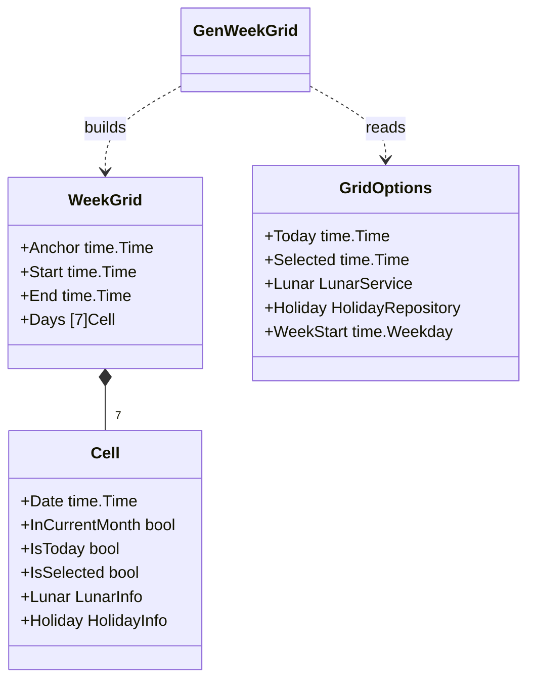
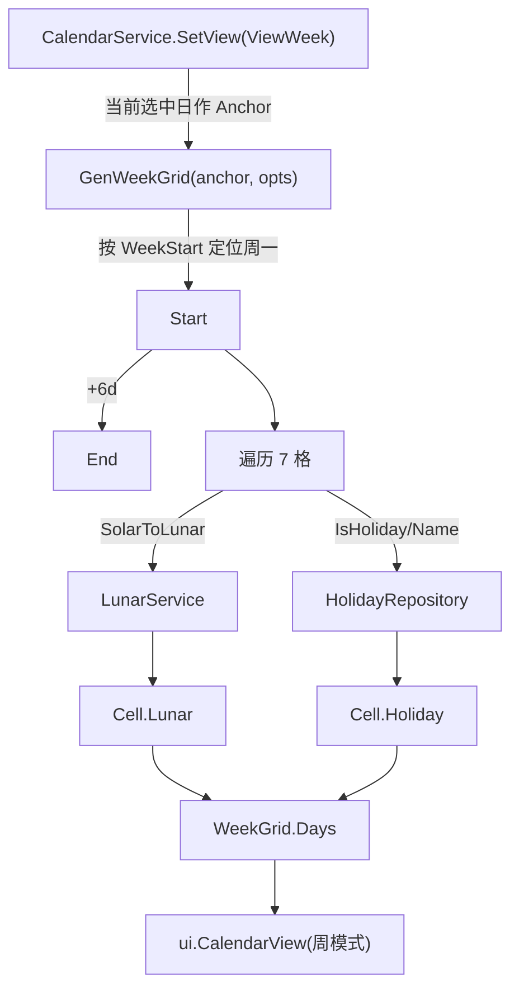

# Week（周视图，可选设计）

> 版本：v1.0-draft ｜ 最后更新：2026-07-07 ｜ 模块组：50-Calendar
> 包：`internal/calendar` ｜ 范围：可选（Post-MVP，v1.0 默认仅月视图）

---

## 1. 📦 package 设计

- **包名**：`calendar`（与聚合根同包，`internal/calendar`，文件 `week.go`）。
- **职责一句话**：设计可选周视图的数据模型（7 格周网格）与月/周切换机制，复用 `Month` 的 `Cell` 与生成选项；MVP 不启用，仅预留。
- **依赖方向**：
  - 依赖：`Cell` / `GridOptions`（来自 `month.go`）、`LunarService`、`HolidayRepository`。
  - 被依赖：`CalendarService.SetView(ViewWeek)` 触发；`ui.CalendarView` 在周模式下取 `WeekGrid`。
  - 不依赖：GPU / 窗口。
- **对外公开符号**：`WeekGrid`、`GenWeekGrid(...)`、`ViewWeek`（常量见 `Calendar.md`）。
- **边界**：
  - 归它管：以锚定日定位所属周、7 格生成、周导航（上一周/下一周）。
  - 不归它管：农历/节假日算法（委托）、像素绘制（委托 `ui`）。

---

## 2. 📐 UML 类图



> `WeekGrid.Days` 复用 `Month` 的 `Cell`，保证标注规则一致。

---

## 3. 🔄 数据流图



- 与月视图共享 `LunarService` / `HolidayRepository`，无新增数据源。

---

## 4. 🎨 UI 原型图（ASCII）

```
周视图（单行 7 格，锚定日=7-24 周四）
┌────┬────┬────┬────┬────┬────┬────┐
│ 日 │ 一 │ 二 │ 三 │ 四 │ 五 │ 六 │
├────┼────┼────┼────┼────┼────┼────┤
│20* │21  │22  │23  │24  │25  │26  │  * 跨月(灰)
│廿七│廿八│廿九│三十│大暑│初二│初三│  ← 同月视图标注规则
└────┴────┴────┴────┴────┴────┴────┘
       ◀ 上一周        下一周 ▶
[24]=选中高亮；顶部显示 "2026年第30周 (7/20 - 7/26)"
```

---

## 5. 🗂 数据库设计

**N/A。** 周网格为纯内存计算结果，不落库。

---

## 6. 📡 Event / Signal 流程

```mermaid
flowchart LR
    CS["CalendarService.SetView(ViewWeek)"] -->|emit ViewModeChanged| UI["ui 切到 WeekGrid"]
    NAV["周导航(上一周/下一周)"] -->|SetSelectedDate(anchor±7)| CS2["CalendarService"]
    CS2 -->|SelectedDateChanged| GW["GenWeekGrid 重建"]
```

- 周视图复用聚合根既有的 `ViewModeChanged` 与 `SelectedDateChanged` 事件，不新增事件类型，降低与月视图的耦合。

---

## 7. 🔌 Plugin API

**N/A。** 同 `Calendar.md` §7：插件系统 Post-MVP；周视图在 MVP 未启用，不暴露钩子。

---

## 8. 🧩 Feature 生命周期

**N/A。** 周视图在 v1.0 为可选/未启用，无独立注册-初始化-显隐生命周期；其启用由 `CalendarService.SetView(ViewWeek)` 在运行时切换，生命周期从属于聚合根（见 `Calendar.md` §8），故本节不适用。

---

## 9. 📖 Go 接口定义

```go
package calendar

import "time"

// WeekGrid 周视图网格（固定 7 格）
type WeekGrid struct {
	Anchor time.Time // 锚定日（决定所属周）
	Start  time.Time // 周首（按 WeekStart）
	End    time.Time // 周尾（Start + 6 天）
	Days   [7]Cell   // 复用 Month 的 Cell
}

// GenWeekGrid 以 anchor 所在周生成周网格（纯函数，可单测）
// 规则：以 opts.WeekStart 定位周首，填充 7 格；每格复用标注规则。
func GenWeekGrid(anchor time.Time, opts GridOptions) WeekGrid {
	if opts.Today.IsZero() {
		opts.Today = time.Now()
	}
	offset := (int(anchor.Weekday()) - int(opts.WeekStart) + 7) % 7
	start := anchor.AddDate(0, 0, -offset)

	wg := WeekGrid{Anchor: anchor, Start: start, End: start.AddDate(0, 0, 6)}
	for i := 0; i < 7; i++ {
		d := start.AddDate(0, 0, i)
		cell := Cell{
			Date:           d,
			InCurrentMonth: true, // 周视图不强调跨月，统一 true
			IsToday:        isSameDay(d, opts.Today),
			IsSelected:     isSameDay(d, opts.Selected),
		}
		if opts.Lunar != nil {
			cell.Lunar = opts.Lunar.SolarToLunar(d)
		}
		if opts.Holiday != nil {
			cell.Holiday = opts.Holiday.dayInfo(d)
		}
		wg.Days[i] = cell
	}
	return wg
}
```

---

## 10. 🚀 Milestone 任务拆分

- **v1.0（MVP，标记可选/未启用）**
  - 落地 `WeekGrid` / `GenWeekGrid` 与单元测试用例。**验收**：周首按 `WeekStart` 正确；跨月锚定正确；单测通过。
  - `CalendarService` 预留 `ViewWeek` 常量与 `SetView` 分支（不接 UI）。**验收**：调用 `SetView(ViewWeek)` 不崩溃，内部可生成 `WeekGrid`。
- **v1.1**：`ui.CalendarView` 接入周模式渲染与周导航按钮（默认仍月视图，可在设置中切）。
- **v1.3**：周/月切换动画。
- **v1.4 / v1.5**：无变更（模型稳定）。
