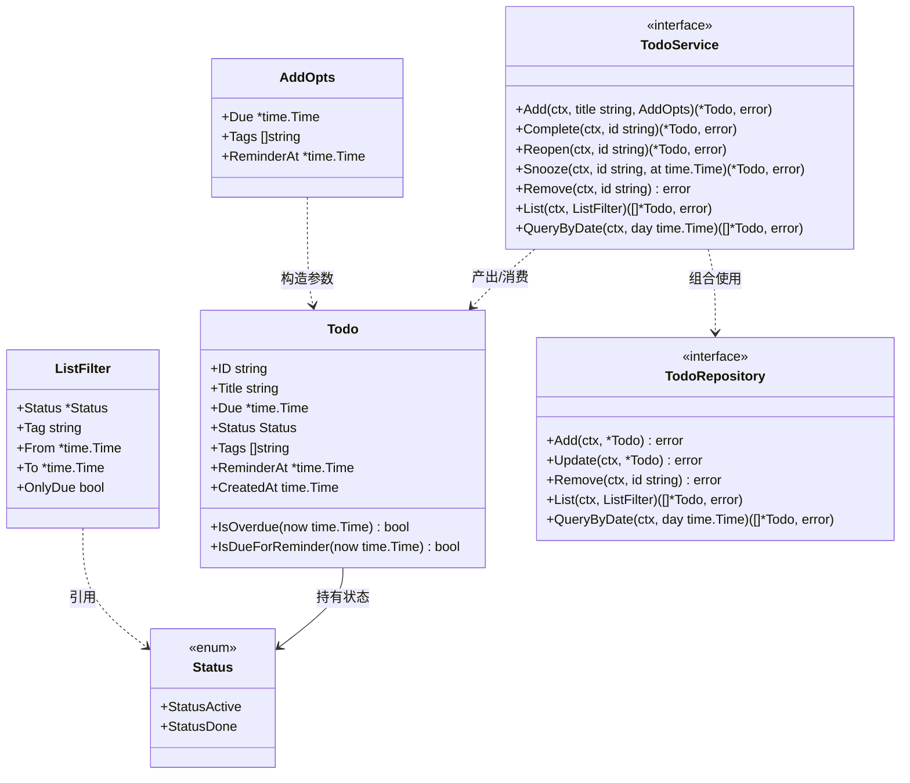
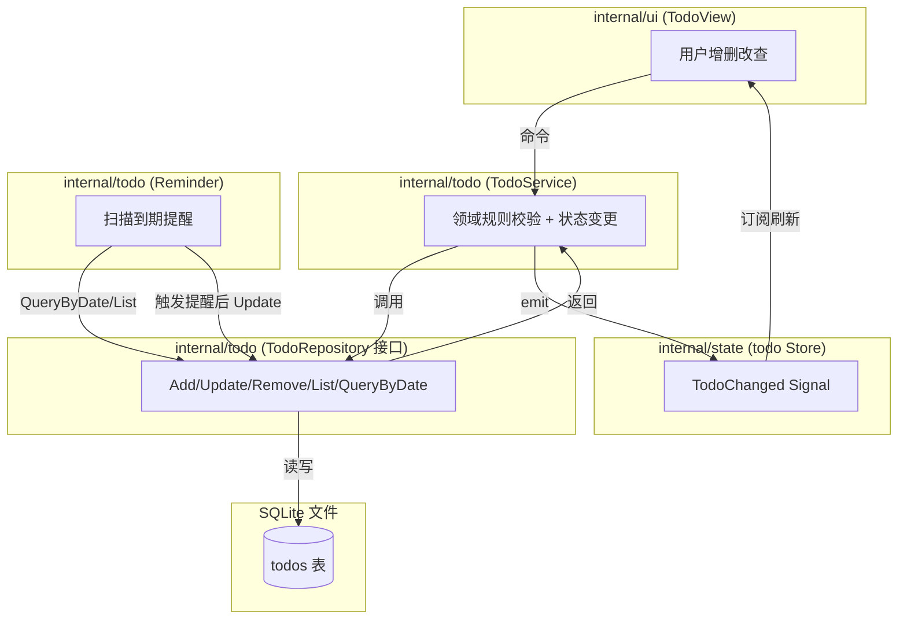
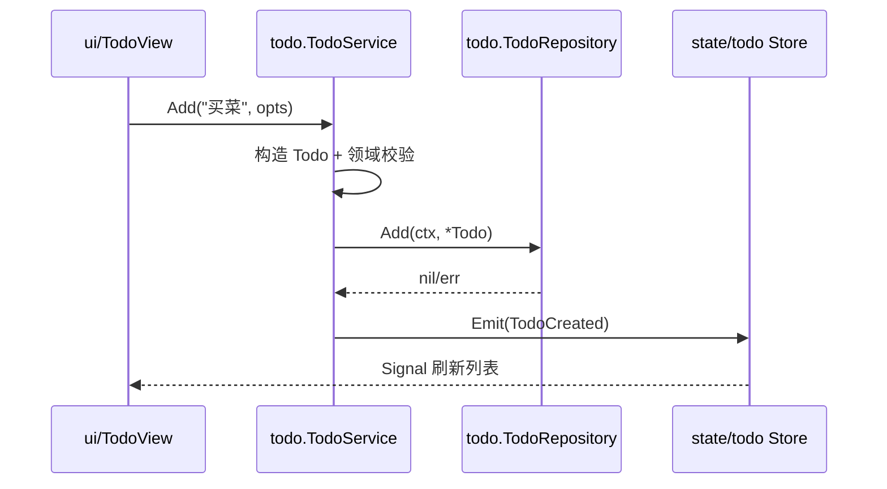

# 60-Todo · Model（待办聚合）

> 模块编号：60-Todo ｜ 子主题：Model ｜ 版本范围：**Post-MVP (v1.1)**
> 最后更新：2026-07-07
>
> **Post-MVP 标注**：本模块属于路线图 v1.1（待办：SQLite + 提醒），**非 MVP（v1.0）**。MVP 仅交付日历核心（`50-Calendar`）。本模块所有接口在 v1.1 实现，本文件为详细设计契约。

---

## 1. 📦 package 设计

- **包名**：`todo`
- **目录**：`internal/todo`（聚合根与领域规则放 `model.go`；Repository 接口定义同文件，SQLite 实现见 `SQLite.md`）
- **职责一句话**：定义 Todo 聚合（Aggregate Root）、领域规则（完成 / 延期 / 提醒触发条件）与 `TodoRepository` / `TodoService` 接口，不绑定任何具体存储或 UI。
- **依赖方向**：
  - 依赖：`time`（标准库）、`errors`（标准库）。**不依赖** `database/sql`、`gogpu`、`platform`、`state` —— 领域层保持纯净，便于单测。
  - 被依赖：`internal/todo`（SQLite 实现）、`internal/todo`（Reminder 调度）、`internal/ui`（TodoView）、`internal/state`（todo Store）均依赖本包的类型与接口。
- **对外暴露的公开符号**：
  - 类型：`Todo`、`Status`、`ListFilter`、`AddOpts`
  - 接口：`TodoRepository`、`TodoService`
  - 常量：`StatusActive`、`StatusDone`
  - 错误变量：`ErrNotFound`、`ErrInvalidID`、`ErrInvalidStatus`
  - 方法：`(*Todo).IsOverdue`、`(*Todo).IsDueForReminder`
- **边界**：
  - 归它管：Todo 的字段语义、状态机规则、提醒/延期判定逻辑、Repository/Service 接口契约。
  - 不归它管：数据库建表与 SQL（见 `SQLite.md`）、定时器与系统通知（见 `Reminder.md`）、gogpu Signal 流转（见 `state/todo` 与 `Reminder.md`）、具体 UI 渲染（见 `90-UI/TodoView`）。

---

## 2. 📐 UML 类图



关系说明：`Todo` 是聚合根；`TodoService` 通过组合 `TodoRepository` 落地领域规则（完成/重开/延期）；`ListFilter`/`AddOpts` 为查询与创建的 Value Object。

---

## 3. 🔄 数据流图



- **数据源**：用户输入（增删改）、系统时钟（Reminder 定时扫描）。
- **汇点**：SQLite 文件（持久化）、`state/todo` Store 的 Signal（驱动 UI 响应式刷新）。
- 领域层（`model.go`）本身不产生数据流向，仅通过接口被 Service / Reminder / UI 调用。

---

## 4. 🎨 UI 原型图（ASCII）

> **N/A**：本文件仅定义领域模型与接口，不含任何视图。Todo 列表 / 编辑表单 / 提醒 Toast 的 UI 原型属于 `90-UI/TodoView` 与 `20-Platform/Notification`，不在聚合层职责内。

---

## 5. 🗂 数据库设计

> **N/A**：聚合层不持有表结构。`todos` 表与索引的 `CREATE TABLE` SQL、迁移策略、Repository 的 SQL 实现均在 `SQLite.md` 中定义。本层只通过 `TodoRepository` 接口抽象存储，符合"接口隔离 + 可逆"（实现可换 modernc.org/sqlite 以外的纯 Go 存储而不影响领域）。

---

## 6. 📡 Event / Signal 流程

本模块不自己持有 gogpu Signal；领域事件由 `TodoService` 在落库后委托 `state/todo` Store 广播。约定领域事件如下：

| 领域事件 | 触发点 | 订阅方 | 副作用 |
|---------|--------|--------|--------|
| `TodoCreated` | `Service.Add` 成功后 | `state/todo` Store、`ui/TodoView` | 列表追加、UI 刷新 |
| `TodoUpdated` | `Service.Update/Complete/Reopen/Snooze` 后 | `state/todo` Store、`ui/TodoView` | 列表重排、状态变更 |
| `TodoRemoved` | `Service.Remove` 后 | `state/todo` Store、`ui/TodoView` | 列表移除 |
| `TodoReminderDue` | `Reminder` 扫描命中且 `IsDueForReminder` 为真 | `Reminder` → `platform.Notification` | 弹出系统通知（见 `Reminder.md`） |



---

## 7. 🔌 Plugin API

> **N/A**：领域聚合层不直接向插件暴露钩子。插件钩子（如 `OnTodoAdded`）属于 `80-Plugin` 与 `state/todo` Store 的事件总线职责；本模块只提供纯净的 `Todo` 类型与接口，供插件系统在更上层订阅 Signal。此处不定义任何 Plugin 接口，避免破坏依赖方向（`plugin` 以钩子反向依赖 `feature`，但 `feature` 不反向依赖 `plugin`）。

---

## 8. 🧩 Feature 生命周期

> **N/A**：`model.go` 是无状态领域层，不存在"注册 → 初始化 → 启动 → 显隐 → 销毁"的生命周期。聚合对象的生命周期由 `TodoService` 调用 `TodoRepository` 管理（创建即落库、删除即移除）。调度器的启停生命周期见 `Reminder.md` §8；Repository 的开闭生命周期见 `SQLite.md` §8。

---

## 9. 📖 Go 接口定义

> 以下为可直接粘入 `internal/todo/model.go` 的真实 Go 签名（`CGO_ENABLED=0` 可编译）。

```go
package todo

import (
	"context"
	"errors"
	"time"
)

// Status 表示待办的完成状态（字符串枚举，便于 JSON/SQLite 存储）。
type Status string

const (
	StatusActive Status = "active" // 进行中
	StatusDone   Status = "done"   // 已完成
)

// 领域错误，供调用方区分处理。
var (
	ErrNotFound      = errors.New("todo: not found")
	ErrInvalidID     = errors.New("todo: invalid id")
	ErrInvalidStatus = errors.New("todo: invalid status")
	ErrEmptyTitle    = errors.New("todo: empty title")
)

// Todo 是待办聚合根（Aggregate Root）。
// 所有时间字段统一使用 time.Time（本地时区），持久化时序列化为 ISO8601 字符串。
type Todo struct {
	ID         string     `json:"id"`                    // 唯一标识（UUID v4）
	Title      string     `json:"title"`                 // 标题，不可为空
	Due        *time.Time `json:"due,omitempty"`         // 截止时间，nil 表示无期限
	Status     Status     `json:"status"`                // active | done
	Tags       []string   `json:"tags"`                  // 标签集合（去重）
	ReminderAt *time.Time `json:"reminder_at,omitempty"` // 提醒时间，nil 表示不提醒
	CreatedAt  time.Time  `json:"created_at"`            // 创建时间（不可变）
}

// IsOverdue 领域规则：未完成且已过截止时间（即"延期"）。
// 已完成的待办不算延期；无 Due 的待办永不延期。
func (t *Todo) IsOverdue(now time.Time) bool {
	return t.Status == StatusActive && t.Due != nil && now.After(*t.Due)
}

// IsDueForReminder 领域规则：未完成、已设置提醒、且当前时间已到达（含超过）提醒时刻。
// 完成态的待办不会触发提醒；无 ReminderAt 的待办永远不触发。
func (t *Todo) IsDueForReminder(now time.Time) bool {
	return t.Status == StatusActive && t.ReminderAt != nil && !now.Before(*t.ReminderAt)
}

// ListFilter 是 List 查询的可选过滤条件（Value Object）。
// 所有字段零值表示"不过滤"，由 Repository 实现自行组合 WHERE。
type ListFilter struct {
	Status  *Status    // 按状态过滤，nil 表示不过滤
	Tag     string     // 按标签过滤（精确匹配），空表示不过滤
	From    *time.Time // Due 区间下界（含），nil 表示不限
	To      *time.Time // Due 区间上界（含），nil 表示不限
	OnlyDue bool       // true 时仅返回设置了 Due 的待办
}

// AddOpts 是创建待办的可选参数（Value Object）。
type AddOpts struct {
	Due        *time.Time // 截止时间，nil 表示无期限
	Tags       []string   // 标签，可空
	ReminderAt *time.Time // 提醒时间，nil 表示不提醒
}

// TodoRepository 持久化接口（接口隔离，零 CGO 存储可替换、可 mock）。
type TodoRepository interface {
	// Add 新增一条待办，ID 由调用方在构造 Todo 时填充（UUID）。
	Add(ctx context.Context, t *Todo) error
	// Update 全量更新（按 ID 覆盖字段）；不存在返回 ErrNotFound。
	Update(ctx context.Context, t *Todo) error
	// Remove 按 ID 删除；不存在返回 ErrNotFound。
	Remove(ctx context.Context, id string) error
	// List 按过滤条件列出（无序或按 Due/CreatedAt 排序由实现决定，建议 Due 升序、无 Due 置底）。
	List(ctx context.Context, filter ListFilter) ([]*Todo, error)
	// QueryByDate 返回 Due 落在 day 当天 [00:00, 24:00) 的待办（含已完成）。
	QueryByDate(ctx context.Context, day time.Time) ([]*Todo, error)
}

// TodoService 领域服务接口：在落库前后施加领域规则，并向 Store 广播变更。
type TodoService interface {
	// Add 创建待办（标题去空格、非空校验；生成 ID 与 CreatedAt）。
	Add(ctx context.Context, title string, opts AddOpts) (*Todo, error)
	// Complete 标记完成（active->done）。已 done 幂等返回原对象。
	Complete(ctx context.Context, id string) (*Todo, error)
	// Reopen 重新打开（done->active）。
	Reopen(ctx context.Context, id string) (*Todo, error)
	// Snooze 推迟提醒时间（仅当存在 ReminderAt）。
	Snooze(ctx context.Context, id string, at time.Time) (*Todo, error)
	// Remove 删除。
	Remove(ctx context.Context, id string) error
	// List 列出。
	List(ctx context.Context, filter ListFilter) ([]*Todo, error)
	// QueryByDate 按日查询。
	QueryByDate(ctx context.Context, day time.Time) ([]*Todo, error)
}
```

---

## 10. 🚀 Milestone 任务拆分

| 版本 | 任务 | 验收标准 |
|------|------|---------|
| v1.0 (MVP) | — | 本模块不属于 MVP，**待实现**。日历核心（`50-Calendar`）先行。 |
| **v1.1 (Post-MVP)** | T1. 定义 `Todo` 聚合与 `Status` 枚举 | `go build` 通过；`IsOverdue`/`IsDueForReminder` 单测覆盖 active/done、有无 Due/ReminderAt 全分支。 |
| **v1.1 (Post-MVP)** | T2. 实现 `TodoRepository` 接口契约 | 接口签名冻结；后续 SQLite 实现可无缝对接；提供内存 fake 供单测。 |
| **v1.1 (Post-MVP)** | T3. 实现 `TodoService` 领域规则 | Complete/Reopen/Snooze 状态迁移正确；空标题、非法 ID 返回对应错误；变更后回调 Store 广播（接口预留）。 |
| **v1.1 (Post-MVP)** | T4. `List`/`QueryByDate` 语义落地 | QueryByDate 正确按本地日界 `[00:00,24:00)` 过滤；ListFilter 各字段组合单测通过。 |
| v1.2+ | 可选：标签索引、重复待办（recurrence） | 不阻塞 v1.1；作为后续增强，接口保持可逆（新增方法不破坏既有实现）。 |
