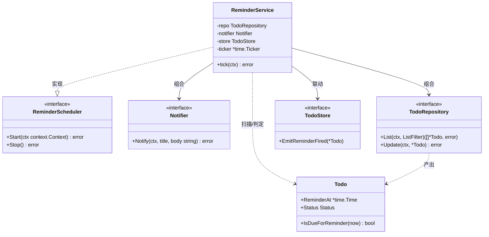
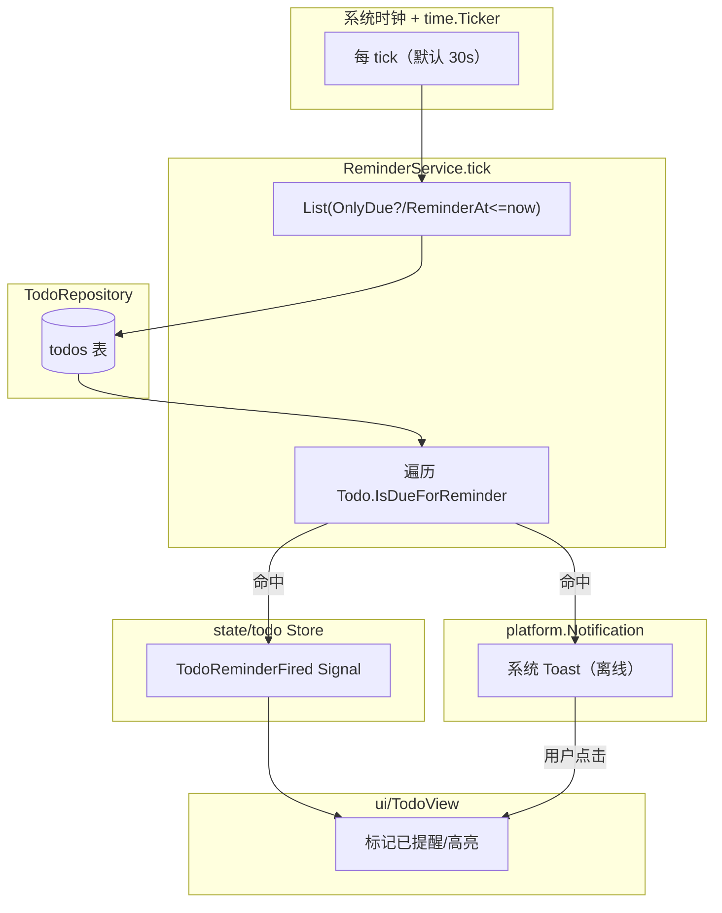
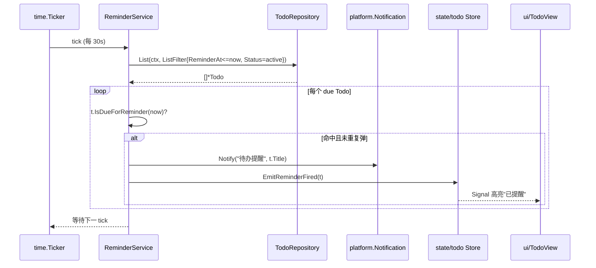
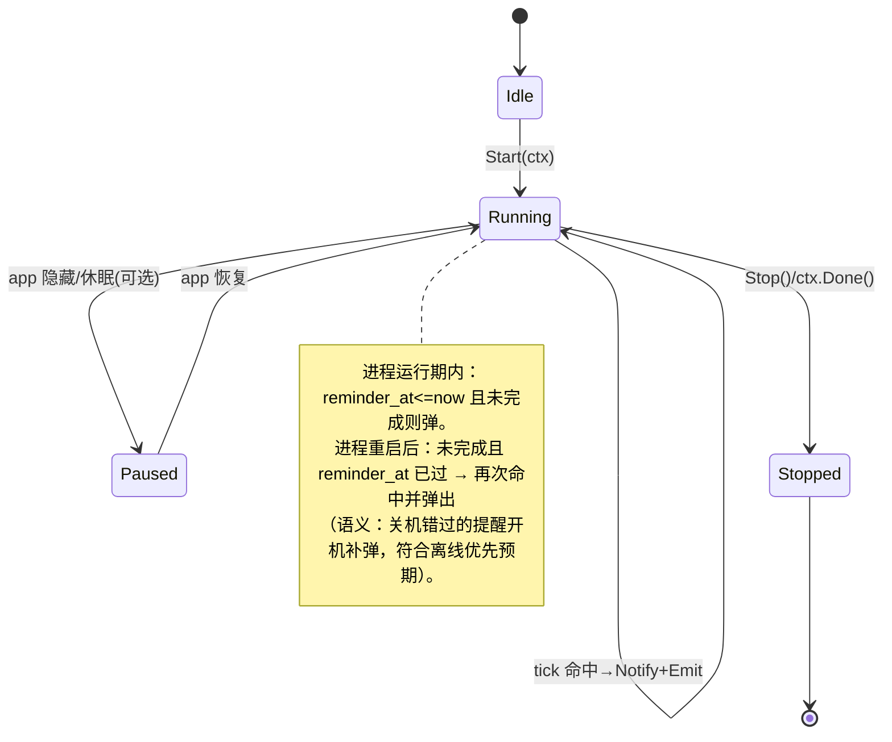

# 60-Todo · Reminder（提醒触发）

> 模块编号：60-Todo ｜ 子主题：Reminder ｜ 版本范围：**Post-MVP (v1.1)**
> 最后更新：2026-07-07
>
> **Post-MVP 标注**：本模块属于路线图 v1.1（待办：SQLite + 提醒），**非 MVP（v1.0）**。提醒调度随 v1.1 落地，依赖 `Model.md` 的领域规则与 `SQLite.md` 的 Repository。

---

## 1. 📦 package 设计

- **包名**：`todo`
- **目录**：`internal/todo`（本文件对应 `reminder.go`，与 `model.go`/`sqlite.go` 同包）
- **职责一句话**：周期性扫描到期提醒，经 `platform.Notification` 弹出系统通知，并联动 `state/todo` Store 刷新；全程离线可用。
- **依赖方向**：
  - 依赖：`internal/todo`（`TodoRepository`/`Todo`/`IsDueForReminder`）、`time`/`context`（标准库）、本地最小 `Notifier` 接口（由 `20-Platform/Notification` 的 `platform.Notification` 实现满足 —— **接口隔离**，不直接依赖 platform 包编译）。
  - 被依赖：`internal/app`（在 wire 阶段 `Start` 调度器）、`internal/state`（todo Store 订阅提醒触发后刷新）。
- **对外暴露的公开符号**：
  - 接口：`ReminderScheduler`、`Notifier`（本地最小接口，供 platform 实现）
  - 类型：`ReminderService`、`SchedulerConfig`
- **边界**：
  - 归它管：定时扫描节奏、到期判定（委托 `Todo.IsDueForReminder`）、调用通知、触发后回写 Store Signal。
  - 不归它管：通知的 Win32 实现（`20-Platform/Notification`）、SQLite 落盘（`SQLite.md`）、gogpu Signal 容器本身（`state/todo`）、UI 渲染（`90-UI`）。
- **关于 `Notification` 的接口隔离**：`20-Platform/Notification`（POST，尚未落文档）定义 `platform.Notification`；本模块仅依赖其方法子集，故在 `todo` 包内声明 `Notifier` 最小接口（`Notify(ctx, title, body string) error`），由 platform 具体类型满足。这样 `todo` 不反向编译依赖 `platform`，符合 `01-总体架构.md` 的依赖方向铁律。

---

## 2. 📐 UML 类图



---

## 3. 🔄 数据流图



- **数据源**：系统时钟驱动的 `time.Ticker`（默认间隔 30s，可配）；离线、无网络。
- **汇点**：系统通知（Win32 Toast，经 `20-Platform`）、`state/todo` Store 的 Signal（驱动 UI 高亮"已提醒"）。
- 触发后**不改写 ReminderAt**（一次提醒只弹一次；若需重复由后续 recurrence 功能扩展），但可经 Store 标记"已提醒"状态以避免重复弹出（幂等：UI 标记 + 内存去重集合，进程重启后由 `ReminderAt < now` 且未完成自然再次命中 —— 此为可接受语义，详见 §8）。

---

## 4. 🎨 UI 原型图（ASCII）

> **N/A**：提醒触发本身无自有 UI，最终呈现是系统 Toast（属于 `20-Platform/Notification`）。下方仅示意 Toast 形态（非本模块产出，供参考）：

```
        ┌─────────────────────────────┐
        │ 🔔 DeskCalendar            ✕ │   ← 系统通知（Win10+ Toast）
        │ ─────────────────────────── │
        │ 待办提醒                     │
        │ • 提交周报  (截止 18:00)     │
        │ • 取快递   (14:30)           │
        └─────────────────────────────┘
              用户点击 → 聚焦日历弹窗 TodoView
```

---

## 5. 🗂 数据库设计

> **N/A**：本模块不持有表结构，只读 `todos` 表（`reminder_at` 列）并经 `TodoRepository` 操作。建表 / 索引见 `SQLite.md` §5。

---

## 6. 📡 Event / Signal 流程

触发时序（mermaid sequenceDiagram）：调度器 tick → 查询到期待办 → 对每个命中项弹通知并广播 Signal。



- **emit 方**：`ReminderService` 在命中后调用 `Notifier.Notify` 与 `TodoStore.EmitReminderFired`。
- **subscribe 方**：`state/todo` Store 订阅后转发给 `ui/TodoView`（`90-UI/TodoView`）做视觉标记。
- **离线可用**：`Notify` 为本地 Win32 Toast，不依赖网络；即使系统通知中心不可用，Store Signal 仍保证应用内标记，提醒语义不丢失。

---

## 7. 🔌 Plugin API

> **N/A**：提醒调度为内部机制，不直接向插件暴露钩子。插件如需感知"提醒触发"，应订阅 `state/todo` Store 的 `TodoReminderFired` Signal（事件总线职责在 `80-Plugin`）。本模块保持内聚，不反向依赖 plugin 包。

---

## 8. 🧩 Feature 生命周期

调度器状态机（idle → running → paused → stopped），与 app 生命周期及"避免重复弹窗"语义一致：



- `Start(ctx)`：启动 `time.Ticker`，首个 tick 立即执行一次（覆盖启动前到期的提醒）。
- `Stop()` / `ctx.Done()`：停止 ticker，释放资源；由 `internal/app` 在退出时调用。
- **幂等保证（进程内）**：用内存 `map[id]struct{}` 记录本次运行已弹过的提醒 ID，避免同一 tick 窗口或多次 tick 重复弹；进程重启后自然重置（旧提醒补弹，符合预期）。

---

## 9. 📖 Go 接口定义

> 以下为可直接粘入 `internal/todo/reminder.go` 的真实 Go 签名。`Notifier` 为本地最小接口，由 `20-Platform/Notification` 的实现满足（接口隔离，不反向依赖 platform 编译）。

```go
package todo

import (
	"context"
	"time"
)

// Notifier 是提醒通知的最小接口（由 20-Platform/Notification 的 platform.Notification 实现满足）。
// 接口隔离：todo 包不反向依赖 platform，仅依赖方法子集。
type Notifier interface {
	// Notify 弹出一条系统通知。title 为标题，body 为内容。
	Notify(ctx context.Context, title, body string) error
}

// TodoStore 是 state/todo Store 对本模块暴露的最小接口，用于广播提醒事件。
type TodoStore interface {
	// EmitReminderFired 在提醒触发后通知 Store，驱动 UI 高亮。
	EmitReminderFired(t *Todo)
}

// SchedulerConfig 调度器配置（Value Object）。
type SchedulerConfig struct {
	Interval     time.Duration // 扫描间隔，默认 30s
	ImmediateRun bool          // 启动即扫描一次，默认 true
}

// ReminderScheduler 提醒调度器接口（可替换/可 mock）。
type ReminderScheduler interface {
	// Start 启动定时扫描；ctx 取消即停止。重复调用返回 error。
	Start(ctx context.Context) error
	// Stop 立即停止（或依赖 ctx.Done）。
	Stop() error
}

// ReminderService 默认实现：组合 Repository + Notifier + Store。
type ReminderService struct {
	repo     TodoRepository
	notifier Notifier
	store    TodoStore
	cfg      SchedulerConfig

	// fired 记录本次运行已弹过的提醒 ID（进程内去重）。
	fired map[string]struct{}
	// cancel 用于 Stop。
	cancel context.CancelFunc
}

// NewReminderService 构造调度器。
func NewReminderService(repo TodoRepository, notifier Notifier, store TodoStore, cfg SchedulerConfig) *ReminderService {
	if cfg.Interval <= 0 {
		cfg.Interval = 30 * time.Second
	}
	return &ReminderService{
		repo:     repo,
		notifier: notifier,
		store:    store,
		cfg:      cfg,
		fired:    make(map[string]struct{}),
	}
}

// Start 实现 ReminderScheduler：启动 ticker 并立即/周期扫描。
func (s *ReminderService) Start(ctx context.Context) error {
	if s.cancel != nil {
		return fmt.Errorf("todo: reminder already started")
	}
	runCtx, cancel := context.WithCancel(ctx)
	s.cancel = cancel
	if s.cfg.ImmediateRun {
		_ = s.tick(runCtx)
	}
	go func() {
		ticker := time.NewTicker(s.cfg.Interval)
		defer ticker.Stop()
		for {
			select {
			case <-runCtx.Done():
				return
			case <-ticker.C:
				_ = s.tick(runCtx)
			}
		}
	}()
	return nil
}

// Stop 实现 ReminderScheduler。
func (s *ReminderService) Stop() error {
	if s.cancel == nil {
		return nil
	}
	s.cancel()
	s.cancel = nil
	return nil
}

// tick 执行一次扫描：查出到期且 active 的待办，逐条弹通知并广播。
func (s *ReminderService) tick(ctx context.Context) error {
	now := time.Now()
	filter := ListFilter{Status: ptr(StatusActive)} // 仅未完成
	todos, err := s.repo.List(ctx, filter)
	if err != nil {
		return fmt.Errorf("todo: reminder scan: %w", err)
	}
	for _, t := range todos {
		if t.ReminderAt == nil || !t.IsDueForReminder(now) {
			continue
		}
		if _, ok := s.fired[t.ID]; ok {
			continue // 进程内去重，避免重复弹
		}
		s.fired[t.ID] = struct{}{}
		body := t.Title
		if t.Due != nil {
			body = fmt.Sprintf("%s（截止 %s）", t.Title, t.Due.Format("15:04"))
		}
		if err := s.notifier.Notify(ctx, "待办提醒", body); err != nil {
			log.Warn("todo: notify failed", "id", t.ID, "err", err)
			continue
		}
		s.store.EmitReminderFired(t)
	}
	return nil
}

// ptr 为 Status 取址辅助（构造 *Status）。
func ptr(s Status) *Status { return &s }
```

> 注：`fmt`、`log`（用 `internal/infra/log` 的 slog 封装）需在导入块补齐；`tick` 中的 `log.Warn` 对应 `slog` 调用风格。

---

## 10. 🚀 Milestone 任务拆分

| 版本 | 任务 | 验收标准 |
|------|------|---------|
| v1.0 (MVP) | — | 本模块属于 v1.1，**待实现**。 |
| **v1.1 (Post-MVP)** | T1. 定义 `Notifier`/`TodoStore` 最小接口 | `todo` 包不反向依赖 `platform`；`platform.Notification` 后续实现满足 `Notifier`。 |
| **v1.1 (Post-MVP)** | T2. 实现 `ReminderService.tick` 到期扫描 | 委托 `Todo.IsDueForReminder`；仅 active 且 `ReminderAt<=now` 命中；单测覆盖命中/未到/已完成分支。 |
| **v1.1 (Post-MVP)** | T3. 接入 `platform.Notification` 弹 Toast | 离线弹通知成功；`Notify` 失败仅记日志不中断扫描。 |
| **v1.1 (Post-MVP)** | T4. 联动 `state/todo` Store 广播 | `EmitReminderFired` 后 `ui/TodoView` 高亮；Signal 流转经 `Model.md` §6 事件。 |
| **v1.1 (Post-MVP)** | T5. 进程内去重 + 启停生命周期 | `fired` 防重复弹；`Start` 立即扫描一次；`Stop`/ctx 取消释放；单测覆盖启停。 |
| v1.2+ | 可选：重复提醒（recurrence）、免打扰时段 | 不阻塞 v1.1；接口保持可逆。 |
