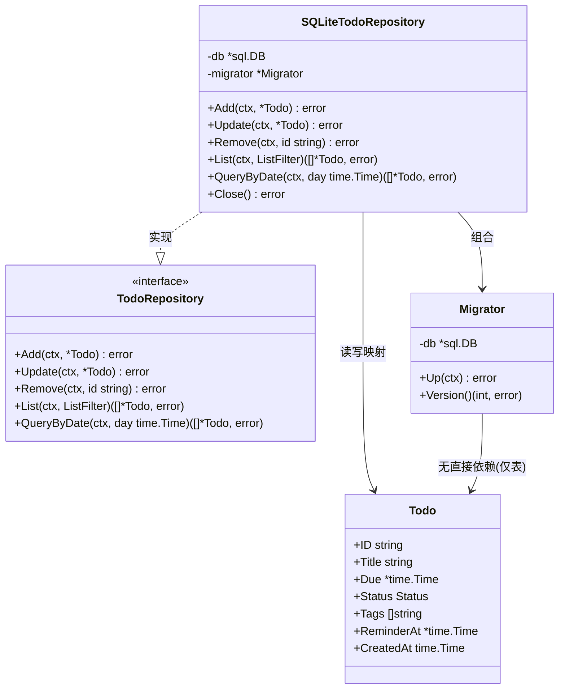
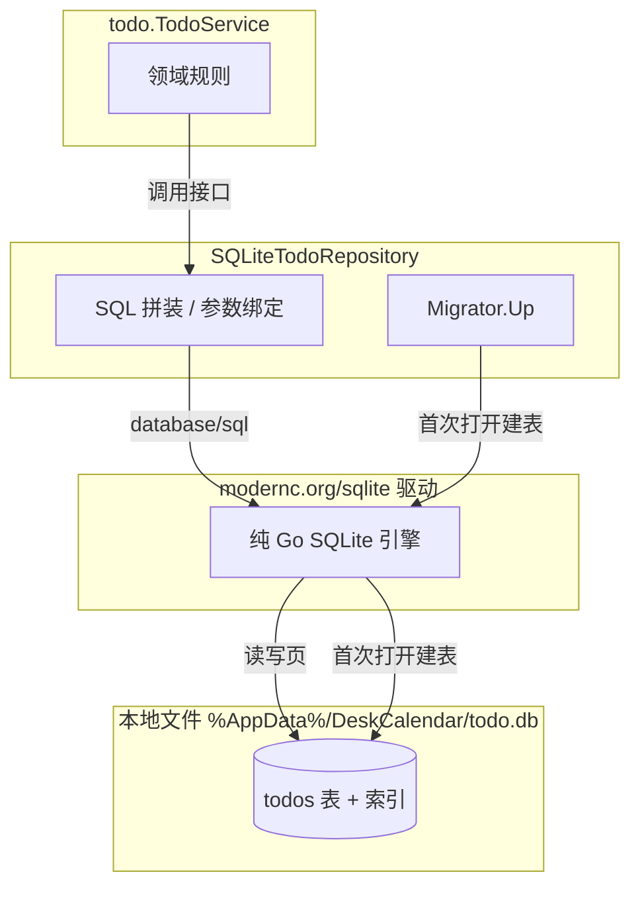
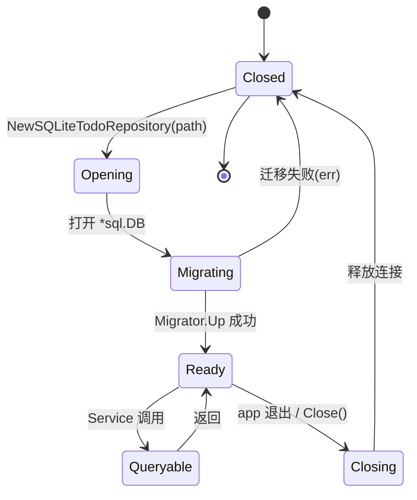

# 60-Todo · SQLite（持久化）

> 模块编号：60-Todo ｜ 子主题：SQLite ｜ 版本范围：**Post-MVP (v1.1)**
> 最后更新：2026-07-07
>
> **Post-MVP 标注**：本模块属于路线图 v1.1（待办：SQLite + 提醒），**非 MVP（v1.0）**。持久化实现随 v1.1 落地。

---

## 1. 📦 package 设计

- **包名**：`todo`
- **目录**：`internal/todo`（本文件对应 `sqlite.go`，与 `model.go` 同包）
- **职责一句话**：以纯 Go、零 CGO 的 `modernc.org/sqlite` 实现 `TodoRepository` 接口，管理 `todos` 表建表、索引与迁移。
- **依赖方向**：
  - 依赖：`database/sql`（标准库）、`modernc.org/sqlite`（纯 Go 驱动，注册名 `"sqlite"`）、`internal/todo`（复用 `Todo`/`ListFilter`/`TodoRepository` 类型）。**不引入任何 CGO。**
  - 被依赖：`internal/todo`（Reminder 调度通过 Repository 读写）、`internal/state`（todo Store 经 Service 间接使用）、`internal/ui`（TodoView 经 Service 使用）。
- **对外暴露的公开符号**：
  - 函数：`NewSQLiteTodoRepository(ctx context.Context, dbPath string) (*SQLiteTodoRepository, error)`
  - 类型：`SQLiteTodoRepository`（实现 `TodoRepository`）、`Migrator`
  - 常量：`schemaVersion`、`driverName = "sqlite"`
- **为什么不用 `mattn/go-sqlite3`**：`mattn/go-sqlite3` 依赖 CGO（`import "C"` + 本地 C 工具链），违反 ADR-01 / ADR-06 的"零 CGO，CGO_ENABLED=0 可编译"硬约束，其 PR 在 `02-开发规范.md` 中被直接拒绝。故选 `modernc.org/sqlite`（100% 纯 Go 翻译版 SQLite，零 CGO、无外部动态库），满足离线优先与单文件分发。

---

## 2. 📐 UML 类图



---

## 3. 🔄 数据流图



- **数据源**：`TodoService` 的命令（增删改查）。
- **汇点**：单文件 SQLite 数据库（位于用户 `AppData`，离线、无网络）。
- 时间字段（`Due`/`ReminderAt`/`CreatedAt`）以 ISO8601（`time.RFC3339`）字符串存储；`Tags` 以 JSON 数组字符串存储（`[]` 表示空）。
- 所有写操作走参数化查询，杜绝 SQL 注入。

---

## 4. 🎨 UI 原型图（ASCII）

> **N/A**：持久化层无界面。Todo 列表/编辑 UI 见 `90-UI/TodoView`；本模块只负责数据落盘与读取。

---

## 5. 🗂 数据库设计

数据库文件：`%AppData%/DeskCalendar/todo.db`（单文件，随应用卸载可删）。

### 建表 SQL（CREATE TABLE）

```sql
-- todos 表：待办聚合持久化
CREATE TABLE IF NOT EXISTS todos (
    id          TEXT PRIMARY KEY,                              -- Todo.ID (UUID v4)
    title       TEXT NOT NULL,                                 -- 标题
    due         TEXT,                                          -- 截止时间 RFC3339，NULL 表示无期限
    status      TEXT NOT NULL DEFAULT 'active' CHECK(status IN ('active','done')),
    tags        TEXT NOT NULL DEFAULT '[]',                    -- JSON 数组字符串
    reminder_at TEXT,                                          -- 提醒时间 RFC3339，NULL 表示不提醒
    created_at  TEXT NOT NULL                                  -- 创建时间 RFC3339
);

-- 索引：按状态过滤（列表常按 active 过滤）
CREATE INDEX IF NOT EXISTS idx_todos_status ON todos(status);
-- 索引：按截止时间排序/区间查询（QueryByDate、List From/To）
CREATE INDEX IF NOT EXISTS idx_todos_due ON todos(due);
-- 索引：提醒扫描（Reminder 定时 QueryByDate/List 命中 reminder_at）
CREATE INDEX IF NOT EXISTS idx_todos_reminder_at ON todos(reminder_at);
```

### 字段含义

| 字段 | 类型 | 含义 | 可空 |
|------|------|------|------|
| `id` | TEXT PK | 唯一标识 | 否 |
| `title` | TEXT | 标题 | 否 |
| `due` | TEXT | 截止时间（RFC3339） | 是 |
| `status` | TEXT | `active`/`done`，CHECK 约束 | 否 |
| `tags` | TEXT | JSON 数组字符串，默认 `[]` | 否 |
| `reminder_at` | TEXT | 提醒时间（RFC3339） | 是 |
| `created_at` | TEXT | 创建时间（RFC3339） | 否 |

### 迁移策略（Migrator）

- 引入 `schema_migrations(version INTEGER PRIMARY KEY, applied_at TEXT)` 表记录当前 schema 版本。
- 采用 **up-only、向前兼容** 的线性迁移：每次 `NewSQLiteTodoRepository` 打开连接后调用 `Migrator.Up(ctx)`，按 `version` 顺序执行未应用的迁移语句。
- v1.1 初始 `schemaVersion = 1`（即上表）。后续如需加列（如 `recurrence`），仅追加 ALTER 迁移，不删除/重命名既有列，保证旧库可平滑升级（可逆）。
- 迁移失败返回 error，阻止应用以不一致 schema 启动；不自动DROP，避免数据丢失。

---

## 6. 📡 Event / Signal 流程

> **N/A（说明）**：`SQLiteTodoRepository` 是副作用型持久化，自身不持有也不广播 gogpu Signal。领域事件（`TodoCreated` 等）由 `TodoService` 在调用 Repository 成功之后委托 `state/todo` Store 广播（见 `Model.md` §6）。本层仅对返回 error 做日志（经 `internal/infra/log`），不主动触发副作用。

---

## 7. 🔌 Plugin API

> **N/A**：持久化实现不直接向插件暴露钩子。插件对 Todo 数据的访问应通过 `TodoService` 接口与 `state/todo` Store 的 Signal（见 `Model.md` §7、`80-Plugin`），本层保持单一职责。

---

## 8. 🧩 Feature 生命周期

Repository 的开启 → 迁移 → 就绪 → 关闭 生命周期（与 `app` 生命周期对齐）：



- 打开在 `app` 初始化阶段（`internal/app` wire）一次性完成。
- 关闭在 `app` 优雅退出时调用 `(*SQLiteTodoRepository).Close()`，释放 `*sql.DB`，避免句柄泄漏。
- 数据库文件缺失时自动创建（连同建表），符合零配置、离线可用。

---

## 9. 📖 Go 接口定义

> 以下为可直接粘入 `internal/todo/sqlite.go` 的真实 Go 签名（依赖 `modernc.org/sqlite`，纯 Go 零 CGO）。

```go
package todo

import (
	"context"
	"database/sql"
	"time"

	_ "modernc.org/sqlite" // 纯 Go 驱动，注册名 "sqlite"，零 CGO
)

const (
	driverName   = "sqlite"
	schemaVersion = 1
	dbFileName   = "todo.db"
)

// SQLiteTodoRepository 以 modernc.org/sqlite 实现 TodoRepository。
// 所有时间字段以 time.RFC3339 字符串存储；Tags 以 JSON 数组字符串存储。
type SQLiteTodoRepository struct {
	db *sql.DB
}

// NewSQLiteTodoRepository 打开（必要时创建）数据库并执行迁移。
// dbPath 为数据库文件完整路径，如 %AppData%/DeskCalendar/todo.db。
func NewSQLiteTodoRepository(ctx context.Context, dbPath string) (*SQLiteTodoRepository, error) {
	db, err := sql.Open(driverName, dbPath)
	if err != nil {
		return nil, fmt.Errorf("todo: open sqlite: %w", err)
	}
	// 单文件桌面程序，连接数保持 1 即可
	db.SetMaxOpenConns(1)
	if err := db.PingContext(ctx); err != nil {
		_ = db.Close()
		return nil, fmt.Errorf("todo: ping sqlite: %w", err)
	}
	repo := &SQLiteTodoRepository{db: db}
	if err := repo.migrate(ctx); err != nil {
		_ = db.Close()
		return nil, fmt.Errorf("todo: migrate: %w", err)
	}
	return repo, nil
}

// Add 插入一条待办。
func (r *SQLiteTodoRepository) Add(ctx context.Context, t *Todo) error {
	const q = `INSERT INTO todos(id,title,due,status,tags,reminder_at,created_at)
               VALUES(?,?,?,?,?,?,?)`
	_, err := r.db.ExecContext(ctx, q,
		t.ID, t.Title, isoOrNil(t.Due), string(t.Status),
		tagsToJSON(t.Tags), isoOrNil(t.ReminderAt), t.CreatedAt.Format(time.RFC3339))
	if err != nil {
		return fmt.Errorf("todo: add: %w", err)
	}
	return nil
}

// Update 按 ID 全量更新。
func (r *SQLiteTodoRepository) Update(ctx context.Context, t *Todo) error {
	const q = `UPDATE todos SET title=?,due=?,status=?,tags=?,reminder_at=? WHERE id=?`
	res, err := r.db.ExecContext(ctx, q,
		t.Title, isoOrNil(t.Due), string(t.Status),
		tagsToJSON(t.Tags), isoOrNil(t.ReminderAt), t.ID)
	if err != nil {
		return fmt.Errorf("todo: update: %w", err)
	}
	if n, _ := res.RowsAffected(); n == 0 {
		return ErrNotFound
	}
	return nil
}

// Remove 按 ID 删除。
func (r *SQLiteTodoRepository) Remove(ctx context.Context, id string) error {
	res, err := r.db.ExecContext(ctx, `DELETE FROM todos WHERE id=?`, id)
	if err != nil {
		return fmt.Errorf("todo: remove: %w", err)
	}
	if n, _ := res.RowsAffected(); n == 0 {
		return ErrNotFound
	}
	return nil
}

// List 按过滤条件查询。
func (r *SQLiteTodoRepository) List(ctx context.Context, filter ListFilter) ([]*Todo, error) {
	where, args := buildListWhere(filter) // 参数化组合，杜绝注入
	rows, err := r.db.QueryContext(ctx,
		`SELECT id,title,due,status,tags,reminder_at,created_at FROM todos`+where+` ORDER BY due IS NULL, due ASC, created_at ASC`,
		args...)
	if err != nil {
		return nil, fmt.Errorf("todo: list: %w", err)
	}
	defer rows.Close()
	return scanTodos(rows)
}

// QueryByDate 返回 Due 落在 day 本地日界 [00:00, 24:00) 的待办。
func (r *SQLiteTodoRepository) QueryByDate(ctx context.Context, day time.Time) ([]*Todo, error) {
	start := time.Date(day.Year(), day.Month(), day.Day(), 0, 0, 0, 0, day.Location())
	end := start.Add(24 * time.Hour)
	rows, err := r.db.QueryContext(ctx,
		`SELECT id,title,due,status,tags,reminder_at,created_at FROM todos
         WHERE due >= ? AND due < ? ORDER BY due ASC`,
		start.Format(time.RFC3339), end.Format(time.RFC3339))
	if err != nil {
		return nil, fmt.Errorf("todo: query by date: %w", err)
	}
	defer rows.Close()
	return scanTodos(rows)
}

// Close 释放数据库连接（app 退出时调用）。
func (r *SQLiteTodoRepository) Close() error {
	if r.db == nil {
		return nil
	}
	return r.db.Close()
}

// —— 内部辅助（示意签名，真实实现需 time/encoding/json）——
// isoOrNil 将 *time.Time 转为 RFC3339 或 NULL 占位。
// tagsToJSON 将 []string 序列化为 JSON 数组字符串。
// scanTodos 将行扫描为 []*Todo（due/reminder_at 空字符串解析为 nil）。
// buildListWhere 依 ListFilter 拼装参数化 WHERE 片段。
// migrate 执行 Migrator.Up（见 §5 迁移策略）。
```

> 注：`fmt` 与 `encoding/json` 需在导入块中补齐；上述辅助函数以真实可编译风格给出签名，落地时实现约 40 行。

---

## 10. 🚀 Milestone 任务拆分

| 版本 | 任务 | 验收标准 |
|------|------|---------|
| v1.0 (MVP) | — | 本模块属于 v1.1，**待实现**。 |
| **v1.1 (Post-MVP)** | T1. 引入 `modernc.org/sqlite` 依赖并验证 `CGO_ENABLED=0` 构建通过 | `go build` 无 CGO；CI 零 CGO 检查通过（对比 `mattn/go-sqlite3` 被拒）。 |
| **v1.1 (Post-MVP)** | T2. 实现 `todos` 表建表 + 三索引 | 首次启动自动建表；PRAGMA 校验列/索引存在。 |
| **v1.1 (Post-MVP)** | T3. 实现 `Migrator`（schema_migrations + up-only） | 空库→v1 自动迁移；重复启动幂等；字段类型与 CHECK 约束生效。 |
| **v1.1 (Post-MVP)** | T4. 实现 `SQLiteTodoRepository` 五个方法 | 参数化查询无注入；QueryByDate 日界正确；Update/Remove 对不存在 ID 返回 `ErrNotFound`。 |
| **v1.1 (Post-MVP)** | T5. 内存 fake + 单测 | Repository 单测覆盖率 ≥ 80%（`model.go` 规则 + 本实现）；fake 供 Reminder/UI 单测复用。 |
| v1.2+ | 可选：重复待办列、全文索引 | 仅追加迁移，不破坏 v1.1 schema（可逆）。 |
