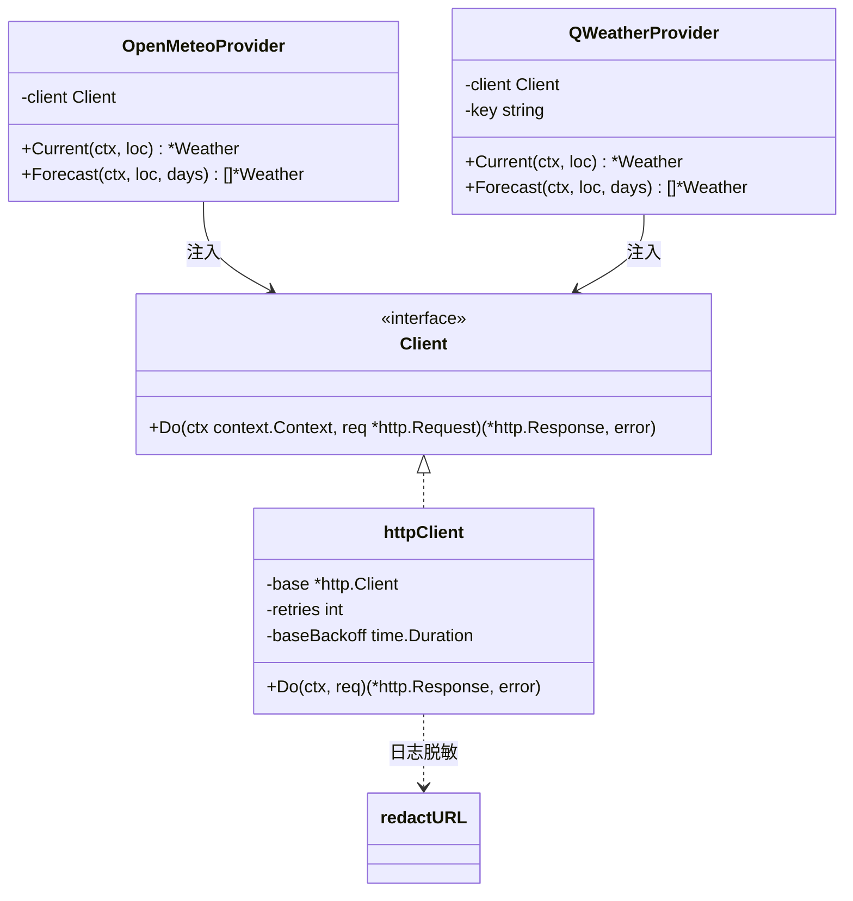
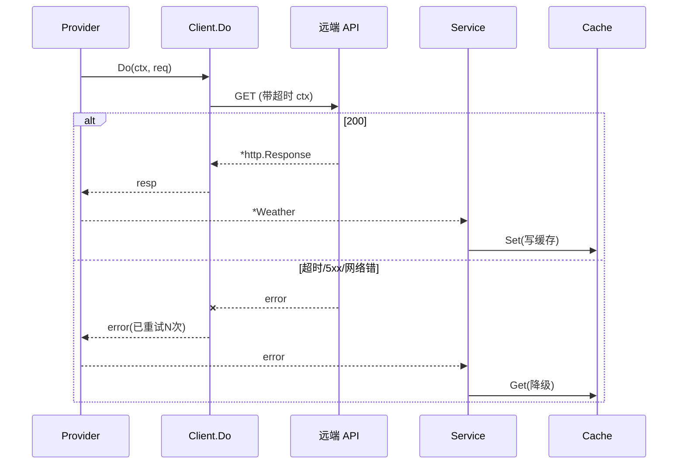
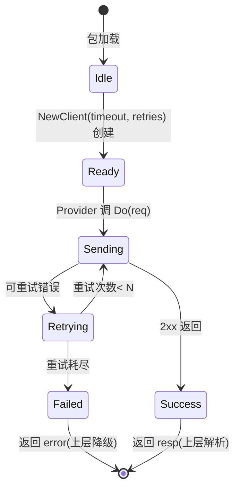

# 70-Weather · API（HTTP 封装：超时 / 重试 / 降级 / 不泄露 key）

> 模块：`internal/weather` ｜ 范围：**Post-MVP（v1.2）** ｜ 最后更新：2026-07-07
> 关联：`Provider.md`（`OpenMeteoProvider`/`QWeatherProvider` 调用本封装）、`Cache.md`（失败回退）、ADR-05b（免 key + 填 key 切换）、ADR-06（零 CGO）

本文描述天气的**网络请求封装层**：基于标准库 `net/http` 的 `Client` 接口，统一提供 `context` 超时、有限次重试、失败即由上层降级（→缓存→空）的策略；并说明 Open-Meteo 与和风在请求构造上的差异，以及 key 的脱敏保护。纯 Go、零 CGO，无第三方 HTTP 库。

---

## 1. 📦 package 设计

- **包名**：`weather`（与 `Provider.md`/`Cache.md` 同包，文件 `api.go`；满足"Go 包名 internal/weather"）。
- **一句话职责**：把"坐标 + 参数"变成对 Open-Meteo / 和风的 HTTP 请求，并施加超时、重试、key 脱敏；请求失败只返回 `error`，**不直接做降级**（降级归 `Service`+`Cache`）。
- **依赖方向**：
  - `weather(api)` → `net/http`（标准库，零 CGO）、`internal/infra/log`（脱敏日志）
  - `weather(api)` 被 `OpenMeteoProvider` / `QWeatherProvider` 依赖（`provider.go`/`openmeteo.go`/`qweather.go`）。
  - **不依赖** `Cache`（避免循环：API 只管发请求，降级由调用方决定）、UI、gogpu。
- **对外公开符号**：`Client`（接口）、`NewClient`、`httpClient`（实现）、`BuildOpenMeteoURL`、`BuildQWeatherURL`、`redactURL`。
- **边界**：管"怎么发请求、怎么重试、URL 怎么拼、key 怎么藏"；**不管** 响应如何解析为 `Weather`（归各 Provider）、**不管** 失败后用缓存还是隐藏（归 `Service`）。

---

## 2. 📐 UML 类图



- `Client` 接口化便于单测（fake client 注入 200/500/超时），满足 `02-开发规范` §4 可测性。
- 两 Provider 通过构造器接收 `Client`，不直接 `http.Get`，便于 mock。

---

## 3. 🔄 数据流图

```mermaid
flowchart TD
    P[Provider.Current/Forecast] --> B["Build URL(坐标+参数)"]
    B -->|"Open-Meteo: 无 key"| U1[api.open-meteo.com/v1/forecast]
    B -->|"和风: ?key=***"| U2[devapi.qweather.com/v7/weather/...]
    U1 --> CLI[Client.Do]
    U2 --> CLI
    CLI -->|"ctx 超时 / 重试≤N"| NET[(远端 API)]
    NET -->|"2xx + 200"| OK["返回 *http.Response"]
    NET -->|"5xx/超时/网络错"| FAIL["返回 error"]
    OK --> P
    FAIL -->|"上层降级→Cache→空"| DEG[Service 处理]

    subgraph 降级链(调用方)
      FAIL --> C[Cache.Get 旧数据]
      C -->|命中| STALE[Stale]
      C -->|miss| DIS[Disabled/空]
    end
```

**坐标→请求**：`Location{Lat,Lng}` → `Build*URL` 拼成查询串；Open-Meteo 用 `latitude/longitude`，和风用 `location=lng,lat`（注意**经纬度顺序相反**）。

---

## 4. 🎨 UI 原型图（ASCII）

API 层无 UI；其在界面上的唯一可见痕迹是"请求中/失败"经 `Service` 转成的状态。这里画出**请求状态→UI 文案**的映射（渲染归 `90-UI`）：

```
网络请求经 API 层的结果：

 Do() 成功 200  ──► Service 写缓存 ──► [☀ 23° 晴]        (Ready)
 Do() 超时/5xx ──► Service 读缓存 ──► [🌥 21° ·旧数据]    (Stale, 降级)
 Do() 错+无缓存 ──► Service Disabled ─► [ — 天气不可用 ]   (Disabled)

调试可见性（仅 log/slog，不弹窗）：
 [debug] GET api.open-meteo.com/...            ← 免 key，可打印
 [debug] GET devapi.qweather.com/v7/weather/now?location=...&key=***REDACTED***  ← key 脱敏
 [warn ] weather: qweather 503, retry 1/2
 [error] weather: open-meteo timeout, degrade to cache
```

---

## 5. 🗂 数据库设计

**N/A** —— API 层只发 HTTP 请求，不持久化任何数据；持久化由 `Cache.md` 负责。无 SQL / 无 schema。

---

## 6. 📡 Event / Signal 流程

API 层不直接 emit Signal（保持纯网络）。它只通过 `Do` 的返回影响 Provider → `Service` → `weatherSignal`（见 `Provider.md` §6）。本层在链路中的角色是"网络出口"：



- **谁触发请求**：仅 Provider（由 `Service.Refresh` 调用）。
- **重试语义**：仅在**可重试错误**（网络错、5xx、超时 context.DeadlineExceeded）时重试；4xx（含和风 401/403 key 错）**不重试**，直接 error 交上层判 Disabled。
- **副作用**：仅网络 I/O 与脱敏日志；不写文件、不触 UI。

---

## 7. 🔌 Plugin API

**N/A** —— 同 `Provider.md` §7 / `Cache.md` §7：插件系统（v1.4）经 `state.weatherSignal` 读状态；API 层无需暴露钩子。

---

## 8. 🧩 Feature 生命周期



- **可逆/无害**：`Client` 无状态、可丢弃；重试次数与超时可配，不影响其他模块。
- **不泄漏**：key 仅出现在和风请求的 query，永不进日志原文（见 `redactURL`）。

---

## 9. 📖 Go 接口定义

```go
package weather

import (
	"context"
	"fmt"
	"io"
	"net/http"
	"net/url"
	"strings"
	"time"
)

// Client 网络请求接口（便于单测注入 fake）。
type Client interface {
	Do(ctx context.Context, req *http.Request) (*http.Response, error)
}

// NewClient 创建带超时与有限重试的 Client。
// timeout 作用于每个请求的 context；retries 为额外重试次数（默认 2）。
func NewClient(timeout time.Duration, retries int) Client {
	if timeout <= 0 {
		timeout = 8 * time.Second
	}
	if retries < 0 {
		retries = 0
	}
	return &httpClient{
		base:         &http.Client{Timeout: timeout},
		retries:      retries,
		baseBackoff: 300 * time.Millisecond,
	}
}

type httpClient struct {
	base         *http.Client
	retries      int
	baseBackoff  time.Duration
}

// Do 发送请求：超时由 req 自带的 ctx 控制；遇可重试错误重试 retries 次，
// 指数退避（300ms, 600ms, ...）。4xx 不重试，直接返回 error。
func (c *httpClient) Do(ctx context.Context, req *http.Request) (*http.Response, error) {
	var lastErr error
	for attempt := 0; attempt <= c.retries; attempt++ {
		// 每个重试都用独立的、带超时的 ctx 克隆，避免复用已取消的 ctx。
		reqClone := req.Clone(ctx)
		resp, err := c.base.Do(reqClone)
		if err == nil {
			if resp.StatusCode >= 500 {
				resp.Body.Close()
				lastErr = fmt.Errorf("weather: upstream 5xx %d", resp.StatusCode)
				// 落入重试
			} else {
				return resp, nil // 2xx/3xx/4xx 都交上层（4xx 不重试）
			}
		} else {
			lastErr = err
		}
		if attempt < c.retries {
			backoff := c.baseBackoff * time.Duration(attempt+1)
			select {
			case <-ctx.Done():
				return nil, ctx.Err()
			case <-time.After(backoff):
			}
		}
	}
	return nil, fmt.Errorf("weather: request failed after %d retries: %w", c.retries, lastErr)
}

// BuildOpenMeteoURL 拼 Open-Meteo 请求（免 key）。
// 实况 + 每日预报；timezone=auto 由 API 按坐标推断。
func BuildOpenMeteoURL(loc Location, days int) string {
	q := url.Values{}
	q.Set("latitude", fmt.Sprintf("%.4f", loc.Lat))
	q.Set("longitude", fmt.Sprintf("%.4f", loc.Lng))
	q.Set("current", "temperature_2m,relative_humidity_2m,apparent_temperature,weather_code,wind_speed_10m,wind_direction_10m,is_day,pressure_msl")
	q.Set("daily", "weather_code,temperature_2m_max,temperature_2m_min,precipitation_probability_max")
	q.Set("timezone", "auto")
	if days > 0 {
		q.Set("forecast_days", fmt.Sprintf("%d", days))
	}
	return "https://api.open-meteo.com/v1/forecast?" + q.Encode()
}

// BuildQWeatherURL 拼和风请求（带 key，注意 location 是 "lng,lat" 顺序）。
// kind=now 实况；kind=3d/7d 预报。key 必须来自配置，不得硬编码。
func BuildQWeatherURL(loc Location, kind string, key string) string {
	base := "https://devapi.qweather.com/v7/weather/" + kind
	q := url.Values{}
	q.Set("location", fmt.Sprintf("%.4f,%.4f", loc.Lng, loc.Lat)) // 注意：经度在前
	q.Set("key", key)
	return base + "?" + q.Encode()
}

// redactURL 用于日志：把 query 中的 key 值替换为 ***，避免 key 泄露到 stdout/日志。
func redactURL(raw string) string {
	u, err := url.Parse(raw)
	if err != nil {
		return "***"
	}
	q := u.Query()
	if q.Get("key") != "" {
		q.Set("key", "***REDACTED***")
		u.RawQuery = q.Encode()
	}
	return u.String()
}

// 便捷拉取并限制响应体大小（防异常大响应），供 Provider 调用。
func readBody(resp *http.Response, maxBytes int64) ([]byte, error) {
	defer resp.Body.Close()
	return io.ReadAll(io.LimitReader(resp.Body, maxBytes))
}
```

**Provider 调用示例（节选自 `openmeteo.go` / `qweather.go`）**：

```go
func (p *OpenMeteoProvider) Current(ctx context.Context, loc Location) (*Weather, error) {
	u := BuildOpenMeteoURL(loc, 1)
	req, err := http.NewRequestWithContext(ctx, http.MethodGet, u, nil)
	if err != nil {
		return nil, err
	}
	resp, err := p.client.Do(ctx, req) // 超时/重试已由 Client 处理
	if err != nil {
		return nil, err // 上层 Service 转降级
	}
	if resp.StatusCode != http.StatusOK {
		return nil, fmt.Errorf("open-meteo: status %d", resp.StatusCode)
	}
	body, err := readBody(resp, 256<<10)
	if err != nil {
		return nil, err
	}
	return parseOpenMeteoCurrent(body, loc) // 解析为归一化 Weather（实现略）
}

func (p *QWeatherProvider) Current(ctx context.Context, loc Location) (*Weather, error) {
	u := BuildQWeatherURL(loc, "now", p.key)
	log.Debug("qweather request", "url", redactURL(u)) // 脱敏日志
	req, _ := http.NewRequestWithContext(ctx, http.MethodGet, u, nil)
	resp, err := p.client.Do(ctx, req)
	if err != nil {
		return nil, err
	}
	if resp.StatusCode == http.StatusUnauthorized || resp.StatusCode == http.StatusForbidden {
		return nil, fmt.Errorf("qweather: invalid key (status %d)", resp.StatusCode) // 不重试
	}
	// ... 解析（同 Open-Meteo 思路，映射到同一 Weather 结构）
}
```

---

## 10. 🚀 Milestone 任务拆分

| 版本 | 任务 | 验收标准 |
|------|------|----------|
| v1.0 (MVP) | 不实现；接口预留 | — |
| **v1.2 (Post-MVP)** | A1 实现 `Client` 接口 + `httpClient`（超时 + 有限重试 + 退避） | 单测：注入 fake client 模拟 503/超时，验证重试次数与退避 |
| **v1.2** | A2 实现 `BuildOpenMeteoURL`（免 key） | 输出 URL 可被 Open-Meteo 接受；单测断言参数完整 |
| **v1.2** | A3 实现 `BuildQWeatherURL`（key + lng,lat 顺序） | 单测断言 location 顺序与 key 存在 |
| **v1.2** | A4 实现 `redactURL` 与脱敏日志 | 日志中 key 不出现明文；单测断言脱敏 |
| **v1.2** | A5 4xx 不重试 / 5xx 重试语义 + `readBody` 限大小 | 单测覆盖 401/403 直错、500 重试、超 256KB 截断 |
| **v1.2** | A6 两 Provider 经 `Client` 发请求并映射 `Weather` | 端到端：Open-Meteo 实况成功；和风填 key 切换后成功 |
| v1.4 (Plugin) | （可选）无需改动 | — |
| v1.5 (Release) | 零 CGO 构建 + 网络层集成测试 | `CGO_ENABLED=0` 通过；CI mock 远端验证降级链 |

> **Post-MVP 标注**：HTTP 封装属 v1.2，是天气"异步 + 限频 + 离线降级"硬约束（`ADR-05b`）的网络出口实现；默认 Open-Meteo 免 key，填 key 自动切和风，调用方零改动。
