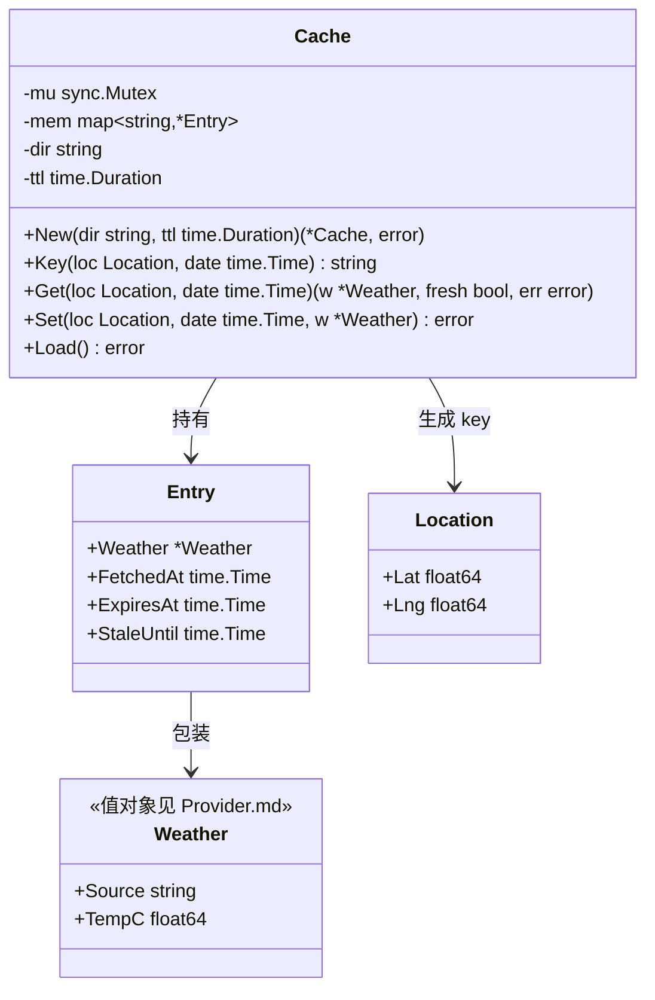
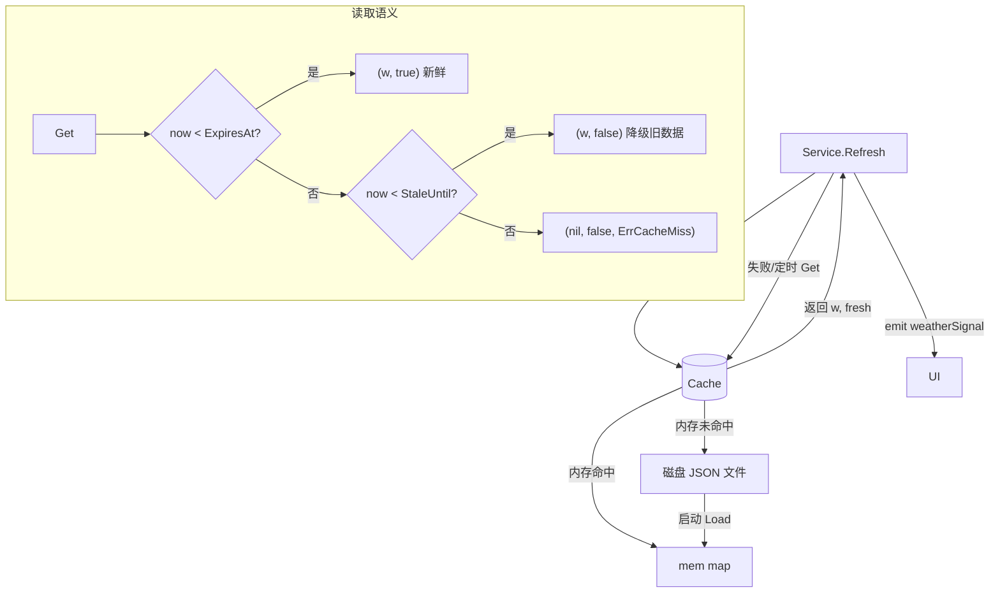
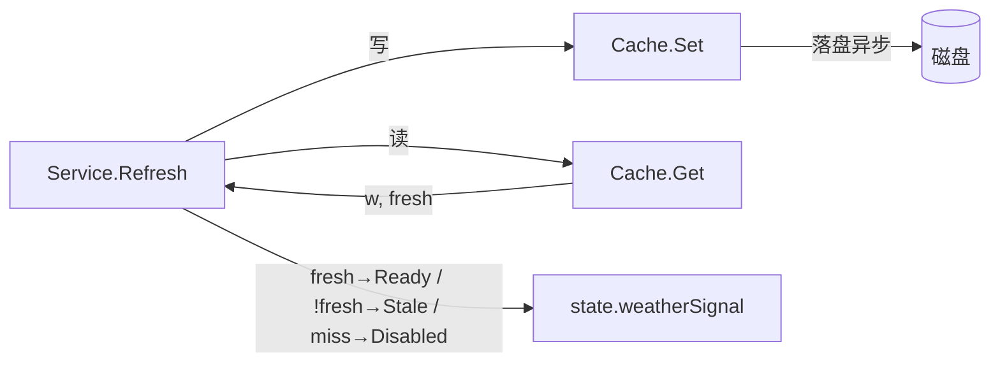
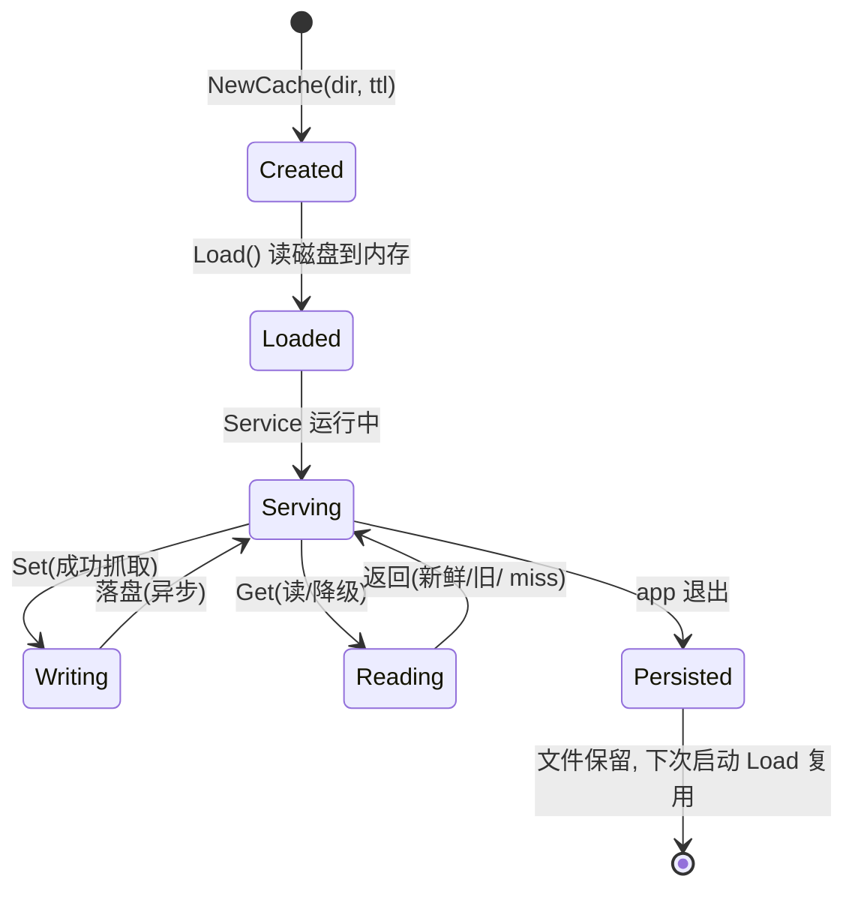

# 70-Weather · Cache（内存 + 磁盘缓存与优雅降级）

> 模块：`internal/weather` ｜ 范围：**Post-MVP（v1.2）** ｜ 最后更新：2026-07-07
> 关联：`Provider.md`（Service 调用本缓存）、`API.md`（网络失败时回退此处）、ADR-05b（天气必须优雅降级）

本文描述天气的**缓存与降级策略**：内存 `map` + 磁盘 JSON 文件双级存储，TTL 默认 30 分钟；断网/超时时返回**最后缓存**（graceful degradation），保证日历主流程永远不被天气阻塞。纯 Go 实现，零 CGO。

---

## 1. 📦 package 设计

- **包名**：`weather`（与 `Provider.md`/`API.md` 同包，文件 `cache.go`；满足"Go 包名 internal/weather"）。
- **一句话职责**：以"坐标 + 日期"为键缓存天气；提供新鲜读取与降级读取（过期仍可用），并持久化到磁盘以支持进程重启后即时降级。
- **依赖方向**：
  - `weather(cache)` → `internal/infra/log`（缓存命中/失效/磁盘读写日志）
  - `weather(cache)` 被 `Service`（`provider.go`）依赖：`Set` 写、`Get` 读。
  - **不依赖** 网络（`api.go`）、UI、gogpu。
- **对外公开符号**：`Cache`、`NewCache`、`(*Cache) Key`、`(*Cache) Get`、`(*Cache) Set`、`(*Cache) Load`、`Entry`、`ErrCacheMiss`。
- **边界**：管"存什么、存多久、怎么取降级值、落盘格式"；**不管** 何时刷新（归 `Service`）、**不管** 数据从哪来（归 `Provider`/`API`）。`Weather` 类型定义见 `Provider.md`。

---

## 2. 📐 UML 类图



- `Entry` 区分 `ExpiresAt`（新鲜截止）与 `StaleUntil`（降级可用截止，通常 = `ExpiresAt + 宽限`，如 TTL 的 2 倍或 24h），实现"断网也能看旧数据"。
- 磁盘文件即 `Entry` 的 JSON 序列化，文件名 = `Key()` 的 URL-safe 编码。

---

## 3. 🔄 数据流图



**降级链（与 API.md 协同）**：网络失败 → `Service` 调 `Get` → 命中旧缓存返回 `fresh=false` → UI 显示 stale 角标；完全无缓存 → `ErrCacheMiss` → `Service` 置 `Status=Disabled` → UI 隐藏天气块。

---

## 4. 🎨 UI 原型图（ASCII）

缓存状态直接影响 UI 呈现（由 `90-UI` 渲染，本包仅提供状态）：

```
当前状态来自 Cache.Get 的 fresh 标志：

 fresh=true  (Ready)         fresh=false (Stale 降级)        ErrCacheMiss (Disabled)
 ┌──────────────────┐        ┌──────────────────┐           ┌──────────────────┐
 │ [☀ 23° 晴 海淀]  │        │ [🌥 21° 晴 海淀] │           │ [ —  天气不可用 ] │
 │   体感21° 湿度40% │        │  ·旧数据 30分钟前│           │   (整块隐藏/占位) │
 └──────────────────┘        └──────────────────┘           └──────────────────┘
   正常显示                      角标"旧数据"，不报错            绝不阻塞日历网格
```

---

## 5. 🗂 数据库设计

**N/A（关系型 SQL）** —— 天气缓存**不接入 SQLite**（SQLite 归 `60-Todo`）。本缓存采用"内存 `map` + 磁盘 JSON 文件"的轻量持久化，纯 Go、零 CGO、无需 schema 迁移。磁盘布局如下（非 SQL，供实现参考）：

```
%AppData%/DeskCalendar/weather-cache/
├── 39.9042,116.4074@2026-07-07.json   ← 当日实况+预报（Key 编码）
├── 39.9042,116.4074@2026-07-08.json
└── ...
```

单文件结构（= `Entry` JSON）：

```json
{
  "weather": { "source": "open-meteo", "temp_c": 23.1, "condition_code": "clear", "...": "..." },
  "fetched_at": "2026-07-07T10:00:00+08:00",
  "expires_at": "2026-07-07T10:30:00+08:00",
  "stale_until": "2026-07-08T10:00:00+08:00"
}
```

字段含义：`weather`=归一化天气；`fetched_at`=抓取时间；`expires_at`=新鲜截止（TTL 后）；`stale_until`=降级宽限截止（超此时间视为彻底失效，返回 `ErrCacheMiss`）。

---

## 6. 📡 Event / Signal 流程

缓存本身不 emit Signal（保持纯存储）。它只通过返回值影响 `Service`，由 `Service` 再 emit `weatherSignal`（见 `Provider.md` §6）。本模块在 Signal 链路中的角色是"数据供给方"：



- **谁触发缓存写**：仅 `Service.Refresh` 成功后。
- **谁触发缓存读**：`Service.Refresh`、面板 `OnShow`、定时器。
- **副作用**：仅磁盘 I/O（异步、带 `sync.Mutex` 保护内存），不影响 UI 线程。

---

## 7. 🔌 Plugin API

**N/A** —— 同 `Provider.md` §7：插件系统（v1.4）经 `state.weatherSignal` 读取天气状态，缓存层无需向插件暴露任何钩子，本包不因此改动。

---

## 8. 🧩 Feature 生命周期



- **可逆/可重建**：缓存文件属可丢弃产物（缓存而非源数据），删除后下次刷新自动重建；不影响核心日历。
- **降级不丢失**：进程崩溃重启后 `Load()` 恢复磁盘缓存，首个面板弹出即可显示旧天气（若仍在 `StaleUntil` 内），无需等待网络。

---

## 9. 📖 Go 接口定义

```go
package weather

import (
	"encoding/json"
	"fmt"
	"os"
	"path/filepath"
	"strings"
	"sync"
	"time"
)

// ErrCacheMiss 表示既无新鲜数据也无可用旧缓存。
var ErrCacheMiss = fmt.Errorf("weather: cache miss")

// Entry 单条缓存记录（同时是磁盘 JSON 的结构）。
type Entry struct {
	Weather    *Weather  `json:"weather"`
	FetchedAt  time.Time `json:"fetched_at"`
	ExpiresAt  time.Time `json:"expires_at"`  // 新鲜截止（TTL 之后）
	StaleUntil time.Time `json:"stale_until"` // 降级宽限截止
}

// Cache 内存 + 磁盘双级缓存。并发安全（sync.Mutex 保护 mem）。
type Cache struct {
	mu  sync.Mutex
	mem map[string]*Entry
	dir string
	ttl time.Duration
}

// NewCache 创建缓存；dir 不存在则创建。ttl 默认 30min。
func NewCache(dir string, ttl time.Duration) (*Cache, error) {
	if ttl <= 0 {
		ttl = 30 * time.Minute
	}
	if err := os.MkdirAll(dir, 0o700); err != nil {
		return nil, fmt.Errorf("weather: make cache dir: %w", err)
	}
	return &Cache{
		mem: make(map[string]*Entry),
		dir: dir,
		ttl: ttl,
	}, nil
}

// Key 缓存键：坐标(4位小数) + 日期。同坐标同日共享一条。
func (c *Cache) Key(loc Location, date time.Time) string {
	return fmt.Sprintf("%.4f,%.4f@%s",
		loc.Lat, loc.Lng, date.Format("2006-01-02"))
}

// Get 读取：新鲜返回 (w,true,nil)；过期但在宽限内返回 (w,false,nil) 降级；
// 否则 (nil,false,ErrCacheMiss)。内存未命中回退磁盘。
func (c *Cache) Get(loc Location, date time.Time) (*Weather, bool, error) {
	key := c.Key(loc, date)
	c.mu.Lock()
	e, ok := c.mem[key]
	c.mu.Unlock()
	if !ok {
		// 回退磁盘
		e = c.loadFile(key)
		if e == nil {
			return nil, false, ErrCacheMiss
		}
		c.mu.Lock()
		c.mem[key] = e // 回填内存
		c.mu.Unlock()
	}
	now := time.Now()
	switch {
	case now.Before(e.ExpiresAt):
		return e.Weather, true, nil
	case now.Before(e.StaleUntil):
		return e.Weather, false, nil // 降级：返回旧数据
	default:
		return nil, false, ErrCacheMiss
	}
}

// Set 写入内存并异步落盘。staleUntil = expiresAt + ttl（宽限一个周期）。
func (c *Cache) Set(loc Location, date time.Time, w *Weather) error {
	if w == nil {
		return fmt.Errorf("weather: set nil")
	}
	now := time.Now()
	e := &Entry{
		Weather:    w,
		FetchedAt:  now,
		ExpiresAt:  now.Add(c.ttl),
		StaleUntil: now.Add(2 * c.ttl),
	}
	key := c.Key(loc, date)
	c.mu.Lock()
	c.mem[key] = e
	c.mu.Unlock()
	return c.saveFile(key, e) // 同步落盘即可（文件小）；如需异步可 go c.saveFile(...)
}

// loadFile / saveFile 磁盘 JSON 读写（文件名对 key 做 URL-safe 编码）。
func (c *Cache) file(key string) string {
	safe := strings.NewReplacer("/", "_", ":", "_", "@", "_").Replace(key)
	return filepath.Join(c.dir, safe+".json")
}
func (c *Cache) saveFile(key string, e *Entry) error {
	b, err := json.Marshal(e)
	if err != nil {
		return fmt.Errorf("weather: marshal cache: %w", err)
	}
	return os.WriteFile(c.file(key), b, 0o600)
}
func (c *Cache) loadFile(key string) *Entry {
	b, err := os.ReadFile(c.file(key))
	if err != nil {
		return nil
	}
	var e Entry
	if err := json.Unmarshal(b, &e); err != nil {
		return nil
	}
	return &e
}

// Load 启动时把磁盘缓存批量读入内存（进程重启后即时降级可用）。
func (c *Cache) Load() error {
	entries, err := os.ReadDir(c.dir)
	if err != nil {
		return nil // 目录空/不存在不致命
	}
	for _, f := range entries {
		if f.IsDir() || !strings.HasSuffix(f.Name(), ".json") {
			continue
		}
		b, err := os.ReadFile(filepath.Join(c.dir, f.Name()))
		if err != nil {
			continue
		}
		var e Entry
		if err := json.Unmarshal(b, &e); err != nil {
			continue
		}
		// key 从文件名还原（去掉 .json）
		k := strings.TrimSuffix(f.Name(), ".json")
		c.mu.Lock()
		c.mem[k] = &e
		c.mu.Unlock()
	}
	return nil
}
```

---

## 10. 🚀 Milestone 任务拆分

| 版本 | 任务 | 验收标准 |
|------|------|----------|
| v1.0 (MVP) | 不实现；接口预留 | — |
| **v1.2 (Post-MVP)** | C1 实现 `Cache`（内存 map + 磁盘 JSON，TTL 30min） | 单测：Set 后 Get 返回新鲜；过期在宽限内返回 `fresh=false` |
| **v1.2** | C2 实现 `StaleUntil` 降级宽限与 `ErrCacheMiss` | 超宽限返回 miss；`Service` 转 Disabled |
| **v1.2** | C3 实现 `Key(loc, date)` 坐标+日期键 | 不同坐标/日期互不串；单测覆盖边界 |
| **v1.2** | C4 实现 `Load()` 启动恢复磁盘缓存 | 删内存后重启仍可读旧数据（降级可用） |
| **v1.2** | C5 衔接 `Service`：`Set` 在抓取成功后、`Get` 在失败回退 | 断网场景端到端：面板显示旧数据不卡死 |
| v1.4 (Plugin) | （可选）缓存对插件透明，无需改动 | — |
| v1.5 (Release) | 缓存目录纳入清理/卸载逻辑 | 卸载时删除 `weather-cache/` 不残留 |

> **Post-MVP 标注**：缓存与降级策略属 v1.2，是天气"优雅降级、不阻塞日历"硬约束（`01-总体架构` §1）的核心保障。
