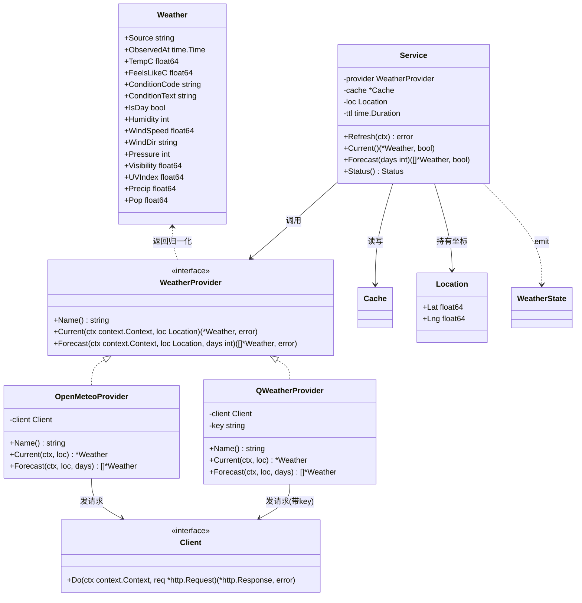
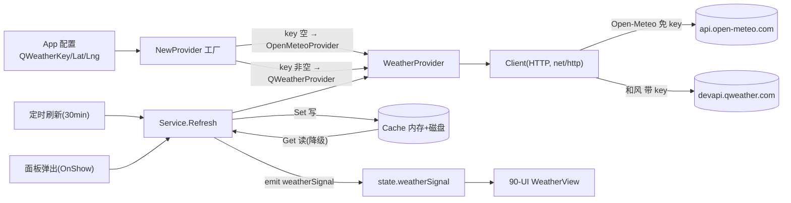
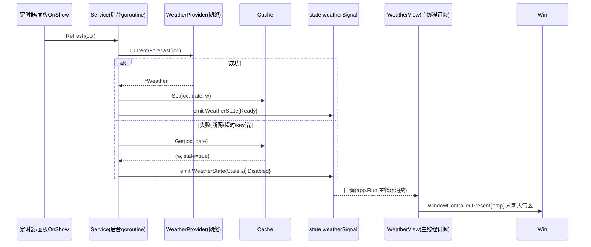
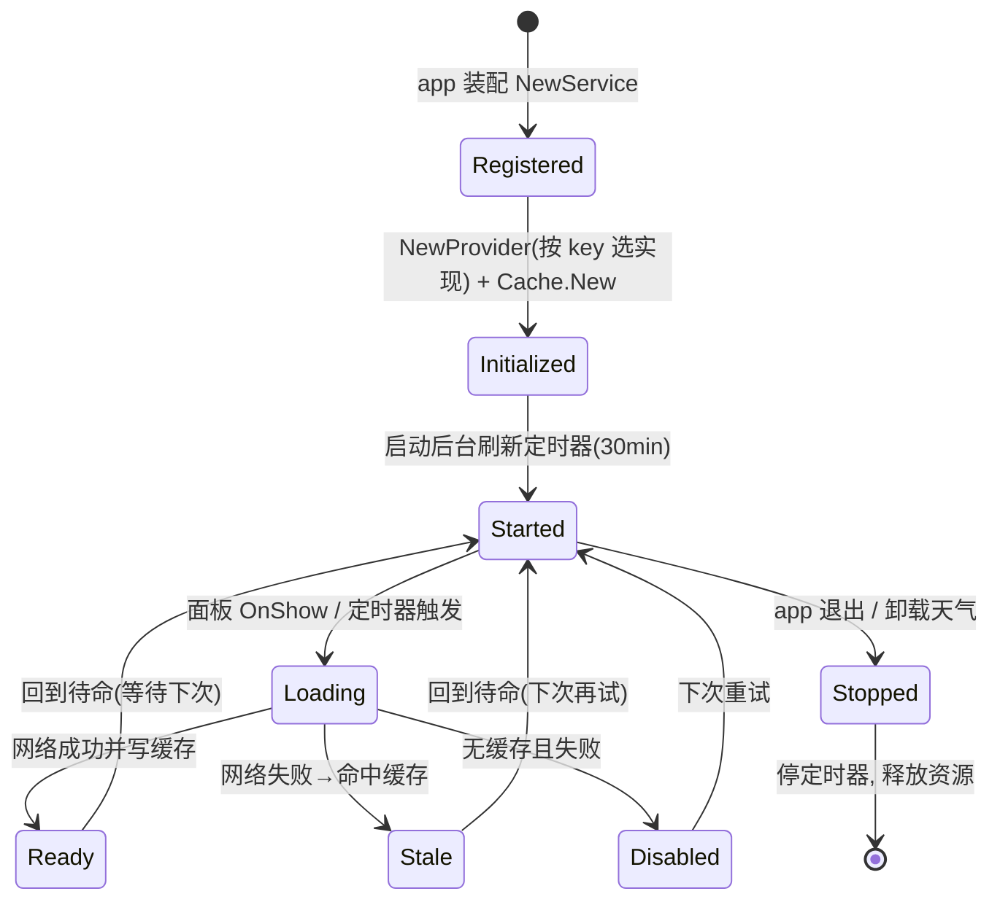

# 70-Weather · Provider（天气 Provider 与工厂）

> 模块：`internal/weather` ｜ 范围：**Post-MVP（v1.2）** ｜ 最后更新：2026-07-07
> 关联：ADR-05b（天气数据源选型）、`_模板与写作规范.md` 10 节结构

本文是 `70-Weather` 组的**聚合根（aggregate root）**：定义 `WeatherProvider` 接口、两个具体实现（Open-Meteo / 和风）与配置驱动的工厂，并给出对外调用的 `Service` 编排层。缓存与 HTTP 细节分别见 `Cache.md` 与 `API.md`。

---

## 1. 📦 package 设计

- **包名**：`weather`（单一包，位于 `internal/weather`，不拆子包，满足硬约束"Go 包名 internal/weather"）。
- **一句话职责**：以接口隔离天气数据源；按配置选择 Open-Meteo（默认免 key）或和风（填 key 自动切），并对上层提供"拉取 + 读缓存 + 优雅降级"的统一入口。
- **目录文件划分**：
  - `types.go` — `Location` / `Weather` / `WeatherState` / `Status` 等值对象。
  - `provider.go` — `WeatherProvider` 接口与 `Service` 编排层。
  - `openmeteo.go` — `OpenMeteoProvider`。
  - `qweather.go` — `QWeatherProvider`。
  - `factory.go` — `NewProvider` 配置驱动工厂。
  - `cache.go` — `Cache`（详见 `Cache.md`）。
  - `api.go` — `Client` HTTP 封装（详见 `API.md`）。
- **依赖方向**：
  - `weather` → `internal/infra/config`（读 `QWeatherKey` / 坐标 / 超时）
  - `weather` → `internal/infra/log`（`log/slog` 封装）
  - `weather` → `internal/state`（emit `weatherSignal` 给 UI，见 §6）
  - `weather` 被 `internal/ui`（WeatherView）、`internal/app`（装配）依赖
  - **不依赖** UI / platform / gogpu 渲染层（保持纯数据，便于单测）。
- **对外公开符号**：`WeatherProvider`、`Location`、`Weather`、`Status`、`WeatherState`、`NewProvider`、`NewOpenMeteoProvider`、`NewQWeatherProvider`、`Service`、`NewService`。
- **边界**：管"数据从哪来、怎么归一化、怎么降级"；不管 UI 渲染（归 `90-UI`）、不管坐标如何获取（归设置/定位，配置传入 `Lat/Lng`）、不管 key 的 UI 输入（归设置面板）。

---

## 2. 📐 UML 类图



---

## 3. 🔄 数据流图



**关键点**：所有网络调用经 `Service` 统一收口；成功即写缓存，失败回退缓存（§8 生命周期与 `Cache.md` 协作），UI 永远拿到"有数据或明确状态"，绝不阻塞日历主流程。

---

## 4. 🎨 UI 原型图（ASCII）

天气模块挂载于日历面板顶部（由 `90-UI/WeatherView` 渲染），`Service` 仅产出数据，布局归 UI。降级时整块不显示或显示" stale/— "。

```
┌─────────────────────────────┐  ← 托盘弹窗面板（圆角透明）
│ [☀ 23°  晴  北京 海淀]   ↑   │  ← WeatherView：图标 + 温度 + 文字 + 地名
│   体感 21°  湿度 40%  风 3级 │  ← 第二行：次要指标（来自 Weather）
│ ┌──────┬──────┬──────┬─────┐ │
│ │ 周一 │ 周二 │ 周三 │ 周四 │ │  ← 短期预报（Forecast，days=3~7）
│ │  ☀23 │  ⛅25 │  🌧19│  ☀22│ │
│ └──────┴──────┴──────┴─────┘ │
│ ┌─────────────────────────┐  │
│ │  公历网格 + 农历/节气/节假日 │ │  ← 50-Calendar
│ └─────────────────────────┘  │
└─────────────────────────────┘

降级态（断网/无 key/失败）：
 [ 🌥 —   天气暂不可用 ]   ← Status=Stale 显示最后缓存；Status=Disabled 整块隐藏
```

---

## 5. 🗂 数据库设计

**N/A** —— 本包不依赖 SQLite。`WeatherProvider` 与 `Service` 的数据持久化由 `Cache.md` 以"内存 map + 磁盘 JSON 文件"实现（纯 Go、零 CGO、非关系型），不需要 `CREATE TABLE`。天气数据本身短时效、可重建，不入关系库。

---

## 6. 📡 Event / Signal 流程

天气以 `coregx/signals` 的 `Signal` 响应式原语对外广播（遵循 `01-总体架构` §6 演进策略：新增 feature 不改核心循环模型，`Service` 在后台 goroutine 刷新后 emit，UI 订阅）。



- **Status 枚举**：`Disabled`（未启用/无网络且无缓存）、`Loading`、`Ready`（新鲜）、`Stale`（返回最后缓存，已降级）、`Error`（无缓存且无网络）。
- **谁 emit**：`Service.Refresh` 后 emit `weatherSignal`。
- **谁 subscribe**：`90-UI/WeatherView`。
- **副作用**：仅 UI 重绘；不写文件、不弹窗、不影响日历网格。

---

## 7. 🔌 Plugin API

**N/A（直接钩子）** —— 插件系统属 `80-Plugin`（v1.4），与天气不在同一里程碑。天气**不向插件暴露专属钩子**；未来若需插件读取天气，统一经由 `state.weatherSignal`（§6）订阅，遵循"插件以接口钩子反向依赖 feature"的依赖倒置原则，天气包本身无需改动。故本模块 Plugin API 节留空。

---

## 8. 🧩 Feature 生命周期



- **可逆**：清空 `QWeatherKey` 即自动回退 Open-Meteo（工厂重选），调用方零改动。
- **销毁**：`Service.Stop()` 关闭定时器 channel；磁盘缓存保留（下次启动可即时降级）。

---

## 9. 📖 Go 接口定义

> 以下签名可直接粘入 `internal/weather/*.go`（`go 1.25`，`CGO_ENABLED=0` 可编译）。

```go
package weather

import (
	"context"
	"net/http"
	"time"
)

// Location 经纬度坐标（由设置/定位配置传入，本包不负责获取）。
type Location struct {
	Lat float64
	Lng float64
}

// Weather 归一化天气值对象：两个 provider 的响应都映射到此结构，
// UI 与缓存只认这一个类型，实现"调用方零改动"。
type Weather struct {
	Source        string    // "open-meteo" | "qweather"
	ObservedAt    time.Time // 观测时间（已转本地时区）
	TempC         float64   // 当前温度 ℃
	FeelsLikeC    float64   // 体感温度 ℃
	ConditionCode string    // 归一化天气代码，映射表见 90-UI WeatherView
	ConditionText string    // 天气文字（"晴"/"多云"...）
	IsDay         bool      // 是否白天（用于图标/主题）
	Humidity      int       // 相对湿度 %
	WindSpeed     float64   // 风速 km/h
	WindDir       string    // 风向（"北风"等）
	Pressure      int       // 气压 hPa
	Visibility    float64   // 能见度 km
	UVIndex       float64   // 紫外线指数
	Precip        float64   // 降水量 mm
	Pop           float64   // 降水概率 0..1（仅 Forecast）
}

// WeatherProvider 数据源接口（ADR-05b）。
// 任何实现都必须：异步友好（首参 ctx）、不 panic、失败返回 error 而非阻塞。
type WeatherProvider interface {
	Name() string
	Current(ctx context.Context, loc Location) (*Weather, error)
	Forecast(ctx context.Context, loc Location, days int) ([]*Weather, error)
}

// Config 工厂输入：key 决定实现切换。
type Config struct {
	QWeatherKey string        // 空 → Open-Meteo；非空 → 和风
	Lat         float64       // 默认坐标（用户未手动定位时）
	Lng         float64
	Timeout     time.Duration // 单请求超时，默认 8s
	Retries     int           // 失败重试次数，默认 2
}

// NewProvider 配置驱动工厂：热插拔核心。
// key 空 → OpenMeteoProvider；key 非空 → QWeatherProvider。
func NewProvider(cfg Config) WeatherProvider {
	if cfg.Timeout <= 0 {
		cfg.Timeout = 8 * time.Second
	}
	if cfg.Retries <= 0 {
		cfg.Retries = 2
	}
	if trimKey(cfg.QWeatherKey) != "" {
		return NewQWeatherProvider(cfg)
	}
	return NewOpenMeteoProvider(cfg)
}

// OpenMeteoProvider 默认实现（免 key）。具体请求见 API.md。
type OpenMeteoProvider struct {
	client Client
}

func NewOpenMeteoProvider(cfg Config) *OpenMeteoProvider {
	return &OpenMeteoProvider{client: NewClient(cfg.Timeout, cfg.Retries)}
}
func (p *OpenMeteoProvider) Name() string { return "open-meteo" }

// QWeatherProvider 用户填 key 后自动切换的实现（中国精度最佳）。
type QWeatherProvider struct {
	client Client
	key    string
}

func NewQWeatherProvider(cfg Config) *QWeatherProvider {
	return &QWeatherProvider{
		client: NewClient(cfg.Timeout, cfg.Retries),
		key:    trimKey(cfg.QWeatherKey),
	}
}
func (p *QWeatherProvider) Name() string { return "qweather" }

// Status 数据新鲜度状态（供 UI 决定显隐/降级提示）。
type Status int

const (
	StatusDisabled Status = iota // 未启用/无网络且无缓存
	StatusLoading                // 刷新中
	StatusReady                  // 新鲜数据
	StatusStale                  // 返回最后缓存（降级）
	StatusError                  // 无缓存且失败
)

// WeatherState 广播给 UI 的响应式状态。
type WeatherState struct {
	Current   *Weather
	Forecast  []*Weather
	Status    Status
	UpdatedAt time.Time
}
```

`Service` 编排层（`provider.go`）：

```go
// Service 对上层（ui/app）暴露的唯一入口：拉取 + 读缓存 + 降级。
type Service struct {
	provider WeatherProvider
	cache    *Cache
	loc      Location
	ttl      time.Duration
	stop     chan struct{}
}

// NewService 装配 provider 与缓存（缓存见 Cache.md）。
func NewService(cfg Config, cacheDir string, ttl time.Duration) *Service {
	if ttl <= 0 {
		ttl = 30 * time.Minute
	}
	return &Service{
		provider: NewProvider(cfg),
		cache:    NewCache(cacheDir, ttl),
		loc:      Location{Lat: cfg.Lat, Lng: cfg.Lng},
		ttl:      ttl,
		stop:     make(chan struct{}),
	}
}

// Refresh 后台拉取并写缓存；失败不返回 error 阻塞调用方，内部转降级状态。
func (s *Service) Refresh(ctx context.Context) error

// Current 读缓存：返回 (数据, 是否新鲜)。断网时 fresh=false 但可能仍有旧数据。
func (s *Service) Current() (*Weather, bool)

// Forecast 读缓存中的预报列表。
func (s *Service) Forecast(days int) ([]*Weather, bool)

// Start 启动 30min 定时刷新；Stop 在退出时调用。
func (s *Service) Start(ctx context.Context)
func (s *Service) Stop()
```

---

## 10. 🚀 Milestone 任务拆分

| 版本 | 任务 | 验收标准 |
|------|------|----------|
| v1.0 (MVP) | 不实现天气；仅预留 `WeatherProvider` 接口与 `NewProvider` 工厂签名 | 接口与工厂可编译；无网络调用；不阻塞日历 |
| v1.1 (Todo) | 无天气任务（沿用接口预留） | — |
| **v1.2 (Post-MVP)** | P1 实现 `WeatherProvider`/`OpenMeteoProvider`/`QWeatherProvider` | 两实现均返回归一化 `Weather`；单测用 fake provider 通过 |
| **v1.2** | P2 实现 `NewProvider` 工厂（key 空→Open-Meteo，非空→和风） | 切换零调用方改动；配置热插拔可验证 |
| **v1.2** | P3 实现 `Service` 编排 + `weatherSignal` 广播 | 面板弹出触发 Refresh；UI 收到 Ready/Stale/Disabled |
| **v1.2** | P4 接 `Cache.md`（30min TTL + 断网降级） | 断网返回最后缓存；超时面板不显示天气但不卡死 |
| **v1.2** | P5 接 `API.md`（超时/重试/不泄露 key） | 单测模拟 5xx/超时；日志中 key 被脱敏 |
| v1.3 (Theme) | 天气图标/配色随主题（UI 层，本包仅提供 ConditionCode） | — |
| v1.4 (Plugin) | （可选）插件经 `weatherSignal` 读天气，本包无需改动 | 依赖倒置验证通过 |
| v1.5 (Release) | 天气模块进自动更新/打包验证 | 单 exe 含天气，零 CGO 构建通过 |

> **Post-MVP 标注**：天气整体属 v1.2 路线图，接口与工厂在 MVP 期已就绪（ADR-05b），不阻塞 v1.0 交付。
