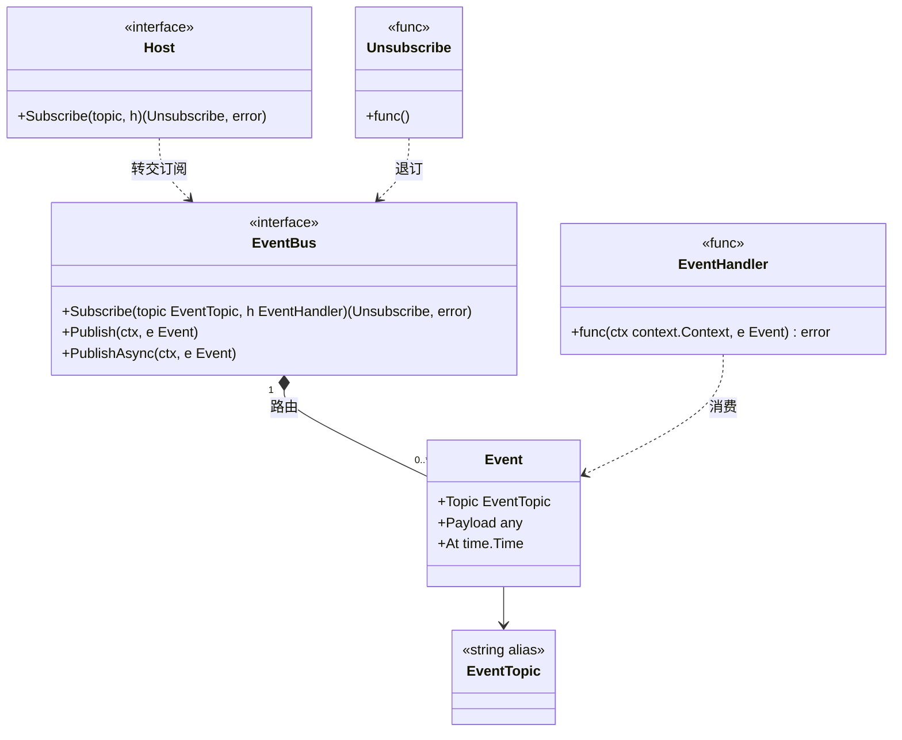
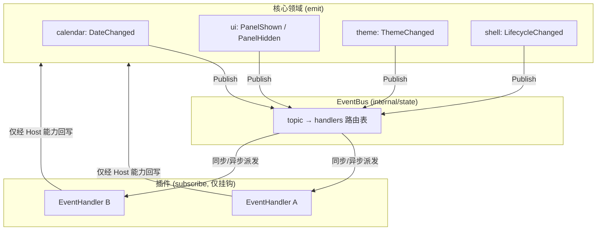
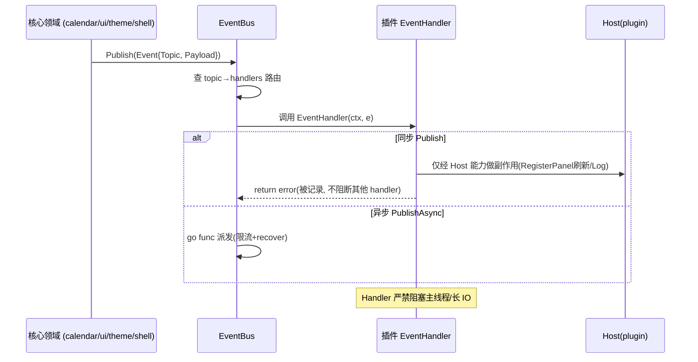
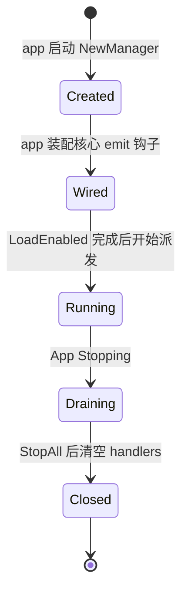

# Event（事件总线）

> 模块：80-Plugin ｜ 版本：v1.4-draft（**Post-MVP**）｜ 最后更新：2026-07-07
> 范围标注：本模块属于 **Post-MVP (v1.4)**，是插件挂钩核心领域事件的唯一通道。

---

## 1. 📦 package 设计

- **包名**：`state`（事件总线逻辑下沉到 `internal/state` 内 `event.go` / `bus.go`；`internal/plugin` 仅经 `Host.Subscribe` 委托订阅，不持有总线、不参与发射——修复 F1 依赖倒置）
- **所在目录**：`internal/plugin/`
- **职责一句话**：提供进程内发布-订阅事件总线（`EventBus`），把核心领域事件（日期变更 / 面板显隐 / 主题变更 / 生命周期变更）以类型安全方式暴露给插件订阅，插件仅能「挂钩」、不能「改写」核心。

**依赖方向**：

```
internal/state     ──依赖──▶  internal/infra/log    (事件分发日志/限流)
internal/calendar  ──依赖──▶  internal/state        (emit DateChanged 经 state.Publish)
internal/ui        ──依赖──▶  internal/state        (emit PanelShown/Hidden 经 state.Publish)
internal/theme     ──依赖──▶  internal/state        (emit ThemeChanged 经 state.Publish)
internal/shell     ──依赖──▶  internal/state        (emit LifecycleChanged 经 state.Publish)
internal/plugin    ──依赖──▶  internal/state        (订阅/注册总线；Host.Subscribe 委托到 state 总线)
internal/app       ──依赖──▶  internal/plugin       (App 启动期装载插件，依赖倒置：app 调用 plugin)
```

- **由 `internal/state` 对外暴露**：`EventBus`（接口）、`Event` / `EventTopic` / `EventHandler` / `Unsubscribe`、`Topic*`（领域事件常量）；`plugin.Host.Subscribe` 委托到该总线。
- **边界**：只管事件路由；事件**语义**由各自 feature 定义，总线不关心 payload 内容（用 `any` 承载）。

---

## 2. 📐 UML 类图



---

## 3. 🔄 数据流图



**数据源**：核心领域状态变更（用户切月、弹窗显隐、换肤、app 启停）。
**汇点**：插件 `EventHandler`（只读派生 / 经 `Host` 间接副作用），绝不反向直写核心 Store。

---

## 4. 🎨 UI 原型图（ASCII）

事件在 UI 上的间接体现（主题变更 → 插件面板随之换肤，无需插件直接碰 theme）：

```
[托盘点击]──▶ 面板 Show
                  │ emit PanelShown
                  ▼
            EventBus(internal/state) ──▶ 插件 Handler: 刷新 Panel 内容
                  │
[切换月份]──▶ 日期变更
                  │ emit DateChanged
                  ▼
            EventBus(internal/state) ──▶ 插件 Handler: "历史上的今天"更新文案
                  │
[切换深/浅色]─▶ 主题变更
                  │ emit ThemeChanged
                  ▼
            EventBus(internal/state) ──▶ 插件 Handler: 重渲染 Panel（取 theme 色）
```

---

## 5. 🗂 数据库设计

N/A — 事件总线为纯内存发布-订阅，不持久化事件（事件即瞬时信号，非业务数据）。领域事件的「结果态」由各自 feature 持久化（如 `plugin_state` 仅存启用态），与总线无关。

---

## 6. 📡 Event / Signal 流程（重点 · 必须充实）

### 6.1 领域事件清单（插件可订阅）

| Topic 常量 | 触发源 | Payload 类型 | 语义 |
|-----------|--------|-------------|------|
| `TopicDateChanged` | `calendar` | `DateChangedPayload` | 当前选中日期 / 月份变更 |
| `TopicPanelShown` | `ui` | `PanelPayload` | 弹窗面板显示 |
| `TopicPanelHidden` | `ui` | `PanelPayload` | 弹窗面板隐藏 |
| `TopicThemeChanged` | `theme` | `ThemeChangedPayload` | 主题 / 深浅色变更 |
| `TopicLifecycleChanged` | `shell` | `LifecyclePayload` | App 生命周期态变更 |

### 6.2 流转图（订阅-发布）



### 6.3 派发规则（铁律）

- **同步 `Publish`**：逐 handler 顺序调用，单 handler panic 经 `recover` 隔离，不影响其他订阅者与核心（失败域隔离）。
- **异步 `PublishAsync`**：派发到独立 goroutine（避免在主线程消费路径阻塞），panic 被 recover 并记录日志。
- **主线程安全**：核心在 `desktop.Run` 主线程 `OnUpdate` emit；handler 若需更新 UI 必须回到主线程（经 `Host` 注入的面板刷新机制，而非直接操作 widget），或通过 channel + `RequestRedraw()`（见 ADR-02 / `02-开发规范.md` §3）。
- **反压**：handler 不阻塞发送方；长任务自起 goroutine 并经 channel 回写。

---

## 7. 🔌 Plugin API

事件订阅是插件最重要的「挂钩」通道之一，经 `Host.Subscribe` 暴露（详见 `Plugin.md` §7）。本节给出插件侧应知道的订阅契约：

- 插件通过 `host.Subscribe(plugin.TopicDateChanged, handler)` 订阅，返回 `Unsubscribe` 句柄。
- `Disable` / `Unload` 时宿主自动调用所有 `Unsubscribe`，插件无需手动管理（便于无泄漏）。
- 插件**只能订阅，不能发布核心领域事件**（保证核心状态唯一真源，不可逆写）。插件自身内部事件不在本总线范围。

---

## 8. 🧩 Feature 生命周期

事件总线的生命周期依附于 App Lifecycle（与 `Lifecycle.md` 协同）：



- **Created→Wired**：`app` 在启动期把 `calendar`/`ui`/`theme`/`shell` 经 `state.Publish` 的 emit 接到总线。
- **Running**：发布-订阅生效。
- **Draining→Closed**：shutdown 时停止派发、释放 handler 表，避免关机残留。

---

## 9. 📖 Go 接口定义

```go
package state

import (
	"context"
	"fmt"
	"sync"
	"time"

	"github.com/shaolei/DeskCalendar/internal/infra/log"
)

// EventTopic 事件主题（字符串别名，便于扩展自定义主题）。
type EventTopic string

// 核心领域事件主题常量（插件可订阅）。
const (
	TopicDateChanged       EventTopic = "calendar.date.changed"
	TopicPanelShown        EventTopic = "ui.panel.shown"
	TopicPanelHidden       EventTopic = "ui.panel.hidden"
	TopicThemeChanged      EventTopic = "theme.changed"
	TopicLifecycleChanged  EventTopic = "app.lifecycle.changed"
)

// Event 一个领域事件。
type Event struct {
	Topic   EventTopic
	Payload any
	At      time.Time
}

// EventHandler 事件处理器；返回 error 仅被记录，不阻断其他 handler。
// 严禁在 handler 内阻塞主线程或做长 IO（应起 goroutine + channel 回写）。
type EventHandler func(ctx context.Context, e Event) error

// Unsubscribe 退订句柄。
type Unsubscribe func()

// EventBus 进程内发布-订阅总线。
type EventBus interface {
	// Subscribe 订阅某主题，返回退订句柄。
	Subscribe(topic EventTopic, h EventHandler) (Unsubscribe, error)
	// Publish 同步派发（逐 handler，panic 被 recover 隔离）。
	Publish(ctx context.Context, e Event)
	// PublishAsync 异步派发到独立 goroutine（不阻塞发送方）。
	PublishAsync(ctx context.Context, e Event)
}

// DateChangedPayload 日期变更载荷。
type DateChangedPayload struct {
	Year    int
	Month   int
	Day     int
	IsMonth bool // true=整月切换，false=单日选中变更
}

// PanelPayload 面板显隐载荷。
type PanelPayload struct {
	Visible bool
	X, Y    int
	W, H    int
}

// ThemeChangedPayload 主题变更载荷。
type ThemeChangedPayload struct {
	Dark    bool
	Scheme  string // 主题方案名
}

// LifecyclePayload App 生命周期载荷。
type LifecyclePayload struct {
	State string // starting/running/stopping
}

// subscription 带唯一 token 的订阅记录，便于精确退订。
type subscription struct {
	token uint64
	handler EventHandler
}

// inProcessBus 默认实现（线程安全）。
type inProcessBus struct {
	mu          sync.RWMutex
	handlers    map[EventTopic][]subscription
	nextToken   uint64
	log         log.Logger
}

// NewEventBus 构造默认总线。
func NewEventBus(logger log.Logger) EventBus {
	return &inProcessBus{
		handlers: map[EventTopic][]subscription{},
		log:      logger,
	}
}

// Subscribe 注册 handler，返回可精确退订的 Unsubscribe。
func (b *inProcessBus) Subscribe(topic EventTopic, h EventHandler) (Unsubscribe, error) {
	if h == nil {
		return nil, fmt.Errorf("nil handler for topic %q", topic)
	}
	b.mu.Lock()
	b.nextToken++
	tok := b.nextToken
	b.handlers[topic] = append(b.handlers[topic], subscription{token: tok, handler: h})
	b.mu.Unlock()
	return func() {
		b.mu.Lock()
		defer b.mu.Unlock()
		hs := b.handlers[topic]
		for i, s := range hs {
			if s.token == tok {
				b.handlers[topic] = append(hs[:i], hs[i+1:]...)
				break
			}
		}
	}, nil
}

// Publish 同步派发。
func (b *inProcessBus) Publish(ctx context.Context, e Event) {
	b.mu.RLock()
	hs := append([]subscription(nil), b.handlers[e.Topic]...)
	b.mu.RUnlock()
	for _, s := range hs {
		h := s.handler
		func() {
			defer func() {
				if r := recover(); r != nil {
					b.log.Error("event handler panic", "topic", e.Topic, "panic", r)
				}
			}()
			if err := h(ctx, e); err != nil {
				b.log.Warn("event handler error", "topic", e.Topic, "err", err)
			}
		}()
	}
}

// PublishAsync 异步派发。
func (b *inProcessBus) PublishAsync(ctx context.Context, e Event) {
	go b.Publish(ctx, e)
}
```

> 实现说明：采用 token 精确退订（避免值比对陷阱），并发安全由 `sync.RWMutex` 保证，全程纯 Go、零 CGO，契合 ADR-01 / ADR-06 约束。

**插件侧订阅示例**：

```go
// 插件侧需 import "github.com/shaolei/DeskCalendar/internal/state" 以引用 EventTopic / Event / *Payload
func (p *MyPlugin) Init(ctx context.Context, host plugin.Host) error {
	p.host = host
	unsub, err := host.Subscribe(state.TopicDateChanged, func(ctx context.Context, e state.Event) error {
		payload, ok := e.Payload.(state.DateChangedPayload)
		if !ok {
			return fmt.Errorf("unexpected payload type %T", e.Payload)
		}
		// 仅经 Host 能力回写，例如请求面板刷新（不直接碰 widget）
		host.Log().Info("date changed", "y", payload.Year, "m", payload.Month)
		return nil
	})
	if err != nil {
		return fmt.Errorf("subscribe date changed: %w", err)
	}
	_ = unsub // 宿主在 Disable/Unload 时自动退订，亦可在 Stop 中调用
	return nil
}
```

---

## 10. 🚀 每个 Milestone 的任务拆分

> 范围：**Post-MVP (v1.4)**；MVP（v1.0）无事件总线对外暴露。

| 版本 | 任务 | 验收标准 |
|------|------|---------|
| v1.0 | 核心内部 Signal 体系就绪（state 包） | 领域状态可响应式更新 |
| v1.1 | 评估 bus 与 state.Signal 关系 | 确定「bus 包装核心 Signal 变更向外暴露」 |
| v1.2 | 定义 `EventTopic` 常量与 `Event` 结构 | 类型安全事件契约冻结 |
| v1.3 | `theme`/`ui` 接入 emit 钩子（为 v1.4 铺垫） | 主题/面板事件可被捕获 |
| **v1.4 (Post-MVP)** | ① 实现 `EventBus`（Subscribe/Publish/PublishAsync）<br>② 接线 `calendar`/`ui`/`theme`/`shell` 的 emit<br>③ `Host.Subscribe` 暴露给插件 + 自动退订<br>④ panic/recover 失败域隔离 + 日志<br>⑤ 插件订阅示例（历史上的今天） | ① 单测覆盖同步/异步派发与退订<br>② 核心状态变更后插件 handler 被调用<br>③ 插件 Disable 后其 handler 不再被派发（无泄漏）<br>④ 单 handler panic 不阻断其他订阅者与核心弹窗<br>⑤ `go vet`/`golangci-lint` 零 CGO 通过 |
| v1.5 | 可选：事件限频 / 调试面板 | 高频事件不拖垮主线程 |

**Post-MVP 标注**：事件总线属 v1.4 Post-MVP；核心铁律——**插件只能订阅不能发布核心领域事件**，所有 UI 回写必须经 `Host`，且 handler 不阻塞主线程、不破坏双循环模型。
