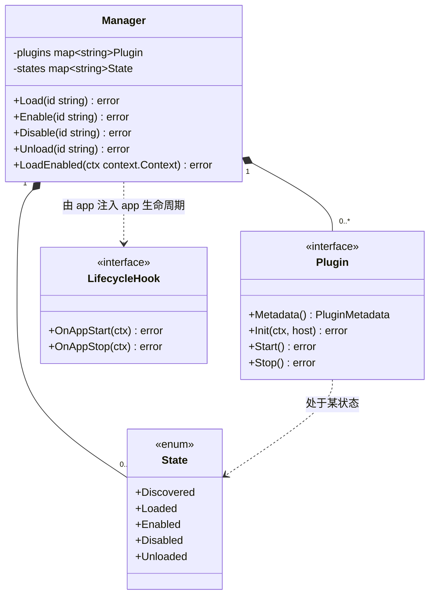
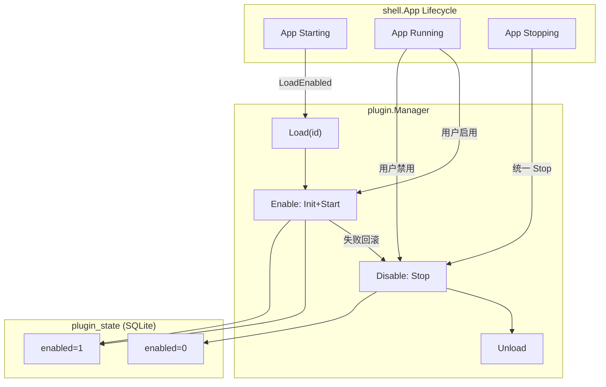
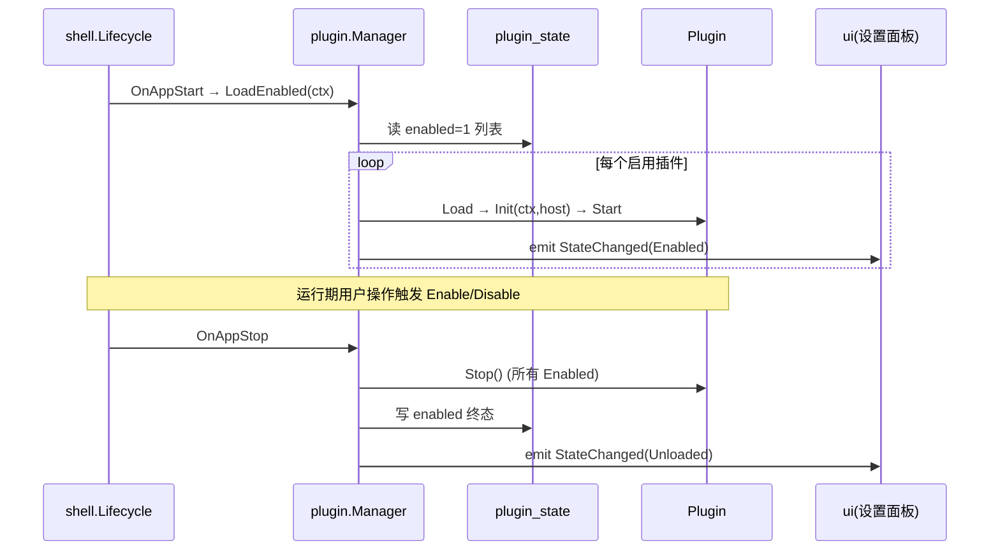
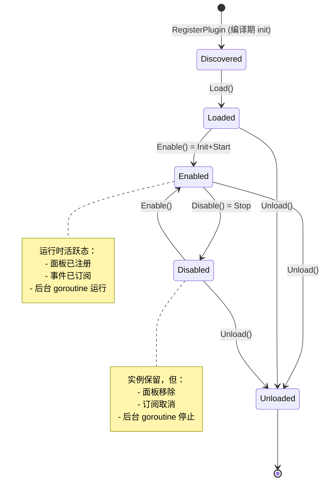

# Lifecycle（插件状态机）

> 模块：80-Plugin ｜ 版本：v1.4-draft（**Post-MVP**）｜ 最后更新：2026-07-07
> 范围标注：本模块属于 **Post-MVP (v1.4)**，与 `shell` 的 App Lifecycle 协同，但不改变其核心状态机。

---

## 1. 📦 package 设计

- **包名**：`plugin`（与 `Plugin.md` 同包，状态机逻辑归属 `internal/plugin` 内 `lifecycle.go`）
- **所在目录**：`internal/plugin/`
- **职责一句话**：定义插件从发现到卸载的有限状态机，并与 `shell` 的 App Lifecycle（启动/运行/关闭）协同，保证启用插件在 app 启动期加载、shutdown 期统一优雅停止。

**依赖方向**：

```
internal/plugin  ──依赖──▶  internal/infra/log   (状态切换日志)
internal/plugin  ──依赖──▶  internal/state        (可选：订阅 App 生命周期 Signal)
internal/plugin  ◀─依赖──   internal/app / internal/shell (在 App 启动/关闭钩子中驱动 Enable/Stop)
```

- **对外暴露**：`State`（枚举）、`StateChanged` 事件、`Manager.Load/Enable/Disable/Unload`、`Manager.LoadEnabled`（启动编排）。
- **边界**：只管「插件状态」；不管 UI 渲染细节（归 `ui`）、不管领域事件内容（归 `Event.md`）。

---

## 2. 📐 UML 类图



---

## 3. 🔄 数据流图



**数据源**：app 生命周期钩子、`plugin_state` 启用列表、用户设置操作。
**汇点**：插件实例状态、`plugin_state` 持久化、日志。

---

## 4. 🎨 UI 原型图（ASCII）

设置面板中插件行的状态与可执行动作（状态机在 UI 上的投影）：

```
┌──────────────────────────────────────────────────────────┐
│ 插件 (Plugins)                                            │
├──────────────────────────────────────────────────────────┤
│ 历史上的今天    [状态: 已启用 Enabled]   [禁用] [配置]    │
│ 倒数日小部件    [状态: 已禁用 Disabled]  [启用] [卸载]    │
│ 周视图(实验)    [状态: 未加载 Unloaded]  [加载并启用]     │
└──────────────────────────────────────────────────────────┘

状态 → 可用操作映射：
  Discovered/Loaded  →  [启用]
  Enabled            →  [禁用] [配置]
  Disabled           →  [启用] [卸载]
  Unloaded           →  [加载并启用]
```

---

## 5. 🗂 数据库设计

复用 `Plugin.md` §5 的 `plugin_state` 表。`enabled` 字段即状态机的持久化投影（`1=Enabled` 或曾 Enabled，`0=Disabled`）。本文件不再重复建表，只补充状态机与表的映射约束：

- `Enabled` 态 ⟺ `plugin_state.enabled = 1`
- `Disabled` / `Unloaded` 态 ⟺ `plugin_state.enabled = 0`（Disabled 保留行，Unloaded 可删行）
- `LoadEnabled` 启动时仅对 `enabled = 1` 的 ID 执行 `Load → Enable`。

---

## 6. 📡 Event / Signal 流程

插件状态切换会发内部 `StateChanged` 事件（供 UI 刷新、日志审计）；并订阅 `shell` 的 App 生命周期 Signal 以驱动启动/关闭编排。



---

## 7. 🔌 Plugin API

> 状态机本身不向插件暴露「驱动自身状态」的 API——插件是状态机的**被管理者**，不是管理者。插件仅通过 `Host` 间接感知生命周期（详见 `Plugin.md` §7）。本节给出 **宿主/容器侧** 用于驱动状态机的公开方法（属 `internal/plugin` 内部 API，供 `app`/`shell` 调用）：

| 方法 | 触发转换 | 说明 |
|------|---------|------|
| `Manager.Load(id)` | Discovered→Loaded | 校验 `MinAppVersion`，构造实例 |
| `Manager.Enable(id)` | Loaded→Enabled（或 Disabled→Enabled） | `Init(ctx,host)`+`Start()`，失败回滚到 Disabled |
| `Manager.Disable(id)` | Enabled→Disabled | `Stop()`，保留实例 |
| `Manager.Unload(id)` | *→Unloaded | 移除引用与面板/订阅 |
| `Manager.LoadEnabled(ctx)` | 批量 Discovered→Enabled | 启动期编排 |

N/A 理由：本节无「插件侧对外钩子」新增（钩子在 `Plugin.md`/`Event.md`）。

---

## 8. 🧩 Feature 生命周期（状态机 · 重点）

插件状态机：discovered → loaded → enabled → disabled → unloaded。使用 `mermaid stateDiagram-v2`：



**转换契约**：

| 转换 | 动作（宿主侧） | 失败处理 |
|------|---------------|---------|
| Discovered→Loaded | 校验 `MinAppVersion` 兼容性 | 不兼容 → 停留 Discovered，记日志 |
| Loaded→Enabled | `Init(ctx,host)` 成功 → `Start()` | `Init` 失败 → 停留 Loaded；`Start` 失败 → 调 `Stop()` 回滚到 Loaded/Disabled |
| Enabled→Disabled | `Stop()`，移面板/取消订阅 | `Stop` 失败 → 仍置 Disabled（记 `last_error`） |
| *→Unloaded | 释放实例、清 `plugin_state` 行（可选） | — |

**与 App Lifecycle 的协同**：

- **App Starting**（`shell` 生命周期进入 Running 前）：`Manager.LoadEnabled(ctx)` 读取 `plugin_state.enabled=1`，逐个 `Load→Enable`。任一插件 `Init/Start` 失败不影响其他插件与核心启动（隔离失败域）。
- **App Running**：用户可在设置中 Enable/Disable，实时生效（UI 通过 `StateChanged` 刷新）。
- **App Stopping**（`shell` 触发 `OnAppStop`）：`Manager` 对全部 Enabled 插件调用 `Stop()`，再持久化终态，确保在 `app.Run` 退出前完成资源释放，避免关机残留（G4）。

---

## 9. 📖 Go 接口定义

```go
package plugin

import "context"

// State 插件状态枚举。
type State int

const (
	StateDiscovered State = iota // 编译期已注册，未加载
	StateLoaded                  // 已加载（实例存在，未 Init）
	StateEnabled                 // 已启用（Init+Start 成功，运行中）
	StateDisabled                // 已停用（Stop，实例保留）
	StateUnloaded                // 已卸载（引用移除）
)

func (s State) String() string {
	switch s {
	case StateDiscovered:
		return "discovered"
	case StateLoaded:
		return "loaded"
	case StateEnabled:
		return "enabled"
	case StateDisabled:
		return "disabled"
	case StateUnloaded:
		return "unloaded"
	default:
		return "unknown"
	}
}

// StateChanged 状态变更事件（内部，供 UI/日志订阅）。
type StateChanged struct {
	ID    string
	From  State
	To    State
	Error error // 转换失败时的原因
}

// Manager 状态机驱动（节选自 Plugin.md，聚焦生命周期）。
type Manager struct {
	plugins map[string]Plugin
	states  map[string]State
	host    Host
	// onStateChange 可选观察者（注入 UI 刷新钩子）
	onStateChange func(StateChanged)
}

// Load 将插件从 Discovered 推进到 Loaded。
func (m *Manager) Load(id string) error {
	p, ok := m.plugins[id]
	if !ok {
		return fmt.Errorf("plugin %q not registered", id)
	}
	if err := checkMinVersion(p.Metadata().MinAppVersion); err != nil {
		m.emit(StateChanged{ID: id, From: StateDiscovered, To: StateLoaded, Error: err})
		return err
	}
	m.states[id] = StateLoaded
	return nil
}

// Enable 启用：Loaded/Disabled → Enabled（Init+Start）。
func (m *Manager) Enable(id string) error {
	p := m.plugins[id]
	if err := p.Init(context.Background(), m.host); err != nil {
		m.emit(StateChanged{ID: id, From: m.states[id], To: StateEnabled, Error: err})
		return fmt.Errorf("init plugin %q: %w", id, err)
	}
	if err := p.Start(); err != nil {
		_ = p.Stop() // 回滚
		m.emit(StateChanged{ID: id, From: m.states[id], To: StateEnabled, Error: err})
		return fmt.Errorf("start plugin %q: %w", id, err)
	}
	m.states[id] = StateEnabled
	m.persistEnabled(id, true)
	m.emit(StateChanged{ID: id, From: StateLoaded, To: StateEnabled})
	return nil
}

// Disable 停用：Enabled → Disabled（Stop，保留实例）。
func (m *Manager) Disable(id string) error {
	if err := m.plugins[id].Stop(); err != nil {
		m.emit(StateChanged{ID: id, From: StateEnabled, To: StateDisabled, Error: err})
		// 仍置为 Disabled，记录错误供诊断
	}
	m.states[id] = StateDisabled
	m.persistEnabled(id, false)
	m.emit(StateChanged{ID: id, From: StateEnabled, To: StateDisabled})
	return nil
}

// Unload 卸载：* → Unloaded（释放引用）。
func (m *Manager) Unload(id string) error {
	if m.states[id] == StateEnabled {
		_ = m.plugins[id].Stop()
	}
	delete(m.plugins, id)
	delete(m.states, id)
	m.emit(StateChanged{ID: id, From: StateEnabled, To: StateUnloaded})
	return nil
}

// LoadEnabled 启动期按持久化启用列表批量启用（与 App Lifecycle 协同）。
func (m *Manager) LoadEnabled(ctx context.Context) error {
	for _, id := range m.listEnabledIDs(ctx) {
		if err := m.Load(id); err != nil {
			continue // 隔离失败域，不影响其他插件与核心
		}
		if err := m.Enable(id); err != nil {
			m.Log().Warn("plugin enable failed", "id", id, "err", err)
		}
	}
	return nil
}

// StopAll 关闭期统一停止所有 Enabled 插件（由 shell.OnAppStop 调用）。
func (m *Manager) StopAll() {
	for id, st := range m.states {
		if st == StateEnabled {
			_ = m.plugins[id].Stop()
		}
	}
}

func (m *Manager) emit(sc StateChanged) {
	if m.onStateChange != nil {
		m.onStateChange(sc)
	}
}
```

> 注：`checkMinVersion` / `persistEnabled` / `listEnabledIDs` / `Log()` 为包内辅助，依赖 `infra` 与 `plugin_state` 表，实现略。

---

## 10. 🚀 每个 Milestone 的任务拆分

> 范围：**Post-MVP (v1.4)**；MVP（v1.0）仅预留空状态机。

| 版本 | 任务 | 验收标准 |
|------|------|---------|
| v1.0 | 占位 `State` 枚举与 `Manager` 骨架（无启用逻辑） | 核心启动不受影响 |
| v1.1 | `plugin_state` 持久化可用（依赖 Todo SQLite） | 状态可落库 |
| v1.2 | 确认 in-process 注册式，状态机以注册为起点 | `RegisterPlugin` 即 Discovered |
| v1.3 | 接入 `theme` 生命周期 Signal（为 Enable 钩子铺垫） | 主题事件可驱动插件刷新 |
| **v1.4 (Post-MVP)** | ① 实现 `stateDiagram-v2` 全转换<br>② `LoadEnabled` 与 `shell.OnAppStart` 协同<br>③ `StopAll` 与 `shell.OnAppStop` 协同（关机无残留，G4）<br>④ `Enable` 失败回滚 + 失败域隔离<br>⑤ `StateChanged` 驱动设置面板刷新 | ① 状态机单测覆盖全部转换（discovered→…→unloaded）<br>② app 启动仅加载启用列表，未启用插件不 Init<br>③ 关闭时所有 Enabled 插件 `Stop` 完成再退出<br>④ 单插件 `Init/Start` 失败不阻断其他插件与核心<br>⑤ 设置面板状态实时反映 |
| v1.5 | 可选：Unloaded 行清理策略调优 | 无孤儿数据 |

**Post-MVP 标注**：状态机实现属 v1.4 Post-MVP；必须与 `shell` App Lifecycle 严格协同且**不阻塞主线程**（关闭流程在主线程退出前同步完成，但单插件 `Stop` 不得做无限等待）。
