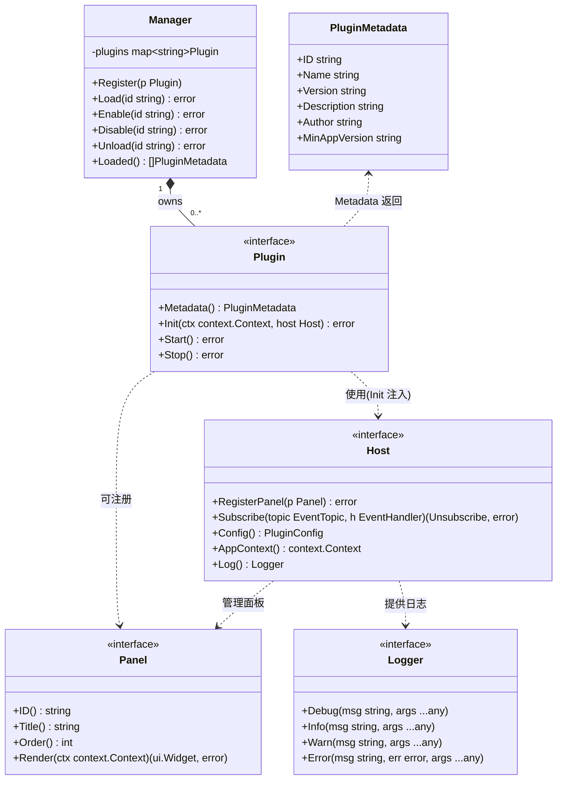
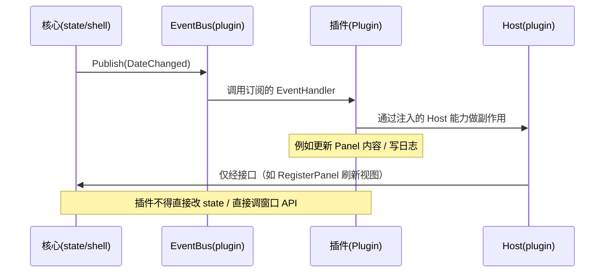
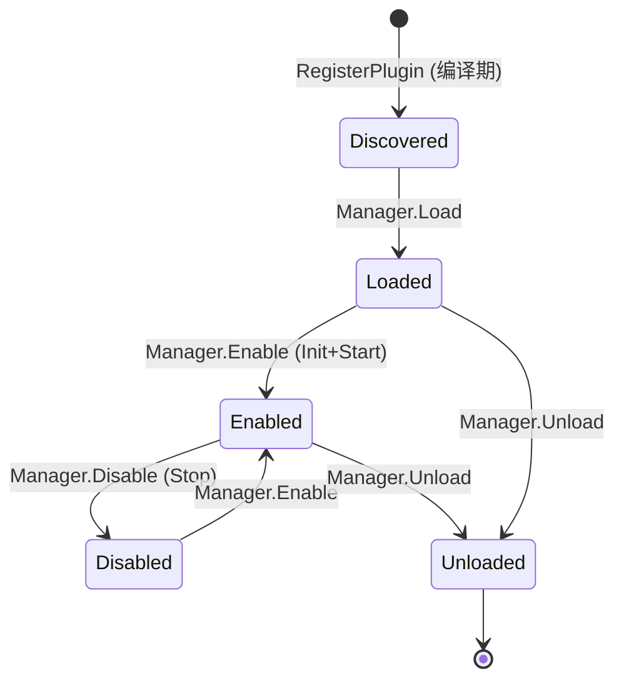

# Plugin（插件接口与宿主能力）

> 模块：80-Plugin ｜ 版本：v1.4-draft（**Post-MVP**）｜ 最后更新：2026-07-07
> 范围标注：本模块属于 **Post-MVP (v1.4)**，不在 MVP 闭包内；实现以「不破坏核心双循环模型」为前提。

---

## 1. 📦 package 设计

- **包名**：`plugin`
- **所在目录**：`internal/plugin/`（对应 `03-项目目录规范.md` 中 `internal/plugin` 映射）
- **职责一句话**：定义插件与宿主之间的契约（`Plugin` / `Host` 接口），提供 in-process 注册式插件容器，使第三方能力仅能通过接口钩子（UI 面板注册、事件订阅、配置读取）扩展，绝不触碰核心双循环模型。

**依赖方向**（遵守 `01-总体架构.md` §2 依赖倒置原则）：

```
internal/plugin  ──依赖──▶  internal/state    (读/订阅 Signal Store)
internal/plugin  ──依赖──▶  internal/ui       (注册 Panel，仅引用 ui 类型/接口)
internal/plugin  ──依赖──▶  internal/infra/log (统一日志)
internal/plugin  ──依赖──▶  internal/todo       (共享 SQLite 句柄/文件，持久化 plugin_state)
internal/plugin  ◀─依赖──   internal/app       (app 启动时装载插件，依赖倒置：app 调用 plugin，plugin 不反向依赖 app)
internal/plugin  ◀─依赖──   internal/shell     (Lifecycle 协同启用列表)
```

- **对外暴露的公开符号**：
  - `Plugin`（接口）、`Host`（接口）、`PluginMetadata`（结构体）
  - `Panel`（接口，供插件注册 UI 面板）、`EventBus`（实现位于 `internal/state`，经 `Host.Subscribe` 暴露给插件，见 `Event.md` §9）
  - `Manager`（插件容器：Register / Load / Enable / Disable / Unload）
  - `RegisterPlugin(p Plugin)`（编译期 in-process 注册入口）
- **边界**：
  - 归它管：插件生命周期编排、Host 能力门面、事件总线接线、启用状态持久化。
  - 不归它管：核心窗口操作（归 `shell` / `platform`）、天气/待办等领域数据实现（归各自 feature）、主题渲染（归 `theme`）。插件只能通过 Host 暴露的接口间接使用这些能力。

**为什么不走 Go `plugin` 包（.so 热加载）**：`plugin` 包要求 CGO 编译产物、且 Windows 下 `plugin` 包**不被支持**（Go 官方仅支持 linux），直接违反 ADR-01 / ADR-06「零 CGO」硬性约束。因此采用 **纯 Go 内嵌式 / 注册式插件（in-process registered plugin）**：插件作为普通 Go 包在编译期通过 `RegisterPlugin` 注入，运行时由 `Manager` 编排。可配置外部插件机制留作未来探索（Post-MVP 之后），本期不实现动态加载。

---

## 2. 📐 UML 类图



---

## 3. 🔄 数据流图

```mermaid
flowchart TB
    subgraph BOOT["应用启动 (app + shell Lifecycle)"]
        A["LoadEnabledList()\n从 plugin_state/配置读启用列表"]
        B["Manager.Register\n编译期注入插件"]
        C["Manager.Load + Enable\n逐个 Init+Start"]
    end
    subgraph HOST["Host 门面 (internal/plugin)"]
        H1["RegisterPanel → ui 注入面板"]
        H2["Subscribe → EventBus"]
        H3["Config 读本地配置"]
    end
    subgraph CORE["核心 (不可被替换)"]
        S["state.Signal / Store"]
        UI["ui 视图渲染"]
        SH["shell 窗口/生命周期"]
    end

    A --> B --> C
    C -->|Init(ctx,host)| H1
    C -->|Init(ctx,host)| H2
    C -->|Init(ctx,host)| H3
    H1 --> UI
    H2 --> S
    Plugin["第三方 Plugin 实现"] -->|仅通过 Host| HOST
    HOST -->|事件订阅挂日历/主题变更| CORE
    UI -->|面板显隐事件| H2
```

**数据源**：插件自身逻辑 / 配置（`%AppData%/DeskCalendar/config.json`）/ 事件总线（来自核心的日期变更、面板显隐、主题变更）。
**汇点**：UI 面板（经 Host 注册）、事件总线（订阅回调，禁止直接改核心状态）、日志。

---

## 4. 🎨 UI 原型图（ASCII）

插件通过 `Host.RegisterPanel` 在设置面板 / 弹窗侧栏注册自己的 UI 面板。原型示意（设置窗口中的「插件」分区）：

```
┌──────────────────────────────────────────────────────────────┐
│  设置 (Settings)                                              │
├──────────┬───────────────────────────────────────────────────┤
│ 常规      │  插件 (Plugins)                                    │
│ 主题      │  ┌─────────────────────────────────────────────┐  │
│ 天气      │  │ [✔] 万年历扩展        v1.2.0   作者: foo     │  │
│ 关于      │  │     在日期格显示历史上的今天               │  │
│ ▶插件     │  │     [配置]  [禁用]                          │  │
│           │  ├─────────────────────────────────────────────┤  │
│           │  │ [✔] 倒数日小部件      v0.9.1   作者: bar     │  │
│           │  │     在面板底部显示最近倒数日               │  │
│           │  │     [配置]  [禁用]                          │  │
│           │  ├─────────────────────────────────────────────┤  │
│           │  │ [✘] 实验性：周视图     v0.1.0   (已禁用)    │  │
│           │  │     [启用]  [卸载]                          │  │
│           │  └─────────────────────────────────────────────┘  │
│           │  ★ 插件仅在面板中追加区域，无法替换主日历网格    │
└──────────┴───────────────────────────────────────────────────┘
```

---

## 5. 🗂 数据库设计

插件启用状态持久化到本地 SQLite（`internal/todo` 已引入 SQLite，复用同一数据库文件）。插件自身不产生业务数据表，仅保存元数据与开关态。

```sql
-- 复用核心 SQLite 库（%AppData%/DeskCalendar/deskcalendar.db）
CREATE TABLE IF NOT EXISTS plugin_state (
    id           TEXT    PRIMARY KEY,            -- 插件 ID（与 PluginMetadata.ID 一致）
    enabled      INTEGER NOT NULL DEFAULT 1,      -- 1=启用 0=禁用
    version      TEXT    NOT NULL,                -- 最后加载到的版本
    last_error   TEXT,                            -- 最近一次 Init/Start/运行错误（便于诊断）
    updated_at   INTEGER NOT NULL                 -- 最近状态变更 Unix 毫秒
);

CREATE INDEX IF NOT EXISTS idx_plugin_state_enabled
    ON plugin_state(enabled);
```

- 主键：`id`。
- 索引：`enabled` 便于启动期快速过滤启用列表。
- 说明：纯内存模块特性不成立（需持久化启用列表），因此给出上表；运行时事件与面板不落库。

---

## 6. 📡 Event / Signal 流程

> 本模块作为事件**消费者与接线者**，自身不定义新领域事件；它把核心领域事件（见 `Event.md`）暴露给插件订阅。流转示意：



- 谁 emit：核心（`shell` 生命周期变更、`calendar` 日期变更、`theme` 主题变更、`ui` 面板显隐）。
- 谁 subscribe：插件经 `Host.Subscribe` 注册 `EventHandler`。
- 触发副作用：仅在插件侧，且必须通过 `Host` 提供的能力回写，禁止反向编译依赖与越权操作。

---

## 7. 🔌 Plugin API（重点 · 必须充实）

本节是插件作者的**唯一对外契约**。插件只能使用 `Host` 暴露的三类能力：**注册 UI 面板**、**订阅事件**、**读取配置**。任何超出此门面的能力均不可达（接口隔离 + 编译屏障）。

### 7.1 插件侧可见接口一览

| 接口 | 用途 | 备注 |
|------|------|------|
| `Plugin` | 插件自身需实现的契约 | `Metadata/Init/Start/Stop` |
| `Host` | 宿主在 `Init` 时注入给插件 | `RegisterPanel/Subscribe/Config/AppContext/Log` |
| `Panel` | 插件实现的 UI 面板 | 经 `Host.RegisterPanel` 注入 |
| `EventTopic` / `Event` / `EventHandler` | 事件订阅 | 见 `Event.md` |
| `PluginMetadata` / `PluginConfig` | 元信息 / 配置读 | 只读 |

### 7.2 插件可做的事（白名单）

1. **注册 UI 面板**：向弹窗 / 设置追加一个独立区域（`Panel`），不能替换、覆盖、重排核心日历网格。
2. **订阅领域事件**：监听 `DateChanged` / `PanelShown` / `PanelHidden` / `ThemeChanged` / `LifecycleChanged` 等，做只读派生或异步副作用。
3. **读取配置**：只读访问 `Host.Config()` 提供的本插件作用域配置（宿主管控写入）。
4. **日志**：经 `Host.Log()` 输出，不向 stdout 喷（托盘程序无控制台，见 `02-开发规范.md` §2）。

### 7.3 插件的禁区（Forbidden Zone）

| 禁止项 | 原因 | 约束来源 |
|--------|------|---------|
| 阻塞主线程 / 在 `Init/Start` 做同步重 IO | 主线程跑 `desktop.Run`，阻塞会卡死弹窗（G1 <50ms） | 双循环模型 `01-总体架构.md` §3 |
| 替换 / 改写核心（`shell`/`calendar`/`state` 内部） | 破坏双循环与核心日历正确性 | 产品硬约束 |
| 直接调用 Win32 / 窗口 API（Show/Hide/SetPosition） | 窗口操作只在主线程 | ADR-02 / `02-开发规范.md` §3 |
| 越权写其他插件的配置或核心 Store | 接口隔离 + 数据安全 | ADR-05 可逆/隔离原则 |
| 引入 CGO 依赖 | 违反零 CGO | ADR-01 / ADR-06 |
| 在 `EventHandler` 中同步执行网络长请求 | 事件回调可能处于主线程消费路径 | `02-开发规范.md` §3（用 goroutine + channel） |

### 7.4 注册式加载示例（插件作者视角）

```go
package myplugin

import "github.com/shaolei/DeskCalendar/internal/plugin"

func init() {
    // 编译期注册：避免 Go plugin 包（Windows 不支持 + 需 CGO）
    plugin.RegisterPlugin(&MyPlugin{})
}

type MyPlugin struct{ host plugin.Host }

func (p *MyPlugin) Metadata() plugin.PluginMetadata {
    return plugin.PluginMetadata{
        ID:            "myplugin.historical",
        Name:          "历史上的今天",
        Version:       "1.2.0",
        Description:   "在日期格下方显示历史上的今天",
        Author:        "foo",
        MinAppVersion: "1.4.0",
    }
}

func (p *MyPlugin) Init(ctx context.Context, host plugin.Host) error {
    p.host = host
    if err := host.RegisterPanel(&myPanel{}); err != nil {
        return fmt.Errorf("register panel: %w", err)
    }
    _, _ = host.Subscribe(plugin.TopicDateChanged, p.onDateChanged)
    return nil
}

func (p *MyPlugin) Start() error { return nil }

func (p *MyPlugin) Stop() error { return nil }
```

---

## 8. 🧩 Feature 生命周期

> 详细状态机见 `Lifecycle.md`。此处给出插件作为 Feature 的注册→初始化→启动→销毁时序。



- **注册**：`init()` 中 `RegisterPlugin`，纯编译期，零运行时成本。
- **初始化/启动**：仅在 `Enabled` 时由 `Manager` 调用 `Init(ctx, host)` 然后 `Start()`。
- **销毁**：`Disable` 调 `Stop()` 保留实例；`Unload` 释放实例引用。
- 与 `shell` 生命周期协同：app 启动后 `Manager` 加载持久化启用列表，shutdown 时统一 `Stop` 全部启用插件（见 `Lifecycle.md` §协同）。

---

## 9. 📖 Go 接口定义

```go
package plugin

import (
	"context"
	"time"

	"github.com/shaolei/DeskCalendar/internal/state" // EventTopic / EventHandler 现由 state 包提供
	"github.com/shaolei/DeskCalendar/internal/ui"
)

// PluginMetadata 描述插件的静态元信息（由 Metadata() 返回）。
type PluginMetadata struct {
	ID            string // 全局唯一，如 "myplugin.historical"
	Name          string // 展示名
	Version       string // 语义化版本
	Description   string // 一句话说明
	Author        string // 作者
	Homepage      string // 可选主页
	MinAppVersion string // 要求的最低 App 版本，如 "1.4.0"
}

// Unsubscribe 取消订阅的句柄。
type Unsubscribe func()

// Plugin 是插件必须实现的契约。
// 生命周期：Metadata()（任意时刻）→ Init(ctx,host) → Start() → [运行] → Stop()。
type Plugin interface {
	// Metadata 返回插件静态元信息，不依赖任何初始化。
	Metadata() PluginMetadata
	// Init 注入宿主能力门面；严禁在此做阻塞 IO。
	Init(ctx context.Context, host Host) error
	// Start 启动插件（如起后台 goroutine）；必须快速返回。
	Start() error
	// Stop 优雅停止；释放资源、取消订阅。
	Stop() error
}

// Panel 插件向 UI 注入的面板（追加区域，不可替换核心网格）。
type Panel interface {
	ID() string            // 与 Plugin ID 命名空间隔离，建议 "pluginID.panel"
	Title() string         // 面板标题
	Order() int            // 排序权重，越小越靠前
	// Render 返回 gogpu/ui 的 Widget；仅主线程调用。
	Render(ctx context.Context) (ui.Widget, error)
}

// PluginConfig 插件作用域的只读配置视图。
type PluginConfig interface {
	GetString(key string) string
	GetInt(key string) int
	GetBool(key string) bool
	// All 返回本插件作用域全部键值（只读副本）。
	All() map[string]any
}

// Logger 宿主提供的结构化日志（封装 slog，不喷 stdout）。
type Logger interface {
	Debug(msg string, args ...any)
	Info(msg string, args ...any)
	Warn(msg string, args ...any)
	Error(msg string, err error, args ...any)
}

// Host 是宿主在 Init 时注入给插件的能力门面（白名单式接口隔离）。
type Host interface {
	// RegisterPanel 向 UI 追加一个插件面板。
	RegisterPanel(p Panel) error
	// Subscribe 订阅某领域事件，返回取消句柄。
	Subscribe(topic EventTopic, h EventHandler) (Unsubscribe, error)
	// Config 返回本插件作用域的只读配置。
	Config() PluginConfig
	// AppContext 返回应用级 context（用于派生取消）。
	AppContext() context.Context
	// Log 返回结构化日志句柄。
	Log() Logger
}

// Manager 插件容器（编译期注册 + 运行时编排）。
type Manager struct {
	plugins map[string]Plugin
	host    Host
}

// NewManager 构造容器，host 由 app 注入（聚合核心能力门面）。
func NewManager(host Host) *Manager { return &Manager{plugins: map[string]Plugin{}, host: host} }

// Register 编译期注入插件（通常经 init() 调用）。
func (m *Manager) Register(p Plugin) { m.plugins[p.Metadata().ID] = p }

// Load 将插件置为 Loaded（校验 MinAppVersion）。
func (m *Manager) Load(id string) error { /* ... */ return nil }

// Enable 启用：Init(ctx,host) 后 Start()，并持久化 enabled=1。
func (m *Manager) Enable(id string) error { /* ... */ return nil }

// Disable 停用：Stop()，保留实例，持久化 enabled=0。
func (m *Manager) Disable(id string) error { /* ... */ return nil }

// Unload 卸载：从容器移除引用。
func (m *Manager) Unload(id string) error { /* ... */ return nil }

// LoadEnabled 启动期按持久化列表批量启用。
func (m *Manager) LoadEnabled(ctx context.Context) error { /* ... */ return nil }

// RegisterPlugin 包级便捷注册入口（供插件 init() 调用）。
func RegisterPlugin(p Plugin) { defaultManager.Register(p) }

var _ = time.Now // 预留时间工具（如超时控制）的占位引用，避免未用导入
```

> 说明：`EventTopic` / `Event` / `EventHandler` / `EventBus` 定义见 `internal/state`（`Event.md` §9）；`Host.Subscribe` 实际签名为 `Subscribe(topic EventTopic, h EventHandler) (Unsubscribe, error)`，其中 `EventTopic`/`EventHandler` 类型现由 `state` 包提供。

---

## 10. 🚀 每个 Milestone 的任务拆分

> 范围：本模块为 **Post-MVP (v1.4)**，MVP（v1.0）**未实现**。

| 版本 | 任务 | 验收标准 |
|------|------|---------|
| v1.0 (MVP) | 预留 `Plugin` / `Host` 接口占位（不启用任何插件） | 核心双循环不受影响；接口存在但 `LoadEnabled` 为空操作 |
| v1.1 | 复用 SQLite 落地 `plugin_state` 表设计 | Todo 模块数据库可承载插件状态持久化 |
| v1.2 | 评估 in-process 注册 vs `plugin` 包，确认走注册式 | ADR 补充：明确禁 `plugin` 包（Windows/CGO 约束） |
| v1.3 | `Host` 门面接入 `theme` 换肤事件钩子 | 主题变更事件可订阅 |
| **v1.4 (Post-MVP)** | ① 实现 `Plugin`/`Host`/`Panel`/`Manager` 全接口<br>② `Host.RegisterPanel` 接入 `ui` 面板注入<br>③ `EventBus` 接线核心领域事件（见 `Event.md`）<br>④ 设置面板「插件」分区（启用/禁用/配置）<br>⑤ 启动期 `LoadEnabled` 编排 + shutdown 统一 `Stop` | ① `go vet`/`golangci-lint` 零 CGO 通过（`CGO_ENABLED=0`）<br>② 至少 1 个示例插件（历史上的今天）编译进二进制并可在设置中启用<br>③ 示例插件启用后不阻塞弹窗（点击到可见 <50ms，G1）<br>④ 禁用插件后其面板与订阅立即移除、无泄漏<br>⑤ 单测覆盖状态机转换（见 `Lifecycle.md`） |
| v1.5 | 插件配置写入 UI（可选） | 用户可在设置中改插件配置并持久化 |

**Post-MVP 标注**：本模块 v1.4 全部实现项均属 Post-MVP，须遵守「不破坏核心双循环、零 CGO、接口隔离、可逆」四条硬约束；动态外部插件加载（.so/.dll）明确不在本期，列为未来探索。
