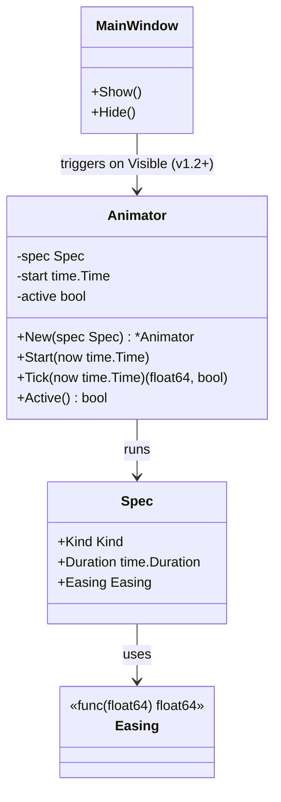
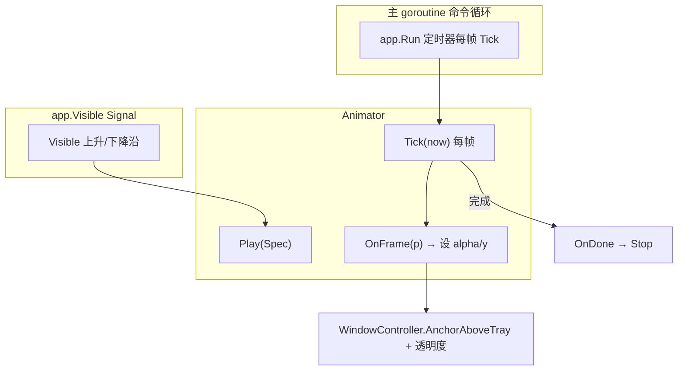
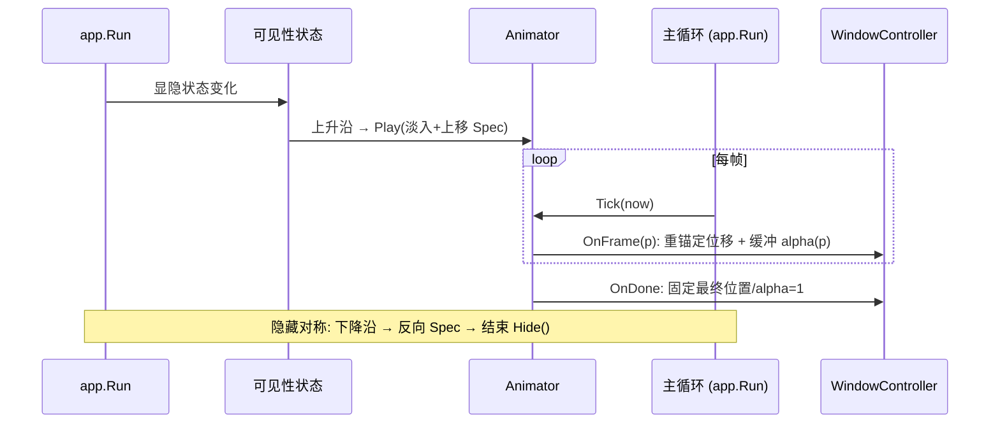
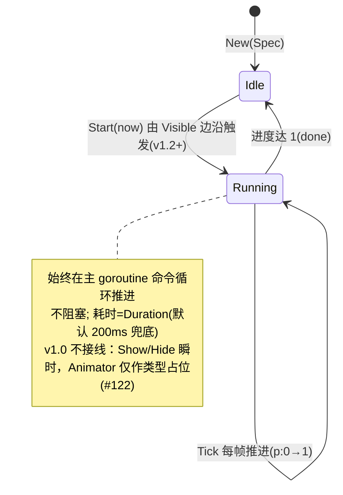

# Animation 详细设计 — 90-UI（贯穿）

> 版本：v1.0-draft ｜ 最后更新：2026-07-07 ｜ 范围：**贯穿 MVP 与 Post-MVP** ｜ 包：`internal/ui`
> 关联：ADR-03（透明圆角）、`01-总体架构` §3（主线程约束）、`MainWindow.md` §6/§8
> 标注：**跨模块横切**：v1.2+ 提供淡入 + 从托盘上方位移（MVP 不接线，Show/Hide 瞬时）；Post-MVP 视图复用同一接口。

---

## 1. 📦 package 设计

- **包名**：`ui`（Go package `internal/ui`）。
- **职责一句话**：提供面板**显隐过渡动画**（淡入 fade-in + 从托盘上方位移 slide-in），基于**自绘缓动函数**（配合 gg 重渲与窗口重定位），**不阻塞主 goroutine**，并与 `app.Run` 显隐生命周期协同。MVP 已按 ADR-08 F1 舍弃显隐动画（窗口为即时显隐的方角不透明弹窗），本能力在 v1.2+（恢复分层窗/圆角时）启用。
- **依赖方向**：
  - 依赖：`internal/state`（可见性状态触发）、`internal/platform`（`WindowController`/`tray.Bounds` 提供起点）、`app.Run` 主循环（定时器驱动每帧 `Tick` 推进动画）。
  - 被依赖：`app.Run`（显隐时调用）、各视图（可选入场微动效，复用同一 `Animator`）。
- **对外公开符号**：包名 `animator`（`internal/ui/animator`）。`Animator`（struct）、`New(spec Spec) *Animator`、`(*Animator) Start(now time.Time)`、`(*Animator) Tick(now time.Time) (float64, bool)`、`(*Animator) Active() bool`、`Easing` 函数类型与若干预设（`Linear`/`EaseInQuad`/`EaseOutQuad`/`EaseInOutQuad`/`EaseOutCubic`/`EaseInOutCubic`/`EaseOutBack`）、`Kind`（`KindNone`/`KindFadeSlideIn`/`KindFadeOut`）、`Spec{Duration,Easing,Kind}`。**MVP 不接入显隐**（#122），仅类型占位。
- **边界**：
  - 归它管：缓动曲线、进度推进、透明度/位移插值、与主循环协同。
  - 不归它管：窗口显隐决策（`app.Run`/`Lifecycle`）、具体业务数据（feature）、窗口几何/像素推送细节（`win32` 内部）。

## 2. 📐 UML 类图



## 3. 🔄 数据流图



**数据源**：可见性状态（边沿触发）、主循环每帧时间。**汇点**：窗口位置（重新 `AnchorAboveTray`）+ 缓冲透明度（v1.2 分层窗前以整体重渲近似），全部在主 goroutine。

## 4. 🎨 UI 原型图（ASCII）

显隐动画时序（从托盘上方滑入 + 淡入）：

```
 时刻 t0 (Visible↑)
   面板在 tray 上方 y0=by，alpha=0（不可见）
        ┌────────┐
        │        │   ← alpha 0.0, y = tray_y
        └────────┘
           🕒tray
 时刻 t0+Δ (动画推进)
   面板上移并渐显 alpha 0.5
        ┌────────┐
        │        │   ← alpha 0.5, y = tray_y - 20
        └────────┘
           🕒tray
 时刻 t0+D (完成)
   面板停在 tray 正上方, alpha 1.0
        ┌────────┐
        │        │   ← alpha 1.0, y = tray_y - panelH - margin
        └────────┘
           🕒tray
 隐藏：反向(alpha→0 + 下移回 tray)，结束后 WindowController.Hide()
```

## 5. 🗂 数据库设计

**N/A** — Animation 为纯运行时缓动，无任何持久化。

## 6. 📡 Event / Signal 流程



- **emit**：可见性状态变化（`app.Run` 显隐时）。
- **subscribe**：`Animator` 订阅可见性边沿；`app.Run` 定时器每帧调用 `Tick` 推进，纯主 goroutine、零阻塞。

## 7. 🔌 Plugin API

**N/A（MVP）** — Animation 为内部横切能力；未来插件若需自定义入场动效，v1.4 可经 `Animator.Register(kind, easing)` 注册缓动，MVP 不定义。

## 8. 🧩 Feature 生命周期



## 9. 📖 Go 接口定义

> ⚠️ **与现实对齐（2026-07-11 S2 文档 sweep）**：实际落地包为 `internal/ui/animator`
> （包名 `animator`，**非** `ui`）；MVP 的 Show/Hide 走瞬时显隐，**本包暂不接入显隐**（#122 原文），
> 仅作**类型与预设占位**，预留给 v1.2+ 恢复分层窗/圆角后的视觉润色。以下为真实 API。

```go
package animator // internal/ui/animator

import "time"

// Easing 缓动函数：输入归一化进度 t∈[0,1]，返回缓动后进度（回弹类可短暂超出 [0,1]）。
// 纯函数，无副作用，可单测。注意实际类型为 float64（早期草稿曾写 float32，以本实现为准）。
type Easing func(t float64) float64

// 预设缓动（自绘，零依赖，符合零 CGO）。命名遵循 Robert Penner 惯例。
var (
	Linear        Easing = func(t float64) float64 { return t }
	EaseInQuad    Easing = func(t float64) float64 { return t * t }
	EaseOutQuad   Easing = func(t float64) float64 { return t * (2 - t) }
	EaseInOutQuad Easing = func(t float64) float64 {
		if t < 0.5 {
			return 2 * t * t
		}
		return -1 + (4-2*t)*t
	}
	EaseOutCubic   Easing = func(t float64) float64 { return 1 - pow3(1-t) }
	EaseInOutCubic Easing = func(t float64) float64 {
		if t < 0.5 {
			return 4 * t * t * t
		}
		return 1 - pow3(-2*t+2)/2
	}
	EaseOutBack Easing = func(t float64) float64 {
		const c1 = 1.70158
		const c3 = c1 + 1
		d := t - 1
		return 1 + c3*d*d*d + c1*d*d
	}
)

// Kind 动画类型（MVP 不接入显隐，仅作语义标注，预留 v1.2+ 润色路线）。
type Kind int

const (
	KindNone        Kind = iota // 无动画（MVP 瞬时显隐等价表述）
	KindFadeSlideIn             // 淡入 + 从 tray 上方位移（v1.2+ 目标）
	KindFadeOut                 // 淡出
)

// Spec 单次动画描述（MVP 仅保留 Duration/Easing/Kind，无 FromY/ToY/Alpha/OnFrame/OnDone）。
type Spec struct {
	Duration time.Duration // ≤0 时 New 归一为 200ms 兜底
	Easing   Easing        // nil 时退化为 Linear
	Kind     Kind          // 仅语义标注，推进逻辑不依赖
}

// Animator 在主 goroutine 经 Tick(now) 推进的动画实例。零值不可用，须经 New 构造。
type Animator struct {
	spec   Spec
	start  time.Time
	active bool
}

func New(spec Spec) *Animator                                    // 归一化：Easing nil→Linear；Duration≤0→200ms
func (a *Animator) Start(now time.Time)                          // 以 now 为起点开始
func (a *Animator) Tick(now time.Time) (progress float64, done bool) // 进度已被 Easing 映射，可超出 [0,1]
func (a *Animator) Active() bool                                 // 是否仍在进行
```

> ⚠️ 集成示例（**v1.2+** 显隐动画落地时；当前 v1.0 不接线，Show/Hide 瞬时）：
> ```go
> // v1.2+ 显隐接入示意（届时按需扩展 Spec，增加位移/alpha 字段）：
> a := animator.New(animator.Spec{
>     Duration: 180 * time.Millisecond,
>     Easing:   animator.EaseOutCubic,
>     Kind:     animator.KindFadeSlideIn,
> })
> a.Start(time.Now())
> // 主循环每帧：p, done := a.Tick(time.Now())
> //   据 p 重锚定窗口（AnchorAboveTray + SetWindowPos）；
> //   分层窗恢复后据 p 设缓冲 alpha（v1.0/路径 D 当前为普通弹窗，无 alpha 通道）。
> ```

## 10. 🚀 每个 Milestone 的任务拆分

- **v1.0（MVP）**：
  - T1（✅ 已实现占位）：`Animator` + `Easing` 预设 + `Spec`/`Tick` 主线程推进 — 落地于 `internal/ui/animator`：零依赖、零 CGO、`CGO_ENABLED=0` 编译通过、`Tick` 不 sleep、不阻塞，单测覆盖缓动曲线。MVP 的 Show/Hide 走瞬时显隐（#121），**本包暂不接入显隐**（#122 原文「暂不接入显隐」），仅作类型与预设占位。
  - T2 / T3（`app.Run` 显隐接入 `KindFadeSlideIn`/`KindFadeOut`、与 `app.Visible` 协同固定位置/alpha）：**v1.2+ 预留**——须待恢复分层窗/圆角（ADR-08 路径 D 当前为普通弹窗，无 alpha 通道）后启用；v1.0 显隐为瞬时，无动画。
- **v1.2+（恢复分层窗/圆角后）**：T2/T3 显隐动画落地；WeatherView 卡片刷新淡入复用。
- **v1.3**：TodoView 入场复用 `Animator`（轻微 fade）。
- **v1.4**：主题切换时透明度曲线可配置。
- **v1.5**：开放 `Animator.Register` 供插件自定义缓动。
- **v1.6**：N/A。
