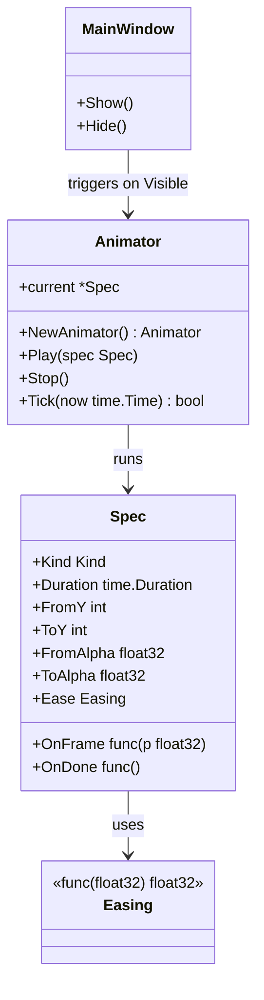
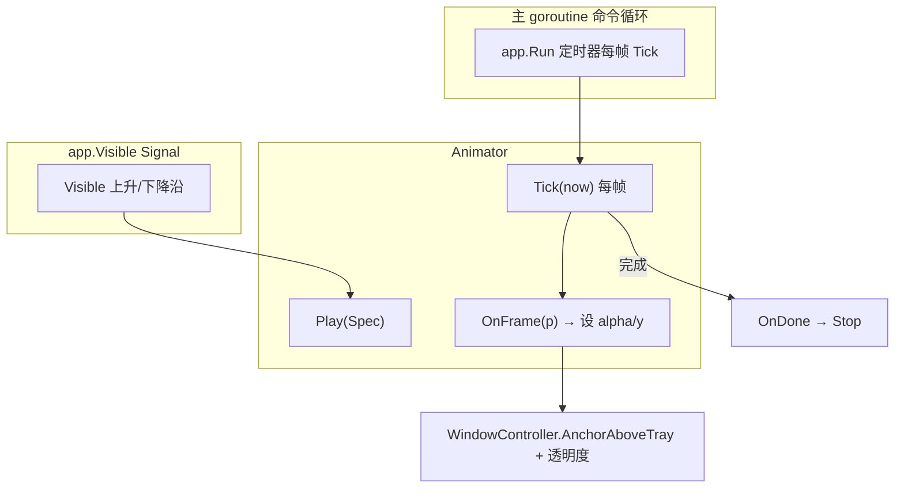
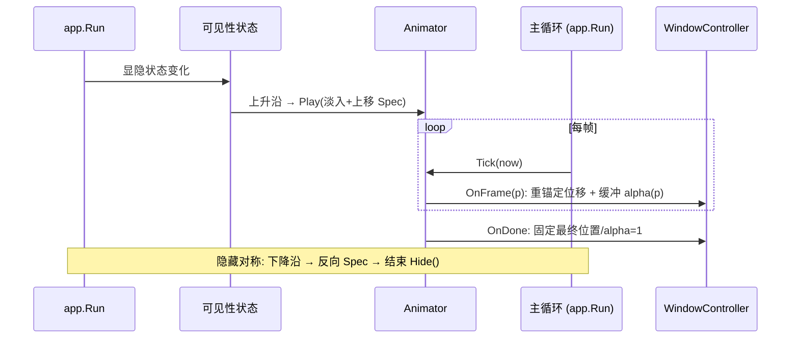
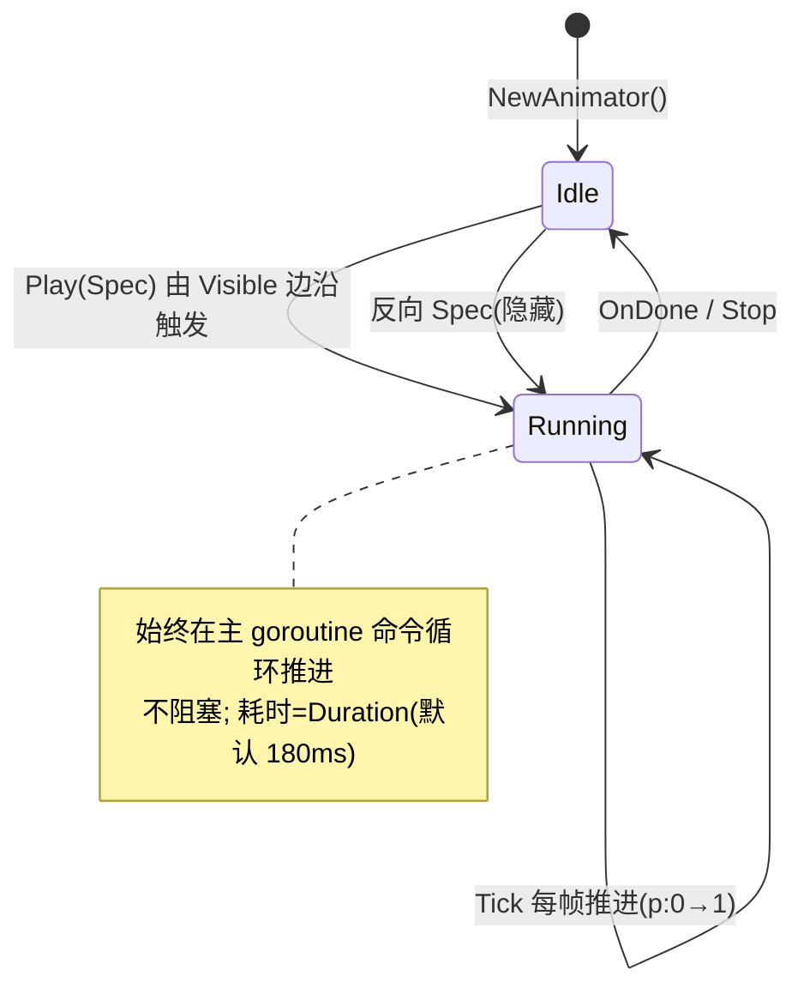

# Animation 详细设计 — 90-UI（贯穿）

> 版本：v1.0-draft ｜ 最后更新：2026-07-07 ｜ 范围：**贯穿 MVP 与 Post-MVP** ｜ 包：`internal/ui`
> 关联：ADR-03（透明圆角）、`01-总体架构` §3（主线程约束）、`MainWindow.md` §6/§8
> 标注：**跨模块横切**：MVP 即提供淡入 + 从托盘上方位移；Post-MVP 视图复用同一接口。

---

## 1. 📦 package 设计

- **包名**：`ui`（Go package `internal/ui`）。
- **职责一句话**：提供面板**显隐过渡动画**（淡入 fade-in + 从托盘上方位移 slide-in），基于**自绘缓动函数**（配合 gg 重渲与窗口重定位），**不阻塞主 goroutine**，并与 `app.Run` 显隐生命周期协同。MVP 已按 ADR-08 F1 舍弃显隐动画（窗口为即时显隐的方角不透明弹窗），本能力在 v1.2+（恢复分层窗/圆角时）启用。
- **依赖方向**：
  - 依赖：`internal/state`（可见性状态触发）、`internal/platform`（`WindowController`/`tray.Bounds` 提供起点）、`app.Run` 主循环（定时器驱动每帧 `Tick` 推进动画）。
  - 被依赖：`app.Run`（显隐时调用）、各视图（可选入场微动效，复用同一 `Animator`）。
- **对外公开符号**：`Animator`（struct）、`NewAnimator() *Animator`、`(*Animator) Play(spec Spec)`、`(*Animator) Stop()`、`(*Animator) Tick(now time.Time) bool`、`Easing` 函数类型与若干预设、`Spec`（动画描述）。
- **边界**：
  - 归它管：缓动曲线、进度推进、透明度/位移插值、与主循环协同。
  - 不归它管：窗口显隐决策（`app.Run`/`Lifecycle`）、具体业务数据（feature）、窗口几何/像素推送细节（`win32` 内部）。

## 2. 📐 UML 类图



## 3. 🔄 数据流图



**数据源**：可见性状态（边沿触发）、主循环每帧时间。**汇点**：窗口位置（重新 `AnchorAboveTray`）+ 缓冲透明度（v1.2 分层窗前以整体重渲近似），全部在主 goroutine。

## 4. 🎨 UI 原型图（ASCII）

显隐动画时序（从托盘上方滑入 + 淡入）：

```
 时刻 t0 (Visible↑)
   面板在 tray 上方 y0=by，alpha=0（不可见）
        ┌────────┐
        │        │   ← alpha 0.0, y = tray_y
        └────────┘
           🕒tray
 时刻 t0+Δ (动画推进)
   面板上移并渐显 alpha 0.5
        ┌────────┐
        │        │   ← alpha 0.5, y = tray_y - 20
        └────────┘
           🕒tray
 时刻 t0+D (完成)
   面板停在 tray 正上方, alpha 1.0
        ┌────────┐
        │        │   ← alpha 1.0, y = tray_y - panelH - margin
        └────────┘
           🕒tray
 隐藏：反向(alpha→0 + 下移回 tray)，结束后 WindowController.Hide()
```

## 5. 🗂 数据库设计

**N/A** — Animation 为纯运行时缓动，无任何持久化。

## 6. 📡 Event / Signal 流程



- **emit**：可见性状态变化（`app.Run` 显隐时）。
- **subscribe**：`Animator` 订阅可见性边沿；`app.Run` 定时器每帧调用 `Tick` 推进，纯主 goroutine、零阻塞。

## 7. 🔌 Plugin API

**N/A（MVP）** — Animation 为内部横切能力；未来插件若需自定义入场动效，v1.4 可经 `Animator.Register(kind, easing)` 注册缓动，MVP 不定义。

## 8. 🧩 Feature 生命周期



## 9. 📖 Go 接口定义

```go
package ui

import "time"

// Easing 缓动函数：输入归一化进度 t∈[0,1]，返回缓动后进度。
// 纯函数，无副作用，可单测。
type Easing func(t float32) float32

// 预设缓动（自绘，零依赖，符合零 CGO）。
var (
    EaseLinear Easing = func(t float32) float32 { return t }
    EaseOutCubic Easing = func(t float32) float32 {
        u := 1 - t
        return 1 - u*u*u
    }
    EaseInOutQuad Easing = func(t float32) float32 {
        if t < 0.5 {
            return 2 * t * t
        }
        u := 2 - 2*t
        return 1 - u*u/2
    }
)

// Kind 动画类型。
type Kind int

const (
    KindFadeSlideIn Kind = iota // 淡入 + 从 tray 上方位移（MVP 默认）
    KindFadeOut                 // 淡出 + 下移（隐藏）
)

// Spec 单次动画描述。
type Spec struct {
    Kind     Kind
    Duration time.Duration
    FromY    int     // 起始 Y 偏移（相对最终位置，如 +panelH）
    ToY      int     // 最终 Y 偏移（0）
    FromAlpha float32 // 起始透明度（0）
    ToAlpha  float32  // 最终透明度（1）
    Ease     Easing
    OnFrame  func(p float32) // 每帧回调：p 为缓动后进度
    OnDone   func()          // 完成回调（可选）
}

// Animator 在主 goroutine（定时器）每帧 Tick 推进当前动画。
type Animator struct {
    current *Spec
    start   time.Time
}

func NewAnimator() *Animator
// Play 启动一次动画（覆盖未完成的当前动画）。
func (a *Animator) Play(spec Spec)
// Stop 立即终止当前动画并清空。
func (a *Animator) Stop()
// Tick 由主循环每帧调用，返回 true 表示动画仍在进行。
// 内部按 (now-start)/Duration 计算归一进度，经 Ease 得到 p，调 OnFrame(p)；
// 到达 1 时调 OnDone 并置 Idle。绝不 sleep，不阻塞主线程。
func (a *Animator) Tick(now time.Time) bool
```

> 集成示例（app.Run 显隐时）：
> ```go
> a := ui.NewAnimator()
> // 显示：从 tray 上方滑入 + 淡入（v1.2+ 分层窗 / 圆角恢复后启用）
> a.Play(ui.Spec{
>     Kind: ui.KindFadeSlideIn, Duration: 180 * time.Millisecond,
>     FromY: panelH, ToY: 0, FromAlpha: 0, ToAlpha: 1,
>     Ease: ui.EaseOutCubic,
>     OnFrame: func(p float32) {
>         // 位移：经 WindowController 重新锚定（AnchorAboveTray / SetWindowPos）；
>         // 淡入：v1.2 分层窗前以整体重渲缓冲 alpha 近似，分层窗后设缓冲 alpha。
>         wc.AnchorAboveTray(shiftedTrayRect(p))
>     },
>     OnDone: func() { wc.AnchorAboveTray(trayRectFinal) },
> })
> ```

## 10. 🚀 每个 Milestone 的任务拆分

- **v1.0（MVP，待实现）**：
  - T1：`Animator` + `Easing` 预设 + `Spec`/`Tick` 主线程推进 — 验收：`CGO_ENABLED=0` 编译；`Tick` 不 sleep、不阻塞。
  - T2：`app.Run` 显隐接入 `KindFadeSlideIn`（淡入 + 从 tray 上方位移）、`KindFadeOut`（隐藏）— 验收：点击托盘弹出有滑入淡入，关闭反向；焦点不抢（G1）。
  - T3：与 `app.Visible` Signal 协同，OnDone 后固定最终位置/alpha — 验收：动画结束无残留位移。
- **v1.1**：TodoView 入场复用 `Animator`（轻微 fade）。
- **v1.2**：WeatherView 卡片刷新淡入复用。
- **v1.3**：主题切换时透明度曲线可配置。
- **v1.4**：开放 `Animator.Register` 供插件自定义缓动。
- **v1.5**：N/A。
