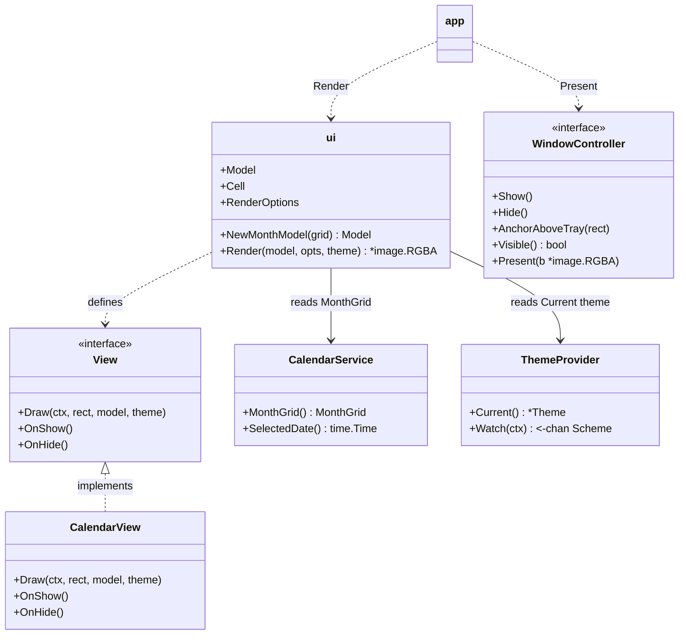
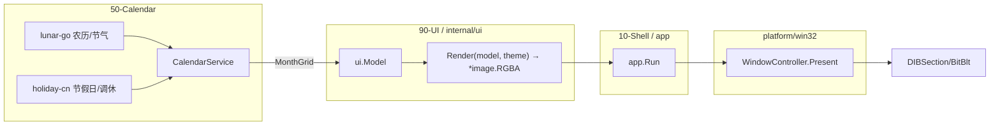
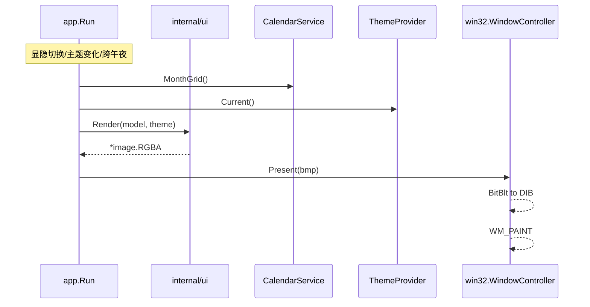
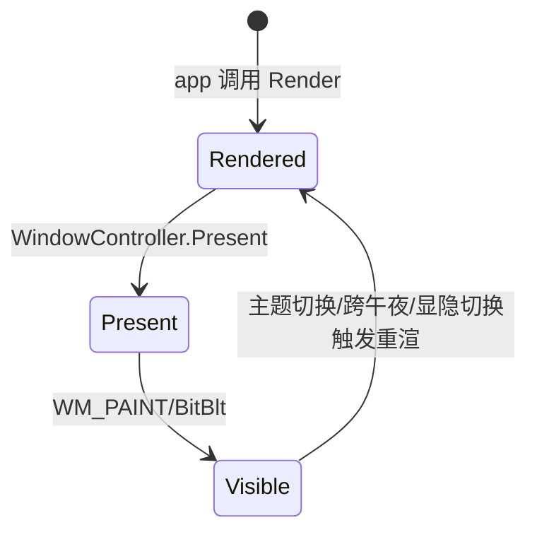

# CalendarView 详细设计 — 90-UI（MVP / Path D）

> 版本：v1.0-PathD ｜ 最后更新：2026-07-09 ｜ 范围：**MVP（v1.0）** ｜ 包：`internal/ui`
> 关联：ADR-05a（lunar-go）、ADR-05c（holiday-cn）、ADR-08（降级 gg 自绘）、`50-Calendar`

---

## 1. 📦 package 设计

- **包名**：`ui`（Go package `internal/ui`）。
- **职责一句话**：把日历领域数据（`calendar.MonthGrid`）与主题（`theme.Theme`）光栅化为一张实心不透明的 `*image.RGBA`，再由 `app` 经 `win32.WindowController.Present` 推送至弹窗。
- **依赖方向**：
  - 依赖：`internal/calendar`（取 `MonthGrid` 值对象）、`internal/theme`（取 `*Theme` 值对象）、`github.com/gogpu/gg`（CPU 光栅）。
  - 被依赖：仅被 `internal/app` 装配；`internal/platform/win32` 只消费像素，不依赖 `ui`。
- **对外公开符号**：`Model`、`Cell`、`NewMonthModel`、`RenderOptions`、`Render`、`View`、`CalendarView`。
- **边界**：
  - 归它管：视图模型构建、完整面板光栅（背景 + 标题 + 星期表头 + 6×7 网格）、今日/选中高亮、农历/节气/节假日小字标注。
  - 不归它管：农历算法本身（`calendar/lunar`）、节假日数据获取（`calendar/holiday`）、窗口显隐/像素推送（`app`/`win32`）、持久化、托盘菜单（`settings`）。

---

## 2. 📐 UML 类图



---

## 3. 🔄 数据流图



- **数据源**：`lunar-go`（离线算法）、`holiday-cn`（嵌入 JSON，离线）、`CalendarService.SelectedDate()`。
- **汇点**：`win32` 普通弹窗的 DIBSection，经 `WM_PAINT`/`BitBlt` 显示。
- **触发重渲**：托盘显隐切换、系统主题切换、跨午夜刷新（app 层发起，ui 无状态、无 goroutine）。

---

## 4. 🎨 UI 原型图（ASCII）

月历网格样例（含农历小字，★今日高亮，非当月灰字）：

```
   2026年7月
   日   一   二   三   四   五   六
   28  29  30   1   2   3   4
  廿三 廿四 廿五 六月 初二 初三 初四
    5   6   7   8   9  10  11
  初五 初六 小暑 初八 初九 初十 十一
   ...
```

- 当月日期：前景色；非当月：静音色。
- 今日：单元格浅蓝底填充。
- 法定节假日：公历日红色；小字显示节日名。
- 调休补班：未来在节日名旁显示「班」字（v1.1 细节）。

---

## 5. 🗂 数据库设计

**N/A** — `ui` 仅做光栅化；数据来自 `50-Calendar` 领域计算与嵌入 JSON，无持久化。

---

## 6. 📡 Event / Signal 流程



- `ui` 本身是无状态的纯函数：每次调用 `Render` 都重建模型并全量光栅。
- `app` 负责在合适时机调用 `Render`（显示时、主题切换时、跨午夜后）。
- MVP 不支持点击选日命中测试（无鼠标交互回调），保留 `Cell.IsSelected` 字段供后续切片接入。

---

## 7. 🔌 Plugin API

**N/A（MVP）** — 月历标注为内置数据。未来插件可在 `ui.Model` 上叠加自定义标记（如日程圆点），v1.4 经 `80-Plugin` 事件总线注入，MVP 不定义。

---

## 8. 🧩 Feature 生命周期



- `ui` 无显隐状态；每次 `Render` 独立。
- `CalendarView.OnShow/OnHide` 为 `View` 接口占位，MVP 空实现。

---

## 9. 📖 Go 接口定义

```go
package ui

import (
    "image"
    "time"

    "github.com/gogpu/gg"
    "github.com/shaolei/DeskCalendar/internal/calendar"
    "github.com/shaolei/DeskCalendar/internal/theme"
)

// Cell 单格展示视图模型。
type Cell struct {
    Day        int
    InMonth    bool
    IsToday    bool
    IsSelected bool
    Lunar      string // 农历小字（初一/节气/节日）；ShowLunar=false 时为空
    Holiday    string // 节假日名；ShowHoliday=false 时为空
    IsHoliday  bool
    IsWorkday  bool
}

// Model 完整渲染模型。
type Model struct {
    Year        int
    Month       time.Month
    MonthLabel  string
    Weekdays    [7]string
    Weeks       [6][7]Cell
    ShowLunar   bool
    ShowHoliday bool
}

// RenderOptions 渲染参数。
type RenderOptions struct {
    Width  int
    Height int
}

// View 是子视图接口（MVP 仅 CalendarView）。
type View interface {
    Draw(dc *gg.Context, rect image.Rectangle, m Model, th *theme.Theme)
    OnShow()
    OnHide()
}

// CalendarView 绘制标题 + 表头 + 网格。
type CalendarView struct{}

func (CalendarView) Draw(dc *gg.Context, rect image.Rectangle, m Model, th *theme.Theme)
func (CalendarView) OnShow()
func (CalendarView) OnHide()

// NewMonthModel 从 calendar.MonthGrid 构建视图模型。
func NewMonthModel(grid calendar.MonthGrid, showLunar, showHoliday bool) Model

// Render 返回光栅化后的不透明 *image.RGBA。
func Render(m Model, opts RenderOptions, th *theme.Theme) *image.RGBA
```

---

## 10. 🚀 每个 Milestone 的任务拆分

- **v1.0（MVP，已实现）**：
  - T1：6×7 网格纯函数布局（`computeLayout`），固定 42 格含上/下月补白 — 验收：任意月份正确对齐星期列。
  - T2：`Render(model, theme) → *image.RGBA`（gg 绘制实心不透明方角面板）— 验收：`CGO_ENABLED=0` 编译；360×480 全不透明。
  - T3：农历/节气/节假日小字标注（消费 `calendar.MonthGrid` 注入的 `ui.Model`）— 验收：小暑、国庆等标注正确（lunar-go + holiday-cn，离线）。
  - T4：日历像素经 `WindowController.Present` 推送至 `win32` 普通弹窗 — 验收：弹窗显示真实日历画面。
- **v1.1**：调休补班「班」字标记；鼠标点击选日命中测试。
- **v1.2**：接入 `Animator` 实现淡入/位移（需分层窗或 DWM 过渡）。
- **v1.3**：皮肤/字号自定义时重渲；独立设置窗后备。
- **v1.4**：开放 `DayCell` 自定义标记注入点供插件叠加日程圆点。
- **v1.5**：N/A。
